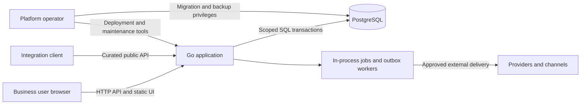
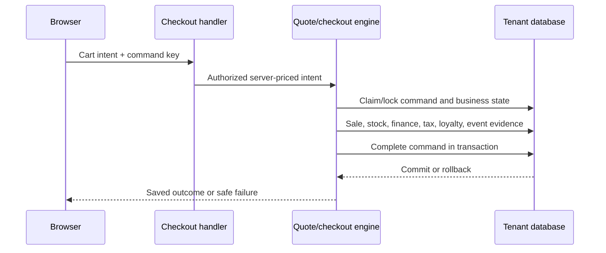

# Current architecture and trust boundaries

This describes inspected source structure, not deployed acceptance. The
[capability catalog](../generated/capability-catalog.md) owns supported scope and limits.
Historical architecture documents retain their own authority banners.

## Concerns and topology

The primary concerns are tenant/scope isolation, economic consistency, recoverable operations,
usable floor workflows and bounded resource cost. The runtime is a Go application with
PostgreSQL and a vanilla JavaScript/CSS/HTML client. Documentation generation runs outside
the server; only the embedded Knowledge Center enters the binary.

[Server entrypoint](../../cmd/server/main.go) invokes [route/server setup](../../internal/server/routes.go).
The [middleware](../../internal/server/middleware.go) resolves request context and access;
[route capabilities](../../internal/server/route_capabilities.go) classify operations.
Domain code lives in `engines/`; the metadata engine and dedicated handlers coexist.
[Database setup](../../db/db.go) resolves tenant schemas and transaction-local search paths.

The Dockerfile is a dormant packaging option, not evidence that the current installation
runs containers. Its final image contains the server and `public/`; `.dockerignore` excludes
the source docs tree. The current deployment choice remains documented in
[go-live decisions](../operations/go_live_decisions.md).

## Data and authority

Shared platform records and tenant schemas have different privilege boundaries. Tenant
selection does not itself prove entity, location, stock-owner, self or field authorization.
Those dimensions must pass the route/engine scope controls. Generic document storage and
dedicated domain tables both exist; a generic write path cannot be assumed equivalent to
an economic command. Source identity and transaction preconditions must be verified at the
actual handler/engine boundary.

The application uses PostgreSQL transactions and explicit idempotency records for the
remediated checkout/return paths. This is not a universal claim about every domain command.
Stage 47.5 now enforces one owner per warehouse; allocation and picking remain owner-blind
in the explicitly unsupported mixed mode. Stage 47.7 implements independently signed audit
events and checkpoints; archive/restore remains open in 47.7.6. A record's presence alone
does not establish sufficient regulated evidence.

## Checkout and return dynamics

The diagram summarizes [quote](../../engines/pos_quote.go),
[checkout](../../engines/pos_checkout.go) and [command identity](../../engines/command_idempotency.go).
Provider round trips and independently delivered events require their own durable outcome
and reconciliation; a database commit is not proof of an external provider action.

Returns use a sale-linked request and cumulative eligibility lock in
[returns_atomic.go](../../engines/returns_atomic.go), followed by QC and refund transitions
in [returns.go](../../engines/returns.go). The legacy instant-return endpoint is retired.
Stock disposition, original-tax reversal and final refund are separate observable outcomes.
[Return reconciliation tests](../../internal/server/returns_stage47_4_test.go) are evidence
locations; production verification remains release-specific.

## Jobs, security and operational recovery

In-process workers and PostgreSQL-backed jobs/outbox retain durable work and retry state.
[Environment controls](../../engines/environment.go) distinguish simulated from real external
side effects. Do not infer that every custom extension honors a control without testing it.
The [security threat model](../security/threat_model.md) owns threats and boundaries;
[risk register](../security/risk_register.md) owns treatment. General documentation adds no
parallel certification or security approval.

[Backup](../operations/backup_restore.md), [incident response](../operations/incident_runbook.md)
and [tenant lifecycle tooling](../../cmd/tenantctl/main.go) address distinct recovery scopes.
RTO/RPO, retention, legal hold and restore validation require configuration-specific owners.

## Decisions and changes

Record governing decisions using the [ADR template](../governance/adr-template.md).
Existing topology is recorded in [ADR-001](decisions/2026-09-07-existing-topology.md).
Session/authentication, owner isolation, audit evidence, job execution and dependency exceptions
need separately reviewed decisions before their irreversible changes. This document cannot
approve those open designs by describing the current code.
