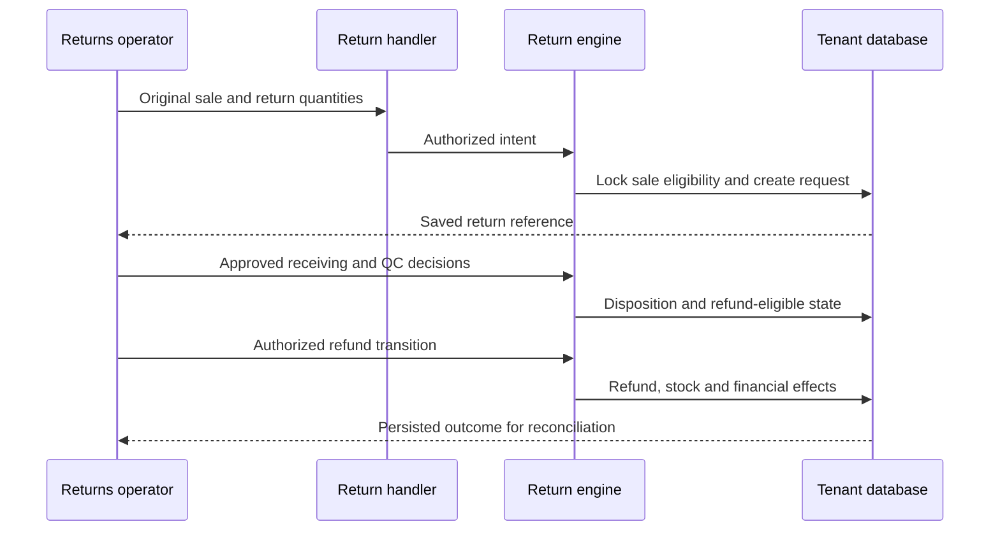
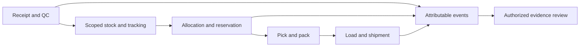

# Data boundaries and runtime views

Read [current architecture](current-architecture.md) first. These source views explain where to inspect a change; they do not approve mixed-owner production or regulated audit use.

## Ownership and storage

| Concern | Current source / owner | Review boundary |
|---|---|---|
| HTTP identity and route access | `internal/server/middleware.go`, route capabilities; security owner | Server-resolved tenant/identity and live credential state; never trust a client-supplied resolved header |
| Tenant schema | `db/db.go`, tenant lifecycle; platform owner | Public platform records and tenant schema privileges differ; transaction-local search path is not all authorization |
| Generic documents | `engines/doctype.go`, `documents.data`; module/data owners | Configured form validation and lifecycle; economic commands may require dedicated handlers |
| Dedicated ledgers and commands | Inventory, finance, POS, returns engines; process owners | Atomic writes, locking, command replay and final reconciliation |
| Integration and asynchronous work | `engines/jobrunner.go`, `engines/outbox.go`; integration/operations owners | Saved job/outbox state, external delivery, retries and uncertain outcomes |
| Audit and operational logs | `engines/logs.go`; security/operations owners | Evidence purpose, sensitive fields, retention and export; Stage 47.7 gaps remain |

The [dictionary](../data/generated/dictionary.md) inventories actual metadata and physical keys. JSON Link fields are not automatically SQL foreign keys. Entity/location/stock-owner constraints must be checked alongside tenant isolation. Backups can include multiple tenants and require distinct access and recovery controls.

## Return lifecycle

Inspect `engines/returns_atomic.go`, `engines/returns.go` and the Stage 47.4 HTTP tests. Original economics and cumulative return limits matter independently of current product price. Provider settlement requires its own reconciliation.

## Warehouse and audit boundaries

The flow is an operational view, not a claim that every step forms one transaction. Validate each command and the stock/owner/lot/serial identity across handoffs. Stage 47.5 selected and implemented one owner per warehouse; the `mixed_unsupported` opt-in does not provide allocation isolation or supported mixed-owner use. Evidence review must consider failed/replayed commands and ordering; the diagram does not imply immutable or legally sufficient audit storage.

## Job execution and recovery

Requests enqueue durable work where the job/outbox framework is used; in-process workers claim and execute it, record results and retry according to the registered handler. The application and PostgreSQL remain the deployment units. An extension or new handler needs the same cancellation, scoping, delivery-mode and reconciliation review. See [job/outbox operations](../operations/jobs-and-outbox.md) and [decision register](decisions/decision-register.md).
