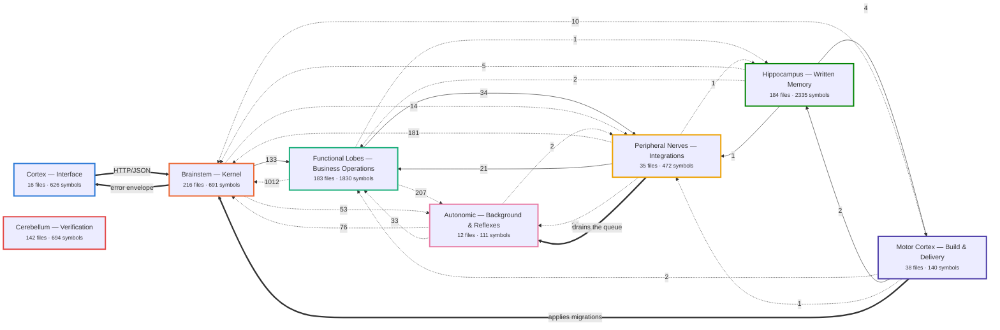
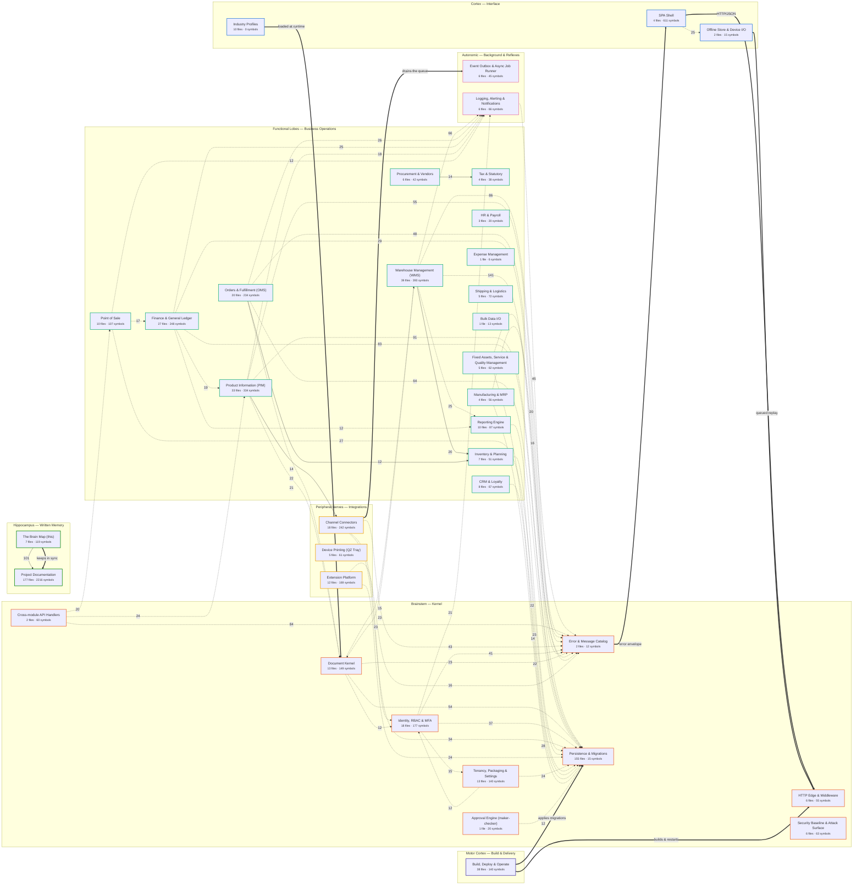
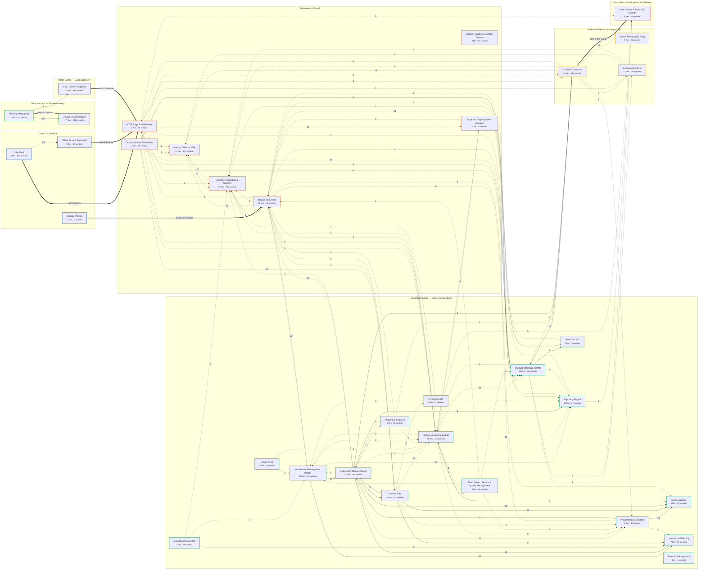
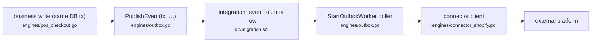
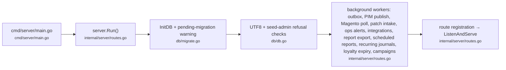

# Custom ERP — Project Brain

<!-- GENERATED FILE - do not edit by hand. Edit docs/brain/brain.map.json instead. -->
> **Generated.** Which regions exist comes from [`brain.map.json`](brain.map.json); which files exist comes
> from the working tree; what calls what comes from `graphify-out/graph.json`. Edit the map, never this
> file, then run `pwsh docs/brain/update-brain.ps1`. How to do that is in [README.md](README.md).

Every part of this system, grouped into brain regions, wired by the call graph graphify actually extracted from the source.

| | |
|---|---|
| Graph built from commit | `4b7328a1` |
| Brain redrawn | source graph 4b7328a1 |
| Regions / lobes | 37 / 8 |
| Files in the working tree | 826 (579 of them parsed into the graph) |
| Files claimed by a region | **100.0%** |
| Symbols in the graph | 7352 |
| Cross-region relationships | 2722 extracted (95% inferred) + 8 declared by hand |

**Interactive version: [brain.html](brain.html)** — open it in a browser and click any region.

## How to read this

- A **lobe** is a layer of the system; a **region** is one area of responsibility inside it. Which files belong to which region is decided entirely by the `match` patterns in `brain.map.json`.
- A **thin arrow** is a real relationship graphify extracted from the source — a call, a type reference, a method, an embed — aggregated up to the region level. The number on it is how many such relationships cross that boundary, which is a measure of coupling, not of importance.
- A **thick `==>` arrow** is *declared by hand* in `brain.map.json`. These are the connections a call-graph extractor structurally cannot see: the browser talking to the server over HTTP, a script driving the binary, a connector reaching a third-party API. They are drawn differently on purpose — they are asserted, not measured.
- A **solid arrow** contains at least one relationship graphify parsed straight out of the source (`EXTRACTED`). A **dotted arrow** is one where *every* underlying relationship is `INFERRED` — graphify's heuristic guess. Dotted is the common case here, and that is a property of the extractor, not a defect in the code: it resolves calls within a file exactly and calls across files by name, and 95% of cross-region relationships are cross-file by definition. So: the shape of this map is reliable, any *single* dotted edge is a lead to confirm with grep before you rely on it, and a solid arrow is one graphify actually saw.
- `contains` edges are excluded everywhere: a file containing its own functions says nothing about how areas of the system relate.
- The test suite is a region but is deliberately left out of every wiring diagram and every count. Tests reach into everything, so drawing them would flatten the real structure into noise.

## 1. The whole brain, at lobe level

8 lobes. If you read one diagram, read this one.

| Lobe | What it is | Regions | Files | Symbols | Wiring inside the lobe |
|---|---|---:|---:|---:|---:|
| **Cortex — Interface** | What the user sees and touches. Every business intent enters here. | 3 | 16 | 626 | 25 |
| **Brainstem — Kernel** | Involuntary and non-negotiable. Every single request passes through here, whatever it is asking for. | 9 | 216 | 691 | 405 |
| **Functional Lobes — Business Operations** | The specialised areas. Each one owns a domain and can be licensed on its own. | 16 | 183 | 1830 | 367 |
| **Peripheral Nerves — Integrations** | Contact with the outside world: storefronts, payment terminals, marketing clouds, third-party extensions. | 3 | 35 | 472 | 7 |
| **Autonomic — Background & Reflexes** | Runs without anyone asking it to: outbox drain, pollers, alerting, scheduled sweeps. | 2 | 12 | 111 | 2 |
| **Hippocampus — Written Memory** | What this project knows about itself: the backlog, the ledger, the guides, the handover note. | 2 | 184 | 2335 | 101 |
| **Motor Cortex — Build & Delivery** | How the system actually moves: build, migrate, promote, back up, restore. | 1 | 38 | 140 | 0 |
| **Cerebellum — Verification** | Balance and correction. Kept out of the wiring diagrams on purpose — tests touch everything, so drawing them would grey out every real edge. | 1 | 142 | 694 | 0 |

## 2. Region map

Every region, grouped by lobe, with the connections of weight **12 or more**. The full set is in [brain.html](brain.html) and in §5 below.

### 2b. The same map with the universal hubs removed

**Error & Message Catalog**, **Persistence & Migrations**, **Logging, Alerting & Notifications** are reached from nearly every region — which is the point of them, but it means they dominate the diagram above and hide everything else. Take them out and what is left is how the business areas actually relate to each other.

*Showing every non-hub connection of weight 3 or more (106 of them).*

### 2c. Declared connections

These are asserted in `brain.map.json`, not measured. Each one is a boundary a call-graph extractor cannot cross.

| From | To | Boundary | Why it has to be declared |
|---|---|---|---|
| SPA Shell | HTTP Edge & Middleware | HTTP/JSON | The SPA is JavaScript and the server is Go. apiFetch() calls the route table over the network; no extractor can link the two. |
| Error & Message Catalog | SPA Shell | error envelope | showApiError() renders the exact code/message the catalog returns. Contract enforced by convention on both sides, invisible to either language's AST. |
| Offline Store & Device I/O | HTTP Edge & Middleware | queued replay | Offline POS writes queue into IndexedDB and are replayed against the same endpoints when the network returns. |
| Industry Profiles | Document Kernel | loaded at runtime | SwitchIndustryProfile reads a JSON profile off disk by path; the profiles are data, not code, so nothing links to them statically. |
| Channel Connectors | Event Outbox & Async Job Runner | drains the queue | The outbox worker dispatches by event name through a registry rather than by direct call, so the edge is a table lookup, not a call site. |
| Build, Deploy & Operate | Persistence & Migrations | applies migrations | promote.ps1 and deploy/migrate.sh run the migration files; PowerShell and .sql are both outside the Go call graph. |
| Build, Deploy & Operate | HTTP Edge & Middleware | builds & restarts | manage.ps1/promote.ps1 build the binary and control its lifecycle from outside the process entirely. |
| The Brain Map (this) | Project Documentation | keeps in sync | The brain is regenerated alongside the big 3 docs; the relationship is a convention in CLAUDE.md, not a code dependency. |

## 3. Signal pathways

The routes a signal actually takes through the brain. These are described by hand in `brain.map.json` (`pathways`) because ordering is intent — a call graph can tell you that A reaches B, not that it must happen third.

### Request signal path

What happens to one API call, in order. Everything downstream of apiMiddleware trusts the Resolved-* headers it sets and nothing the client claimed.

```mermaid
flowchart LR
  n_request0["Browser: apiFetch()<br/><small>public/app.js</small>"]
  n_request1["Route table<br/><small>internal/server/routes.go</small>"]
  n_request0 --> n_request1
  n_request2["apiMiddleware: CORS → 2MB cap → rate limit → panic recovery<br/><small>internal/server/middleware.go</small>"]
  n_request1 --> n_request2
  n_request3["JWT verify → tenant resolve → Resolved-Tenant-ID / Resolved-User-ID headers<br/><small>internal/server/middleware.go</small>"]
  n_request2 --> n_request3
  n_request4["handler<br/><small>internal/server/handlers_*.go</small>"]
  n_request3 --> n_request4
  n_request5["engine<br/><small>engines/*.go</small>"]
  n_request4 --> n_request5
  n_request6["GetTenantSchema + SetSearchPath<br/><small>db/db.go</small>"]
  n_request5 --> n_request6
  n_request7["PostgreSQL tenant schema<br/><small>db/migration.sql</small>"]
  n_request6 --> n_request7
  n_request8["writeAPIError / JSON envelope<br/><small>internal/server/apierror.go</small>"]
  n_request7 --> n_request8
  n_request9["showApiError()<br/><small>public/app.js</small>"]
  n_request8 --> n_request9
```

### Outbound integration path

No user-facing transaction ever makes a synchronous outbound HTTP call. This is why a down Shopify cannot hang a checkout.

### Maker-checker path

Any approval-gated document follows this. Editing an already-approved document resets it to pending rather than silently keeping the approval.

```mermaid
flowchart LR
  n_approval0["document submitted<br/><small>internal/server/handlers_core_doc_engine.go</small>"]
  n_approval1["ValidateDocument<br/><small>engines/doctype.go</small>"]
  n_approval0 --> n_approval1
  n_approval2["IsApprovalGated / RequiredApproverRoleForAmount<br/><small>engines/approval.go</small>"]
  n_approval1 --> n_approval2
  n_approval3["SubmitForApproval → Pending<br/><small>engines/approval.go</small>"]
  n_approval2 --> n_approval3
  n_approval4["DecideApproval (different user, required role)<br/><small>engines/approval.go</small>"]
  n_approval3 --> n_approval4
  n_approval5["status transition<br/><small>engines/status_transition.go</small>"]
  n_approval4 --> n_approval5
  n_approval6["GL posting<br/><small>engines/finance.go</small>"]
  n_approval5 --> n_approval6
  n_approval7["audit log<br/><small>engines/logs.go</small>"]
  n_approval6 --> n_approval7
```

### Boot & reflex startup

What comes up when the binary starts, before it ever serves a request. One cancellable context is threaded into every worker so SIGTERM lets them finish a tick and exit.

## 4. Region index

| Region | Lobe | Files | Symbols | Busiest connection |
|---|---|---:|---:|---|
| [SPA Shell](#spa-shell) | Cortex — Interface | 4 | 611 | → Offline Store & Device I/O (25) |
| [Offline Store & Device I/O](#offline-store--device-io) | Cortex — Interface | 2 | 15 | ← SPA Shell (25) |
| [Industry Profiles](#industry-profiles) | Cortex — Interface | 10 | 0 | — |
| [HTTP Edge & Middleware](#http-edge--middleware) | Brainstem — Kernel | 6 | 55 | → Error & Message Catalog (9) |
| [Error & Message Catalog](#error--message-catalog) | Brainstem — Kernel | 2 | 12 | ← Warehouse Management (WMS) (86) |
| [Document Kernel](#document-kernel) | Brainstem — Kernel | 13 | 149 | → Persistence & Migrations (54) |
| [Identity, RBAC & MFA](#identity-rbac--mfa) | Brainstem — Kernel | 18 | 177 | → Error & Message Catalog (41) |
| [Tenancy, Packaging & Settings](#tenancy-packaging--settings) | Brainstem — Kernel | 13 | 140 | → Persistence & Migrations (24) |
| [Approval Engine (maker-checker)](#approval-engine-maker-checker) | Brainstem — Kernel | 1 | 20 | → Persistence & Migrations (12) |
| [Persistence & Migrations](#persistence--migrations) | Brainstem — Kernel | 155 | 15 | ← Warehouse Management (WMS) (141) |
| [Cross-module API Handlers](#cross-module-api-handlers) | Brainstem — Kernel | 2 | 60 | → Error & Message Catalog (84) |
| [Finance & General Ledger](#finance--general-ledger) | Functional Lobes — Business Operations | 27 | 248 | → Persistence & Migrations (83) |
| [Tax & Statutory](#tax--statutory) | Functional Lobes — Business Operations | 4 | 38 | ← Procurement & Vendors (14) |
| [Procurement & Vendors](#procurement--vendors) | Functional Lobes — Business Operations | 6 | 42 | → Tax & Statutory (14) |
| [Inventory & Planning](#inventory--planning) | Functional Lobes — Business Operations | 7 | 51 | → Persistence & Migrations (23) |
| [Warehouse Management (WMS)](#warehouse-management-wms) | Functional Lobes — Business Operations | 39 | 393 | → Persistence & Migrations (141) |
| [Orders & Fulfillment (OMS)](#orders--fulfillment-oms) | Functional Lobes — Business Operations | 20 | 234 | → Persistence & Migrations (64) |
| [Point of Sale](#point-of-sale) | Functional Lobes — Business Operations | 10 | 107 | → Persistence & Migrations (27) |
| [Product Information (PIM)](#product-information-pim) | Functional Lobes — Business Operations | 33 | 334 | → Persistence & Migrations (91) |
| [CRM & Loyalty](#crm--loyalty) | Functional Lobes — Business Operations | 8 | 67 | → Persistence & Migrations (22) |
| [HR & Payroll](#hr--payroll) | Functional Lobes — Business Operations | 3 | 20 | → Error & Message Catalog (9) |
| [Manufacturing & MRP](#manufacturing--mrp) | Functional Lobes — Business Operations | 4 | 56 | → Error & Message Catalog (20) |
| [Fixed Assets, Service & Quality Management](#fixed-assets-service--quality-management) | Functional Lobes — Business Operations | 5 | 62 | → Persistence & Migrations (22) |
| [Expense Management](#expense-management) | Functional Lobes — Business Operations | 1 | 6 | → Persistence & Migrations (3) |
| [Reporting Engine](#reporting-engine) | Functional Lobes — Business Operations | 10 | 87 | → Persistence & Migrations (28) |
| [Shipping & Logistics](#shipping--logistics) | Functional Lobes — Business Operations | 5 | 72 | → Persistence & Migrations (10) |
| [Bulk Data I/O](#bulk-data-io) | Functional Lobes — Business Operations | 1 | 13 | → Document Kernel (8) |
| [Channel Connectors](#channel-connectors) | Peripheral Nerves — Integrations | 18 | 242 | → Error & Message Catalog (43) |
| [Device Printing (QZ Tray)](#device-printing-qz-tray) | Peripheral Nerves — Integrations | 5 | 61 | → Error & Message Catalog (7) |
| [Extension Platform](#extension-platform) | Peripheral Nerves — Integrations | 12 | 169 | → Persistence & Migrations (24) |
| [Event Outbox & Async Job Runner](#event-outbox--async-job-runner) | Autonomic — Background & Reflexes | 6 | 45 | ← Channel Connectors (10) |
| [Logging, Alerting & Notifications](#logging-alerting--notifications) | Autonomic — Background & Reflexes | 6 | 66 | ← Warehouse Management (WMS) (66) |
| [Project Documentation](#project-documentation) | Hippocampus — Written Memory | 177 | 2216 | ← The Brain Map (this) (101) |
| [The Brain Map (this)](#the-brain-map-this) | Hippocampus — Written Memory | 7 | 119 | → Project Documentation (101) |
| [Build, Deploy & Operate](#build-deploy--operate) | Motor Cortex — Build & Delivery | 38 | 140 | → Persistence & Migrations (4) |
| [Security Baseline & Attack Surface](#security-baseline--attack-surface) | Brainstem — Kernel | 6 | 63 | ← HTTP Edge & Middleware (2) |
| [Test Suite](#test-suite) | Cerebellum — Verification | 142 | 694 | — |

## 5. Region detail

### Cortex — Interface

*What the user sees and touches. Every business intent enters here.*

#### SPA Shell

The whole frontend: one hand-written vanilla-JS single-page app, no framework and no build step. Owns routing (renderView), every screen's markup, the two dialog systems, and the shared apiFetch/showApiError error path.

**Most connected symbols**

- `apiFetch()` — [public/app.js](../../public/app.js#L550) · degree 253
- `showApiError()` — [public/app.js](../../public/app.js#L191) · degree 128
- `renderView()` — [public/app.js](../../public/app.js#L4005) · degree 117
- `renderViewContent()` — [public/app.js](../../public/app.js#L4067) · degree 59
- `escapeHTMLText()` — [public/app.js](../../public/app.js#L1184) · degree 48
- `showCustomAlert()` — [public/app.js](../../public/app.js#L2) · degree 47

**Wired to**

- → **Offline Store & Device I/O** — 25 relationships, 25 inferred
- → **HTTP Edge & Middleware** — declared: HTTP/JSON
- ← **Error & Message Catalog** — declared: error envelope

4 files

- [public/app.js](../../public/app.js)
- [public/components/erp-typeahead.js](../../public/components/erp-typeahead.js)
- [public/index.html](../../public/index.html)
- [public/styles.css](../../public/styles.css)

#### Offline Store & Device I/O

Browser-side IndexedDB queue that lets POS keep selling when the network drops, plus on-device barcode/QR rendering.

**Most connected symbols**

- `a()` — [public/qrcode.min.js](../../public/qrcode.min.js#L1) · degree 9
- `d()` — [public/qrcode.min.js](../../public/qrcode.min.js#L1) · degree 8
- `b()` — [public/qrcode.min.js](../../public/qrcode.min.js#L1) · degree 3
- `k()` — [public/qrcode.min.js](../../public/qrcode.min.js#L1) · degree 3
- `n()` — [public/qrcode.min.js](../../public/qrcode.min.js#L1) · degree 3
- `m()` — [public/qrcode.min.js](../../public/qrcode.min.js#L1) · degree 2

**Wired to**

- → **HTTP Edge & Middleware** — declared: queued replay
- ← **SPA Shell** — 25 relationships, 25 inferred

2 files

- [public/db.js](../../public/db.js)
- [public/qrcode.min.js](../../public/qrcode.min.js)

#### Industry Profiles

Per-vertical master-data and field packs (jewellery, pharma, food & bev, auto, …) loaded by SwitchIndustryProfile to reshape the same kernel into a different industry.

**Wired to**

- → **Document Kernel** — declared: loaded at runtime

10 files

- [public/profiles/agriculture.json](../../public/profiles/agriculture.json)
- [public/profiles/auto.json](../../public/profiles/auto.json)
- [public/profiles/clothing.json](../../public/profiles/clothing.json)
- [public/profiles/construction.json](../../public/profiles/construction.json)
- [public/profiles/food_bev.json](../../public/profiles/food_bev.json)
- [public/profiles/jewelry.json](../../public/profiles/jewelry.json)
- [public/profiles/medical.json](../../public/profiles/medical.json)
- [public/profiles/metal.json](../../public/profiles/metal.json)
- [public/profiles/pharma.json](../../public/profiles/pharma.json)
- [public/profiles/semiconductor.json](../../public/profiles/semiconductor.json)

### Brainstem — Kernel

*Involuntary and non-negotiable. Every single request passes through here, whatever it is asking for.*

#### HTTP Edge & Middleware

The one door in. apiMiddleware does CORS allowlist, 2MB body cap, per-category rate limiting, panic recovery, JWT verification and tenant resolution, then publishes Resolved-* headers every handler downstream reads. routes.go is the full route table and the background-worker startup list. tenant_host.go maps <slug>.<TENANT_BASE_DOMAIN> to a tenant and gates Caddy's on-demand certificate issuance.

**Most connected symbols**

- `Run()` — [internal/server/routes.go](../../internal/server/routes.go#L22) · degree 49
- `apiMiddleware()` — [internal/server/middleware.go](../../internal/server/middleware.go#L579) · degree 46
- `handleSetTenantHostSlug()` — [internal/server/tenant_host.go](../../internal/server/tenant_host.go#L206) · degree 8
- `tenantForHost()` — [internal/server/tenant_host.go](../../internal/server/tenant_host.go#L280) · degree 8
- `gzipResponseWriter` — [internal/server/middleware_compress.go](../../internal/server/middleware_compress.go#L61) · degree 6
- `main()` — [cmd/server/main.go](../../cmd/server/main.go#L17) · degree 6

**Wired to**

- → **Error & Message Catalog** — 9 relationships, 9 inferred
- → **Persistence & Migrations** — 9 relationships, 9 inferred
- → **Identity, RBAC & MFA** — 8 relationships, 8 inferred
- → **Tenancy, Packaging & Settings** — 8 relationships, 8 inferred
- → **Channel Connectors** — 5 relationships, 5 inferred
- → **Event Outbox & Async Job Runner** — 5 relationships, 5 inferred
- → **Finance & General Ledger** — 4 relationships, 4 inferred
- → **Logging, Alerting & Notifications** — 4 relationships, 4 inferred
- ← **Channel Connectors** — 6 relationships, 6 inferred
- ← **Document Kernel** — 4 relationships, 4 inferred
- ← **Logging, Alerting & Notifications** — 3 relationships, 3 inferred
- ← **Extension Platform** — 2 relationships, 2 inferred
- ← **Identity, RBAC & MFA** — 2 relationships, 2 inferred
- ← **Tenancy, Packaging & Settings** — 1 relationship, 1 inferred
- ← **SPA Shell** — declared: HTTP/JSON
- ← **Offline Store & Device I/O** — declared: queued replay

6 files

- [cmd/server/main.go](../../cmd/server/main.go)
- [internal/server/VERSION](../../internal/server/VERSION)
- [internal/server/middleware.go](../../internal/server/middleware.go)
- [internal/server/middleware_compress.go](../../internal/server/middleware_compress.go)
- [internal/server/routes.go](../../internal/server/routes.go)
- [internal/server/tenant_host.go](../../internal/server/tenant_host.go)

#### Error & Message Catalog

The 300+ code standard message catalog and the writeAPIError/writeAPIErrorGeneric envelope every handler returns through. Single choke point for what a user is actually told when something fails.

**Most connected symbols**

- `writeAPIErrorGeneric()` — [internal/server/apierror.go](../../internal/server/apierror.go#L217) · degree 448
- `writeEngineError()` — [internal/server/apierror.go](../../internal/server/apierror.go#L182) · degree 90
- `writeAPIError()` — [internal/server/apierror.go](../../internal/server/apierror.go#L117) · degree 34
- `writeAPIErrorDetail()` — [internal/server/apierror.go](../../internal/server/apierror.go#L131) · degree 18
- `logForEntry()` — [internal/server/apierror.go](../../internal/server/apierror.go#L91) · degree 12
- `writeResponse()` — [internal/server/apierror.go](../../internal/server/apierror.go#L107) · degree 7

**Wired to**

- → **Logging, Alerting & Notifications** — 2 relationships, 2 inferred
- → **SPA Shell** — declared: error envelope
- ← **Warehouse Management (WMS)** — 86 relationships, 86 inferred
- ← **Cross-module API Handlers** — 84 relationships, 84 inferred
- ← **Product Information (PIM)** — 55 relationships, 55 inferred
- ← **Orders & Fulfillment (OMS)** — 48 relationships, 48 inferred
- ← **Logging, Alerting & Notifications** — 45 relationships, 45 inferred
- ← **Channel Connectors** — 43 relationships, 43 inferred
- ← **Identity, RBAC & MFA** — 41 relationships, 41 inferred
- ← **Finance & General Ledger** — 29 relationships, 29 inferred

2 files

- [internal/server/apierror.go](../../internal/server/apierror.go)
- [internal/server/error_catalog_generated.go](../../internal/server/error_catalog_generated.go)

#### Document Kernel

The metadata-driven Record Type engine — one generic documents table per tenant plus a doctype_meta/doctype_fields registry. ValidateDocument is the shared validation choke point; document numbering, edit windows and status transitions hang off the same spine.

**Most connected symbols**

- `NewDocID()` — [engines/docid.go](../../engines/docid.go#L93) · degree 60
- `strField()` — [engines/master_data_validation.go](../../engines/master_data_validation.go#L318) · degree 48
- `handleGenericDoc()` — [internal/server/handlers_core_doc_engine.go](../../internal/server/handlers_core_doc_engine.go#L78) · degree 47
- `ValidateMasterDataRules()` — [engines/master_data_validation.go](../../engines/master_data_validation.go#L32) · degree 33
- `checkPermission()` — [internal/server/handlers_core_doc_engine.go](../../internal/server/handlers_core_doc_engine.go#L952) · degree 17
- `ValidateDocument()` — [engines/doctype.go](../../engines/doctype.go#L355) · degree 16

**Wired to**

- → **Persistence & Migrations** — 54 relationships, 54 inferred
- → **Error & Message Catalog** — 23 relationships, 23 inferred
- → **Warehouse Management (WMS)** — 15 relationships, 15 inferred
- → **Identity, RBAC & MFA** — 12 relationships, 12 inferred
- → **Tenancy, Packaging & Settings** — 9 relationships, 9 inferred
- → **Logging, Alerting & Notifications** — 5 relationships, 5 inferred
- → **HTTP Edge & Middleware** — 4 relationships, 4 inferred
- → **Product Information (PIM)** — 4 relationships, 4 inferred
- ← **Warehouse Management (WMS)** — 23 relationships, 23 inferred
- ← **Orders & Fulfillment (OMS)** — 22 relationships, 22 inferred
- ← **Product Information (PIM)** — 21 relationships, 21 inferred
- ← **Bulk Data I/O** — 8 relationships, 8 inferred
- ← **Point of Sale** — 8 relationships, 8 inferred
- ← **Finance & General Ledger** — 7 relationships, 7 inferred
- ← **Procurement & Vendors** — 6 relationships, 6 inferred
- ← **Shipping & Logistics** — 5 relationships, 5 inferred

13 files

- [engines/docid.go](../../engines/docid.go)
- [engines/doctype.go](../../engines/doctype.go)
- [engines/document_edit_window.go](../../engines/document_edit_window.go)
- [engines/document_mirror_fields.go](../../engines/document_mirror_fields.go)
- [engines/document_numbering.go](../../engines/document_numbering.go)
- [engines/field_formats.go](../../engines/field_formats.go)
- [engines/master_data_validation.go](../../engines/master_data_validation.go)
- [engines/numbering.go](../../engines/numbering.go)
- [engines/phone.go](../../engines/phone.go)
- [engines/status_transition.go](../../engines/status_transition.go)
- [engines/transactional_validation.go](../../engines/transactional_validation.go)
- [internal/server/handlers_core_doc_engine.go](../../internal/server/handlers_core_doc_engine.go)
- [internal/server/handlers_field_formats.go](../../internal/server/handlers_field_formats.go)

#### Identity, RBAC & MFA

Login, JWT issue/verify, per-role permissions, TOTP MFA for privileged roles, MFA recovery codes and authenticator re-enrollment, account lockout, password reset, field-level permissions, and (Stage 47.1) the deny-by-default authorization layer: the route-capability registry, the sensitive-field policy, scope semantics, role templates, the SoD conflict catalog and the reviewed/reversible tenant grant migration.

**Most connected symbols**

- `IsSuperAdmin()` — [engines/roles.go](../../engines/roles.go#L47) · degree 51
- `requireHRAdmin()` — [internal/server/handlers_admin_identity.go](../../internal/server/handlers_admin_identity.go#L37) · degree 29
- `SignToken()` — [engines/auth.go](../../engines/auth.go#L228) · degree 22
- `handleLogin()` — [internal/server/handlers_auth.go](../../internal/server/handlers_auth.go#L20) · degree 17
- `handleMFAActivate()` — [internal/server/handlers_auth.go](../../internal/server/handlers_auth.go#L241) · degree 14
- `handleMFAVerify()` — [internal/server/handlers_auth.go](../../internal/server/handlers_auth.go#L360) · degree 12

**Wired to**

- → **Error & Message Catalog** — 41 relationships, 41 inferred
- → **Persistence & Migrations** — 37 relationships, 37 inferred
- → **Logging, Alerting & Notifications** — 21 relationships, 21 inferred
- → **Tenancy, Packaging & Settings** — 15 relationships, 15 inferred
- → **Document Kernel** — 2 relationships, 1 inferred
- → **HTTP Edge & Middleware** — 2 relationships, 2 inferred
- → **HR & Payroll** — 1 relationship, 1 inferred
- → **Event Outbox & Async Job Runner** — 1 relationship, 1 inferred
- ← **Channel Connectors** — 23 relationships, 23 inferred
- ← **Document Kernel** — 12 relationships, 12 inferred
- ← **Tenancy, Packaging & Settings** — 12 relationships, 12 inferred
- ← **HTTP Edge & Middleware** — 8 relationships, 8 inferred
- ← **Extension Platform** — 7 relationships, 7 inferred
- ← **Cross-module API Handlers** — 6 relationships, 6 inferred
- ← **Approval Engine (maker-checker)** — 2 relationships, 2 inferred
- ← **Logging, Alerting & Notifications** — 2 relationships, 2 inferred

18 files

- [engines/auth.go](../../engines/auth.go)
- [engines/auth_livestate.go](../../engines/auth_livestate.go)
- [engines/field_permissions.go](../../engines/field_permissions.go)
- [engines/mfa.go](../../engines/mfa.go)
- [engines/mfa_recovery.go](../../engines/mfa_recovery.go)
- [engines/password_reset.go](../../engines/password_reset.go)
- [engines/role_template_migration.go](../../engines/role_template_migration.go)
- [engines/role_templates.go](../../engines/role_templates.go)
- [engines/roles.go](../../engines/roles.go)
- [engines/scope_policy.go](../../engines/scope_policy.go)
- [engines/sensitive_fields.go](../../engines/sensitive_fields.go)
- [engines/sod_catalog.go](../../engines/sod_catalog.go)
- [internal/server/handlers_access_governance.go](../../internal/server/handlers_access_governance.go)
- [internal/server/handlers_admin_identity.go](../../internal/server/handlers_admin_identity.go)
- [internal/server/handlers_auth.go](../../internal/server/handlers_auth.go)
- [internal/server/handlers_mfa_recovery.go](../../internal/server/handlers_mfa_recovery.go)
- [internal/server/handlers_profile.go](../../internal/server/handlers_profile.go)
- [internal/server/route_capabilities.go](../../internal/server/route_capabilities.go)

#### Tenancy, Packaging & Settings

Schema-per-tenant provisioning, the sellable product packages (PIM/WMS/OMS/HR/…) and their module entitlements, tenant limits, the settings registry, per-tenant UI label overrides, and the setup-readiness/localization reads the UI uses to tell a user what is not configured yet. Stage 38.7 adds self-service sandbox tenants on top of the same ProvisionTenantSchema baseline: is_sandbox/sandbox_expires_at flag a tenant for auto-expiry (checked at login and on every live session re-check) and for external side effects being turned off (Stage 38.4's webhook delivery checks it), plus a reset (truncate business data, keep login/config) and delete path guarded so neither can ever touch a non-sandbox tenant. Stage 49.1.5 makes the whole lifecycle governed: tenant_lifecycle.go holds the state machine (active ⇄ suspended, → deprovision_requested → purged), the one-time provisioning credential's expiry and rotation record, the append-only evidence trail in public.tenant_lifecycle_events, the four purge preconditions (deprovisioned first, no legal hold, retention elapsed, backup reference) and the post-purge residue proof; suspension is enforced through the tenant gate in auth_livestate.go so it reaches sessions already in flight, and cmd/tenantctl is the operator surface — deliberately a CLI rather than a route, so no role inside the product can reach DROP SCHEMA.

**Most connected symbols**

- `GetSettingInt()` — [engines/settings_registry.go](../../engines/settings_registry.go#L150) · degree 40
- `ProvisionTenantSchema()` — [engines/saas.go](../../engines/saas.go#L64) · degree 16
- `GetTenantLifecycle()` — [engines/tenant_lifecycle.go](../../engines/tenant_lifecycle.go#L175) · degree 14
- `main()` — [cmd/tenantctl/main.go](../../cmd/tenantctl/main.go#L58) · degree 13
- `GetSettingFloat()` — [engines/settings_registry.go](../../engines/settings_registry.go#L174) · degree 10
- `PurgeTenant()` — [engines/tenant_lifecycle.go](../../engines/tenant_lifecycle.go#L783) · degree 10

**Wired to**

- → **Persistence & Migrations** — 24 relationships, 24 inferred
- → **Identity, RBAC & MFA** — 12 relationships, 12 inferred
- → **Error & Message Catalog** — 6 relationships, 6 inferred
- → **Document Kernel** — 5 relationships, 4 inferred
- → **HTTP Edge & Middleware** — 1 relationship, 1 inferred
- → **Logging, Alerting & Notifications** — 1 relationship, 1 inferred
- ← **Identity, RBAC & MFA** — 15 relationships, 15 inferred
- ← **Channel Connectors** — 9 relationships, 9 inferred
- ← **Document Kernel** — 9 relationships, 9 inferred
- ← **HTTP Edge & Middleware** — 8 relationships, 8 inferred
- ← **CRM & Loyalty** — 7 relationships, 7 inferred
- ← **Finance & General Ledger** — 5 relationships, 5 inferred
- ← **Orders & Fulfillment (OMS)** — 5 relationships, 5 inferred
- ← **Extension Platform** — 4 relationships, 4 inferred

13 files

- [cmd/tenantctl/main.go](../../cmd/tenantctl/main.go)
- [engines/labels.go](../../engines/labels.go)
- [engines/modules.go](../../engines/modules.go)
- [engines/saas.go](../../engines/saas.go)
- [engines/sandbox.go](../../engines/sandbox.go)
- [engines/settings_definitions.go](../../engines/settings_definitions.go)
- [engines/settings_registry.go](../../engines/settings_registry.go)
- [engines/setup_advisor.go](../../engines/setup_advisor.go)
- [engines/tenant_lifecycle.go](../../engines/tenant_lifecycle.go)
- [engines/tenant_limits.go](../../engines/tenant_limits.go)
- [internal/server/handlers_sandbox.go](../../internal/server/handlers_sandbox.go)
- [internal/server/handlers_settings.go](../../internal/server/handlers_settings.go)
- [internal/server/handlers_setup_advisor.go](../../internal/server/handlers_setup_advisor.go)

#### Approval Engine (maker-checker)

Amount-banded approval rules, submit → decide → log, bulk decisions, and reset-to-pending when an approved document is edited. Every approval-gated flow in the system routes through this one engine rather than rolling its own.

**Most connected symbols**

- `DecideApproval()` — [engines/approval.go](../../engines/approval.go#L301) · degree 24
- `SubmitForApproval()` — [engines/approval.go](../../engines/approval.go#L252) · degree 17
- `ListPendingApprovals()` — [engines/approval.go](../../engines/approval.go#L537) · degree 5
- `RequiredApproverRoleForAmount()` — [engines/approval.go](../../engines/approval.go#L158) · degree 5
- `IsApprovalGated()` — [engines/approval.go](../../engines/approval.go#L194) · degree 4
- `ResetToPendingOnEdit()` — [engines/approval.go](../../engines/approval.go#L523) · degree 4

**Wired to**

- → **Persistence & Migrations** — 12 relationships, 12 inferred
- → **Finance & General Ledger** — 7 relationships, 7 inferred
- → **Product Information (PIM)** — 3 relationships, 3 inferred
- → **Identity, RBAC & MFA** — 2 relationships, 2 inferred
- → **Logging, Alerting & Notifications** — 2 relationships, 2 inferred
- → **CRM & Loyalty** — 1 relationship, 1 inferred
- → **Warehouse Management (WMS)** — 1 relationship, 1 inferred
- ← **Cross-module API Handlers** — 11 relationships, 11 inferred
- ← **Document Kernel** — 3 relationships, 3 inferred
- ← **Finance & General Ledger** — 3 relationships, 3 inferred
- ← **Product Information (PIM)** — 2 relationships, 2 inferred
- ← **Point of Sale** — 2 relationships, 2 inferred
- ← **CRM & Loyalty** — 1 relationship, 1 inferred
- ← **Warehouse Management (WMS)** — 1 relationship, 1 inferred

1 file

- [engines/approval.go](../../engines/approval.go)

#### Persistence & Migrations

The Postgres connection, GetTenantSchema/SetSearchPath (the tenant boundary, enforced at the SQL layer), the migration runner, and every incremental migration file.

**Most connected symbols**

- `GetTenantSchema()` — [db/db.go](../../db/db.go#L134) · degree 831
- `InitDB()` — [db/db.go](../../db/db.go#L49) · degree 183
- `SetSearchPath()` — [db/db.go](../../db/db.go#L152) · degree 71
- `ConnStringFromEnv()` — [db/db.go](../../db/db.go#L32) · degree 5
- `migrationFileNames()` — [db/migrate.go](../../db/migrate.go#L223) · degree 5
- `ApplyPendingMigrations()` — [db/migrate.go](../../db/migrate.go#L51) · degree 4

**Wired to**

- → **Security Baseline & Attack Surface** — 1 relationship, 1 inferred
- ← **Warehouse Management (WMS)** — 141 relationships, 141 inferred
- ← **Product Information (PIM)** — 91 relationships, 91 inferred
- ← **Finance & General Ledger** — 83 relationships, 83 inferred
- ← **Orders & Fulfillment (OMS)** — 64 relationships, 64 inferred
- ← **Document Kernel** — 54 relationships, 54 inferred
- ← **Identity, RBAC & MFA** — 37 relationships, 37 inferred
- ← **Channel Connectors** — 34 relationships, 34 inferred
- ← **Reporting Engine** — 28 relationships, 28 inferred

155 files

- [db/db.go](../../db/db.go)
- [db/migrate.go](../../db/migrate.go)
- [db/migration.sql](../../db/migration.sql)
- [db/migrations_phase3.sql](../../db/migrations_phase3.sql)
- [db/migrations_stage14a_modules.sql](../../db/migrations_stage14a_modules.sql)
- [db/migrations_stage14b_versioning.sql](../../db/migrations_stage14b_versioning.sql)
- [db/migrations_stage14c_pipeline.sql](../../db/migrations_stage14c_pipeline.sql)
- [db/migrations_stage14d_patchintake.sql](../../db/migrations_stage14d_patchintake.sql)
- [db/migrations_stage14e_extensions.sql](../../db/migrations_stage14e_extensions.sql)
- [db/migrations_stage14f_security.sql](../../db/migrations_stage14f_security.sql)
- [db/migrations_stage16_field_permissions.sql](../../db/migrations_stage16_field_permissions.sql)
- [db/migrations_stage17_soft_delete.sql](../../db/migrations_stage17_soft_delete.sql)
- [db/migrations_stage17c_accounting_periods.sql](../../db/migrations_stage17c_accounting_periods.sql)
- [db/migrations_stage17d_gst_accounts.sql](../../db/migrations_stage17d_gst_accounts.sql)
- [db/migrations_stage17e_transfer_orders.sql](../../db/migrations_stage17e_transfer_orders.sql)
- [db/migrations_stage17f_purchase_requisition.sql](../../db/migrations_stage17f_purchase_requisition.sql)
- [db/migrations_stage17g_vendor_invoice.sql](../../db/migrations_stage17g_vendor_invoice.sql)
- [db/migrations_stage17h_location_masters.sql](../../db/migrations_stage17h_location_masters.sql)
- [db/migrations_stage18_core_module_fix.sql](../../db/migrations_stage18_core_module_fix.sql)
- [db/migrations_stage20_13_offline_pos_sync.sql](../../db/migrations_stage20_13_offline_pos_sync.sql)
- [db/migrations_stage20a_pos_maturity.sql](../../db/migrations_stage20a_pos_maturity.sql)
- [db/migrations_stage20b_wms_maturity.sql](../../db/migrations_stage20b_wms_maturity.sql)
- [db/migrations_stage20c_finance_maturity.sql](../../db/migrations_stage20c_finance_maturity.sql)
- [db/migrations_stage20d_reports_engine.sql](../../db/migrations_stage20d_reports_engine.sql)
- [db/migrations_stage21_user_profile.sql](../../db/migrations_stage21_user_profile.sql)
- [db/migrations_stage24_addendum_data_integrity.sql](../../db/migrations_stage24_addendum_data_integrity.sql)
- [db/migrations_stage24_addendum_offline_heartbeat.sql](../../db/migrations_stage24_addendum_offline_heartbeat.sql)
- [db/migrations_stage24_security.sql](../../db/migrations_stage24_security.sql)
- [db/migrations_stage24b_deferred_hardening.sql](../../db/migrations_stage24b_deferred_hardening.sql)
- [db/migrations_stage25_ops_status.sql](../../db/migrations_stage25_ops_status.sql)
- [db/migrations_stage26_10_1_stock_ledger.sql](../../db/migrations_stage26_10_1_stock_ledger.sql)
- [db/migrations_stage26_10_4_scheduled_reports.sql](../../db/migrations_stage26_10_4_scheduled_reports.sql)
- [db/migrations_stage26_10_7_report_perf.sql](../../db/migrations_stage26_10_7_report_perf.sql)
- [db/migrations_stage26_12_10_notifications.sql](../../db/migrations_stage26_12_10_notifications.sql)
- [db/migrations_stage26_12_1_order_engine.sql](../../db/migrations_stage26_12_1_order_engine.sql)
- [db/migrations_stage26_12_2_allocation_sourcing.sql](../../db/migrations_stage26_12_2_allocation_sourcing.sql)
- [db/migrations_stage26_12_3_pick_pack.sql](../../db/migrations_stage26_12_3_pick_pack.sql)
- [db/migrations_stage26_12_4_shipment_manifest.sql](../../db/migrations_stage26_12_4_shipment_manifest.sql)
- [db/migrations_stage26_12_5_returns_rto_qc_refund.sql](../../db/migrations_stage26_12_5_returns_rto_qc_refund.sql)
- [db/migrations_stage26_12_foundation.sql](../../db/migrations_stage26_12_foundation.sql)
- [db/migrations_stage26_4_10_supplier_portal.sql](../../db/migrations_stage26_4_10_supplier_portal.sql)
- [db/migrations_stage26_4_11_content_assist.sql](../../db/migrations_stage26_4_11_content_assist.sql)
- [db/migrations_stage26_4_pim_maturity.sql](../../db/migrations_stage26_4_pim_maturity.sql)
- [db/migrations_stage26_5_16_robotics.sql](../../db/migrations_stage26_5_16_robotics.sql)
- [db/migrations_stage26_5_wms_enterprise.sql](../../db/migrations_stage26_5_wms_enterprise.sql)
- [db/migrations_stage26_5_wms_p2.sql](../../db/migrations_stage26_5_wms_p2.sql)
- [db/migrations_stage26_6_11_item_tax_treatment.sql](../../db/migrations_stage26_6_11_item_tax_treatment.sql)
- [db/migrations_stage26_6_5_payment_file.sql](../../db/migrations_stage26_6_5_payment_file.sql)
- [db/migrations_stage26_6_6_backdated_posting.sql](../../db/migrations_stage26_6_6_backdated_posting.sql)
- [db/migrations_stage26_6_8_cost_center_postings.sql](../../db/migrations_stage26_6_8_cost_center_postings.sql)
- [db/migrations_stage26_6_finance_tax_close.sql](../../db/migrations_stage26_6_finance_tax_close.sql)
- [db/migrations_stage26_7_4_campaign.sql](../../db/migrations_stage26_7_4_campaign.sql)
- [db/migrations_stage26_7_4b_clevertap_tables_catchup.sql](../../db/migrations_stage26_7_4b_clevertap_tables_catchup.sql)
- [db/migrations_stage26_7_5_fraud_otp.sql](../../db/migrations_stage26_7_5_fraud_otp.sql)
- [db/migrations_stage26_7_9_crm_analytics.sql](../../db/migrations_stage26_7_9_crm_analytics.sql)
- [db/migrations_stage26_7_crm_loyalty.sql](../../db/migrations_stage26_7_crm_loyalty.sql)
- [db/migrations_stage26_8_hr_payroll.sql](../../db/migrations_stage26_8_hr_payroll.sql)
- [db/migrations_stage26_8_hr_process.sql](../../db/migrations_stage26_8_hr_process.sql)
- [db/migrations_stage26_9_10_scheduling_subcontract.sql](../../db/migrations_stage26_9_10_scheduling_subcontract.sql)
- [db/migrations_stage26_9_manufacturing_mrp.sql](../../db/migrations_stage26_9_manufacturing_mrp.sql)
- [db/migrations_stage27_product_packaging.sql](../../db/migrations_stage27_product_packaging.sql)
- [db/migrations_stage28_report_column_profiles.sql](../../db/migrations_stage28_report_column_profiles.sql)
- [db/migrations_stage28_system_settings.sql](../../db/migrations_stage28_system_settings.sql)
- [db/migrations_stage28_user_theme.sql](../../db/migrations_stage28_user_theme.sql)
- [db/migrations_stage29_8_5_reversible_terminal_statuses.sql](../../db/migrations_stage29_8_5_reversible_terminal_statuses.sql)
- [db/migrations_stage29_8_status_transition_map.sql](../../db/migrations_stage29_8_status_transition_map.sql)
- [db/migrations_stage29_gl_postings_reporting_index.sql](../../db/migrations_stage29_gl_postings_reporting_index.sql)
- [db/migrations_stage29_purchase_requisition_catalog.sql](../../db/migrations_stage29_purchase_requisition_catalog.sql)
- [db/migrations_stage30_1_2_item_tax_mandatory.sql](../../db/migrations_stage30_1_2_item_tax_mandatory.sql)
- [db/migrations_stage30_2_1_grn_location.sql](../../db/migrations_stage30_2_1_grn_location.sql)
- [db/migrations_stage30_2_2_integration_tables_catchup.sql](../../db/migrations_stage30_2_2_integration_tables_catchup.sql)
- [db/migrations_stage30_2_5_loyalty_redemption_account.sql](../../db/migrations_stage30_2_5_loyalty_redemption_account.sql)
- [db/migrations_stage30_5_3_json_line_editors.sql](../../db/migrations_stage30_5_3_json_line_editors.sql)
- [db/migrations_stage30_5_4_setup_menu_advanced.sql](../../db/migrations_stage30_5_4_setup_menu_advanced.sql)
- [db/migrations_stage30_5_5_retire_stores.sql](../../db/migrations_stage30_5_5_retire_stores.sql)
- [db/migrations_stage30_5_6_po_duplicate_field_labels.sql](../../db/migrations_stage30_5_6_po_duplicate_field_labels.sql)
- [db/migrations_stage30_6_auto_document_numbering.sql](../../db/migrations_stage30_6_auto_document_numbering.sql)
- [db/migrations_stage30_7_pos_offers.sql](../../db/migrations_stage30_7_pos_offers.sql)
- [db/migrations_stage31_1_qz_print.sql](../../db/migrations_stage31_1_qz_print.sql)
- [db/migrations_stage32_5_mfa_recovery_codes.sql](../../db/migrations_stage32_5_mfa_recovery_codes.sql)
- [db/migrations_stage34_1_competitor_price.sql](../../db/migrations_stage34_1_competitor_price.sql)
- [db/migrations_stage34_3_undercut_alert.sql](../../db/migrations_stage34_3_undercut_alert.sql)
- [db/migrations_stage35_2_oms_console.sql](../../db/migrations_stage35_2_oms_console.sql)
- [db/migrations_stage35_3_7_reservation_attribution.sql](../../db/migrations_stage35_3_7_reservation_attribution.sql)
- [db/migrations_stage35_4_shipping_package.sql](../../db/migrations_stage35_4_shipping_package.sql)
- [db/migrations_stage35_5_courier_integration.sql](../../db/migrations_stage35_5_courier_integration.sql)
- [db/migrations_stage35_6_channel_breadth.sql](../../db/migrations_stage35_6_channel_breadth.sql)
- [db/migrations_stage35_7_bundles_kits.sql](../../db/migrations_stage35_7_bundles_kits.sql)
- [db/migrations_stage35_8_settlement_reconciliation.sql](../../db/migrations_stage35_8_settlement_reconciliation.sql)
- [db/migrations_stage36_1_product_groups.sql](../../db/migrations_stage36_1_product_groups.sql)
- [db/migrations_stage36_2_pim_tasks.sql](../../db/migrations_stage36_2_pim_tasks.sql)
- [db/migrations_stage36_3_import_depth.sql](../../db/migrations_stage36_3_import_depth.sql)
- [db/migrations_stage36_4_export_syndication.sql](../../db/migrations_stage36_4_export_syndication.sql)
- [db/migrations_stage36_5_transform_rules.sql](../../db/migrations_stage36_5_transform_rules.sql)
- [db/migrations_stage36_6_dam_depth.sql](../../db/migrations_stage36_6_dam_depth.sql)
- [db/migrations_stage36_7_enrichment_quality.sql](../../db/migrations_stage36_7_enrichment_quality.sql)
- [db/migrations_stage37_10_planning_depth.sql](../../db/migrations_stage37_10_planning_depth.sql)
- [db/migrations_stage37_11_dashboards.sql](../../db/migrations_stage37_11_dashboards.sql)
- [db/migrations_stage37_1_2_multicurrency_documents.sql](../../db/migrations_stage37_1_2_multicurrency_documents.sql)
- [db/migrations_stage37_1_currency_foundation.sql](../../db/migrations_stage37_1_currency_foundation.sql)
- [db/migrations_stage37_1_fx_revaluation.sql](../../db/migrations_stage37_1_fx_revaluation.sql)
- [db/migrations_stage37_2_multi_entity_intercompany.sql](../../db/migrations_stage37_2_multi_entity_intercompany.sql)
- [db/migrations_stage37_3_costing_valuation.sql](../../db/migrations_stage37_3_costing_valuation.sql)
- [db/migrations_stage37_4_budgeting_credit_dunning.sql](../../db/migrations_stage37_4_budgeting_credit_dunning.sql)
- [db/migrations_stage37_6_deferred_prepaid_recurring_pricelist.sql](../../db/migrations_stage37_6_deferred_prepaid_recurring_pricelist.sql)
- [db/migrations_stage37_7_projects_job_costing.sql](../../db/migrations_stage37_7_projects_job_costing.sql)
- [db/migrations_stage37_8_service_management.sql](../../db/migrations_stage37_8_service_management.sql)
- [db/migrations_stage37_9_quality_maintenance.sql](../../db/migrations_stage37_9_quality_maintenance.sql)
- [db/migrations_stage38_2_api_credentials.sql](../../db/migrations_stage38_2_api_credentials.sql)
- [db/migrations_stage38_3_5_9_public_api_spine.sql](../../db/migrations_stage38_3_5_9_public_api_spine.sql)
- [db/migrations_stage38_4_webhook_subscriptions.sql](../../db/migrations_stage38_4_webhook_subscriptions.sql)
- [db/migrations_stage38_6_async_job_runner.sql](../../db/migrations_stage38_6_async_job_runner.sql)
- [db/migrations_stage38_7_sandbox_tenants.sql](../../db/migrations_stage38_7_sandbox_tenants.sql)
- [db/migrations_stage39_9_help_feedback.sql](../../db/migrations_stage39_9_help_feedback.sql)
- [db/migrations_stage40_1_po_line_items.sql](../../db/migrations_stage40_1_po_line_items.sql)
- [db/migrations_stage40_3_super_admin_role.sql](../../db/migrations_stage40_3_super_admin_role.sql)
- [db/migrations_stage41_country_phone_setup.sql](../../db/migrations_stage41_country_phone_setup.sql)
- [db/migrations_stage42_1_10_uom.sql](../../db/migrations_stage42_1_10_uom.sql)
- [db/migrations_stage42_1_7_lottable.sql](../../db/migrations_stage42_1_7_lottable.sql)
- [db/migrations_stage42_1_8_serial.sql](../../db/migrations_stage42_1_8_serial.sql)
- [db/migrations_stage42_1_traceability.sql](../../db/migrations_stage42_1_traceability.sql)
- [db/migrations_stage42_2_1_warehouse_task.sql](../../db/migrations_stage42_2_1_warehouse_task.sql)
- [db/migrations_stage42_2_4_task_dispatch_strategy.sql](../../db/migrations_stage42_2_4_task_dispatch_strategy.sql)
- [db/migrations_stage42_2_5_zone.sql](../../db/migrations_stage42_2_5_zone.sql)
- [db/migrations_stage42_2_6_bin_capacity.sql](../../db/migrations_stage42_2_6_bin_capacity.sql)
- [db/migrations_stage42_2_7_putaway_strategy.sql](../../db/migrations_stage42_2_7_putaway_strategy.sql)
- [db/migrations_stage42_2_8_allocation_strategy.sql](../../db/migrations_stage42_2_8_allocation_strategy.sql)
- [db/migrations_stage42_2_9_exception_codes.sql](../../db/migrations_stage42_2_9_exception_codes.sql)
- [db/migrations_stage42_3_1_dockdoor.sql](../../db/migrations_stage42_3_1_dockdoor.sql)
- [db/migrations_stage42_3_2_appointment.sql](../../db/migrations_stage42_3_2_appointment.sql)
- [db/migrations_stage42_3_4_yard.sql](../../db/migrations_stage42_3_4_yard.sql)
- [db/migrations_stage42_3_5_holdcode.sql](../../db/migrations_stage42_3_5_holdcode.sql)
- [db/migrations_stage42_3_6_receipt_validation_rule.sql](../../db/migrations_stage42_3_6_receipt_validation_rule.sql)
- [db/migrations_stage42_3_7_catch_weight.sql](../../db/migrations_stage42_3_7_catch_weight.sql)
- [db/migrations_stage42_3_8_crossdock_plan.sql](../../db/migrations_stage42_3_8_crossdock_plan.sql)
- [db/migrations_stage42_3_9_compliance_fields.sql](../../db/migrations_stage42_3_9_compliance_fields.sql)
- [db/migrations_stage42_4_10_preship.sql](../../db/migrations_stage42_4_10_preship.sql)
- [db/migrations_stage42_4_11_vas.sql](../../db/migrations_stage42_4_11_vas.sql)
- [db/migrations_stage42_4_1_wave.sql](../../db/migrations_stage42_4_1_wave.sql)
- [db/migrations_stage42_4_3_sortation.sql](../../db/migrations_stage42_4_3_sortation.sql)
- [db/migrations_stage42_4_4_cartonization_v2.sql](../../db/migrations_stage42_4_4_cartonization_v2.sql)
- [db/migrations_stage42_4_5_packstation.sql](../../db/migrations_stage42_4_5_packstation.sql)
- [db/migrations_stage42_4_6_packing_validation.sql](../../db/migrations_stage42_4_6_packing_validation.sql)
- [db/migrations_stage42_4_8_loading.sql](../../db/migrations_stage42_4_8_loading.sql)
- [db/migrations_stage42_5_5_owner_segregation.sql](../../db/migrations_stage42_5_5_owner_segregation.sql)
- [db/migrations_stage42_5_inventory_control_depth.sql](../../db/migrations_stage42_5_inventory_control_depth.sql)
- [db/migrations_stage42_6_labour_billing_depth.sql](../../db/migrations_stage42_6_labour_billing_depth.sql)
- [db/migrations_stage44_tenant_host_slug.sql](../../db/migrations_stage44_tenant_host_slug.sql)
- [db/migrations_stage45_money_paise.sql](../../db/migrations_stage45_money_paise.sql)
- [db/migrations_stage47_1_role_templates.sql](../../db/migrations_stage47_1_role_templates.sql)
- [db/migrations_stage47_2_server_authoritative_pricing.sql](../../db/migrations_stage47_2_server_authoritative_pricing.sql)
- [db/migrations_stage47_3_atomic_checkout.sql](../../db/migrations_stage47_3_atomic_checkout.sql)
- [db/migrations_stage47_6_rf_shell.sql](../../db/migrations_stage47_6_rf_shell.sql)
- [db/migrations_stage49_1_5_tenant_lifecycle.sql](../../db/migrations_stage49_1_5_tenant_lifecycle.sql)
- [db/migrations_stores_master_fields.sql](../../db/migrations_stores_master_fields.sql)

#### Cross-module API Handlers

Two historical grab-bag handler files whose contents span several modules (bulk import, availability/checkout, POS sessions, trial balance, approvals, GST, the four core reports, RFQ quotes, stickers, payroll export, the PIM workbench). Kept visible as its own region rather than force-filed under one module, because that is genuinely what they are.

**Most connected symbols**

- `handleCheckout()` — [internal/server/handlers_pim_pos_finance.go](../../internal/server/handlers_pim_pos_finance.go#L340) · degree 25
- `handleDecideApproval()` — [internal/server/handlers_pim_pos_finance.go](../../internal/server/handlers_pim_pos_finance.go#L1360) · degree 10
- `handleBulkImport()` — [internal/server/handlers_pim_pos_finance.go](../../internal/server/handlers_pim_pos_finance.go#L23) · degree 9
- `handleAccountingPeriods()` — [internal/server/handlers_pim_pos_finance.go](../../internal/server/handlers_pim_pos_finance.go#L1259) · degree 8
- `handleApprovalRules()` — [internal/server/handlers_pim_pos_finance.go](../../internal/server/handlers_pim_pos_finance.go#L1565) · degree 8
- `handleBigCommerceWebhook()` — [internal/server/handlers_pim_pos_finance.go](../../internal/server/handlers_pim_pos_finance.go#L197) · degree 7

**Wired to**

- → **Error & Message Catalog** — 84 relationships, 84 inferred
- → **Product Information (PIM)** — 24 relationships, 24 inferred
- → **Point of Sale** — 20 relationships, 20 inferred
- → **Approval Engine (maker-checker)** — 11 relationships, 11 inferred
- → **Logging, Alerting & Notifications** — 9 relationships, 9 inferred
- → **Bulk Data I/O** — 6 relationships, 5 inferred
- → **Identity, RBAC & MFA** — 6 relationships, 6 inferred
- → **Finance & General Ledger** — 5 relationships, 5 inferred

2 files

- [internal/server/handlers_pim_pos_finance.go](../../internal/server/handlers_pim_pos_finance.go)
- [internal/server/handlers_procurement_pim2.go](../../internal/server/handlers_procurement_pim2.go)

#### Security Baseline & Attack Surface

Stage 49's security program spine. security_baseline.go is the fail-fast startup validator (findings SB-001..SB-022) called from Run() next to the 20.6 UTF-8 and 24.27 seed-admin gates: it logs every configuration finding at every ENV and refuses to start on a blocking one when ENV=production, and its findings never echo the value they complain about. internal/securityscan derives the attack-surface inventory (49.1.1) and the no-bypass scan (49.1.4) from source rather than from a runtime registry, so it is imported only by its own tests and by cmd/surfacescan and adds nothing to the production binary; docs/security/attack_surface.json is the approved profile the 49.1.6 drift gate compares against. static_fileserver.go wraps the static root so a directory with no index.html 404s instead of returning a generated file listing.

**Most connected symbols**

- `Surface` — [internal/securityscan/surface.go](../../internal/securityscan/surface.go#L47) · degree 27
- `configurationFindings()` — [engines/security_baseline.go](../../engines/security_baseline.go#L113) · degree 15
- `ScanSurface()` — [internal/securityscan/surface.go](../../internal/securityscan/surface.go#L169) · degree 14
- `BaselineFinding` — [engines/security_baseline.go](../../engines/security_baseline.go#L60) · degree 9
- `DescribeDrift()` — [internal/securityscan/drift.go](../../internal/securityscan/drift.go#L36) · degree 9
- `.Open()` — [internal/server/static_fileserver.go](../../internal/server/static_fileserver.go#L44) · degree 6

**Wired to**

- → **Event Outbox & Async Job Runner** — 2 relationships, 2 inferred
- ← **HTTP Edge & Middleware** — 2 relationships, 2 inferred
- ← **Build, Deploy & Operate** — 2 relationships, 2 inferred
- ← **Product Information (PIM)** — 2 relationships, 2 inferred
- ← **Persistence & Migrations** — 1 relationship, 1 inferred

6 files

- [cmd/surfacescan/main.go](../../cmd/surfacescan/main.go)
- [engines/security_baseline.go](../../engines/security_baseline.go)
- [internal/securityscan/bypass.go](../../internal/securityscan/bypass.go)
- [internal/securityscan/drift.go](../../internal/securityscan/drift.go)
- [internal/securityscan/surface.go](../../internal/securityscan/surface.go)
- [internal/server/static_fileserver.go](../../internal/server/static_fileserver.go)

### Functional Lobes — Business Operations

*The specialised areas. Each one owns a domain and can be licensed on its own.*

#### Finance & General Ledger

Balanced double-entry posting (PostDoubleEntry), chart of accounts, journal vouchers and recurring templates, accounting-period close, cost centres, bank reconciliation, payment proposals and payment files, sales/vendor invoices, debit and credit notes, the multi-currency stack (effective-dated rates, dual-currency postings, realised FX at settlement, period-end revaluation and presentation-currency reporting), multi-entity/intercompany (entity-scoped posting, mirrored intercompany legs, reconciliation and consolidation with eliminations), costing/valuation (moving-average item cost, landed cost allocation, real GRN/COGS GL posting), budgeting/credit/dunning (budget-vs-actual variance, customer credit limits, overdue-invoice dunning, cash-flow forecasting), deferred revenue/prepaid amortisation/recurring billing/price-list versioning, and projects/job costing (a 5th whole-posting dimension + project P&L).

**Most connected symbols**

- `PostDoubleEntry()` — [engines/finance.go](../../engines/finance.go#L107) · degree 31
- `parityNumber()` — [engines/currency.go](../../engines/currency.go#L30) · degree 28
- `PaiseToRupees()` — [engines/finance.go](../../engines/finance.go#L23) · degree 26
- `ValidateParityFoundationDocument()` — [engines/currency.go](../../engines/currency.go#L147) · degree 24
- `RupeesToPaise()` — [engines/finance.go](../../engines/finance.go#L19) · degree 20
- `PayVendorInvoice()` — [engines/vendor_invoice.go](../../engines/vendor_invoice.go#L193) · degree 16

**Wired to**

- → **Persistence & Migrations** — 83 relationships, 83 inferred
- → **Error & Message Catalog** — 29 relationships, 29 inferred
- → **Logging, Alerting & Notifications** — 25 relationships, 25 inferred
- → **Product Information (PIM)** — 19 relationships, 19 inferred
- → **Reporting Engine** — 12 relationships, 12 inferred
- → **Warehouse Management (WMS)** — 9 relationships, 9 inferred
- → **Document Kernel** — 7 relationships, 7 inferred
- → **Procurement & Vendors** — 6 relationships, 6 inferred
- ← **Point of Sale** — 17 relationships, 17 inferred
- ← **Fixed Assets, Service & Quality Management** — 8 relationships, 8 inferred
- ← **Approval Engine (maker-checker)** — 7 relationships, 7 inferred
- ← **Orders & Fulfillment (OMS)** — 7 relationships, 7 inferred
- ← **HR & Payroll** — 5 relationships, 5 inferred
- ← **Shipping & Logistics** — 5 relationships, 5 inferred
- ← **Cross-module API Handlers** — 5 relationships, 5 inferred
- ← **HTTP Edge & Middleware** — 4 relationships, 4 inferred

27 files

- [engines/accounting_periods.go](../../engines/accounting_periods.go)
- [engines/bank_reconciliation.go](../../engines/bank_reconciliation.go)
- [engines/budgeting.go](../../engines/budgeting.go)
- [engines/costing.go](../../engines/costing.go)
- [engines/currency.go](../../engines/currency.go)
- [engines/currency_documents.go](../../engines/currency_documents.go)
- [engines/currency_fx.go](../../engines/currency_fx.go)
- [engines/currency_reports.go](../../engines/currency_reports.go)
- [engines/deferred_prepaid.go](../../engines/deferred_prepaid.go)
- [engines/finance.go](../../engines/finance.go)
- [engines/finance_reports_stage26.go](../../engines/finance_reports_stage26.go)
- [engines/gl_cost_center.go](../../engines/gl_cost_center.go)
- [engines/intercompany.go](../../engines/intercompany.go)
- [engines/journal_voucher.go](../../engines/journal_voucher.go)
- [engines/notes.go](../../engines/notes.go)
- [engines/order_invoice.go](../../engines/order_invoice.go)
- [engines/payment_file.go](../../engines/payment_file.go)
- [engines/payment_proposal.go](../../engines/payment_proposal.go)
- [engines/project.go](../../engines/project.go)
- [engines/sales_invoice.go](../../engines/sales_invoice.go)
- [engines/vendor_invoice.go](../../engines/vendor_invoice.go)
- [engines/voucher.go](../../engines/voucher.go)
- [internal/server/handlers_costing.go](../../internal/server/handlers_costing.go)
- [internal/server/handlers_currency_fx.go](../../internal/server/handlers_currency_fx.go)
- [internal/server/handlers_finance_maturity.go](../../internal/server/handlers_finance_maturity.go)
- [internal/server/handlers_finance_stage26.go](../../internal/server/handlers_finance_stage26.go)
- [internal/server/handlers_intercompany.go](../../internal/server/handlers_intercompany.go)

#### Tax & Statutory

GST computation and enforcement (CGST/SGST/IGST, place-of-supply) and TDS. Called from PO creation, checkout and invoicing rather than living inside any one of them.

**Most connected symbols**

- `round2()` — [engines/gst.go](../../engines/gst.go#L14) · degree 19
- `GSTBreakdown` — [engines/gst.go](../../engines/gst.go#L98) · degree 14
- `CalculateGST()` — [engines/gst.go](../../engines/gst.go#L124) · degree 8
- `ComputeGSTForLines()` — [engines/gst.go](../../engines/gst.go#L263) · degree 8
- `ComputeGSTForLinesMode()` — [engines/gst.go](../../engines/gst.go#L290) · degree 8
- `GetItemTaxInfo()` — [engines/gst.go](../../engines/gst.go#L180) · degree 8

**Wired to**

- → **Persistence & Migrations** — 5 relationships, 5 inferred
- → **Finance & General Ledger** — 2 relationships, 2 inferred
- → **Warehouse Management (WMS)** — 2 relationships, 2 inferred
- → **Inventory & Planning** — 1 relationship, 1 inferred
- → **Logging, Alerting & Notifications** — 1 relationship, 1 inferred
- → **Tenancy, Packaging & Settings** — 1 relationship, 1 inferred
- ← **Procurement & Vendors** — 14 relationships, 10 inferred
- ← **Point of Sale** — 11 relationships, 8 inferred
- ← **Orders & Fulfillment (OMS)** — 10 relationships, 8 inferred
- ← **Finance & General Ledger** — 5 relationships, 1 inferred
- ← **Document Kernel** — 4 relationships, 4 inferred
- ← **HR & Payroll** — 2 relationships, 2 inferred
- ← **Reporting Engine** — 2 relationships, 2 inferred
- ← **Cross-module API Handlers** — 1 relationship, 1 inferred

4 files

- [engines/amount_words.go](../../engines/amount_words.go)
- [engines/gst.go](../../engines/gst.go)
- [engines/gst_place_of_supply.go](../../engines/gst_place_of_supply.go)
- [engines/tds.go](../../engines/tds.go)

#### Procurement & Vendors

Purchase Requisition → RFQ and vendor-quote comparison → Purchase Order → GRN → three-way-matched Vendor Invoice → payment, with the requisition catalog and sourcing rules.

**Most connected symbols**

- `ResolveAllocationPlan()` — [engines/sourcing.go](../../engines/sourcing.go#L364) · degree 14
- `PreviewPurchaseOrder()` — [engines/purchase_order.go](../../engines/purchase_order.go#L96) · degree 13
- `fetchDocData()` — [engines/purchase_order.go](../../engines/purchase_order.go#L246) · degree 13
- `BuildPurchaseOrderPrint()` — [engines/purchase_order.go](../../engines/purchase_order.go#L284) · degree 11
- `numericFromAny()` — [engines/sourcing.go](../../engines/sourcing.go#L518) · degree 9
- `qualifyingLocations()` — [engines/sourcing.go](../../engines/sourcing.go#L125) · degree 8

**Wired to**

- → **Tax & Statutory** — 14 relationships, 10 inferred
- → **Persistence & Migrations** — 11 relationships, 11 inferred
- → **Error & Message Catalog** — 6 relationships, 6 inferred
- → **Document Kernel** — 6 relationships, 6 inferred
- → **Logging, Alerting & Notifications** — 4 relationships, 4 inferred
- → **Inventory & Planning** — 3 relationships, 3 inferred
- → **Orders & Fulfillment (OMS)** — 3 relationships, all extracted
- → **Channel Connectors** — 1 relationship, 1 inferred
- ← **Orders & Fulfillment (OMS)** — 11 relationships, 11 inferred
- ← **Finance & General Ledger** — 6 relationships, 6 inferred
- ← **Fixed Assets, Service & Quality Management** — 3 relationships, 3 inferred
- ← **Channel Connectors** — 3 relationships, 3 inferred
- ← **Point of Sale** — 3 relationships, 3 inferred
- ← **Document Kernel** — 2 relationships, 2 inferred
- ← **Cross-module API Handlers** — 2 relationships, 2 inferred
- ← **Logging, Alerting & Notifications** — 2 relationships, 2 inferred

6 files

- [engines/procurement.go](../../engines/procurement.go)
- [engines/purchase_order.go](../../engines/purchase_order.go)
- [engines/purchase_requisition_catalog.go](../../engines/purchase_requisition_catalog.go)
- [engines/rfq.go](../../engines/rfq.go)
- [engines/sourcing.go](../../engines/sourcing.go)
- [internal/server/handlers_purchase_order.go](../../internal/server/handlers_purchase_order.go)

#### Inventory & Planning

Stock ledger and Available-to-Sell read model (Available − Reserved − Safety Stock − Channel Holds), item lookup by SKU/barcode, location masters, transfer orders, the replenishment/velocity/demand-forecast engines, and planning depth (trend-weighted forecasting, per-item reorder-point config, demand/supply pegging, and a report wired onto the existing production capacity scheduler).

**Most connected symbols**

- `WriteStockLedgerEntry()` — [engines/inventory.go](../../engines/inventory.go#L82) · degree 18
- `CreateReservation()` — [engines/inventory.go](../../engines/inventory.go#L403) · degree 13
- `PostInventoryLedgerWithVoucher()` — [engines/inventory.go](../../engines/inventory.go#L188) · degree 12
- `CalculateSalesVelocity()` — [engines/optimization.go](../../engines/optimization.go#L24) · degree 10
- `ResolveItemBySKU()` — [engines/item_lookup.go](../../engines/item_lookup.go#L47) · degree 9
- `computeATS()` — [engines/inventory.go](../../engines/inventory.go#L388) · degree 9

**Wired to**

- → **Persistence & Migrations** — 23 relationships, 23 inferred
- → **Logging, Alerting & Notifications** — 6 relationships, 6 inferred
- → **Orders & Fulfillment (OMS)** — 2 relationships, 2 inferred
- → **Reporting Engine** — 2 relationships, 2 inferred
- → **Document Kernel** — 1 relationship, 1 inferred
- → **Finance & General Ledger** — 1 relationship, 1 inferred
- → **Manufacturing & MRP** — 1 relationship, 1 inferred
- → **Event Outbox & Async Job Runner** — 1 relationship, 1 inferred
- ← **Warehouse Management (WMS)** — 20 relationships, 19 inferred
- ← **Orders & Fulfillment (OMS)** — 12 relationships, 11 inferred
- ← **Logging, Alerting & Notifications** — 7 relationships, 7 inferred
- ← **Manufacturing & MRP** — 5 relationships, 5 inferred
- ← **Point of Sale** — 5 relationships, 3 inferred
- ← **Procurement & Vendors** — 3 relationships, 3 inferred
- ← **Cross-module API Handlers** — 2 relationships, 2 inferred
- ← **Channel Connectors** — 1 relationship, 1 inferred

7 files

- [engines/inventory.go](../../engines/inventory.go)
- [engines/item_lookup.go](../../engines/item_lookup.go)
- [engines/location_masters.go](../../engines/location_masters.go)
- [engines/optimization.go](../../engines/optimization.go)
- [engines/planning.go](../../engines/planning.go)
- [engines/reservation_sweeper.go](../../engines/reservation_sweeper.go)
- [engines/transfer_orders.go](../../engines/transfer_orders.go)

#### Warehouse Management (WMS)

Receiving, put-away, slotting, picking, pack counts, 3PL billing, productivity tracking and robotics hooks — the enterprise warehouse tier on top of plain inventory. Stage 42.1 adds the traceability foundation: per-item batch/serial tracking flags and shelf-life rules, the Batch master, a bin_stock_batch sub-ledger that breaks bin stock down by lot the same way bin_stock breaks down inventory_availability, batch capture at receipt, FEFO allocation behind one AllocateFromStock choke point both pick-list generators call, the expiry and hold gates that filter it, and recall traceability as reports read off the batch-stamped stock ledger. 42.1.8 adds the serial half (42.D3: batch and serial, not batch-only) — the SerialNumber register, one document per physical unit rather than a further bin_stock breakdown, capture at receipt/putaway/allocate/ship/return/scrap through one TransitionSerialStatus choke point, a reserved_for check that makes 'verify at pack' a real order-identity check, and the same stock-ledger-as-history pattern for serial-inquiry/serial-movement-history. 42.1.7 adds outbound lottable validation (the LottableConstraint master + ValidateLotForCustomer). 42.1.10 adds UOM conversion (the UOM/UOMConversion masters + the ConvertUOMQty choke point, wired into cartonization/pick-UoM-display/3PL billing units). 42.1.11 adds a hand-rolled Code 128 encoder + SVG renderer, closing the browser-print fallback's plain-text 'barcode' gap (the QZ Tray silent-print path already had a real one via ZPL's native ^BC command). Phase 42.2 (the task spine) adds the WarehouseTask doctype - one object every floor action emits into - with TransitionWarehouseTaskStatus as its lifecycle choke point, and retrofits PutawayToBin/ExecuteBinReplenishment/CrossDockPutaway/PostCycleCountAdjustment/ScanPickItem to additively log a Completed task via LogCompletedWarehouseTask.

**Most connected symbols**

- `numFromInterface()` — [engines/wms.go](../../engines/wms.go#L592) · degree 76
- `PostGRNReceiptWithQC()` — [engines/wms_receiving.go](../../engines/wms_receiving.go#L36) · degree 19
- `PutawayToBin()` — [engines/wms.go](../../engines/wms.go#L27) · degree 16
- `TransitionWarehouseTaskStatus()` — [engines/warehouse_task.go](../../engines/warehouse_task.go#L241) · degree 14
- `CompleteVASTask()` — [engines/wms_vas.go](../../engines/wms_vas.go#L67) · degree 12
- `GenerateInvoiceFromCapturedCharges()` — [engines/wms_labour_billing.go](../../engines/wms_labour_billing.go#L879) · degree 12

**Wired to**

- → **Persistence & Migrations** — 141 relationships, 141 inferred
- → **Error & Message Catalog** — 86 relationships, 86 inferred
- → **Logging, Alerting & Notifications** — 66 relationships, 66 inferred
- → **Reporting Engine** — 25 relationships, 25 inferred
- → **Document Kernel** — 23 relationships, 23 inferred
- → **Inventory & Planning** — 20 relationships, 19 inferred
- → **Orders & Fulfillment (OMS)** — 11 relationships, 10 inferred
- → **Finance & General Ledger** — 3 relationships, 3 inferred
- ← **Document Kernel** — 15 relationships, 15 inferred
- ← **Finance & General Ledger** — 9 relationships, 9 inferred
- ← **Orders & Fulfillment (OMS)** — 9 relationships, 9 inferred
- ← **Manufacturing & MRP** — 7 relationships, 7 inferred
- ← **HR & Payroll** — 5 relationships, 5 inferred
- ← **Fixed Assets, Service & Quality Management** — 3 relationships, 3 inferred
- ← **CRM & Loyalty** — 3 relationships, 3 inferred
- ← **Device Printing (QZ Tray)** — 2 relationships, 2 inferred

39 files

- [engines/code128.go](../../engines/code128.go)
- [engines/serial_reports.go](../../engines/serial_reports.go)
- [engines/serial_tracking.go](../../engines/serial_tracking.go)
- [engines/traceability.go](../../engines/traceability.go)
- [engines/traceability_reports.go](../../engines/traceability_reports.go)
- [engines/uom.go](../../engines/uom.go)
- [engines/warehouse_cockpit.go](../../engines/warehouse_cockpit.go)
- [engines/warehouse_task.go](../../engines/warehouse_task.go)
- [engines/wms.go](../../engines/wms.go)
- [engines/wms_3pl_billing.go](../../engines/wms_3pl_billing.go)
- [engines/wms_cartonization_v2.go](../../engines/wms_cartonization_v2.go)
- [engines/wms_deconsolidation.go](../../engines/wms_deconsolidation.go)
- [engines/wms_facility.go](../../engines/wms_facility.go)
- [engines/wms_holds.go](../../engines/wms_holds.go)
- [engines/wms_labour_billing.go](../../engines/wms_labour_billing.go)
- [engines/wms_loading.go](../../engines/wms_loading.go)
- [engines/wms_owner_stock.go](../../engines/wms_owner_stock.go)
- [engines/wms_pack_count.go](../../engines/wms_pack_count.go)
- [engines/wms_pack_station.go](../../engines/wms_pack_station.go)
- [engines/wms_physical_inventory.go](../../engines/wms_physical_inventory.go)
- [engines/wms_picking.go](../../engines/wms_picking.go)
- [engines/wms_preship.go](../../engines/wms_preship.go)
- [engines/wms_productivity.go](../../engines/wms_productivity.go)
- [engines/wms_putaway_directed.go](../../engines/wms_putaway_directed.go)
- [engines/wms_putaway_ext.go](../../engines/wms_putaway_ext.go)
- [engines/wms_receiving.go](../../engines/wms_receiving.go)
- [engines/wms_robotics.go](../../engines/wms_robotics.go)
- [engines/wms_slotting.go](../../engines/wms_slotting.go)
- [engines/wms_sortation.go](../../engines/wms_sortation.go)
- [engines/wms_vas.go](../../engines/wms_vas.go)
- [engines/wms_wave.go](../../engines/wms_wave.go)
- [internal/server/handlers_traceability.go](../../internal/server/handlers_traceability.go)
- [internal/server/handlers_warehouse_task.go](../../internal/server/handlers_warehouse_task.go)
- [internal/server/handlers_wms.go](../../internal/server/handlers_wms.go)
- [internal/server/handlers_wms_enterprise.go](../../internal/server/handlers_wms_enterprise.go)
- [internal/server/handlers_wms_inventory_depth.go](../../internal/server/handlers_wms_inventory_depth.go)
- [internal/server/handlers_wms_labour_billing.go](../../internal/server/handlers_wms_labour_billing.go)
- [internal/server/handlers_wms_outbound.go](../../internal/server/handlers_wms_outbound.go)
- [internal/server/handlers_wms_p2.go](../../internal/server/handlers_wms_p2.go)

#### Orders & Fulfillment (OMS)

The order lifecycle: capture, allocation and sourcing, reservation, store/warehouse pick-pack, shipment, and Return Anywhere with RTO/QC/refund. Stage 35 adds the OMS Console (the faceted cross-channel queue, one-call order detail, report-backed tiles, bulk actions and global search), the order-mutation surface (item-level hold, edit, switch facility, priority, split), the outbound document chain, courier/channel integrations, and bundle/kit fulfillment with virtual-SKU availability and atomic stocked-kit assembly.

**Most connected symbols**

- `GenerateInvoiceForPackage()` — [engines/pack_invoice.go](../../engines/pack_invoice.go#L46) · degree 20
- `.insert()` — [engines/shipping_package.go](../../engines/shipping_package.go#L170) · degree 19
- `CreateShippingPackageFromTask()` — [engines/shipping_package.go](../../engines/shipping_package.go#L209) · degree 16
- `loadShippingPackage()` — [engines/shipping_package.go](../../engines/shipping_package.go#L112) · degree 16
- `CreateSalesOrder()` — [engines/orders.go](../../engines/orders.go#L159) · degree 15
- `requireActiveReasonCode()` — [engines/orders.go](../../engines/orders.go#L703) · degree 14

**Wired to**

- → **Persistence & Migrations** — 64 relationships, 64 inferred
- → **Error & Message Catalog** — 48 relationships, 48 inferred
- → **Logging, Alerting & Notifications** — 26 relationships, 26 inferred
- → **Document Kernel** — 22 relationships, 22 inferred
- → **Inventory & Planning** — 12 relationships, 11 inferred
- → **Procurement & Vendors** — 11 relationships, 11 inferred
- → **Tax & Statutory** — 10 relationships, 8 inferred
- → **Reporting Engine** — 9 relationships, 8 inferred
- ← **Warehouse Management (WMS)** — 11 relationships, 10 inferred
- ← **Point of Sale** — 9 relationships, 6 inferred
- ← **Shipping & Logistics** — 6 relationships, 6 inferred
- ← **Channel Connectors** — 4 relationships, 2 inferred
- ← **Procurement & Vendors** — 3 relationships, all extracted
- ← **Inventory & Planning** — 2 relationships, 2 inferred
- ← **Product Information (PIM)** — 2 relationships, 2 inferred
- ← **Fixed Assets, Service & Quality Management** — 1 relationship, 1 inferred

20 files

- [engines/bundles.go](../../engines/bundles.go)
- [engines/cancellation_credit_note.go](../../engines/cancellation_credit_note.go)
- [engines/fulfillment.go](../../engines/fulfillment.go)
- [engines/fulfillment_pickpack.go](../../engines/fulfillment_pickpack.go)
- [engines/gate_pass.go](../../engines/gate_pass.go)
- [engines/oms_console.go](../../engines/oms_console.go)
- [engines/oms_reports.go](../../engines/oms_reports.go)
- [engines/order_mutations.go](../../engines/order_mutations.go)
- [engines/orders.go](../../engines/orders.go)
- [engines/pack_invoice.go](../../engines/pack_invoice.go)
- [engines/returns.go](../../engines/returns.go)
- [engines/settlement_reconciliation.go](../../engines/settlement_reconciliation.go)
- [engines/shipping_package.go](../../engines/shipping_package.go)
- [internal/server/handlers_bundles.go](../../internal/server/handlers_bundles.go)
- [internal/server/handlers_oms_console.go](../../internal/server/handlers_oms_console.go)
- [internal/server/handlers_order_mutations.go](../../internal/server/handlers_order_mutations.go)
- [internal/server/handlers_orders.go](../../internal/server/handlers_orders.go)
- [internal/server/handlers_returns.go](../../internal/server/handlers_returns.go)
- [internal/server/handlers_settlement_reconciliation.go](../../internal/server/handlers_settlement_reconciliation.go)
- [internal/server/handlers_shipping_package.go](../../internal/server/handlers_shipping_package.go)

#### Point of Sale

Cart → offer evaluation → GST → tender → GL posting → loyalty accrual, plus cash-drawer sessions, offline heartbeat and session close.

**Most connected symbols**

- `finalizePOSCheckoutTx()` — [engines/pos_checkout.go](../../engines/pos_checkout.go#L128) · degree 22
- `ResolvePOSQuote()` — [engines/pos_quote.go](../../engines/pos_quote.go#L198) · degree 19
- `EvaluatePOSOffers()` — [engines/pos_offers.go](../../engines/pos_offers.go#L108) · degree 15
- `ConfirmPOSSale()` — [engines/pos_payment.go](../../engines/pos_payment.go#L150) · degree 12
- `RecordPriceOverride()` — [engines/pos_quote.go](../../engines/pos_quote.go#L521) · degree 11
- `ResolveReturnEligibility()` — [engines/returns_atomic.go](../../engines/returns_atomic.go#L368) · degree 11

**Wired to**

- → **Persistence & Migrations** — 27 relationships, 27 inferred
- → **Finance & General Ledger** — 17 relationships, 17 inferred
- → **Logging, Alerting & Notifications** — 12 relationships, 12 inferred
- → **Tax & Statutory** — 11 relationships, 8 inferred
- → **Orders & Fulfillment (OMS)** — 9 relationships, 6 inferred
- → **Document Kernel** — 8 relationships, 8 inferred
- → **Inventory & Planning** — 5 relationships, 3 inferred
- → **CRM & Loyalty** — 3 relationships, 3 inferred
- ← **Cross-module API Handlers** — 20 relationships, 20 inferred
- ← **Orders & Fulfillment (OMS)** — 7 relationships, 6 inferred
- ← **Document Kernel** — 3 relationships, 3 inferred
- ← **Inventory & Planning** — 1 relationship, 1 inferred

10 files

- [engines/command_idempotency.go](../../engines/command_idempotency.go)
- [engines/field_semantics.go](../../engines/field_semantics.go)
- [engines/pos_checkout.go](../../engines/pos_checkout.go)
- [engines/pos_offers.go](../../engines/pos_offers.go)
- [engines/pos_payment.go](../../engines/pos_payment.go)
- [engines/pos_quote.go](../../engines/pos_quote.go)
- [engines/pos_sale_reconciliation.go](../../engines/pos_sale_reconciliation.go)
- [engines/pos_session.go](../../engines/pos_session.go)
- [engines/returns_atomic.go](../../engines/returns_atomic.go)
- [internal/server/handlers_pos_offers.go](../../internal/server/handlers_pos_offers.go)

#### Product Information (PIM)

Family/attribute framework, taxonomy, approval-gated content with versions and rollback, completeness scoring, media library, bulk edit and CSV round-trip, channel publish queue, and barcode/label printing. Stage 36.2 adds the task & workflow engine: assignable tasks with a terminal-state machine and an append-only comment thread, reusable task templates instantiated against a product group, and declarative table-driven workflow definitions whose runs advance on task completion against a closed condition vocabulary. Stage 36.5 adds declarative value-transform rules (a closed function vocabulary, applied by both the channel-publish and import paths); Stage 36.3 adds import depth on top of it: column-mapping templates, a scheduled directory scan, an inbound webhook, and variant-parent-aware preview.

**Most connected symbols**

- `pimString()` — [engines/pim_tasks.go](../../engines/pim_tasks.go#L232) · degree 51
- `pimTaskGuard()` — [internal/server/handlers_pim_tasks.go](../../internal/server/handlers_pim_tasks.go#L31) · degree 25
- `pimRequireMethod()` — [internal/server/handlers_pim_tasks.go](../../internal/server/handlers_pim_tasks.go#L47) · degree 22
- `BulkUpdateDocuments()` — [engines/pim_bulk.go](../../engines/pim_bulk.go#L37) · degree 16
- `ResolvePIMProductGroup()` — [engines/pim_product_groups.go](../../engines/pim_product_groups.go#L219) · degree 15
- `SaveMediaFile()` — [engines/pim_media.go](../../engines/pim_media.go#L275) · degree 15

**Wired to**

- → **Persistence & Migrations** — 91 relationships, 91 inferred
- → **Error & Message Catalog** — 55 relationships, 55 inferred
- → **Document Kernel** — 21 relationships, 21 inferred
- → **Logging, Alerting & Notifications** — 18 relationships, 18 inferred
- → **Channel Connectors** — 14 relationships, 10 inferred
- → **Bulk Data I/O** — 8 relationships, 7 inferred
- → **Event Outbox & Async Job Runner** — 6 relationships, 6 inferred
- → **Extension Platform** — 5 relationships, 5 inferred
- ← **Cross-module API Handlers** — 24 relationships, 24 inferred
- ← **Finance & General Ledger** — 19 relationships, 19 inferred
- ← **Channel Connectors** — 5 relationships, 5 inferred
- ← **Document Kernel** — 4 relationships, 4 inferred
- ← **HTTP Edge & Middleware** — 4 relationships, 4 inferred
- ← **Approval Engine (maker-checker)** — 3 relationships, 3 inferred
- ← **Fixed Assets, Service & Quality Management** — 3 relationships, 3 inferred
- ← **Device Printing (QZ Tray)** — 2 relationships, 1 inferred

33 files

- [engines/pim.go](../../engines/pim.go)
- [engines/pim_barcode.go](../../engines/pim_barcode.go)
- [engines/pim_bulk.go](../../engines/pim_bulk.go)
- [engines/pim_catalog.go](../../engines/pim_catalog.go)
- [engines/pim_content_assist.go](../../engines/pim_content_assist.go)
- [engines/pim_content_versions.go](../../engines/pim_content_versions.go)
- [engines/pim_dam.go](../../engines/pim_dam.go)
- [engines/pim_export_schedule.go](../../engines/pim_export_schedule.go)
- [engines/pim_export_template.go](../../engines/pim_export_template.go)
- [engines/pim_import_schedule.go](../../engines/pim_import_schedule.go)
- [engines/pim_import_template.go](../../engines/pim_import_template.go)
- [engines/pim_media.go](../../engines/pim_media.go)
- [engines/pim_product_group_report.go](../../engines/pim_product_group_report.go)
- [engines/pim_product_groups.go](../../engines/pim_product_groups.go)
- [engines/pim_publish.go](../../engines/pim_publish.go)
- [engines/pim_related.go](../../engines/pim_related.go)
- [engines/pim_reports.go](../../engines/pim_reports.go)
- [engines/pim_supplier_portal.go](../../engines/pim_supplier_portal.go)
- [engines/pim_task_reports.go](../../engines/pim_task_reports.go)
- [engines/pim_tasks.go](../../engines/pim_tasks.go)
- [engines/pim_taxonomy.go](../../engines/pim_taxonomy.go)
- [engines/pim_transform.go](../../engines/pim_transform.go)
- [engines/pim_translation.go](../../engines/pim_translation.go)
- [engines/pim_workflow.go](../../engines/pim_workflow.go)
- [engines/stickers.go](../../engines/stickers.go)
- [internal/server/handlers_pim_dam.go](../../internal/server/handlers_pim_dam.go)
- [internal/server/handlers_pim_export.go](../../internal/server/handlers_pim_export.go)
- [internal/server/handlers_pim_groups.go](../../internal/server/handlers_pim_groups.go)
- [internal/server/handlers_pim_import_template.go](../../internal/server/handlers_pim_import_template.go)
- [internal/server/handlers_pim_quality.go](../../internal/server/handlers_pim_quality.go)
- [internal/server/handlers_pim_tasks.go](../../internal/server/handlers_pim_tasks.go)
- [internal/server/handlers_pim_transform.go](../../internal/server/handlers_pim_transform.go)
- [public/pim-catalog-share.html](../../public/pim-catalog-share.html)

#### CRM & Loyalty

Append-only loyalty points ledger with tiering and expiry, redemption security controls, birthday/lapsed-customer campaigns, and customer analytics/reports.

**Most connected symbols**

- `EarnLoyaltyPoints()` — [engines/loyalty.go](../../engines/loyalty.go#L190) · degree 10
- `GetLoyaltyBalance()` — [engines/loyalty.go](../../engines/loyalty.go#L92) · degree 10
- `InitiateSecureLoyaltyRedemption()` — [engines/loyalty_redemption_security.go](../../engines/loyalty_redemption_security.go#L72) · degree 10
- `VerifyAndRedeemLoyaltyOTP()` — [engines/loyalty_redemption_security.go](../../engines/loyalty_redemption_security.go#L121) · degree 8
- `RedeemLoyaltyPoints()` — [engines/loyalty.go](../../engines/loyalty.go#L134) · degree 7
- `redemptionValuePerPointFor()` — [engines/loyalty.go](../../engines/loyalty.go#L20) · degree 7

**Wired to**

- → **Persistence & Migrations** — 22 relationships, 22 inferred
- → **Error & Message Catalog** — 9 relationships, 9 inferred
- → **Logging, Alerting & Notifications** — 7 relationships, 7 inferred
- → **Reporting Engine** — 7 relationships, 7 inferred
- → **Tenancy, Packaging & Settings** — 7 relationships, 7 inferred
- → **Warehouse Management (WMS)** — 3 relationships, 3 inferred
- → **Channel Connectors** — 2 relationships, 2 inferred
- → **Document Kernel** — 2 relationships, 2 inferred
- ← **Logging, Alerting & Notifications** — 3 relationships, 3 inferred
- ← **Point of Sale** — 3 relationships, 3 inferred
- ← **HTTP Edge & Middleware** — 2 relationships, 2 inferred
- ← **Cross-module API Handlers** — 2 relationships, 2 inferred
- ← **Approval Engine (maker-checker)** — 1 relationship, 1 inferred
- ← **Device Printing (QZ Tray)** — 1 relationship, 1 inferred

8 files

- [engines/campaign.go](../../engines/campaign.go)
- [engines/crm_analytics.go](../../engines/crm_analytics.go)
- [engines/crm_reports_stage26.go](../../engines/crm_reports_stage26.go)
- [engines/loyalty.go](../../engines/loyalty.go)
- [engines/loyalty_redemption_security.go](../../engines/loyalty_redemption_security.go)
- [engines/loyalty_tiering.go](../../engines/loyalty_tiering.go)
- [internal/server/handlers_crm_analytics.go](../../internal/server/handlers_crm_analytics.go)
- [internal/server/handlers_crm_stage26.go](../../internal/server/handlers_crm_stage26.go)

#### HR & Payroll

Employee records, attendance and leave, payroll runs and export, and the employee↔user access link.

**Most connected symbols**

- `PostPayslipToGL()` — [engines/hr_payroll.go](../../engines/hr_payroll.go#L166) · degree 9
- `RunPayroll()` — [engines/hr_payroll.go](../../engines/hr_payroll.go#L96) · degree 8
- `CalculateSalaryComponents()` — [engines/hr_payroll.go](../../engines/hr_payroll.go#L48) · degree 7
- `DisburseEmployeeLoan()` — [engines/hr_payroll.go](../../engines/hr_payroll.go#L261) · degree 6
- `handleDisburseEmployeeLoan()` — [internal/server/handlers_hr_payroll_stage26.go](../../internal/server/handlers_hr_payroll_stage26.go#L60) · degree 5
- `handlePostPayslip()` — [internal/server/handlers_hr_payroll_stage26.go](../../internal/server/handlers_hr_payroll_stage26.go#L39) · degree 5

**Wired to**

- → **Error & Message Catalog** — 9 relationships, 9 inferred
- → **Persistence & Migrations** — 9 relationships, 9 inferred
- → **Finance & General Ledger** — 5 relationships, 5 inferred
- → **Warehouse Management (WMS)** — 5 relationships, 5 inferred
- → **Logging, Alerting & Notifications** — 3 relationships, 3 inferred
- → **Tax & Statutory** — 2 relationships, 2 inferred
- → **Document Kernel** — 1 relationship, 1 inferred
- → **Identity, RBAC & MFA** — 1 relationship, 1 inferred
- ← **Document Kernel** — 1 relationship, 1 inferred
- ← **Identity, RBAC & MFA** — 1 relationship, 1 inferred
- ← **Cross-module API Handlers** — 1 relationship, 1 inferred

3 files

- [engines/hr.go](../../engines/hr.go)
- [engines/hr_payroll.go](../../engines/hr_payroll.go)
- [internal/server/handlers_hr_payroll_stage26.go](../../internal/server/handlers_hr_payroll_stage26.go)

#### Manufacturing & MRP

BOM, production orders (issue → receive), MRP netting, and production scheduling / subcontracting.

**Most connected symbols**

- `finishProductionQty()` — [engines/manufacturing_mrp.go](../../engines/manufacturing_mrp.go#L361) · degree 11
- `fetchProductionOrder()` — [engines/manufacturing.go](../../engines/manufacturing.go#L26) · degree 9
- `ConfirmOperation()` — [engines/manufacturing_mrp.go](../../engines/manufacturing_mrp.go#L290) · degree 8
- `GetProductionSchedule()` — [engines/manufacturing_scheduling.go](../../engines/manufacturing_scheduling.go#L82) · degree 8
- `saveProductionOrderStatus()` — [engines/manufacturing.go](../../engines/manufacturing.go#L71) · degree 8
- `explodeBOMComponents()` — [engines/manufacturing_mrp.go](../../engines/manufacturing_mrp.go#L39) · degree 7

**Wired to**

- → **Error & Message Catalog** — 20 relationships, 20 inferred
- → **Persistence & Migrations** — 14 relationships, 14 inferred
- → **Warehouse Management (WMS)** — 7 relationships, 7 inferred
- → **Logging, Alerting & Notifications** — 6 relationships, 6 inferred
- → **Inventory & Planning** — 5 relationships, 5 inferred
- → **Tenancy, Packaging & Settings** — 3 relationships, 3 inferred
- → **Reporting Engine** — 1 relationship, 1 inferred
- ← **Logging, Alerting & Notifications** — 2 relationships, 2 inferred
- ← **Warehouse Management (WMS)** — 2 relationships, 2 inferred
- ← **Inventory & Planning** — 1 relationship, 1 inferred

4 files

- [engines/manufacturing.go](../../engines/manufacturing.go)
- [engines/manufacturing_mrp.go](../../engines/manufacturing_mrp.go)
- [engines/manufacturing_scheduling.go](../../engines/manufacturing_scheduling.go)
- [internal/server/handlers_manufacturing_stage26.go](../../internal/server/handlers_manufacturing_stage26.go)

#### Fixed Assets, Service & Quality Management

Capitalize → straight-line depreciate → transfer → dispose, with the asset register and its GL postings; service tickets (Draft→Assigned→InProgress→Resolved→Closed) and AMC service contracts with visit-entitlement tracking against those assets; and quality/maintenance - inspection plans, certificates of analysis (with batch quarantine on rejection), non-conformance/CAPA, and preventive maintenance schedules against those same assets.

**Most connected symbols**

- `CloseServiceTicket()` — [engines/service_management.go](../../engines/service_management.go#L165) · degree 7
- `CreateCertificateOfAnalysis()` — [engines/quality_maintenance.go](../../engines/quality_maintenance.go#L79) · degree 6
- `DisposeAsset()` — [engines/assets.go](../../engines/assets.go#L220) · degree 6
- `RejectCertificateOfAnalysis()` — [engines/quality_maintenance.go](../../engines/quality_maintenance.go#L194) · degree 6
- `fetchServiceTicket()` — [engines/service_management.go](../../engines/service_management.go#L26) · degree 6
- `AssignServiceTicket()` — [engines/service_management.go](../../engines/service_management.go#L101) · degree 5

**Wired to**

- → **Persistence & Migrations** — 22 relationships, 22 inferred
- → **Error & Message Catalog** — 16 relationships, 16 inferred
- → **Finance & General Ledger** — 8 relationships, 8 inferred
- → **Document Kernel** — 4 relationships, 4 inferred
- → **Logging, Alerting & Notifications** — 3 relationships, 3 inferred
- → **Product Information (PIM)** — 3 relationships, 3 inferred
- → **Procurement & Vendors** — 3 relationships, 3 inferred
- → **Warehouse Management (WMS)** — 3 relationships, 3 inferred
- ← **Logging, Alerting & Notifications** — 4 relationships, 4 inferred
- ← **Finance & General Ledger** — 3 relationships, 3 inferred
- ← **HTTP Edge & Middleware** — 1 relationship, 1 inferred
- ← **Reporting Engine** — 1 relationship, 1 inferred

5 files

- [engines/assets.go](../../engines/assets.go)
- [engines/quality_maintenance.go](../../engines/quality_maintenance.go)
- [engines/service_management.go](../../engines/service_management.go)
- [internal/server/handlers_quality_maintenance.go](../../internal/server/handlers_quality_maintenance.go)
- [internal/server/handlers_service_management.go](../../internal/server/handlers_service_management.go)

#### Expense Management

Claim → verify → pay, reusing the approval engine and posting to the GL at payment.

**Most connected symbols**

- `PayExpenseClaim()` — [engines/expense.go](../../engines/expense.go#L107) · degree 6
- `VerifyExpenseClaim()` — [engines/expense.go](../../engines/expense.go#L87) · degree 3
- `fetchExpenseClaim()` — [engines/expense.go](../../engines/expense.go#L52) · degree 3
- `saveExpenseClaimStatus()` — [engines/expense.go](../../engines/expense.go#L68) · degree 3
- `ValidateExpenseClaimControls()` — [engines/expense.go](../../engines/expense.go#L16) · degree 2

**Wired to**

- → **Persistence & Migrations** — 3 relationships, 3 inferred
- → **Finance & General Ledger** — 2 relationships, 2 inferred
- ← **Logging, Alerting & Notifications** — 2 relationships, 2 inferred
- ← **Document Kernel** — 1 relationship, 1 inferred

1 file

- [engines/expense.go](../../engines/expense.go)

#### Reporting Engine

The ReportDefinition/RegisterReport framework, the report registry and column profiles, background exports, and scheduled report delivery. Any new report plugs in here rather than getting its own endpoint. Also holds market intelligence (Stage 34): competitor price observations, the price-gap report and the undercut alert worker, which live here because the report is the whole point of the data. Stage 37.11 adds role dashboards on top: DashboardLayout (savable/role-shared tile sets over the same report catalog) and DashboardDigest (the ScheduledReport pattern applied to a whole layout).

**Most connected symbols**

- `RegisterReport()` — [engines/report_registry.go](../../engines/report_registry.go#L68) · degree 32
- `structsToRows()` — [engines/report_registry.go](../../engines/report_registry.go#L209) · degree 20
- `init()` — [engines/report_definitions.go](../../engines/report_definitions.go#L14) · degree 14
- `roundTo2()` — [engines/reports_stage26_10.go](../../engines/reports_stage26_10.go#L397) · degree 13
- `RunReport()` — [engines/report_registry.go](../../engines/report_registry.go#L156) · degree 12
- `init()` — [engines/reports_stage26_10.go](../../engines/reports_stage26_10.go#L38) · degree 9

**Wired to**

- → **Persistence & Migrations** — 28 relationships, 28 inferred
- → **Event Outbox & Async Job Runner** — 6 relationships, 6 inferred
- → **Error & Message Catalog** — 5 relationships, 5 inferred
- → **Document Kernel** — 3 relationships, 3 inferred
- → **Finance & General Ledger** — 2 relationships, 2 inferred
- → **Identity, RBAC & MFA** — 2 relationships, 2 inferred
- → **Tax & Statutory** — 2 relationships, 2 inferred
- → **Tenancy, Packaging & Settings** — 2 relationships, 2 inferred
- ← **Warehouse Management (WMS)** — 25 relationships, 25 inferred
- ← **Finance & General Ledger** — 12 relationships, 12 inferred
- ← **Orders & Fulfillment (OMS)** — 9 relationships, 8 inferred
- ← **CRM & Loyalty** — 7 relationships, 7 inferred
- ← **HTTP Edge & Middleware** — 4 relationships, 4 inferred
- ← **Cross-module API Handlers** — 4 relationships, 4 inferred
- ← **Product Information (PIM)** — 4 relationships, 4 inferred
- ← **Project Documentation** — 2 relationships, 2 inferred

10 files

- [engines/dashboard.go](../../engines/dashboard.go)
- [engines/market_intelligence.go](../../engines/market_intelligence.go)
- [engines/report_definitions.go](../../engines/report_definitions.go)
- [engines/report_export.go](../../engines/report_export.go)
- [engines/report_registry.go](../../engines/report_registry.go)
- [engines/reports.go](../../engines/reports.go)
- [engines/reports_stage26_10.go](../../engines/reports_stage26_10.go)
- [engines/scheduled_reports.go](../../engines/scheduled_reports.go)
- [internal/server/handlers_dashboard.go](../../internal/server/handlers_dashboard.go)
- [internal/server/handlers_report_engine.go](../../internal/server/handlers_report_engine.go)

#### Shipping & Logistics

Courier serviceability, logistics booking, provider adapters and encrypted credentials, real AWB/pickup/cancellation calls, rate shopping, PDF/Code128 shipping labels, signed tracking webhooks, manifests, handover, and NDR/RTO handling.

**Most connected symbols**

- `fetchLogisticsBooking()` — [engines/marketplace.go](../../engines/marketplace.go#L201) · degree 13
- `CreateLogisticsBooking()` — [engines/marketplace.go](../../engines/marketplace.go#L103) · degree 12
- `AllocateCourierAWB()` — [engines/courier.go](../../engines/courier.go#L141) · degree 11
- `IngestCourierTrackingWebhook()` — [engines/courier.go](../../engines/courier.go#L342) · degree 9
- `HandoverManifest()` — [engines/marketplace.go](../../engines/marketplace.go#L399) · degree 8
- `ScheduleCourierPickup()` — [engines/courier.go](../../engines/courier.go#L222) · degree 8

**Wired to**

- → **Persistence & Migrations** — 10 relationships, 10 inferred
- → **Error & Message Catalog** — 9 relationships, 9 inferred
- → **Channel Connectors** — 7 relationships, 7 inferred
- → **Logging, Alerting & Notifications** — 6 relationships, 6 inferred
- → **Orders & Fulfillment (OMS)** — 6 relationships, 6 inferred
- → **Document Kernel** — 5 relationships, 5 inferred
- → **Finance & General Ledger** — 5 relationships, 5 inferred
- → **Identity, RBAC & MFA** — 1 relationship, 1 inferred
- ← **Logging, Alerting & Notifications** — 9 relationships, 9 inferred
- ← **Orders & Fulfillment (OMS)** — 4 relationships, 4 inferred
- ← **Device Printing (QZ Tray)** — 1 relationship, 1 inferred

5 files

- [engines/courier.go](../../engines/courier.go)
- [engines/courier_adapters.go](../../engines/courier_adapters.go)
- [engines/marketplace.go](../../engines/marketplace.go)
- [engines/shipping_label_pdf.go](../../engines/shipping_label_pdf.go)
- [internal/server/handlers_courier.go](../../internal/server/handlers_courier.go)

#### Bulk Data I/O

BulkImportCSV — the shared CSV import path (validation, error rows, formula-injection sanitisation) every line-item upload in the system is expected to reuse.

**Most connected symbols**

- `BulkImportCSV()` — [engines/import.go](../../engines/import.go#L68) · degree 11
- `importBatch()` — [engines/import.go](../../engines/import.go#L228) · degree 9
- `RecordImportJob()` — [engines/import.go](../../engines/import.go#L381) · degree 8
- `ImportResult` — [engines/import.go](../../engines/import.go#L14) · degree 7
- `runDocDataImport()` — [engines/import.go](../../engines/import.go#L146) · degree 6
- `sanitizeCSVCell()` — [engines/import.go](../../engines/import.go#L37) · degree 5

**Wired to**

- → **Document Kernel** — 8 relationships, 8 inferred
- → **Persistence & Migrations** — 4 relationships, 4 inferred
- → **Identity, RBAC & MFA** — 1 relationship, 1 inferred
- → **Product Information (PIM)** — 1 relationship, 1 inferred
- → **Tenancy, Packaging & Settings** — 1 relationship, 1 inferred
- ← **Product Information (PIM)** — 8 relationships, 7 inferred
- ← **Cross-module API Handlers** — 6 relationships, 5 inferred

1 file

- [engines/import.go](../../engines/import.go)

### Peripheral Nerves — Integrations

*Contact with the outside world: storefronts, payment terminals, marketing clouds, third-party extensions.*

#### Channel Connectors

Channel connector SDK and operations: public-contract Amazon, Flipkart and WooCommerce adapters; negotiated-path Indian marketplace and quick-commerce adapters; existing Shopify / BigCommerce / Magento clients; encrypted credentials, order/ATS/status sync, SKU exceptions, health, inbound webhook verification, plus Unicommerce, Pine Labs and CleverTap integrations.

**Most connected symbols**

- `doConnectorRequest()` — [engines/connector_http.go](../../engines/connector_http.go#L26) · degree 20
- `connectorJSONRequest()` — [engines/connector_sdk.go](../../engines/connector_sdk.go#L143) · degree 19
- `ChannelProductPayload` — [engines/connector.go](../../engines/connector.go#L27) · degree 16
- `ImportChannelSalesOrder()` — [engines/channel_orders.go](../../engines/channel_orders.go#L32) · degree 15
- `BuildChannelPayload()` — [engines/connector.go](../../engines/connector.go#L137) · degree 11
- `PullChannelOrders()` — [engines/channel_sync.go](../../engines/channel_sync.go#L194) · degree 10

**Wired to**

- → **Error & Message Catalog** — 43 relationships, 43 inferred
- → **Persistence & Migrations** — 34 relationships, 34 inferred
- → **Identity, RBAC & MFA** — 23 relationships, 23 inferred
- → **Event Outbox & Async Job Runner** — 10 relationships, 10 inferred
- → **Tenancy, Packaging & Settings** — 9 relationships, 9 inferred
- → **Extension Platform** — 7 relationships, 7 inferred
- → **HTTP Edge & Middleware** — 6 relationships, 6 inferred
- → **Product Information (PIM)** — 5 relationships, 5 inferred
- ← **Product Information (PIM)** — 14 relationships, 10 inferred
- ← **Shipping & Logistics** — 7 relationships, 7 inferred
- ← **HTTP Edge & Middleware** — 5 relationships, 5 inferred
- ← **Cross-module API Handlers** — 4 relationships, 4 inferred
- ← **CRM & Loyalty** — 2 relationships, 2 inferred
- ← **Logging, Alerting & Notifications** — 1 relationship, 1 inferred
- ← **Point of Sale** — 1 relationship, 1 inferred
- ← **Procurement & Vendors** — 1 relationship, 1 inferred

18 files

- [engines/channel_credentials.go](../../engines/channel_credentials.go)
- [engines/channel_orders.go](../../engines/channel_orders.go)
- [engines/channel_sync.go](../../engines/channel_sync.go)
- [engines/clevertap.go](../../engines/clevertap.go)
- [engines/connector.go](../../engines/connector.go)
- [engines/connector_amazon_flipkart.go](../../engines/connector_amazon_flipkart.go)
- [engines/connector_bigcommerce.go](../../engines/connector_bigcommerce.go)
- [engines/connector_http.go](../../engines/connector_http.go)
- [engines/connector_magento.go](../../engines/connector_magento.go)
- [engines/connector_partner_channels.go](../../engines/connector_partner_channels.go)
- [engines/connector_sdk.go](../../engines/connector_sdk.go)
- [engines/connector_shopify.go](../../engines/connector_shopify.go)
- [engines/connector_zz_legacy_sdk.go](../../engines/connector_zz_legacy_sdk.go)
- [engines/pinelabs.go](../../engines/pinelabs.go)
- [engines/unicommerce.go](../../engines/unicommerce.go)
- [engines/webhook_verify.go](../../engines/webhook_verify.go)
- [internal/server/handlers_channel_connectors.go](../../internal/server/handlers_channel_connectors.go)
- [internal/server/handlers_integrations_admin.go](../../internal/server/handlers_integrations_admin.go)

#### Device Printing (QZ Tray)

Silent one-click printing to named OS printers via a QZ Tray bridge on each packing PC. RSA request signing (the tray verifies SHA512withRSA over a SHA-256 hex string), the Printer Master's OS-name/role/language mapping, ZPL/TSPL/ESC-POS command generation, and byte-for-byte pass-through of marketplace-issued label PDFs.

**Most connected symbols**

- `BuildReceiptPayload()` — [engines/qz_payload.go](../../engines/qz_payload.go#L421) · degree 12
- `handleQZPrintPayload()` — [internal/server/handlers_qz_print.go](../../internal/server/handlers_qz_print.go#L89) · degree 12
- `BuildInvoicePayload()` — [engines/qz_payload.go](../../engines/qz_payload.go#L602) · degree 10
- `connect()` — [public/qz-print.js](../../public/qz-print.js#L338) · degree 9
- `BuildStickerPayload()` — [engines/qz_payload.go](../../engines/qz_payload.go#L190) · degree 7
- `send()` — [public/qz-print.js](../../public/qz-print.js#L252) · degree 7

**Wired to**

- → **Error & Message Catalog** — 7 relationships, 7 inferred
- → **Persistence & Migrations** — 4 relationships, 4 inferred
- → **Product Information (PIM)** — 2 relationships, 1 inferred
- → **Warehouse Management (WMS)** — 2 relationships, 2 inferred
- → **CRM & Loyalty** — 1 relationship, 1 inferred
- → **Project Documentation** — 1 relationship, 1 inferred
- → **Shipping & Logistics** — 1 relationship, 1 inferred

5 files

- [cmd/qzcert/main.go](../../cmd/qzcert/main.go)
- [engines/qz_payload.go](../../engines/qz_payload.go)
- [engines/qz_print.go](../../engines/qz_print.go)
- [internal/server/handlers_qz_print.go](../../internal/server/handlers_qz_print.go)
- [public/qz-print.js](../../public/qz-print.js)

#### Extension Platform

Scoped external identities: read-only extension tokens plus durable digest-only public API credentials, the patch/bug intake worker (which never mutates tenant state by construction), and the standalone third-party SDK contract.

**Most connected symbols**

- `publicAPIMiddleware()` — [internal/server/middleware_public_api.go](../../internal/server/middleware_public_api.go#L101) · degree 20
- `InvokeBeforeSaveHooks()` — [engines/extensions.go](../../engines/extensions.go#L332) · degree 11
- `tenantIDForSchema()` — [engines/patchintake.go](../../engines/patchintake.go#L160) · degree 11
- `AdmitPublicAPIRequest()` — [engines/public_api_runtime.go](../../engines/public_api_runtime.go#L242) · degree 10
- `BeginIdempotentRequest()` — [engines/public_api_runtime.go](../../engines/public_api_runtime.go#L425) · degree 8
- `InvokeAfterSaveHooksAsync()` — [engines/extensions.go](../../engines/extensions.go#L367) · degree 8

**Wired to**

- → **Persistence & Migrations** — 24 relationships, 24 inferred
- → **Error & Message Catalog** — 16 relationships, 16 inferred
- → **Identity, RBAC & MFA** — 7 relationships, 7 inferred
- → **Logging, Alerting & Notifications** — 6 relationships, 6 inferred
- → **Tenancy, Packaging & Settings** — 4 relationships, 4 inferred
- → **HTTP Edge & Middleware** — 2 relationships, 2 inferred
- → **Event Outbox & Async Job Runner** — 2 relationships, 2 inferred
- → **Inventory & Planning** — 1 relationship, 1 inferred
- ← **Channel Connectors** — 7 relationships, 7 inferred
- ← **Product Information (PIM)** — 5 relationships, 5 inferred
- ← **HTTP Edge & Middleware** — 3 relationships, 3 inferred
- ← **Document Kernel** — 2 relationships, 2 inferred
- ← **Finance & General Ledger** — 2 relationships, 2 inferred
- ← **The Brain Map (this)** — 1 relationship, all extracted
- ← **Build, Deploy & Operate** — 1 relationship, 1 inferred
- ← **Event Outbox & Async Job Runner** — 1 relationship, 1 inferred

12 files

- [engines/extensions.go](../../engines/extensions.go)
- [engines/patchintake.go](../../engines/patchintake.go)
- [engines/public_api_credentials.go](../../engines/public_api_credentials.go)
- [engines/public_api_runtime.go](../../engines/public_api_runtime.go)
- [engines/public_api_v1.go](../../engines/public_api_v1.go)
- [extension-sdk/README.md](../../extension-sdk/README.md)
- [extension-sdk/hook-payload.schema.json](../../extension-sdk/hook-payload.schema.json)
- [internal/server/handlers_public_api_admin.go](../../internal/server/handlers_public_api_admin.go)
- [internal/server/handlers_public_api_v1.go](../../internal/server/handlers_public_api_v1.go)
- [internal/server/middleware_public_api.go](../../internal/server/middleware_public_api.go)
- [internal/server/openapi_public_v1.go](../../internal/server/openapi_public_v1.go)
- [internal/server/routes_public_api_v1.go](../../internal/server/routes_public_api_v1.go)

### Autonomic — Background & Reflexes

*Runs without anyone asking it to: outbox drain, pollers, alerting, scheduled sweeps.*

#### Event Outbox & Async Job Runner

The reason a slow third party can never hang a checkout: business writes publish an event into integration_event_outbox inside the same DB transaction, and a background poller drains it afterwards. Retry and integration logs live here too. Stage 38.6 adds a general-purpose async job runner (SELECT...FOR UPDATE SKIP LOCKED claiming, lease/heartbeat, retry/backoff, DeadLettered DLQ, a visibility screen) that any future job type registers a handler with; Stage 38.4's HMAC-signed webhook subscriptions are its first real consumer, fanning out from a committed outbox event to one webhook_delivery job per matching subscription.

**Most connected symbols**

- `listTenantSchemas()` — [engines/outbox.go](../../engines/outbox.go#L60) · degree 30
- `PublishEvent()` — [engines/outbox.go](../../engines/outbox.go#L15) · degree 11
- `ExternalSideEffectsEnabled()` — [engines/environment.go](../../engines/environment.go#L26) · degree 7
- `StartJobRunnerRetentionSweeper()` — [engines/jobrunner.go](../../engines/jobrunner.go#L417) · degree 6
- `deliverWebhook()` — [engines/webhook.go](../../engines/webhook.go#L153) · degree 6
- `handleGetEnvironment()` — [internal/server/handlers_environment.go](../../internal/server/handlers_environment.go#L15) · degree 6

**Wired to**

- → **Persistence & Migrations** — 7 relationships, 7 inferred
- → **Error & Message Catalog** — 4 relationships, 4 inferred
- → **Tenancy, Packaging & Settings** — 2 relationships, 2 inferred
- → **Document Kernel** — 1 relationship, 1 inferred
- → **Extension Platform** — 1 relationship, 1 inferred
- ← **Channel Connectors** — 10 relationships, 10 inferred
- ← **Product Information (PIM)** — 6 relationships, 6 inferred
- ← **Reporting Engine** — 6 relationships, 6 inferred
- ← **Finance & General Ledger** — 5 relationships, 5 inferred
- ← **HTTP Edge & Middleware** — 5 relationships, 5 inferred
- ← **CRM & Loyalty** — 2 relationships, 2 inferred
- ← **Extension Platform** — 2 relationships, 2 inferred
- ← **Logging, Alerting & Notifications** — 2 relationships, 2 inferred

6 files

- [engines/environment.go](../../engines/environment.go)
- [engines/jobrunner.go](../../engines/jobrunner.go)
- [engines/outbox.go](../../engines/outbox.go)
- [engines/webhook.go](../../engines/webhook.go)
- [internal/server/handlers_environment.go](../../internal/server/handlers_environment.go)
- [internal/server/handlers_jobrunner.go](../../internal/server/handlers_jobrunner.go)

#### Logging, Alerting & Notifications

Audit log, system error log (a PANIC alerts immediately), the ops alert monitor that watches error rates per tenant schema, user/ops notifications, the ops status surface, and the concurrency scale simulator.

**Most connected symbols**

- `LogAuditEvent()` — [engines/logs.go](../../engines/logs.go#L23) · degree 160
- `LogSystemError()` — [engines/logs.go](../../engines/logs.go#L117) · degree 69
- `DispatchNotification()` — [engines/notifications.go](../../engines/notifications.go#L70) · degree 21
- `SendOpsAlert()` — [engines/alerting.go](../../engines/alerting.go#L39) · degree 9
- `RunScaleSimulation()` — [engines/scale.go](../../engines/scale.go#L53) · degree 8
- `handleCapitalizeAsset()` — [internal/server/handlers_operations.go](../../internal/server/handlers_operations.go#L38) · degree 6

**Wired to**

- → **Error & Message Catalog** — 45 relationships, 45 inferred
- → **Shipping & Logistics** — 9 relationships, 9 inferred
- → **Persistence & Migrations** — 9 relationships, 9 inferred
- → **Inventory & Planning** — 7 relationships, 7 inferred
- → **Fixed Assets, Service & Quality Management** — 4 relationships, 4 inferred
- → **CRM & Loyalty** — 3 relationships, 3 inferred
- → **Finance & General Ledger** — 3 relationships, 3 inferred
- → **HTTP Edge & Middleware** — 3 relationships, 3 inferred
- ← **Warehouse Management (WMS)** — 66 relationships, 66 inferred
- ← **Orders & Fulfillment (OMS)** — 26 relationships, 26 inferred
- ← **Finance & General Ledger** — 25 relationships, 25 inferred
- ← **Identity, RBAC & MFA** — 21 relationships, 21 inferred
- ← **Product Information (PIM)** — 18 relationships, 18 inferred
- ← **Point of Sale** — 12 relationships, 12 inferred
- ← **Cross-module API Handlers** — 9 relationships, 9 inferred
- ← **CRM & Loyalty** — 7 relationships, 7 inferred

6 files

- [engines/alerting.go](../../engines/alerting.go)
- [engines/logs.go](../../engines/logs.go)
- [engines/notifications.go](../../engines/notifications.go)
- [engines/scale.go](../../engines/scale.go)
- [internal/server/handlers_operations.go](../../internal/server/handlers_operations.go)
- [internal/server/handlers_ops_status.go](../../internal/server/handlers_ops_status.go)

### Hippocampus — Written Memory

*What this project knows about itself: the backlog, the ledger, the guides, the handover note.*

#### Project Documentation

The big 3 (micro_checklist / project_ledger / ai_handover) plus the blueprint, guides, SOPs, specs, architecture notes and runbooks. This is where the project stores what it knows about itself between sessions.

**Most connected symbols**

- `Build()` — [internal/kb/build.go](../../internal/kb/build.go#L230) · degree 25
- `DriftGuards()` — [internal/kb/drift.go](../../internal/kb/drift.go#L79) · degree 20
- `inspect()` — [cmd/doclint/main.go](../../cmd/doclint/main.go#L126) · degree 17
- `RenderMarkdown()` — [internal/kb/markdown.go](../../internal/kb/markdown.go#L27) · degree 16
- `Index` — [internal/kb/build.go](../../internal/kb/build.go#L72) · degree 15
- `Article` — [internal/kb/build.go](../../internal/kb/build.go#L35) · degree 8

**Wired to**

- → **Error & Message Catalog** — 4 relationships, 4 inferred
- → **Reporting Engine** — 2 relationships, 2 inferred
- → **Build, Deploy & Operate** — 1 relationship, all extracted
- → **Persistence & Migrations** — 1 relationship, 1 inferred
- ← **The Brain Map (this)** — 101 relationships, 1 inferred
- ← **Build, Deploy & Operate** — 2 relationships, 1 inferred
- ← **Product Information (PIM)** — 1 relationship, 1 inferred
- ← **Device Printing (QZ Tray)** — 1 relationship, 1 inferred
- ← **The Brain Map (this)** — declared: keeps in sync

177 files

- [CLAUDE.md](../../CLAUDE.md)
- [README.md](../../README.md)
- [cmd/doclint/main.go](../../cmd/doclint/main.go)
- [cmd/genkb/main.go](../../cmd/genkb/main.go)
- [docs/Contract/Developer Contract.md](../../docs/Contract/Developer Contract.md)
- [docs/DURABILITY_AUDIT_2026-07-31.md](../../docs/DURABILITY_AUDIT_2026-07-31.md)
- [docs/ERP_BLUEPRINT.md](../../docs/ERP_BLUEPRINT.md)
- [docs/ERP_LOOPHOLES_ANALYSIS.md](../../docs/ERP_LOOPHOLES_ANALYSIS.md)
- [docs/QC_EXHAUSTIVE_REPORT.md](../../docs/QC_EXHAUSTIVE_REPORT.md)
- [docs/README.md](../../docs/README.md)
- [docs/UX_MANUAL_AUDIT.md](../../docs/UX_MANUAL_AUDIT.md)
- [docs/ai_handover.md](../../docs/ai_handover.md)
- [docs/architecture/architecture_evaluation.md](../../docs/architecture/architecture_evaluation.md)
- [docs/architecture/framework_architecture.md](../../docs/architecture/framework_architecture.md)
- [docs/architecture/pos_architecture.md](../../docs/architecture/pos_architecture.md)
- [docs/archive/micro_checklist_closed_stages.md](../../docs/archive/micro_checklist_closed_stages.md)
- [docs/archive/project_ledger_sections_4_62.md](../../docs/archive/project_ledger_sections_4_62.md)
- [docs/audits/DOCUMENTATION_ARCHITECTURE_PLAN_2026-09-01.md](../../docs/audits/DOCUMENTATION_ARCHITECTURE_PLAN_2026-09-01.md)
- [docs/audits/ERP_DEEP_PERSONA_AUDIT_2026-09-01.md](../../docs/audits/ERP_DEEP_PERSONA_AUDIT_2026-09-01.md)
- [docs/audits/LIGHTWEIGHT_SMOOTHNESS_PLAN_2026-09-01.md](../../docs/audits/LIGHTWEIGHT_SMOOTHNESS_PLAN_2026-09-01.md)
- [docs/audits/STAGE47_ENDPOINT_MUTATION_MAP_2026-09-03.md](../../docs/audits/STAGE47_ENDPOINT_MUTATION_MAP_2026-09-03.md)
- [docs/extension_hooks_checklist.md](../../docs/extension_hooks_checklist.md)
- [docs/generated/brain-manifest.json](../../docs/generated/brain-manifest.json)
- [docs/generated/guides-manifest.json](../../docs/generated/guides-manifest.json)
- [docs/generated/kb-manifest.json](../../docs/generated/kb-manifest.json)
- [docs/github_checklist.md](../../docs/github_checklist.md)
- [docs/governance/authority-matrix.md](../../docs/governance/authority-matrix.md)
- [docs/governance/document-register.json](../../docs/governance/document-register.json)
- [docs/governance/documentation-standard.md](../../docs/governance/documentation-standard.md)
- [docs/governance/generation.json](../../docs/governance/generation.json)
- [docs/governance/register-policy.json](../../docs/governance/register-policy.json)
- [docs/guides/ADMIN_GUIDE.md](../../docs/guides/ADMIN_GUIDE.md)
- [docs/guides/ADMIN_SOP.md](../../docs/guides/ADMIN_SOP.md)
- [docs/guides/ERROR_CODES.md](../../docs/guides/ERROR_CODES.md)
- [docs/guides/PERMISSION_MATRIX.md](../../docs/guides/PERMISSION_MATRIX.md)
- [docs/guides/QZ_PRINTING_SETUP.md](../../docs/guides/QZ_PRINTING_SETUP.md)
- [docs/guides/REPORT_CATALOG.md](../../docs/guides/REPORT_CATALOG.md)
- [docs/guides/UAT_CHECKLIST.md](../../docs/guides/UAT_CHECKLIST.md)
- [docs/guides/USER_GUIDE.md](../../docs/guides/USER_GUIDE.md)
- [docs/guides/USER_SOP.md](../../docs/guides/USER_SOP.md)
- [docs/guides/capture-screenshots.js](../../docs/guides/capture-screenshots.js)
- [docs/guides/img/MANIFEST.md](../../docs/guides/img/MANIFEST.md)
- [docs/guides/img/approvals.png](../../docs/guides/img/approvals.png)
- [docs/guides/img/configuration.png](../../docs/guides/img/configuration.png)
- [docs/guides/img/goods-receipt.png](../../docs/guides/img/goods-receipt.png)
- [docs/guides/img/inventory.png](../../docs/guides/img/inventory.png)
- [docs/guides/img/json-line-editor.png](../../docs/guides/img/json-line-editor.png)
- [docs/guides/img/pos-billing.png](../../docs/guides/img/pos-billing.png)
- [docs/guides/img/purchase-order.png](../../docs/guides/img/purchase-order.png)
- [docs/guides/img/record-list.png](../../docs/guides/img/record-list.png)
- [docs/guides/img/reports.png](../../docs/guides/img/reports.png)
- [docs/guides/img/roles.png](../../docs/guides/img/roles.png)
- [docs/guides/img/setup-menu.png](../../docs/guides/img/setup-menu.png)
- [docs/guides/img/sidebar.png](../../docs/guides/img/sidebar.png)
- [docs/guides/img/trial-balance.png](../../docs/guides/img/trial-balance.png)
- [docs/guides/update-guides.ps1](../../docs/guides/update-guides.ps1)
- [docs/kb/admin-operations/backup-and-restore.md](../../docs/kb/admin-operations/backup-and-restore.md)
- [docs/kb/admin-operations/incident-response.md](../../docs/kb/admin-operations/incident-response.md)
- [docs/kb/getting-started/finding-your-way-around.md](../../docs/kb/getting-started/finding-your-way-around.md)
- [docs/kb/getting-started/first-login.md](../../docs/kb/getting-started/first-login.md)
- [docs/kb/getting-started/first-order.md](../../docs/kb/getting-started/first-order.md)
- [docs/kb/getting-started/open-a-shop-and-make-your-first-sale.md](../../docs/kb/getting-started/open-a-shop-and-make-your-first-sale.md)
- [docs/kb/getting-started/what-is-this-system.md](../../docs/kb/getting-started/what-is-this-system.md)
- [docs/kb/module-handbooks/channel-connectors.md](../../docs/kb/module-handbooks/channel-connectors.md)
- [docs/kb/module-handbooks/courier-integrations.md](../../docs/kb/module-handbooks/courier-integrations.md)
- [docs/kb/module-handbooks/crm-loyalty.md](../../docs/kb/module-handbooks/crm-loyalty.md)
- [docs/kb/module-handbooks/finance-tax.md](../../docs/kb/module-handbooks/finance-tax.md)
- [docs/kb/module-handbooks/hr-payroll.md](../../docs/kb/module-handbooks/hr-payroll.md)
- [docs/kb/module-handbooks/inventory-wms-operations.md](../../docs/kb/module-handbooks/inventory-wms-operations.md)
- [docs/kb/module-handbooks/manufacturing-mrp.md](../../docs/kb/module-handbooks/manufacturing-mrp.md)
- [docs/kb/module-handbooks/oms-order-management.md](../../docs/kb/module-handbooks/oms-order-management.md)
- [docs/kb/module-handbooks/pim-product-groups.md](../../docs/kb/module-handbooks/pim-product-groups.md)
- [docs/kb/module-handbooks/pim-pxm.md](../../docs/kb/module-handbooks/pim-pxm.md)
- [docs/kb/module-handbooks/pos-operations.md](../../docs/kb/module-handbooks/pos-operations.md)
- [docs/kb/module-handbooks/procurement.md](../../docs/kb/module-handbooks/procurement.md)
- [docs/kb/module-handbooks/security-approvals.md](../../docs/kb/module-handbooks/security-approvals.md)
- [docs/kb/module-handbooks/traceability-batch-serial.md](../../docs/kb/module-handbooks/traceability-batch-serial.md)
- [docs/kb/reference/abbreviations.md](../../docs/kb/reference/abbreviations.md)
- [docs/kb/reference/country-phone-rules.md](../../docs/kb/reference/country-phone-rules.md)
- [docs/kb/reference/faq.md](../../docs/kb/reference/faq.md)
- [docs/kb/reference/glossary.md](../../docs/kb/reference/glossary.md)
- [docs/kb/reference/public-api-authentication.md](../../docs/kb/reference/public-api-authentication.md)
- [docs/kb/reference/public-api-idempotency.md](../../docs/kb/reference/public-api-idempotency.md)
- [docs/kb/reference/release-notes.md](../../docs/kb/reference/release-notes.md)
- [docs/kb/reference/report-catalog.md](../../docs/kb/reference/report-catalog.md)
- [docs/kb/role-journeys/journey-admin.md](../../docs/kb/role-journeys/journey-admin.md)
- [docs/kb/role-journeys/journey-cashier.md](../../docs/kb/role-journeys/journey-cashier.md)
- [docs/kb/role-journeys/journey-category-manager.md](../../docs/kb/role-journeys/journey-category-manager.md)
- [docs/kb/role-journeys/journey-finance.md](../../docs/kb/role-journeys/journey-finance.md)
- [docs/kb/role-journeys/journey-store-manager.md](../../docs/kb/role-journeys/journey-store-manager.md)
- [docs/kb/role-journeys/journey-warehouse-operator.md](../../docs/kb/role-journeys/journey-warehouse-operator.md)
- [docs/kb/role-journeys/role-journeys-overview.md](../../docs/kb/role-journeys/role-journeys-overview.md)
- [docs/kb/troubleshooting/error-code-reference.md](../../docs/kb/troubleshooting/error-code-reference.md)
- [docs/kb/troubleshooting/error-codes.md](../../docs/kb/troubleshooting/error-codes.md)
- [docs/kb/troubleshooting/troubleshooting-index.md](../../docs/kb/troubleshooting/troubleshooting-index.md)
- [docs/kb/update-kb.ps1](../../docs/kb/update-kb.ps1)
- [docs/micro_checklist.md](../../docs/micro_checklist.md)
- [docs/operations/backup_restore.md](../../docs/operations/backup_restore.md)
- [docs/operations/connector_live_verification.md](../../docs/operations/connector_live_verification.md)
- [docs/operations/go_live_decisions.md](../../docs/operations/go_live_decisions.md)
- [docs/operations/hardening_roadmap.md](../../docs/operations/hardening_roadmap.md)
- [docs/operations/hypercare_plan.md](../../docs/operations/hypercare_plan.md)
- [docs/operations/incident_runbook.md](../../docs/operations/incident_runbook.md)
- [docs/operations/pentest_scope.md](../../docs/operations/pentest_scope.md)
- [docs/operations/restore_drill_log.md](../../docs/operations/restore_drill_log.md)
- [docs/operations/uat_run_sheet.md](../../docs/operations/uat_run_sheet.md)
- [docs/project_ledger.md](../../docs/project_ledger.md)
- [docs/requirements/BRD.md](../../docs/requirements/BRD.md)
- [docs/requirements/PRD.md](../../docs/requirements/PRD.md)
- [docs/security/README.md](../../docs/security/README.md)
- [docs/security/attack_surface.json](../../docs/security/attack_surface.json)
- [docs/security/risk_register.md](../../docs/security/risk_register.md)
- [docs/security/threat_model.md](../../docs/security/threat_model.md)
- [docs/specs/erp_maturity_master_plan.md](../../docs/specs/erp_maturity_master_plan.md)
- [docs/specs/implementation_plan.md](../../docs/specs/implementation_plan.md)
- [docs/specs/industry_plugs.md](../../docs/specs/industry_plugs.md)
- [docs/specs/market_intelligence_reference.md](../../docs/specs/market_intelligence_reference.md)
- [docs/specs/message_catalog.md](../../docs/specs/message_catalog.md)
- [docs/specs/modules_overview.md](../../docs/specs/modules_overview.md)
- [docs/specs/oms_master_blueprint_reference.md](../../docs/specs/oms_master_blueprint_reference.md)
- [docs/specs/openapi_public_v1.json](../../docs/specs/openapi_public_v1.json)
- [docs/specs/parity_master_plan.md](../../docs/specs/parity_master_plan.md)
- [docs/specs/pdf_blueprint_gap_analysis.md](../../docs/specs/pdf_blueprint_gap_analysis.md)
- [docs/specs/public_api_v1.md](../../docs/specs/public_api_v1.md)
- [docs/specs/wms_master_blueprint_reference.md](../../docs/specs/wms_master_blueprint_reference.md)
- [docs/specs/wms_parity_plan.md](../../docs/specs/wms_parity_plan.md)
- [docs/test-docs-safety.ps1](../../docs/test-docs-safety.ps1)
- [docs/update-docs.ps1](../../docs/update-docs.ps1)
- [engines/help_feedback.go](../../engines/help_feedback.go)
- [engines/help_feedback_report.go](../../engines/help_feedback_report.go)
- [internal/docgen/files.go](../../internal/docgen/files.go)
- [internal/kb/build.go](../../internal/kb/build.go)
- [internal/kb/content.go](../../internal/kb/content.go)
- [internal/kb/content/articles/abbreviations.html](../../internal/kb/content/articles/abbreviations.html)
- [internal/kb/content/articles/backup-and-restore.html](../../internal/kb/content/articles/backup-and-restore.html)
- [internal/kb/content/articles/channel-connectors.html](../../internal/kb/content/articles/channel-connectors.html)
- [internal/kb/content/articles/country-phone-rules.html](../../internal/kb/content/articles/country-phone-rules.html)
- [internal/kb/content/articles/courier-integrations.html](../../internal/kb/content/articles/courier-integrations.html)
- [internal/kb/content/articles/crm-loyalty.html](../../internal/kb/content/articles/crm-loyalty.html)
- [internal/kb/content/articles/error-code-reference.html](../../internal/kb/content/articles/error-code-reference.html)
- [internal/kb/content/articles/error-codes.html](../../internal/kb/content/articles/error-codes.html)
- [internal/kb/content/articles/faq.html](../../internal/kb/content/articles/faq.html)
- [internal/kb/content/articles/finance-tax.html](../../internal/kb/content/articles/finance-tax.html)
- [internal/kb/content/articles/finding-your-way-around.html](../../internal/kb/content/articles/finding-your-way-around.html)
- [internal/kb/content/articles/first-login.html](../../internal/kb/content/articles/first-login.html)
- [internal/kb/content/articles/first-order.html](../../internal/kb/content/articles/first-order.html)
- [internal/kb/content/articles/glossary.html](../../internal/kb/content/articles/glossary.html)
- [internal/kb/content/articles/hr-payroll.html](../../internal/kb/content/articles/hr-payroll.html)
- [internal/kb/content/articles/incident-response.html](../../internal/kb/content/articles/incident-response.html)
- [internal/kb/content/articles/inventory-wms-operations.html](../../internal/kb/content/articles/inventory-wms-operations.html)
- [internal/kb/content/articles/journey-admin.html](../../internal/kb/content/articles/journey-admin.html)
- [internal/kb/content/articles/journey-cashier.html](../../internal/kb/content/articles/journey-cashier.html)
- [internal/kb/content/articles/journey-category-manager.html](../../internal/kb/content/articles/journey-category-manager.html)
- [internal/kb/content/articles/journey-finance.html](../../internal/kb/content/articles/journey-finance.html)
- [internal/kb/content/articles/journey-store-manager.html](../../internal/kb/content/articles/journey-store-manager.html)
- [internal/kb/content/articles/journey-warehouse-operator.html](../../internal/kb/content/articles/journey-warehouse-operator.html)
- [internal/kb/content/articles/manufacturing-mrp.html](../../internal/kb/content/articles/manufacturing-mrp.html)
- [internal/kb/content/articles/oms-order-management.html](../../internal/kb/content/articles/oms-order-management.html)
- [internal/kb/content/articles/open-a-shop-and-make-your-first-sale.html](../../internal/kb/content/articles/open-a-shop-and-make-your-first-sale.html)
- [internal/kb/content/articles/pim-product-groups.html](../../internal/kb/content/articles/pim-product-groups.html)
- [internal/kb/content/articles/pim-pxm.html](../../internal/kb/content/articles/pim-pxm.html)
- [internal/kb/content/articles/pos-operations.html](../../internal/kb/content/articles/pos-operations.html)
- [internal/kb/content/articles/procurement.html](../../internal/kb/content/articles/procurement.html)
- [internal/kb/content/articles/public-api-authentication.html](../../internal/kb/content/articles/public-api-authentication.html)
- [internal/kb/content/articles/public-api-idempotency.html](../../internal/kb/content/articles/public-api-idempotency.html)
- [internal/kb/content/articles/release-notes.html](../../internal/kb/content/articles/release-notes.html)
- [internal/kb/content/articles/report-catalog.html](../../internal/kb/content/articles/report-catalog.html)
- [internal/kb/content/articles/role-journeys-overview.html](../../internal/kb/content/articles/role-journeys-overview.html)
- [internal/kb/content/articles/security-approvals.html](../../internal/kb/content/articles/security-approvals.html)
- [internal/kb/content/articles/traceability-batch-serial.html](../../internal/kb/content/articles/traceability-batch-serial.html)
- [internal/kb/content/articles/troubleshooting-index.html](../../internal/kb/content/articles/troubleshooting-index.html)
- [internal/kb/content/articles/what-is-this-system.html](../../internal/kb/content/articles/what-is-this-system.html)
- [internal/kb/content/index.json](../../internal/kb/content/index.json)
- [internal/kb/content/search.json](../../internal/kb/content/search.json)
- [internal/kb/drift.go](../../internal/kb/drift.go)
- [internal/kb/markdown.go](../../internal/kb/markdown.go)
- [internal/server/handlers_help.go](../../internal/server/handlers_help.go)

#### The Brain Map (this)

The map you are reading and the generator that draws it. brain.map.json is the only hand-edited part; BRAIN.md and brain.html are output. Filed as its own region so the brain contains a description of itself, and so a change to the generator shows up in the diagram like any other change.

**Most connected symbols**

- `mdCtx` — [cmd/brainmap/main.go](../../cmd/brainmap/main.go#L714) · degree 10
- `brainData` — [cmd/brainmap/main.go](../../cmd/brainmap/main.go#L165) · degree 9
- `main()` — [cmd/brainmap/main.go](../../cmd/brainmap/main.go#L278) · degree 9
- `renderMarkdown()` — [cmd/brainmap/main.go](../../cmd/brainmap/main.go#L735) · degree 9
- `brainMap` — [cmd/brainmap/main.go](../../cmd/brainmap/main.go#L47) · degree 8
- `build()` — [cmd/brainmap/main.go](../../cmd/brainmap/main.go#L495) · degree 8

**Wired to**

- → **Project Documentation** — 101 relationships, 1 inferred
- → **Build, Deploy & Operate** — 3 relationships, all extracted
- → **Extension Platform** — 1 relationship, all extracted
- → **Project Documentation** — declared: keeps in sync

7 files

- [cmd/brainmap/brain.tmpl.html](../../cmd/brainmap/brain.tmpl.html)
- [cmd/brainmap/main.go](../../cmd/brainmap/main.go)
- [docs/brain/BRAIN.md](../../docs/brain/BRAIN.md)
- [docs/brain/README.md](../../docs/brain/README.md)
- [docs/brain/brain.html](../../docs/brain/brain.html)
- [docs/brain/brain.map.json](../../docs/brain/brain.map.json)
- [docs/brain/update-brain.ps1](../../docs/brain/update-brain.ps1)

### Motor Cortex — Build & Delivery

*How the system actually moves: build, migrate, promote, back up, restore.*

#### Build, Deploy & Operate

manage.ps1 (start/stop/backup/restore/drill), promote.ps1 (worktree → build → migrate → restart, with a red-build gate and rollback), the deploy scripts, CI, and one-shot maintenance commands.

**Most connected symbols**

- `Invoke-Action()` — [manage.ps1](../../manage.ps1#L614) · degree 13
- `Test-PortOpen()` — [manage.ps1](../../manage.ps1#L107) · degree 10
- `referenceFiles()` — [cmd/gendocs/main.go](../../cmd/gendocs/main.go#L103) · degree 10
- `buildSnapshot()` — [cmd/snapshot_tenant_config/main.go](../../cmd/snapshot_tenant_config/main.go#L425) · degree 8
- `tenantSnapshot` — [cmd/snapshot_tenant_config/main.go](../../cmd/snapshot_tenant_config/main.go#L152) · degree 7
- `Backup-Databases()` — [manage.ps1](../../manage.ps1#L352) · degree 6

**Wired to**

- → **Persistence & Migrations** — 4 relationships, 4 inferred
- → **Error & Message Catalog** — 2 relationships, 2 inferred
- → **Project Documentation** — 2 relationships, 1 inferred
- → **Reporting Engine** — 2 relationships, 2 inferred
- → **Security Baseline & Attack Surface** — 2 relationships, 2 inferred
- → **Document Kernel** — 1 relationship, 1 inferred
- → **Extension Platform** — 1 relationship, 1 inferred
- → **Identity, RBAC & MFA** — 1 relationship, 1 inferred
- ← **The Brain Map (this)** — 3 relationships, all extracted
- ← **Project Documentation** — 1 relationship, all extracted

38 files

- [.dockerignore](../../.dockerignore)
- [.gitattributes](../../.gitattributes)
- [.github/pull_request_template.md](../../.github/pull_request_template.md)
- [.github/workflows/ci.yml](../../.github/workflows/ci.yml)
- [.gitignore](../../.gitignore)
- [Dockerfile](../../Dockerfile)
- [Open-ERP.cmd](../../Open-ERP.cmd)
- [cmd/gendocs/kbdocs.go](../../cmd/gendocs/kbdocs.go)
- [cmd/gendocs/main.go](../../cmd/gendocs/main.go)
- [cmd/gendocs/release_notes.go](../../cmd/gendocs/release_notes.go)
- [cmd/minttoken/main.go](../../cmd/minttoken/main.go)
- [cmd/reset_mfa/main.go](../../cmd/reset_mfa/main.go)
- [cmd/snapshot_tenant_config/main.go](../../cmd/snapshot_tenant_config/main.go)
- [deploy/Caddyfile](../../deploy/Caddyfile)
- [deploy/Caddyfile.holding](../../deploy/Caddyfile.holding)
- [deploy/README.md](../../deploy/README.md)
- [deploy/backup.sh](../../deploy/backup.sh)
- [deploy/build/erp-server](../../deploy/build/erp-server)
- [deploy/deploy.ps1](../../deploy/deploy.ps1)
- [deploy/enable_tls.sh](../../deploy/enable_tls.sh)
- [deploy/erp.env.example](../../deploy/erp.env.example)
- [deploy/erp.service](../../deploy/erp.service)
- [deploy/install_backup_cron.sh](../../deploy/install_backup_cron.sh)
- [deploy/migrate.sh](../../deploy/migrate.sh)
- [deploy/restore_drill.sh](../../deploy/restore_drill.sh)
- [docker-compose.yml](../../docker-compose.yml)
- [environments.json](../../environments.json)
- [go.mod](../../go.mod)
- [go.sum](../../go.sum)
- [manage.ps1](../../manage.ps1)
- [package.json](../../package.json)
- [promote.ps1](../../promote.ps1)
- [scripts/archive/README.md](../../scripts/archive/README.md)
- [scripts/archive/diff.txt](../../scripts/archive/diff.txt)
- [scripts/archive/patch.js](../../scripts/archive/patch.js)
- [scripts/archive/wrap_tables.js](../../scripts/archive/wrap_tables.js)
- [scripts/gen_error_catalog.py](../../scripts/gen_error_catalog.py)
- [scripts/verify_connector_live.ps1](../../scripts/verify_connector_live.ps1)

### Cerebellum — Verification

*Balance and correction. Kept out of the wiring diagrams on purpose — tests touch everything, so drawing them would grey out every real edge.*

#### Test Suite

Every *_test.go in the tree plus the shared test-DB fixture. Deliberately excluded from the wiring diagrams (diagram: false) — tests call into every region, so including them would drown out the real structure.

**Most connected symbols**

- `testConnStr()` — [engines/testdb_test.go](../../engines/testdb_test.go#L16) · degree 155
- `TestEngines()` — [engines/engines_test.go](../../engines/engines_test.go#L12) · degree 62
- `newPOSPricingFixture()` — [internal/server/pos_pricing_stage47_2_test.go](../../internal/server/pos_pricing_stage47_2_test.go#L48) · degree 32
- `TestTraceability()` — [engines/traceability_test.go](../../engines/traceability_test.go#L84) · degree 24
- `testConnStr()` — [internal/server/testdb_test.go](../../internal/server/testdb_test.go#L8) · degree 22
- `TestStage379QualityMaintenance()` — [engines/quality_maintenance_test.go](../../engines/quality_maintenance_test.go#L11) · degree 20

142 files

- [cmd/doclint/main_test.go](../../cmd/doclint/main_test.go)
- [cmd/gendocs/main_test.go](../../cmd/gendocs/main_test.go)
- [cmd/gendocs/release_notes_test.go](../../cmd/gendocs/release_notes_test.go)
- [db/migrate_test.go](../../db/migrate_test.go)
- [engines/accounting_periods_test.go](../../engines/accounting_periods_test.go)
- [engines/alerting_test.go](../../engines/alerting_test.go)
- [engines/auth_claim_injection_test.go](../../engines/auth_claim_injection_test.go)
- [engines/backdated_posting_test.go](../../engines/backdated_posting_test.go)
- [engines/backup_freshness_test.go](../../engines/backup_freshness_test.go)
- [engines/budgeting_test.go](../../engines/budgeting_test.go)
- [engines/bundles_stage35_test.go](../../engines/bundles_stage35_test.go)
- [engines/campaign_test.go](../../engines/campaign_test.go)
- [engines/channel_intake_stage35_test.go](../../engines/channel_intake_stage35_test.go)
- [engines/channel_orders_test.go](../../engines/channel_orders_test.go)
- [engines/channel_stage35_6_test.go](../../engines/channel_stage35_6_test.go)
- [engines/code128_test.go](../../engines/code128_test.go)
- [engines/connector_platforms_test.go](../../engines/connector_platforms_test.go)
- [engines/connector_test.go](../../engines/connector_test.go)
- [engines/costing_test.go](../../engines/costing_test.go)
- [engines/courier_stage35_test.go](../../engines/courier_stage35_test.go)
- [engines/crm_analytics_test.go](../../engines/crm_analytics_test.go)
- [engines/currency_documents_test.go](../../engines/currency_documents_test.go)
- [engines/currency_fx_test.go](../../engines/currency_fx_test.go)
- [engines/dashboard_test.go](../../engines/dashboard_test.go)
- [engines/deferred_prepaid_test.go](../../engines/deferred_prepaid_test.go)
- [engines/docid_test.go](../../engines/docid_test.go)
- [engines/document_edit_window_test.go](../../engines/document_edit_window_test.go)
- [engines/document_numbering_test.go](../../engines/document_numbering_test.go)
- [engines/engines_test.go](../../engines/engines_test.go)
- [engines/environment_test.go](../../engines/environment_test.go)
- [engines/extensions_test.go](../../engines/extensions_test.go)
- [engines/field_formats_test.go](../../engines/field_formats_test.go)
- [engines/field_semantics_test.go](../../engines/field_semantics_test.go)
- [engines/finance_statement_builder_test.go](../../engines/finance_statement_builder_test.go)
- [engines/gl_cost_center_test.go](../../engines/gl_cost_center_test.go)
- [engines/grn_location_test.go](../../engines/grn_location_test.go)
- [engines/gst_test.go](../../engines/gst_test.go)
- [engines/import_sanitize_test.go](../../engines/import_sanitize_test.go)
- [engines/intercompany_test.go](../../engines/intercompany_test.go)
- [engines/item_lookup_test.go](../../engines/item_lookup_test.go)
- [engines/jobrunner_test.go](../../engines/jobrunner_test.go)
- [engines/journal_voucher_test.go](../../engines/journal_voucher_test.go)
- [engines/location_masters_test.go](../../engines/location_masters_test.go)
- [engines/loyalty_redemption_deferral_test.go](../../engines/loyalty_redemption_deferral_test.go)
- [engines/loyalty_redemption_security_test.go](../../engines/loyalty_redemption_security_test.go)
- [engines/loyalty_tiering_test.go](../../engines/loyalty_tiering_test.go)
- [engines/manufacturing_scheduling_test.go](../../engines/manufacturing_scheduling_test.go)
- [engines/market_intelligence_test.go](../../engines/market_intelligence_test.go)
- [engines/master_data_validation_test.go](../../engines/master_data_validation_test.go)
- [engines/oms_console_stage35_test.go](../../engines/oms_console_stage35_test.go)
- [engines/parity_foundations_test.go](../../engines/parity_foundations_test.go)
- [engines/payment_file_test.go](../../engines/payment_file_test.go)
- [engines/phone_test.go](../../engines/phone_test.go)
- [engines/pim_barcode_test.go](../../engines/pim_barcode_test.go)
- [engines/pim_bulk_test.go](../../engines/pim_bulk_test.go)
- [engines/pim_content_assist_test.go](../../engines/pim_content_assist_test.go)
- [engines/pim_dam_test.go](../../engines/pim_dam_test.go)
- [engines/pim_export_test.go](../../engines/pim_export_test.go)
- [engines/pim_import_test.go](../../engines/pim_import_test.go)
- [engines/pim_related_test.go](../../engines/pim_related_test.go)
- [engines/pim_reports_test.go](../../engines/pim_reports_test.go)
- [engines/pim_tasks_test.go](../../engines/pim_tasks_test.go)
- [engines/pim_transform_test.go](../../engines/pim_transform_test.go)
- [engines/pim_translation_test.go](../../engines/pim_translation_test.go)
- [engines/planning_test.go](../../engines/planning_test.go)
- [engines/pos_offers_test.go](../../engines/pos_offers_test.go)
- [engines/procurement_test.go](../../engines/procurement_test.go)
- [engines/project_test.go](../../engines/project_test.go)
- [engines/public_api_credentials_test.go](../../engines/public_api_credentials_test.go)
- [engines/public_api_runtime_test.go](../../engines/public_api_runtime_test.go)
- [engines/purchase_order_pricing_test.go](../../engines/purchase_order_pricing_test.go)
- [engines/purchase_order_test.go](../../engines/purchase_order_test.go)
- [engines/purchase_requisition_catalog_test.go](../../engines/purchase_requisition_catalog_test.go)
- [engines/quality_maintenance_test.go](../../engines/quality_maintenance_test.go)
- [engines/qz_print_test.go](../../engines/qz_print_test.go)
- [engines/qz_receipt_invoice_test.go](../../engines/qz_receipt_invoice_test.go)
- [engines/reports_stage26_10_test.go](../../engines/reports_stage26_10_test.go)
- [engines/reservation_sweeper_test.go](../../engines/reservation_sweeper_test.go)
- [engines/reversible_terminal_status_test.go](../../engines/reversible_terminal_status_test.go)
- [engines/role_templates_test.go](../../engines/role_templates_test.go)
- [engines/sandbox_test.go](../../engines/sandbox_test.go)
- [engines/scope_policy_test.go](../../engines/scope_policy_test.go)
- [engines/security_baseline_test.go](../../engines/security_baseline_test.go)
- [engines/sensitive_fields_test.go](../../engines/sensitive_fields_test.go)
- [engines/service_management_test.go](../../engines/service_management_test.go)
- [engines/settings_registry_test.go](../../engines/settings_registry_test.go)
- [engines/shipping_package_test.go](../../engines/shipping_package_test.go)
- [engines/stage29_8_test.go](../../engines/stage29_8_test.go)
- [engines/stage30_5_ux_test.go](../../engines/stage30_5_ux_test.go)
- [engines/stage35_8_9_test.go](../../engines/stage35_8_9_test.go)
- [engines/stage47_a03_checkout_retry_redteam_test.go](../../engines/stage47_a03_checkout_retry_redteam_test.go)
- [engines/stage47_a04_return_replay_redteam_test.go](../../engines/stage47_a04_return_replay_redteam_test.go)
- [engines/stage47_a05_owner_allocation_redteam_test.go](../../engines/stage47_a05_owner_allocation_redteam_test.go)
- [engines/stage47_a06_phone_field_redteam_test.go](../../engines/stage47_a06_phone_field_redteam_test.go)
- [engines/stickers_test.go](../../engines/stickers_test.go)
- [engines/tenant_lifecycle_test.go](../../engines/tenant_lifecycle_test.go)
- [engines/testdb_test.go](../../engines/testdb_test.go)
- [engines/traceability_test.go](../../engines/traceability_test.go)
- [engines/transfer_orders_test.go](../../engines/transfer_orders_test.go)
- [engines/trial_balance_as_of_test.go](../../engines/trial_balance_as_of_test.go)
- [engines/uom_test.go](../../engines/uom_test.go)
- [engines/vendor_invoice_test.go](../../engines/vendor_invoice_test.go)
- [engines/voucher_test.go](../../engines/voucher_test.go)
- [engines/warehouse_task_test.go](../../engines/warehouse_task_test.go)
- [engines/webhook_test.go](../../engines/webhook_test.go)
- [engines/wms_enterprise_test.go](../../engines/wms_enterprise_test.go)
- [engines/wms_p2_test.go](../../engines/wms_p2_test.go)
- [engines/wms_stage42_3_test.go](../../engines/wms_stage42_3_test.go)
- [engines/wms_stage42_4_test.go](../../engines/wms_stage42_4_test.go)
- [engines/wms_stage42_5_test.go](../../engines/wms_stage42_5_test.go)
- [engines/wms_stage42_6_test.go](../../engines/wms_stage42_6_test.go)
- [engines/wms_task_spine_p2_test.go](../../engines/wms_task_spine_p2_test.go)
- [internal/docgen/files_test.go](../../internal/docgen/files_test.go)
- [internal/kb/build_test.go](../../internal/kb/build_test.go)
- [internal/kb/drift_test.go](../../internal/kb/drift_test.go)
- [internal/kb/markdown_test.go](../../internal/kb/markdown_test.go)
- [internal/securityscan/bypass_test.go](../../internal/securityscan/bypass_test.go)
- [internal/securityscan/surface_test.go](../../internal/securityscan/surface_test.go)
- [internal/server/apierror_test.go](../../internal/server/apierror_test.go)
- [internal/server/authorization_contract_test.go](../../internal/server/authorization_contract_test.go)
- [internal/server/client_ip_test.go](../../internal/server/client_ip_test.go)
- [internal/server/document_numbering_api_test.go](../../internal/server/document_numbering_api_test.go)
- [internal/server/frontend_accessibility_test.go](../../internal/server/frontend_accessibility_test.go)
- [internal/server/handlers_courier_test.go](../../internal/server/handlers_courier_test.go)
- [internal/server/mfa_recovery_test.go](../../internal/server/mfa_recovery_test.go)
- [internal/server/pim_dashboard_test.go](../../internal/server/pim_dashboard_test.go)
- [internal/server/pos_atomic_checkout_stage47_3_test.go](../../internal/server/pos_atomic_checkout_stage47_3_test.go)
- [internal/server/pos_pricing_stage47_2_test.go](../../internal/server/pos_pricing_stage47_2_test.go)
- [internal/server/purchase_requisition_catalog_test.go](../../internal/server/purchase_requisition_catalog_test.go)
- [internal/server/returns_stage47_4_test.go](../../internal/server/returns_stage47_4_test.go)
- [internal/server/route_capabilities_test.go](../../internal/server/route_capabilities_test.go)
- [internal/server/server_test.go](../../internal/server/server_test.go)
- [internal/server/soft_delete_test.go](../../internal/server/soft_delete_test.go)
- [internal/server/stage29_8_test.go](../../internal/server/stage29_8_test.go)
- [internal/server/stage47_a01_authz_redteam_test.go](../../internal/server/stage47_a01_authz_redteam_test.go)
- [internal/server/stage47_a02_price_tamper_redteam_test.go](../../internal/server/stage47_a02_price_tamper_redteam_test.go)
- [internal/server/stage47_redteam_helpers_shared_test.go](../../internal/server/stage47_redteam_helpers_shared_test.go)
- [internal/server/stage47_redteam_helpers_test.go](../../internal/server/stage47_redteam_helpers_test.go)
- [internal/server/static_fileserver_test.go](../../internal/server/static_fileserver_test.go)
- [internal/server/supplier_portal_test.go](../../internal/server/supplier_portal_test.go)
- [internal/server/tenant_host_test.go](../../internal/server/tenant_host_test.go)
- [internal/server/testdb_test.go](../../internal/server/testdb_test.go)

## 6. What the brain does not know yet

Nothing — every one of the 826 files in the working tree is claimed by a region (100.0% coverage). When that stops being true, the unclaimed files get listed here and `update-brain.ps1 -Check` fails, which is the signal to add a `match` pattern (or a whole new region) to `brain.map.json`.

Two other things the brain is honest about not seeing:

- **579 of 826 files are parsed into the call graph.** The rest — `.sql` migrations, JSON industry profiles, PowerShell, CI config, Markdown — are filed into regions by path, but contribute no symbols or edges, because graphify has no extractor for them. A region can therefore be substantial and still show few symbols.
- **453 graph nodes are external type references** (`sql.Tx`, `context.Context` and friends) with no source file of their own. They belong to no region by design.

