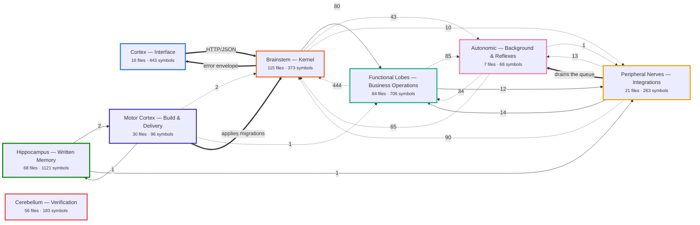
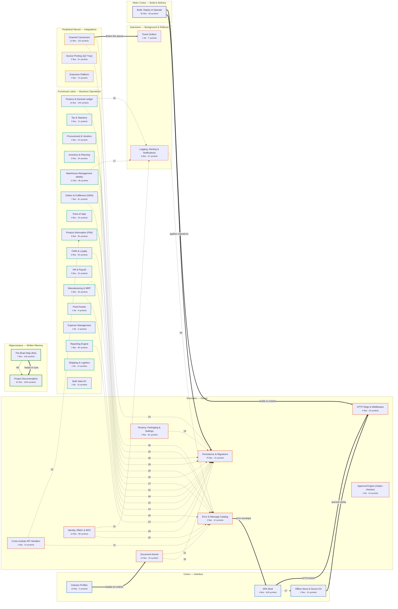
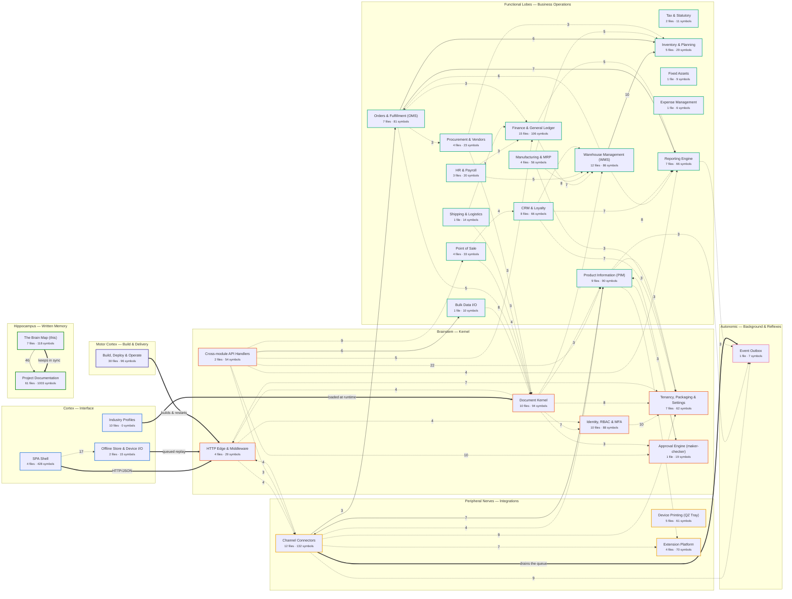
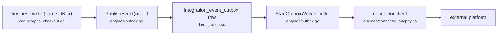
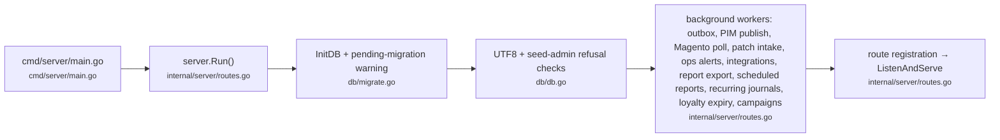

# Custom ERP — Project Brain

<!-- GENERATED FILE - do not edit by hand. Edit docs/brain/brain.map.json instead. -->
> **Generated.** Which regions exist comes from [`brain.map.json`](brain.map.json); which files exist comes
> from the working tree; what calls what comes from `graphify-out/graph.json`. Edit the map, never this
> file, then run `pwsh docs/brain/update-brain.ps1`. How to do that is in [README.md](README.md).

Every part of this system, grouped into brain regions, wired by the call graph graphify actually extracted from the source.

| | |
|---|---|
| Graph built from commit | `ad2b4b34` |
| Brain redrawn | 2026-08-05 |
| Regions / lobes | 36 / 8 |
| Files in the working tree | 397 (277 of them parsed into the graph) |
| Files claimed by a region | **100.0%** |
| Symbols in the graph | 3443 |
| Cross-region relationships | 1390 extracted (95% inferred) + 8 declared by hand |

**Interactive version: [brain.html](brain.html)** — open it in a browser and click any region.

## How to read this

- A **lobe** is a layer of the system; a **region** is one area of responsibility inside it. Which files belong to which region is decided entirely by the `match` patterns in `brain.map.json`.
- A **thin arrow** is a real relationship graphify extracted from the source — a call, a type reference, a method, an embed — aggregated up to the region level. The number on it is how many such relationships cross that boundary, which is a measure of coupling, not of importance.
- A **thick `==>` arrow** is *declared by hand* in `brain.map.json`. These are the connections a call-graph extractor structurally cannot see: the browser talking to the server over HTTP, a script driving the binary, a connector reaching a third-party API. They are drawn differently on purpose — they are asserted, not measured.
- A **solid arrow** contains at least one relationship graphify parsed straight out of the source (`EXTRACTED`). A **dotted arrow** is one where *every* underlying relationship is `INFERRED` — graphify's heuristic guess. Dotted is the common case here, and that is a property of the extractor, not a defect in the code: it resolves calls within a file exactly and calls across files by name, and 95% of cross-region relationships are cross-file by definition. So: the shape of this map is reliable, any *single* dotted edge is a lead to confirm with grep before you rely on it, and a solid arrow is one graphify actually saw.
- `contains` edges are excluded everywhere: a file containing its own functions says nothing about how areas of the system relate.
- The test suite is a region but is deliberately left out of every wiring diagram and every count. Tests reach into everything, so drawing them would flatten the real structure into noise.

## 1. The whole brain, at lobe level

8 lobes. If you read one diagram, read this one.

| Lobe | What it is | Regions | Files | Symbols | Wiring inside the lobe |
|---|---|---:|---:|---:|---:|
| **Cortex — Interface** | What the user sees and touches. Every business intent enters here. | 3 | 16 | 443 | 17 |
| **Brainstem — Kernel** | Involuntary and non-negotiable. Every single request passes through here, whatever it is asking for. | 8 | 115 | 373 | 295 |
| **Functional Lobes — Business Operations** | The specialised areas. Each one owns a domain and can be licensed on its own. | 16 | 84 | 706 | 126 |
| **Peripheral Nerves — Integrations** | Contact with the outside world: storefronts, payment terminals, marketing clouds, third-party extensions. | 3 | 21 | 263 | 7 |
| **Autonomic — Background & Reflexes** | Runs without anyone asking it to: outbox drain, pollers, alerting, scheduled sweeps. | 2 | 7 | 68 | 1 |
| **Hippocampus — Written Memory** | What this project knows about itself: the backlog, the ledger, the guides, the handover note. | 2 | 68 | 1121 | 46 |
| **Motor Cortex — Build & Delivery** | How the system actually moves: build, migrate, promote, back up, restore. | 1 | 30 | 96 | 0 |
| **Cerebellum — Verification** | Balance and correction. Kept out of the wiring diagrams on purpose — tests touch everything, so drawing them would grey out every real edge. | 1 | 56 | 183 | 0 |

## 2. Region map

Every region, grouped by lobe, with the connections of weight **12 or more**. The full set is in [brain.html](brain.html) and in §5 below.

### 2b. The same map with the universal hubs removed

**Error & Message Catalog**, **Persistence & Migrations**, **Logging, Alerting & Notifications** are reached from nearly every region — which is the point of them, but it means they dominate the diagram above and hide everything else. Take them out and what is left is how the business areas actually relate to each other.

*Showing every non-hub connection of weight 3 or more (57 of them).*

### 2c. Declared connections

These are asserted in `brain.map.json`, not measured. Each one is a boundary a call-graph extractor cannot cross.

| From | To | Boundary | Why it has to be declared |
|---|---|---|---|
| SPA Shell | HTTP Edge & Middleware | HTTP/JSON | The SPA is JavaScript and the server is Go. apiFetch() calls the route table over the network; no extractor can link the two. |
| Error & Message Catalog | SPA Shell | error envelope | showApiError() renders the exact code/message the catalog returns. Contract enforced by convention on both sides, invisible to either language's AST. |
| Offline Store & Device I/O | HTTP Edge & Middleware | queued replay | Offline POS writes queue into IndexedDB and are replayed against the same endpoints when the network returns. |
| Industry Profiles | Document Kernel | loaded at runtime | SwitchIndustryProfile reads a JSON profile off disk by path; the profiles are data, not code, so nothing links to them statically. |
| Channel Connectors | Event Outbox | drains the queue | The outbox worker dispatches by event name through a registry rather than by direct call, so the edge is a table lookup, not a call site. |
| Build, Deploy & Operate | Persistence & Migrations | applies migrations | promote.ps1 and deploy/migrate.sh run the migration files; PowerShell and .sql are both outside the Go call graph. |
| Build, Deploy & Operate | HTTP Edge & Middleware | builds & restarts | manage.ps1/promote.ps1 build the binary and control its lifecycle from outside the process entirely. |
| The Brain Map (this) | Project Documentation | keeps in sync | The brain is regenerated alongside the big 3 docs; the relationship is a convention in CLAUDE.md, not a code dependency. |

## 3. Signal pathways

The routes a signal actually takes through the brain. These are described by hand in `brain.map.json` (`pathways`) because ordering is intent — a call graph can tell you that A reaches B, not that it must happen third.

### Request signal path

What happens to one API call, in order. Everything downstream of apiMiddleware trusts the Resolved-* headers it sets and nothing the client claimed.

```mermaid
flowchart LR
  n_request0["Browser: apiFetch()<br/><small>public/app.js</small>"]
  n_request1["Route table<br/><small>internal/server/routes.go</small>"]
  n_request0 --> n_request1
  n_request2["apiMiddleware: CORS → 2MB cap → rate limit → panic recovery<br/><small>internal/server/middleware.go</small>"]
  n_request1 --> n_request2
  n_request3["JWT verify → tenant resolve → Resolved-Tenant-ID / Resolved-User-ID headers<br/><small>internal/server/middleware.go</small>"]
  n_request2 --> n_request3
  n_request4["handler<br/><small>internal/server/handlers_*.go</small>"]
  n_request3 --> n_request4
  n_request5["engine<br/><small>engines/*.go</small>"]
  n_request4 --> n_request5
  n_request6["GetTenantSchema + SetSearchPath<br/><small>db/db.go</small>"]
  n_request5 --> n_request6
  n_request7["PostgreSQL tenant schema<br/><small>db/migration.sql</small>"]
  n_request6 --> n_request7
  n_request8["writeAPIError / JSON envelope<br/><small>internal/server/apierror.go</small>"]
  n_request7 --> n_request8
  n_request9["showApiError()<br/><small>public/app.js</small>"]
  n_request8 --> n_request9
```

### Outbound integration path

No user-facing transaction ever makes a synchronous outbound HTTP call. This is why a down Shopify cannot hang a checkout.

### Maker-checker path

Any approval-gated document follows this. Editing an already-approved document resets it to pending rather than silently keeping the approval.

```mermaid
flowchart LR
  n_approval0["document submitted<br/><small>internal/server/handlers_core_doc_engine.go</small>"]
  n_approval1["ValidateDocument<br/><small>engines/doctype.go</small>"]
  n_approval0 --> n_approval1
  n_approval2["IsApprovalGated / RequiredApproverRoleForAmount<br/><small>engines/approval.go</small>"]
  n_approval1 --> n_approval2
  n_approval3["SubmitForApproval → Pending<br/><small>engines/approval.go</small>"]
  n_approval2 --> n_approval3
  n_approval4["DecideApproval (different user, required role)<br/><small>engines/approval.go</small>"]
  n_approval3 --> n_approval4
  n_approval5["status transition<br/><small>engines/status_transition.go</small>"]
  n_approval4 --> n_approval5
  n_approval6["GL posting<br/><small>engines/finance.go</small>"]
  n_approval5 --> n_approval6
  n_approval7["audit log<br/><small>engines/logs.go</small>"]
  n_approval6 --> n_approval7
```

### Boot & reflex startup

What comes up when the binary starts, before it ever serves a request. One cancellable context is threaded into every worker so SIGTERM lets them finish a tick and exit.

## 4. Region index

| Region | Lobe | Files | Symbols | Busiest connection |
|---|---|---:|---:|---|
| [SPA Shell](#spa-shell) | Cortex — Interface | 4 | 428 | → Offline Store & Device I/O (17) |
| [Offline Store & Device I/O](#offline-store--device-io) | Cortex — Interface | 2 | 15 | ← SPA Shell (17) |
| [Industry Profiles](#industry-profiles) | Cortex — Interface | 10 | 0 | — |
| [HTTP Edge & Middleware](#http-edge--middleware) | Brainstem — Kernel | 4 | 29 | → Persistence & Migrations (9) |
| [Error & Message Catalog](#error--message-catalog) | Brainstem — Kernel | 2 | 12 | ← Cross-module API Handlers (72) |
| [Document Kernel](#document-kernel) | Brainstem — Kernel | 10 | 94 | → Persistence & Migrations (33) |
| [Identity, RBAC & MFA](#identity-rbac--mfa) | Brainstem — Kernel | 10 | 88 | → Error & Message Catalog (32) |
| [Tenancy, Packaging & Settings](#tenancy-packaging--settings) | Brainstem — Kernel | 7 | 62 | → Persistence & Migrations (19) |
| [Approval Engine (maker-checker)](#approval-engine-maker-checker) | Brainstem — Kernel | 1 | 19 | → Persistence & Migrations (11) |
| [Persistence & Migrations](#persistence--migrations) | Brainstem — Kernel | 79 | 15 | ← Finance & General Ledger (45) |
| [Cross-module API Handlers](#cross-module-api-handlers) | Brainstem — Kernel | 2 | 54 | → Error & Message Catalog (72) |
| [Finance & General Ledger](#finance--general-ledger) | Functional Lobes — Business Operations | 15 | 106 | → Persistence & Migrations (45) |
| [Tax & Statutory](#tax--statutory) | Functional Lobes — Business Operations | 2 | 11 | → Persistence & Migrations (3) |
| [Procurement & Vendors](#procurement--vendors) | Functional Lobes — Business Operations | 4 | 23 | → Persistence & Migrations (10) |
| [Inventory & Planning](#inventory--planning) | Functional Lobes — Business Operations | 5 | 29 | → Persistence & Migrations (18) |
| [Warehouse Management (WMS)](#warehouse-management-wms) | Functional Lobes — Business Operations | 12 | 86 | → Persistence & Migrations (32) |
| [Orders & Fulfillment (OMS)](#orders--fulfillment-oms) | Functional Lobes — Business Operations | 7 | 81 | → Persistence & Migrations (32) |
| [Point of Sale](#point-of-sale) | Functional Lobes — Business Operations | 4 | 33 | → Persistence & Migrations (10) |
| [Product Information (PIM)](#product-information-pim) | Functional Lobes — Business Operations | 9 | 90 | → Persistence & Migrations (44) |
| [CRM & Loyalty](#crm--loyalty) | Functional Lobes — Business Operations | 8 | 66 | → Persistence & Migrations (22) |
| [HR & Payroll](#hr--payroll) | Functional Lobes — Business Operations | 3 | 20 | → Error & Message Catalog (9) |
| [Manufacturing & MRP](#manufacturing--mrp) | Functional Lobes — Business Operations | 4 | 56 | → Error & Message Catalog (20) |
| [Fixed Assets](#fixed-assets) | Functional Lobes — Business Operations | 1 | 9 | ← Logging, Alerting & Notifications (4) |
| [Expense Management](#expense-management) | Functional Lobes — Business Operations | 1 | 6 | → Persistence & Migrations (3) |
| [Reporting Engine](#reporting-engine) | Functional Lobes — Business Operations | 7 | 66 | → Persistence & Migrations (23) |
| [Shipping & Logistics](#shipping--logistics) | Functional Lobes — Business Operations | 1 | 14 | ← Logging, Alerting & Notifications (9) |
| [Bulk Data I/O](#bulk-data-io) | Functional Lobes — Business Operations | 1 | 10 | → Document Kernel (8) |
| [Channel Connectors](#channel-connectors) | Peripheral Nerves — Integrations | 12 | 132 | → Error & Message Catalog (35) |
| [Device Printing (QZ Tray)](#device-printing-qz-tray) | Peripheral Nerves — Integrations | 5 | 61 | → Error & Message Catalog (7) |
| [Extension Platform](#extension-platform) | Peripheral Nerves — Integrations | 4 | 70 | ← Channel Connectors (7) |
| [Event Outbox](#event-outbox) | Autonomic — Background & Reflexes | 1 | 7 | ← Channel Connectors (9) |
| [Logging, Alerting & Notifications](#logging-alerting--notifications) | Autonomic — Background & Reflexes | 6 | 61 | → Error & Message Catalog (46) |
| [Project Documentation](#project-documentation) | Hippocampus — Written Memory | 61 | 1003 | ← The Brain Map (this) (46) |
| [The Brain Map (this)](#the-brain-map-this) | Hippocampus — Written Memory | 7 | 118 | → Project Documentation (46) |
| [Build, Deploy & Operate](#build-deploy--operate) | Motor Cortex — Build & Delivery | 30 | 96 | ← The Brain Map (this) (2) |
| [Test Suite](#test-suite) | Cerebellum — Verification | 56 | 183 | — |

## 5. Region detail

### Cortex — Interface

*What the user sees and touches. Every business intent enters here.*

#### SPA Shell

The whole frontend: one hand-written vanilla-JS single-page app, no framework and no build step. Owns routing (renderView), every screen's markup, the two dialog systems, and the shared apiFetch/showApiError error path.

**Most connected symbols**

- `apiFetch()` — [public/app.js](../../public/app.js#L518) · degree 187
- `renderView()` — [public/app.js](../../public/app.js#L2986) · degree 108
- `showApiError()` — [public/app.js](../../public/app.js#L191) · degree 88
- `renderViewContent()` — [public/app.js](../../public/app.js#L3006) · degree 50
- `showCustomAlert()` — [public/app.js](../../public/app.js#L2) · degree 33
- `getErrorMessage()` — [public/app.js](../../public/app.js#L180) · degree 29

**Wired to**

- → **Offline Store & Device I/O** — 17 relationships, 17 inferred
- → **HTTP Edge & Middleware** — declared: HTTP/JSON
- ← **Error & Message Catalog** — declared: error envelope

4 files

- [public/app.js](../../public/app.js)
- [public/components/erp-typeahead.js](../../public/components/erp-typeahead.js)
- [public/index.html](../../public/index.html)
- [public/styles.css](../../public/styles.css)

#### Offline Store & Device I/O

Browser-side IndexedDB queue that lets POS keep selling when the network drops, plus on-device barcode/QR rendering.

**Most connected symbols**

- `d()` — [public/qrcode.min.js](../../public/qrcode.min.js#L1) · degree 7
- `a()` — [public/qrcode.min.js](../../public/qrcode.min.js#L1) · degree 6
- `k()` — [public/qrcode.min.js](../../public/qrcode.min.js#L1) · degree 3
- `b()` — [public/qrcode.min.js](../../public/qrcode.min.js#L1) · degree 2
- `n()` — [public/qrcode.min.js](../../public/qrcode.min.js#L1) · degree 2
- `r()` — [public/qrcode.min.js](../../public/qrcode.min.js#L1) · degree 2

**Wired to**

- → **HTTP Edge & Middleware** — declared: queued replay
- ← **SPA Shell** — 17 relationships, 17 inferred

2 files

- [public/db.js](../../public/db.js)
- [public/qrcode.min.js](../../public/qrcode.min.js)

#### Industry Profiles

Per-vertical master-data and field packs (jewellery, pharma, food & bev, auto, …) loaded by SwitchIndustryProfile to reshape the same kernel into a different industry.

**Wired to**

- → **Document Kernel** — declared: loaded at runtime

10 files

- [public/profiles/agriculture.json](../../public/profiles/agriculture.json)
- [public/profiles/auto.json](../../public/profiles/auto.json)
- [public/profiles/clothing.json](../../public/profiles/clothing.json)
- [public/profiles/construction.json](../../public/profiles/construction.json)
- [public/profiles/food_bev.json](../../public/profiles/food_bev.json)
- [public/profiles/jewelry.json](../../public/profiles/jewelry.json)
- [public/profiles/medical.json](../../public/profiles/medical.json)
- [public/profiles/metal.json](../../public/profiles/metal.json)
- [public/profiles/pharma.json](../../public/profiles/pharma.json)
- [public/profiles/semiconductor.json](../../public/profiles/semiconductor.json)

### Brainstem — Kernel

*Involuntary and non-negotiable. Every single request passes through here, whatever it is asking for.*

#### HTTP Edge & Middleware

The one door in. apiMiddleware does CORS allowlist, 2MB body cap, per-category rate limiting, panic recovery, JWT verification and tenant resolution, then publishes Resolved-* headers every handler downstream reads. routes.go is the full route table and the background-worker startup list.

**Most connected symbols**

- `apiMiddleware()` — [internal/server/middleware.go](../../internal/server/middleware.go#L455) · degree 35
- `Run()` — [internal/server/routes.go](../../internal/server/routes.go#L22) · degree 23
- `main()` — [cmd/server/main.go](../../cmd/server/main.go#L17) · degree 6
- `moduleGate()` — [internal/server/middleware.go](../../internal/server/middleware.go#L396) · degree 5
- `RateLimiter` — [internal/server/middleware.go](../../internal/server/middleware.go#L60) · degree 4
- `currentAppVersion()` — [internal/server/middleware.go](../../internal/server/middleware.go#L46) · degree 4

**Wired to**

- → **Persistence & Migrations** — 9 relationships, 9 inferred
- → **Tenancy, Packaging & Settings** — 7 relationships, 7 inferred
- → **Error & Message Catalog** — 6 relationships, 6 inferred
- → **Channel Connectors** — 4 relationships, 4 inferred
- → **Identity, RBAC & MFA** — 4 relationships, 4 inferred
- → **CRM & Loyalty** — 2 relationships, 2 inferred
- → **Logging, Alerting & Notifications** — 2 relationships, 2 inferred
- → **Reporting Engine** — 2 relationships, 2 inferred
- ← **Channel Connectors** — 4 relationships, 4 inferred
- ← **Document Kernel** — 4 relationships, 4 inferred
- ← **Identity, RBAC & MFA** — 2 relationships, 2 inferred
- ← **Logging, Alerting & Notifications** — 2 relationships, 2 inferred
- ← **SPA Shell** — declared: HTTP/JSON
- ← **Offline Store & Device I/O** — declared: queued replay
- ← **Build, Deploy & Operate** — declared: builds & restarts

4 files

- [cmd/server/main.go](../../cmd/server/main.go)
- [internal/server/VERSION](../../internal/server/VERSION)
- [internal/server/middleware.go](../../internal/server/middleware.go)
- [internal/server/routes.go](../../internal/server/routes.go)

#### Error & Message Catalog

The 300+ code standard message catalog and the writeAPIError/writeAPIErrorGeneric envelope every handler returns through. Single choke point for what a user is actually told when something fails.

**Most connected symbols**

- `writeAPIErrorGeneric()` — [internal/server/apierror.go](../../internal/server/apierror.go#L217) · degree 251
- `writeEngineError()` — [internal/server/apierror.go](../../internal/server/apierror.go#L182) · degree 49
- `writeAPIError()` — [internal/server/apierror.go](../../internal/server/apierror.go#L117) · degree 23
- `writeAPIErrorDetail()` — [internal/server/apierror.go](../../internal/server/apierror.go#L131) · degree 14
- `logForEntry()` — [internal/server/apierror.go](../../internal/server/apierror.go#L91) · degree 12
- `writeResponse()` — [internal/server/apierror.go](../../internal/server/apierror.go#L107) · degree 5

**Wired to**

- → **Logging, Alerting & Notifications** — 2 relationships, 2 inferred
- → **SPA Shell** — declared: error envelope
- ← **Cross-module API Handlers** — 72 relationships, 72 inferred
- ← **Logging, Alerting & Notifications** — 46 relationships, 46 inferred
- ← **Channel Connectors** — 35 relationships, 35 inferred
- ← **Identity, RBAC & MFA** — 32 relationships, 32 inferred
- ← **Warehouse Management (WMS)** — 25 relationships, 25 inferred
- ← **Document Kernel** — 21 relationships, 21 inferred
- ← **Finance & General Ledger** — 20 relationships, 20 inferred
- ← **Manufacturing & MRP** — 20 relationships, 20 inferred

2 files

- [internal/server/apierror.go](../../internal/server/apierror.go)
- [internal/server/error_catalog_generated.go](../../internal/server/error_catalog_generated.go)

#### Document Kernel

The metadata-driven Record Type engine — one generic documents table per tenant plus a doctype_meta/doctype_fields registry. ValidateDocument is the shared validation choke point; document numbering, edit windows and status transitions hang off the same spine.

**Most connected symbols**

- `handleGenericDoc()` — [internal/server/handlers_core_doc_engine.go](../../internal/server/handlers_core_doc_engine.go#L57) · degree 41
- `NewDocID()` — [engines/docid.go](../../engines/docid.go#L93) · degree 22
- `ValidateTransactionalRules()` — [engines/transactional_validation.go](../../engines/transactional_validation.go#L19) · degree 15
- `strField()` — [engines/master_data_validation.go](../../engines/master_data_validation.go#L44) · degree 15
- `GenerateSequence()` — [engines/numbering.go](../../engines/numbering.go#L45) · degree 11
- `GetDocTypeMeta()` — [engines/doctype.go](../../engines/doctype.go#L52) · degree 10

**Wired to**

- → **Persistence & Migrations** — 33 relationships, 33 inferred
- → **Error & Message Catalog** — 21 relationships, 21 inferred
- → **Tenancy, Packaging & Settings** — 8 relationships, 8 inferred
- → **Identity, RBAC & MFA** — 7 relationships, 7 inferred
- → **Logging, Alerting & Notifications** — 5 relationships, 5 inferred
- → **HTTP Edge & Middleware** — 4 relationships, 4 inferred
- → **Warehouse Management (WMS)** — 4 relationships, 4 inferred
- → **Approval Engine (maker-checker)** — 3 relationships, 3 inferred
- ← **Bulk Data I/O** — 8 relationships, 8 inferred
- ← **Orders & Fulfillment (OMS)** — 5 relationships, 5 inferred
- ← **Point of Sale** — 4 relationships, 4 inferred
- ← **Shipping & Logistics** — 3 relationships, 3 inferred
- ← **Procurement & Vendors** — 3 relationships, 3 inferred
- ← **CRM & Loyalty** — 2 relationships, 2 inferred
- ← **Finance & General Ledger** — 2 relationships, 2 inferred
- ← **Cross-module API Handlers** — 2 relationships, 2 inferred

10 files

- [engines/docid.go](../../engines/docid.go)
- [engines/doctype.go](../../engines/doctype.go)
- [engines/document_edit_window.go](../../engines/document_edit_window.go)
- [engines/document_mirror_fields.go](../../engines/document_mirror_fields.go)
- [engines/document_numbering.go](../../engines/document_numbering.go)
- [engines/master_data_validation.go](../../engines/master_data_validation.go)
- [engines/numbering.go](../../engines/numbering.go)
- [engines/status_transition.go](../../engines/status_transition.go)
- [engines/transactional_validation.go](../../engines/transactional_validation.go)
- [internal/server/handlers_core_doc_engine.go](../../internal/server/handlers_core_doc_engine.go)

#### Identity, RBAC & MFA

Login, JWT issue/verify, per-role permissions, TOTP MFA for privileged roles, MFA recovery codes and authenticator re-enrollment, account lockout, password reset, and field-level permissions.

**Most connected symbols**

- `requireHRAdmin()` — [internal/server/handlers_admin_identity.go](../../internal/server/handlers_admin_identity.go#L37) · degree 21
- `SignToken()` — [engines/auth.go](../../engines/auth.go#L206) · degree 16
- `handleMFAActivate()` — [internal/server/handlers_auth.go](../../internal/server/handlers_auth.go#L176) · degree 13
- `handleLogin()` — [internal/server/handlers_auth.go](../../internal/server/handlers_auth.go#L19) · degree 12
- `handleMFAReenrollConfirm()` — [internal/server/handlers_mfa_recovery.go](../../internal/server/handlers_mfa_recovery.go#L154) · degree 11
- `handleMFAVerify()` — [internal/server/handlers_auth.go](../../internal/server/handlers_auth.go#L295) · degree 11

**Wired to**

- → **Error & Message Catalog** — 32 relationships, 32 inferred
- → **Persistence & Migrations** — 29 relationships, 29 inferred
- → **Logging, Alerting & Notifications** — 21 relationships, 21 inferred
- → **Tenancy, Packaging & Settings** — 10 relationships, 10 inferred
- → **HTTP Edge & Middleware** — 2 relationships, 2 inferred
- → **Document Kernel** — 1 relationship, all extracted
- ← **Document Kernel** — 7 relationships, 7 inferred
- ← **HTTP Edge & Middleware** — 4 relationships, 4 inferred
- ← **Logging, Alerting & Notifications** — 2 relationships, 2 inferred
- ← **Tenancy, Packaging & Settings** — 2 relationships, 2 inferred
- ← **Channel Connectors** — 1 relationship, 1 inferred
- ← **HR & Payroll** — 1 relationship, 1 inferred
- ← **Cross-module API Handlers** — 1 relationship, 1 inferred

10 files

- [engines/auth.go](../../engines/auth.go)
- [engines/auth_livestate.go](../../engines/auth_livestate.go)
- [engines/field_permissions.go](../../engines/field_permissions.go)
- [engines/mfa.go](../../engines/mfa.go)
- [engines/mfa_recovery.go](../../engines/mfa_recovery.go)
- [engines/password_reset.go](../../engines/password_reset.go)
- [internal/server/handlers_admin_identity.go](../../internal/server/handlers_admin_identity.go)
- [internal/server/handlers_auth.go](../../internal/server/handlers_auth.go)
- [internal/server/handlers_mfa_recovery.go](../../internal/server/handlers_mfa_recovery.go)
- [internal/server/handlers_profile.go](../../internal/server/handlers_profile.go)

#### Tenancy, Packaging & Settings

Schema-per-tenant provisioning, the sellable product packages (PIM/WMS/OMS/HR/…) and their module entitlements, tenant limits, the settings registry, and per-tenant UI label overrides.

**Most connected symbols**

- `GetSettingInt()` — [engines/settings_registry.go](../../engines/settings_registry.go#L140) · degree 30
- `GetSettingFloat()` — [engines/settings_registry.go](../../engines/settings_registry.go#L164) · degree 7
- `SetModuleEntitlement()` — [engines/modules.go](../../engines/modules.go#L341) · degree 7
- `handleUpdateSettings()` — [internal/server/handlers_settings.go](../../internal/server/handlers_settings.go#L29) · degree 7
- `rawSettingForSchema()` — [engines/settings_registry.go](../../engines/settings_registry.go#L100) · degree 7
- `SetSetting()` — [engines/settings_registry.go](../../engines/settings_registry.go#L246) · degree 6

**Wired to**

- → **Persistence & Migrations** — 19 relationships, 19 inferred
- → **Identity, RBAC & MFA** — 2 relationships, 2 inferred
- → **Error & Message Catalog** — 1 relationship, 1 inferred
- → **Logging, Alerting & Notifications** — 1 relationship, 1 inferred
- ← **Identity, RBAC & MFA** — 10 relationships, 10 inferred
- ← **Channel Connectors** — 9 relationships, 9 inferred
- ← **Document Kernel** — 8 relationships, 8 inferred
- ← **CRM & Loyalty** — 7 relationships, 7 inferred
- ← **HTTP Edge & Middleware** — 7 relationships, 7 inferred
- ← **Manufacturing & MRP** — 3 relationships, 3 inferred
- ← **Product Information (PIM)** — 3 relationships, 3 inferred
- ← **Orders & Fulfillment (OMS)** — 2 relationships, 2 inferred

7 files

- [engines/labels.go](../../engines/labels.go)
- [engines/modules.go](../../engines/modules.go)
- [engines/saas.go](../../engines/saas.go)
- [engines/settings_definitions.go](../../engines/settings_definitions.go)
- [engines/settings_registry.go](../../engines/settings_registry.go)
- [engines/tenant_limits.go](../../engines/tenant_limits.go)
- [internal/server/handlers_settings.go](../../internal/server/handlers_settings.go)

#### Approval Engine (maker-checker)

Amount-banded approval rules, submit → decide → log, bulk decisions, and reset-to-pending when an approved document is edited. Every approval-gated flow in the system routes through this one engine rather than rolling its own.

**Most connected symbols**

- `DecideApproval()` — [engines/approval.go](../../engines/approval.go#L269) · degree 14
- `SubmitForApproval()` — [engines/approval.go](../../engines/approval.go#L223) · degree 12
- `IsApprovalGated()` — [engines/approval.go](../../engines/approval.go#L165) · degree 4
- `ListPendingApprovals()` — [engines/approval.go](../../engines/approval.go#L461) · degree 4
- `RequiredApproverRoleForAmount()` — [engines/approval.go](../../engines/approval.go#L158) · degree 4
- `ResetToPendingOnEdit()` — [engines/approval.go](../../engines/approval.go#L450) · degree 4

**Wired to**

- → **Persistence & Migrations** — 11 relationships, 11 inferred
- → **Product Information (PIM)** — 3 relationships, 3 inferred
- → **CRM & Loyalty** — 1 relationship, 1 inferred
- → **Finance & General Ledger** — 1 relationship, 1 inferred
- → **Logging, Alerting & Notifications** — 1 relationship, 1 inferred
- ← **Cross-module API Handlers** — 10 relationships, 10 inferred
- ← **Document Kernel** — 3 relationships, 3 inferred
- ← **Product Information (PIM)** — 3 relationships, 3 inferred
- ← **Finance & General Ledger** — 2 relationships, 2 inferred
- ← **CRM & Loyalty** — 1 relationship, 1 inferred
- ← **Warehouse Management (WMS)** — 1 relationship, 1 inferred

1 file

- [engines/approval.go](../../engines/approval.go)

#### Persistence & Migrations

The Postgres connection, GetTenantSchema/SetSearchPath (the tenant boundary, enforced at the SQL layer), the migration runner, and every incremental migration file.

**Most connected symbols**

- `GetTenantSchema()` — [db/db.go](../../db/db.go#L105) · degree 410
- `InitDB()` — [db/db.go](../../db/db.go#L40) · degree 67
- `SetSearchPath()` — [db/db.go](../../db/db.go#L123) · degree 49
- `migrationFileNames()` — [db/migrate.go](../../db/migrate.go#L208) · degree 5
- `ApplyPendingMigrations()` — [db/migrate.go](../../db/migrate.go#L51) · degree 4
- `PendingMigrations()` — [db/migrate.go](../../db/migrate.go#L170) · degree 4

**Wired to**

- ← **Finance & General Ledger** — 45 relationships, 45 inferred
- ← **Product Information (PIM)** — 44 relationships, 44 inferred
- ← **Document Kernel** — 33 relationships, 33 inferred
- ← **Orders & Fulfillment (OMS)** — 32 relationships, 32 inferred
- ← **Warehouse Management (WMS)** — 32 relationships, 32 inferred
- ← **Identity, RBAC & MFA** — 29 relationships, 29 inferred
- ← **Channel Connectors** — 24 relationships, 24 inferred
- ← **Reporting Engine** — 23 relationships, 23 inferred

79 files

- [db/db.go](../../db/db.go)
- [db/migrate.go](../../db/migrate.go)
- [db/migration.sql](../../db/migration.sql)
- [db/migrations_phase3.sql](../../db/migrations_phase3.sql)
- [db/migrations_stage14a_modules.sql](../../db/migrations_stage14a_modules.sql)
- [db/migrations_stage14b_versioning.sql](../../db/migrations_stage14b_versioning.sql)
- [db/migrations_stage14c_pipeline.sql](../../db/migrations_stage14c_pipeline.sql)
- [db/migrations_stage14d_patchintake.sql](../../db/migrations_stage14d_patchintake.sql)
- [db/migrations_stage14e_extensions.sql](../../db/migrations_stage14e_extensions.sql)
- [db/migrations_stage14f_security.sql](../../db/migrations_stage14f_security.sql)
- [db/migrations_stage16_field_permissions.sql](../../db/migrations_stage16_field_permissions.sql)
- [db/migrations_stage17_soft_delete.sql](../../db/migrations_stage17_soft_delete.sql)
- [db/migrations_stage17c_accounting_periods.sql](../../db/migrations_stage17c_accounting_periods.sql)
- [db/migrations_stage17d_gst_accounts.sql](../../db/migrations_stage17d_gst_accounts.sql)
- [db/migrations_stage17e_transfer_orders.sql](../../db/migrations_stage17e_transfer_orders.sql)
- [db/migrations_stage17f_purchase_requisition.sql](../../db/migrations_stage17f_purchase_requisition.sql)
- [db/migrations_stage17g_vendor_invoice.sql](../../db/migrations_stage17g_vendor_invoice.sql)
- [db/migrations_stage17h_location_masters.sql](../../db/migrations_stage17h_location_masters.sql)
- [db/migrations_stage18_core_module_fix.sql](../../db/migrations_stage18_core_module_fix.sql)
- [db/migrations_stage20_13_offline_pos_sync.sql](../../db/migrations_stage20_13_offline_pos_sync.sql)
- [db/migrations_stage20a_pos_maturity.sql](../../db/migrations_stage20a_pos_maturity.sql)
- [db/migrations_stage20b_wms_maturity.sql](../../db/migrations_stage20b_wms_maturity.sql)
- [db/migrations_stage20c_finance_maturity.sql](../../db/migrations_stage20c_finance_maturity.sql)
- [db/migrations_stage20d_reports_engine.sql](../../db/migrations_stage20d_reports_engine.sql)
- [db/migrations_stage21_user_profile.sql](../../db/migrations_stage21_user_profile.sql)
- [db/migrations_stage24_addendum_data_integrity.sql](../../db/migrations_stage24_addendum_data_integrity.sql)
- [db/migrations_stage24_addendum_offline_heartbeat.sql](../../db/migrations_stage24_addendum_offline_heartbeat.sql)
- [db/migrations_stage24_security.sql](../../db/migrations_stage24_security.sql)
- [db/migrations_stage24b_deferred_hardening.sql](../../db/migrations_stage24b_deferred_hardening.sql)
- [db/migrations_stage25_ops_status.sql](../../db/migrations_stage25_ops_status.sql)
- [db/migrations_stage26_10_1_stock_ledger.sql](../../db/migrations_stage26_10_1_stock_ledger.sql)
- [db/migrations_stage26_10_4_scheduled_reports.sql](../../db/migrations_stage26_10_4_scheduled_reports.sql)
- [db/migrations_stage26_10_7_report_perf.sql](../../db/migrations_stage26_10_7_report_perf.sql)
- [db/migrations_stage26_12_10_notifications.sql](../../db/migrations_stage26_12_10_notifications.sql)
- [db/migrations_stage26_12_1_order_engine.sql](../../db/migrations_stage26_12_1_order_engine.sql)
- [db/migrations_stage26_12_2_allocation_sourcing.sql](../../db/migrations_stage26_12_2_allocation_sourcing.sql)
- [db/migrations_stage26_12_3_pick_pack.sql](../../db/migrations_stage26_12_3_pick_pack.sql)
- [db/migrations_stage26_12_4_shipment_manifest.sql](../../db/migrations_stage26_12_4_shipment_manifest.sql)
- [db/migrations_stage26_12_5_returns_rto_qc_refund.sql](../../db/migrations_stage26_12_5_returns_rto_qc_refund.sql)
- [db/migrations_stage26_12_foundation.sql](../../db/migrations_stage26_12_foundation.sql)
- [db/migrations_stage26_4_10_supplier_portal.sql](../../db/migrations_stage26_4_10_supplier_portal.sql)
- [db/migrations_stage26_4_pim_maturity.sql](../../db/migrations_stage26_4_pim_maturity.sql)
- [db/migrations_stage26_5_16_robotics.sql](../../db/migrations_stage26_5_16_robotics.sql)
- [db/migrations_stage26_5_wms_enterprise.sql](../../db/migrations_stage26_5_wms_enterprise.sql)
- [db/migrations_stage26_5_wms_p2.sql](../../db/migrations_stage26_5_wms_p2.sql)
- [db/migrations_stage26_6_5_payment_file.sql](../../db/migrations_stage26_6_5_payment_file.sql)
- [db/migrations_stage26_6_6_backdated_posting.sql](../../db/migrations_stage26_6_6_backdated_posting.sql)
- [db/migrations_stage26_6_8_cost_center_postings.sql](../../db/migrations_stage26_6_8_cost_center_postings.sql)
- [db/migrations_stage26_6_finance_tax_close.sql](../../db/migrations_stage26_6_finance_tax_close.sql)
- [db/migrations_stage26_7_4_campaign.sql](../../db/migrations_stage26_7_4_campaign.sql)
- [db/migrations_stage26_7_4b_clevertap_tables_catchup.sql](../../db/migrations_stage26_7_4b_clevertap_tables_catchup.sql)
- [db/migrations_stage26_7_5_fraud_otp.sql](../../db/migrations_stage26_7_5_fraud_otp.sql)
- [db/migrations_stage26_7_9_crm_analytics.sql](../../db/migrations_stage26_7_9_crm_analytics.sql)
- [db/migrations_stage26_7_crm_loyalty.sql](../../db/migrations_stage26_7_crm_loyalty.sql)
- [db/migrations_stage26_8_hr_payroll.sql](../../db/migrations_stage26_8_hr_payroll.sql)
- [db/migrations_stage26_8_hr_process.sql](../../db/migrations_stage26_8_hr_process.sql)
- [db/migrations_stage26_9_10_scheduling_subcontract.sql](../../db/migrations_stage26_9_10_scheduling_subcontract.sql)
- [db/migrations_stage26_9_manufacturing_mrp.sql](../../db/migrations_stage26_9_manufacturing_mrp.sql)
- [db/migrations_stage27_product_packaging.sql](../../db/migrations_stage27_product_packaging.sql)
- [db/migrations_stage28_report_column_profiles.sql](../../db/migrations_stage28_report_column_profiles.sql)
- [db/migrations_stage28_system_settings.sql](../../db/migrations_stage28_system_settings.sql)
- [db/migrations_stage28_user_theme.sql](../../db/migrations_stage28_user_theme.sql)
- [db/migrations_stage29_8_5_reversible_terminal_statuses.sql](../../db/migrations_stage29_8_5_reversible_terminal_statuses.sql)
- [db/migrations_stage29_8_status_transition_map.sql](../../db/migrations_stage29_8_status_transition_map.sql)
- [db/migrations_stage29_gl_postings_reporting_index.sql](../../db/migrations_stage29_gl_postings_reporting_index.sql)
- [db/migrations_stage29_purchase_requisition_catalog.sql](../../db/migrations_stage29_purchase_requisition_catalog.sql)
- [db/migrations_stage30_1_2_item_tax_mandatory.sql](../../db/migrations_stage30_1_2_item_tax_mandatory.sql)
- [db/migrations_stage30_2_1_grn_location.sql](../../db/migrations_stage30_2_1_grn_location.sql)
- [db/migrations_stage30_2_2_integration_tables_catchup.sql](../../db/migrations_stage30_2_2_integration_tables_catchup.sql)
- [db/migrations_stage30_2_5_loyalty_redemption_account.sql](../../db/migrations_stage30_2_5_loyalty_redemption_account.sql)
- [db/migrations_stage30_5_3_json_line_editors.sql](../../db/migrations_stage30_5_3_json_line_editors.sql)
- [db/migrations_stage30_5_4_setup_menu_advanced.sql](../../db/migrations_stage30_5_4_setup_menu_advanced.sql)
- [db/migrations_stage30_5_5_retire_stores.sql](../../db/migrations_stage30_5_5_retire_stores.sql)
- [db/migrations_stage30_5_6_po_duplicate_field_labels.sql](../../db/migrations_stage30_5_6_po_duplicate_field_labels.sql)
- [db/migrations_stage30_6_auto_document_numbering.sql](../../db/migrations_stage30_6_auto_document_numbering.sql)
- [db/migrations_stage30_7_pos_offers.sql](../../db/migrations_stage30_7_pos_offers.sql)
- [db/migrations_stage31_1_qz_print.sql](../../db/migrations_stage31_1_qz_print.sql)
- [db/migrations_stage32_5_mfa_recovery_codes.sql](../../db/migrations_stage32_5_mfa_recovery_codes.sql)
- [db/migrations_stores_master_fields.sql](../../db/migrations_stores_master_fields.sql)

#### Cross-module API Handlers

Two historical grab-bag handler files whose contents span several modules (bulk import, availability/checkout, POS sessions, trial balance, approvals, GST, the four core reports, RFQ quotes, stickers, payroll export, the PIM workbench). Kept visible as its own region rather than force-filed under one module, because that is genuinely what they are.

**Most connected symbols**

- `handleCheckout()` — [internal/server/handlers_pim_pos_finance.go](../../internal/server/handlers_pim_pos_finance.go#L304) · degree 16
- `handleDecideApproval()` — [internal/server/handlers_pim_pos_finance.go](../../internal/server/handlers_pim_pos_finance.go#L884) · degree 10
- `handleBulkImport()` — [internal/server/handlers_pim_pos_finance.go](../../internal/server/handlers_pim_pos_finance.go#L22) · degree 9
- `handleApprovalRules()` — [internal/server/handlers_pim_pos_finance.go](../../internal/server/handlers_pim_pos_finance.go#L1089) · degree 8
- `handleAccountingPeriods()` — [internal/server/handlers_pim_pos_finance.go](../../internal/server/handlers_pim_pos_finance.go#L783) · degree 7
- `handlePIMImportPreview()` — [internal/server/handlers_pim_pos_finance.go](../../internal/server/handlers_pim_pos_finance.go#L107) · degree 7

**Wired to**

- → **Error & Message Catalog** — 72 relationships, 72 inferred
- → **Product Information (PIM)** — 22 relationships, 22 inferred
- → **Approval Engine (maker-checker)** — 10 relationships, 10 inferred
- → **Logging, Alerting & Notifications** — 9 relationships, 9 inferred
- → **Point of Sale** — 9 relationships, 9 inferred
- → **Bulk Data I/O** — 6 relationships, 5 inferred
- → **Finance & General Ledger** — 5 relationships, 5 inferred
- → **Reporting Engine** — 4 relationships, 4 inferred

2 files

- [internal/server/handlers_pim_pos_finance.go](../../internal/server/handlers_pim_pos_finance.go)
- [internal/server/handlers_procurement_pim2.go](../../internal/server/handlers_procurement_pim2.go)

### Functional Lobes — Business Operations

*The specialised areas. Each one owns a domain and can be licensed on its own.*

#### Finance & General Ledger

Balanced double-entry posting (PostDoubleEntry), chart of accounts, journal vouchers and recurring templates, accounting-period close, cost centres, bank reconciliation, payment proposals and payment files, sales/vendor invoices, debit and credit notes.

**Most connected symbols**

- `PostDoubleEntry()` — [engines/finance.go](../../engines/finance.go#L41) · degree 29
- `createJournalVoucherInSchema()` — [engines/journal_voucher.go](../../engines/journal_voucher.go#L67) · degree 10
- `PayVendorInvoice()` — [engines/vendor_invoice.go](../../engines/vendor_invoice.go#L191) · degree 8
- `init()` — [engines/finance_reports_stage26.go](../../engines/finance_reports_stage26.go#L353) · degree 8
- `postApprovedJournalVoucher()` — [engines/journal_voucher.go](../../engines/journal_voucher.go#L165) · degree 8
- `CreateJournalVoucher()` — [engines/journal_voucher.go](../../engines/journal_voucher.go#L112) · degree 7

**Wired to**

- → **Persistence & Migrations** — 45 relationships, 45 inferred
- → **Error & Message Catalog** — 20 relationships, 20 inferred
- → **Logging, Alerting & Notifications** — 15 relationships, 15 inferred
- → **Warehouse Management (WMS)** — 8 relationships, 8 inferred
- → **Reporting Engine** — 5 relationships, 5 inferred
- → **Approval Engine (maker-checker)** — 2 relationships, 2 inferred
- → **Document Kernel** — 2 relationships, 2 inferred
- → **Tax & Statutory** — 2 relationships, 1 inferred
- ← **Cross-module API Handlers** — 5 relationships, 5 inferred
- ← **HR & Payroll** — 3 relationships, 3 inferred
- ← **Shipping & Logistics** — 3 relationships, 3 inferred
- ← **Logging, Alerting & Notifications** — 3 relationships, 3 inferred
- ← **Orders & Fulfillment (OMS)** — 3 relationships, 3 inferred
- ← **Fixed Assets** — 2 relationships, 2 inferred
- ← **Point of Sale** — 2 relationships, 2 inferred
- ← **Approval Engine (maker-checker)** — 1 relationship, 1 inferred

15 files

- [engines/accounting_periods.go](../../engines/accounting_periods.go)
- [engines/bank_reconciliation.go](../../engines/bank_reconciliation.go)
- [engines/finance.go](../../engines/finance.go)
- [engines/finance_reports_stage26.go](../../engines/finance_reports_stage26.go)
- [engines/gl_cost_center.go](../../engines/gl_cost_center.go)
- [engines/journal_voucher.go](../../engines/journal_voucher.go)
- [engines/notes.go](../../engines/notes.go)
- [engines/order_invoice.go](../../engines/order_invoice.go)
- [engines/payment_file.go](../../engines/payment_file.go)
- [engines/payment_proposal.go](../../engines/payment_proposal.go)
- [engines/sales_invoice.go](../../engines/sales_invoice.go)
- [engines/vendor_invoice.go](../../engines/vendor_invoice.go)
- [engines/voucher.go](../../engines/voucher.go)
- [internal/server/handlers_finance_maturity.go](../../internal/server/handlers_finance_maturity.go)
- [internal/server/handlers_finance_stage26.go](../../internal/server/handlers_finance_stage26.go)

#### Tax & Statutory

GST computation and enforcement (CGST/SGST/IGST, place-of-supply) and TDS. Called from PO creation, checkout and invoicing rather than living inside any one of them.

**Most connected symbols**

- `ComputeGSTForLines()` — [engines/gst.go](../../engines/gst.go#L116) · degree 8
- `PayVendorInvoiceWithTDS()` — [engines/tds.go](../../engines/tds.go#L46) · degree 7
- `CalculateGST()` — [engines/gst.go](../../engines/gst.go#L38) · degree 6
- `CalculateTDS()` — [engines/tds.go](../../engines/tds.go#L15) · degree 4
- `ComputePurchaseOrderGST()` — [engines/gst.go](../../engines/gst.go#L159) · degree 4
- `GSTBreakdown` — [engines/gst.go](../../engines/gst.go#L21) · degree 4

**Wired to**

- → **Persistence & Migrations** — 3 relationships, 3 inferred
- → **Warehouse Management (WMS)** — 2 relationships, 2 inferred
- → **Finance & General Ledger** — 1 relationship, 1 inferred
- → **Inventory & Planning** — 1 relationship, 1 inferred
- → **Logging, Alerting & Notifications** — 1 relationship, 1 inferred
- ← **Finance & General Ledger** — 2 relationships, 1 inferred
- ← **HR & Payroll** — 2 relationships, 2 inferred
- ← **Cross-module API Handlers** — 2 relationships, 2 inferred
- ← **Document Kernel** — 1 relationship, 1 inferred
- ← **Point of Sale** — 1 relationship, 1 inferred

2 files

- [engines/gst.go](../../engines/gst.go)
- [engines/tds.go](../../engines/tds.go)

#### Procurement & Vendors

Purchase Requisition → RFQ and vendor-quote comparison → Purchase Order → GRN → three-way-matched Vendor Invoice → payment, with the requisition catalog and sourcing rules.

**Most connected symbols**

- `ResolveAllocationPlan()` — [engines/sourcing.go](../../engines/sourcing.go#L362) · degree 13
- `FindBestFulfillmentNode()` — [engines/sourcing.go](../../engines/sourcing.go#L13) · degree 7
- `qualifyingLocations()` — [engines/sourcing.go](../../engines/sourcing.go#L123) · degree 7
- `ConvertRequisitionToOrder()` — [engines/procurement.go](../../engines/procurement.go#L15) · degree 6
- `ImportChannelOrder()` — [engines/sourcing.go](../../engines/sourcing.go#L447) · degree 5
- `PreparePurchaseRequisition()` — [engines/purchase_requisition_catalog.go](../../engines/purchase_requisition_catalog.go#L20) · degree 4

**Wired to**

- → **Persistence & Migrations** — 10 relationships, 10 inferred
- → **Document Kernel** — 3 relationships, 3 inferred
- → **Inventory & Planning** — 3 relationships, 3 inferred
- → **Logging, Alerting & Notifications** — 2 relationships, 2 inferred
- → **Orders & Fulfillment (OMS)** — 2 relationships, all extracted
- ← **Orders & Fulfillment (OMS)** — 3 relationships, 3 inferred
- ← **Document Kernel** — 2 relationships, 2 inferred
- ← **Cross-module API Handlers** — 2 relationships, 2 inferred
- ← **Logging, Alerting & Notifications** — 2 relationships, 2 inferred
- ← **Reporting Engine** — 1 relationship, 1 inferred

4 files

- [engines/procurement.go](../../engines/procurement.go)
- [engines/purchase_requisition_catalog.go](../../engines/purchase_requisition_catalog.go)
- [engines/rfq.go](../../engines/rfq.go)
- [engines/sourcing.go](../../engines/sourcing.go)

#### Inventory & Planning

Stock ledger and Available-to-Sell read model (Available − Reserved − Safety Stock − Channel Holds), item lookup by SKU/barcode, location masters, transfer orders, and the replenishment/velocity/demand-forecast engines.

**Most connected symbols**

- `PostInventoryLedgerWithVoucher()` — [engines/inventory.go](../../engines/inventory.go#L175) · degree 13
- `CreateReservation()` — [engines/inventory.go](../../engines/inventory.go#L304) · degree 11
- `WriteStockLedgerEntry()` — [engines/inventory.go](../../engines/inventory.go#L78) · degree 11
- `DispatchTransferOrder()` — [engines/transfer_orders.go](../../engines/transfer_orders.go#L115) · degree 8
- `ReceiveTransferOrder()` — [engines/transfer_orders.go](../../engines/transfer_orders.go#L211) · degree 8
- `CalculateSalesVelocity()` — [engines/optimization.go](../../engines/optimization.go#L24) · degree 6

**Wired to**

- → **Persistence & Migrations** — 18 relationships, 18 inferred
- → **Logging, Alerting & Notifications** — 6 relationships, 6 inferred
- → **Document Kernel** — 1 relationship, 1 inferred
- → **Tenancy, Packaging & Settings** — 1 relationship, 1 inferred
- → **Warehouse Management (WMS)** — 1 relationship, 1 inferred
- ← **Warehouse Management (WMS)** — 10 relationships, 9 inferred
- ← **Logging, Alerting & Notifications** — 7 relationships, 7 inferred
- ← **Orders & Fulfillment (OMS)** — 6 relationships, 5 inferred
- ← **Manufacturing & MRP** — 5 relationships, 5 inferred
- ← **Procurement & Vendors** — 3 relationships, 3 inferred
- ← **Cross-module API Handlers** — 2 relationships, 2 inferred
- ← **Point of Sale** — 2 relationships, 1 inferred
- ← **Channel Connectors** — 1 relationship, 1 inferred

5 files

- [engines/inventory.go](../../engines/inventory.go)
- [engines/item_lookup.go](../../engines/item_lookup.go)
- [engines/location_masters.go](../../engines/location_masters.go)
- [engines/optimization.go](../../engines/optimization.go)
- [engines/transfer_orders.go](../../engines/transfer_orders.go)

#### Warehouse Management (WMS)

Receiving, put-away, slotting, picking, pack counts, 3PL billing, productivity tracking and robotics hooks — the enterprise warehouse tier on top of plain inventory.

**Most connected symbols**

- `numFromInterface()` — [engines/wms.go](../../engines/wms.go#L446) · degree 42
- `PostGRNReceiptWithQC()` — [engines/wms_receiving.go](../../engines/wms_receiving.go#L35) · degree 10
- `PutawayToBin()` — [engines/wms.go](../../engines/wms.go#L26) · degree 9
- `CrossDockPutaway()` — [engines/wms_putaway_ext.go](../../engines/wms_putaway_ext.go#L130) · degree 8
- `PostCycleCountAdjustment()` — [engines/wms.go](../../engines/wms.go#L371) · degree 8
- `handleRoboticsEvent()` — [internal/server/handlers_wms_p2.go](../../internal/server/handlers_wms_p2.go#L21) · degree 8

**Wired to**

- → **Persistence & Migrations** — 32 relationships, 32 inferred
- → **Error & Message Catalog** — 25 relationships, 25 inferred
- → **Logging, Alerting & Notifications** — 17 relationships, 17 inferred
- → **Inventory & Planning** — 10 relationships, 9 inferred
- → **Reporting Engine** — 8 relationships, 8 inferred
- → **Orders & Fulfillment (OMS)** — 6 relationships, 6 inferred
- → **Document Kernel** — 2 relationships, 2 inferred
- → **Approval Engine (maker-checker)** — 1 relationship, 1 inferred
- ← **Finance & General Ledger** — 8 relationships, 8 inferred
- ← **Manufacturing & MRP** — 7 relationships, 7 inferred
- ← **HR & Payroll** — 5 relationships, 5 inferred
- ← **Document Kernel** — 4 relationships, 4 inferred
- ← **CRM & Loyalty** — 3 relationships, 3 inferred
- ← **Device Printing (QZ Tray)** — 2 relationships, 2 inferred
- ← **Reporting Engine** — 2 relationships, 2 inferred
- ← **Tax & Statutory** — 2 relationships, 2 inferred

12 files

- [engines/wms.go](../../engines/wms.go)
- [engines/wms_3pl_billing.go](../../engines/wms_3pl_billing.go)
- [engines/wms_pack_count.go](../../engines/wms_pack_count.go)
- [engines/wms_picking.go](../../engines/wms_picking.go)
- [engines/wms_productivity.go](../../engines/wms_productivity.go)
- [engines/wms_putaway_ext.go](../../engines/wms_putaway_ext.go)
- [engines/wms_receiving.go](../../engines/wms_receiving.go)
- [engines/wms_robotics.go](../../engines/wms_robotics.go)
- [engines/wms_slotting.go](../../engines/wms_slotting.go)
- [internal/server/handlers_wms.go](../../internal/server/handlers_wms.go)
- [internal/server/handlers_wms_enterprise.go](../../internal/server/handlers_wms_enterprise.go)
- [internal/server/handlers_wms_p2.go](../../internal/server/handlers_wms_p2.go)

#### Orders & Fulfillment (OMS)

The order lifecycle: capture, allocation and sourcing, reservation, store/warehouse pick-pack, shipment, and Return Anywhere with RTO/QC/refund.

**Most connected symbols**

- `CreateReturnRequest()` — [engines/returns.go](../../engines/returns.go#L194) · degree 13
- `CreateSalesOrder()` — [engines/orders.go](../../engines/orders.go#L131) · degree 11
- `ScanPickItem()` — [engines/fulfillment_pickpack.go](../../engines/fulfillment_pickpack.go#L181) · degree 9
- `ProcessRefundRequest()` — [engines/returns.go](../../engines/returns.go#L622) · degree 8
- `ProcessReturnAnywhere()` — [engines/fulfillment.go](../../engines/fulfillment.go#L297) · degree 8
- `ScanPackItem()` — [engines/fulfillment_pickpack.go](../../engines/fulfillment_pickpack.go#L234) · degree 8

**Wired to**

- → **Persistence & Migrations** — 32 relationships, 32 inferred
- → **Error & Message Catalog** — 12 relationships, 12 inferred
- → **Logging, Alerting & Notifications** — 7 relationships, 7 inferred
- → **Reporting Engine** — 7 relationships, 6 inferred
- → **Inventory & Planning** — 6 relationships, 5 inferred
- → **Document Kernel** — 5 relationships, 5 inferred
- → **Finance & General Ledger** — 3 relationships, 3 inferred
- → **Procurement & Vendors** — 3 relationships, 3 inferred
- ← **Warehouse Management (WMS)** — 6 relationships, 6 inferred
- ← **Channel Connectors** — 3 relationships, 1 inferred
- ← **Logging, Alerting & Notifications** — 2 relationships, 2 inferred
- ← **Procurement & Vendors** — 2 relationships, all extracted
- ← **Shipping & Logistics** — 1 relationship, 1 inferred

7 files

- [engines/fulfillment.go](../../engines/fulfillment.go)
- [engines/fulfillment_pickpack.go](../../engines/fulfillment_pickpack.go)
- [engines/oms_reports.go](../../engines/oms_reports.go)
- [engines/orders.go](../../engines/orders.go)
- [engines/returns.go](../../engines/returns.go)
- [internal/server/handlers_orders.go](../../internal/server/handlers_orders.go)
- [internal/server/handlers_returns.go](../../internal/server/handlers_returns.go)

#### Point of Sale

Cart → offer evaluation → GST → tender → GL posting → loyalty accrual, plus cash-drawer sessions, offline heartbeat and session close.

**Most connected symbols**

- `EvaluatePOSOffers()` — [engines/pos_offers.go](../../engines/pos_offers.go#L108) · degree 15
- `FinalizePOSCheckout()` — [engines/pos_checkout.go](../../engines/pos_checkout.go#L17) · degree 11
- `offerRule` — [engines/pos_offers.go](../../engines/pos_offers.go#L77) · degree 11
- `OfferCartLine` — [engines/pos_offers.go](../../engines/pos_offers.go#L40) · degree 9
- `offerDiscountFor()` — [engines/pos_offers.go](../../engines/pos_offers.go#L225) · degree 7
- `ClosePOSSession()` — [engines/pos_session.go](../../engines/pos_session.go#L258) · degree 5

**Wired to**

- → **Persistence & Migrations** — 10 relationships, 10 inferred
- → **CRM & Loyalty** — 4 relationships, 4 inferred
- → **Document Kernel** — 4 relationships, 4 inferred
- → **Logging, Alerting & Notifications** — 4 relationships, 4 inferred
- → **Finance & General Ledger** — 2 relationships, 2 inferred
- → **Inventory & Planning** — 2 relationships, 1 inferred
- → **Error & Message Catalog** — 1 relationship, 1 inferred
- → **Tax & Statutory** — 1 relationship, 1 inferred
- ← **Cross-module API Handlers** — 9 relationships, 9 inferred

4 files

- [engines/pos_checkout.go](../../engines/pos_checkout.go)
- [engines/pos_offers.go](../../engines/pos_offers.go)
- [engines/pos_session.go](../../engines/pos_session.go)
- [internal/server/handlers_pos_offers.go](../../internal/server/handlers_pos_offers.go)

#### Product Information (PIM)

Family/attribute framework, taxonomy, approval-gated content with versions and rollback, completeness scoring, media library, bulk edit and CSV round-trip, channel publish queue, and barcode/label printing.

**Most connected symbols**

- `BulkUpdateDocuments()` — [engines/pim_bulk.go](../../engines/pim_bulk.go#L37) · degree 14
- `CalculateCompleteness()` — [engines/pim.go](../../engines/pim.go#L285) · degree 13
- `SaveMediaFile()` — [engines/pim_media.go](../../engines/pim_media.go#L252) · degree 12
- `processPublishQueue()` — [engines/pim_publish.go](../../engines/pim_publish.go#L360) · degree 9
- `CheckPublishReadiness()` — [engines/pim_publish.go](../../engines/pim_publish.go#L37) · degree 6
- `QueuePublish()` — [engines/pim_publish.go](../../engines/pim_publish.go#L210) · degree 6

**Wired to**

- → **Persistence & Migrations** — 44 relationships, 44 inferred
- → **Channel Connectors** — 7 relationships, 5 inferred
- → **Approval Engine (maker-checker)** — 3 relationships, 3 inferred
- → **Extension Platform** — 3 relationships, 3 inferred
- → **Event Outbox** — 3 relationships, 3 inferred
- → **Tenancy, Packaging & Settings** — 3 relationships, 3 inferred
- → **Document Kernel** — 2 relationships, 2 inferred
- → **Logging, Alerting & Notifications** — 2 relationships, 2 inferred
- ← **Cross-module API Handlers** — 22 relationships, 22 inferred
- ← **Channel Connectors** — 4 relationships, 4 inferred
- ← **Approval Engine (maker-checker)** — 3 relationships, 3 inferred
- ← **Document Kernel** — 3 relationships, 3 inferred
- ← **Device Printing (QZ Tray)** — 2 relationships, 1 inferred
- ← **HTTP Edge & Middleware** — 1 relationship, 1 inferred

9 files

- [engines/pim.go](../../engines/pim.go)
- [engines/pim_bulk.go](../../engines/pim_bulk.go)
- [engines/pim_content_versions.go](../../engines/pim_content_versions.go)
- [engines/pim_media.go](../../engines/pim_media.go)
- [engines/pim_publish.go](../../engines/pim_publish.go)
- [engines/pim_reports.go](../../engines/pim_reports.go)
- [engines/pim_supplier_portal.go](../../engines/pim_supplier_portal.go)
- [engines/pim_taxonomy.go](../../engines/pim_taxonomy.go)
- [engines/stickers.go](../../engines/stickers.go)

#### CRM & Loyalty

Append-only loyalty points ledger with tiering and expiry, redemption security controls, birthday/lapsed-customer campaigns, and customer analytics/reports.

**Most connected symbols**

- `InitiateSecureLoyaltyRedemption()` — [engines/loyalty_redemption_security.go](../../engines/loyalty_redemption_security.go#L72) · degree 10
- `EarnLoyaltyPoints()` — [engines/loyalty.go](../../engines/loyalty.go#L154) · degree 9
- `GetLoyaltyBalance()` — [engines/loyalty.go](../../engines/loyalty.go#L56) · degree 9
- `RedeemLoyaltyPoints()` — [engines/loyalty.go](../../engines/loyalty.go#L98) · degree 8
- `VerifyAndRedeemLoyaltyOTP()` — [engines/loyalty_redemption_security.go](../../engines/loyalty_redemption_security.go#L121) · degree 8
- `GetCustomerLifetimeValue()` — [engines/crm_analytics.go](../../engines/crm_analytics.go#L139) · degree 6

**Wired to**

- → **Persistence & Migrations** — 22 relationships, 22 inferred
- → **Error & Message Catalog** — 9 relationships, 9 inferred
- → **Logging, Alerting & Notifications** — 7 relationships, 7 inferred
- → **Reporting Engine** — 7 relationships, 7 inferred
- → **Tenancy, Packaging & Settings** — 7 relationships, 7 inferred
- → **Warehouse Management (WMS)** — 3 relationships, 3 inferred
- → **Channel Connectors** — 2 relationships, 2 inferred
- → **Document Kernel** — 2 relationships, 2 inferred
- ← **Point of Sale** — 4 relationships, 4 inferred
- ← **Logging, Alerting & Notifications** — 3 relationships, 3 inferred
- ← **HTTP Edge & Middleware** — 2 relationships, 2 inferred
- ← **Cross-module API Handlers** — 2 relationships, 2 inferred
- ← **Approval Engine (maker-checker)** — 1 relationship, 1 inferred
- ← **Device Printing (QZ Tray)** — 1 relationship, 1 inferred

8 files

- [engines/campaign.go](../../engines/campaign.go)
- [engines/crm_analytics.go](../../engines/crm_analytics.go)
- [engines/crm_reports_stage26.go](../../engines/crm_reports_stage26.go)
- [engines/loyalty.go](../../engines/loyalty.go)
- [engines/loyalty_redemption_security.go](../../engines/loyalty_redemption_security.go)
- [engines/loyalty_tiering.go](../../engines/loyalty_tiering.go)
- [internal/server/handlers_crm_analytics.go](../../internal/server/handlers_crm_analytics.go)
- [internal/server/handlers_crm_stage26.go](../../internal/server/handlers_crm_stage26.go)

#### HR & Payroll

Employee records, attendance and leave, payroll runs and export, and the employee↔user access link.

**Most connected symbols**

- `PostPayslipToGL()` — [engines/hr_payroll.go](../../engines/hr_payroll.go#L166) · degree 8
- `RunPayroll()` — [engines/hr_payroll.go](../../engines/hr_payroll.go#L96) · degree 8
- `CalculateSalaryComponents()` — [engines/hr_payroll.go](../../engines/hr_payroll.go#L48) · degree 7
- `DisburseEmployeeLoan()` — [engines/hr_payroll.go](../../engines/hr_payroll.go#L261) · degree 5
- `handleDisburseEmployeeLoan()` — [internal/server/handlers_hr_payroll_stage26.go](../../internal/server/handlers_hr_payroll_stage26.go#L60) · degree 5
- `handlePostPayslip()` — [internal/server/handlers_hr_payroll_stage26.go](../../internal/server/handlers_hr_payroll_stage26.go#L39) · degree 5

**Wired to**

- → **Error & Message Catalog** — 9 relationships, 9 inferred
- → **Persistence & Migrations** — 9 relationships, 9 inferred
- → **Warehouse Management (WMS)** — 5 relationships, 5 inferred
- → **Finance & General Ledger** — 3 relationships, 3 inferred
- → **Logging, Alerting & Notifications** — 3 relationships, 3 inferred
- → **Tax & Statutory** — 2 relationships, 2 inferred
- → **Document Kernel** — 1 relationship, 1 inferred
- → **Identity, RBAC & MFA** — 1 relationship, 1 inferred
- ← **Document Kernel** — 1 relationship, 1 inferred
- ← **Cross-module API Handlers** — 1 relationship, 1 inferred

3 files

- [engines/hr.go](../../engines/hr.go)
- [engines/hr_payroll.go](../../engines/hr_payroll.go)
- [internal/server/handlers_hr_payroll_stage26.go](../../internal/server/handlers_hr_payroll_stage26.go)

#### Manufacturing & MRP

BOM, production orders (issue → receive), MRP netting, and production scheduling / subcontracting.

**Most connected symbols**

- `finishProductionQty()` — [engines/manufacturing_mrp.go](../../engines/manufacturing_mrp.go#L361) · degree 11
- `fetchProductionOrder()` — [engines/manufacturing.go](../../engines/manufacturing.go#L26) · degree 9
- `ConfirmOperation()` — [engines/manufacturing_mrp.go](../../engines/manufacturing_mrp.go#L290) · degree 8
- `saveProductionOrderStatus()` — [engines/manufacturing.go](../../engines/manufacturing.go#L71) · degree 8
- `GetMRPSuggestions()` — [engines/manufacturing_mrp.go](../../engines/manufacturing_mrp.go#L555) · degree 6
- `GetProductionSchedule()` — [engines/manufacturing_scheduling.go](../../engines/manufacturing_scheduling.go#L82) · degree 6

**Wired to**

- → **Error & Message Catalog** — 20 relationships, 20 inferred
- → **Persistence & Migrations** — 14 relationships, 14 inferred
- → **Warehouse Management (WMS)** — 7 relationships, 7 inferred
- → **Logging, Alerting & Notifications** — 6 relationships, 6 inferred
- → **Inventory & Planning** — 5 relationships, 5 inferred
- → **Tenancy, Packaging & Settings** — 3 relationships, 3 inferred
- → **Reporting Engine** — 1 relationship, 1 inferred
- ← **Logging, Alerting & Notifications** — 2 relationships, 2 inferred

4 files

- [engines/manufacturing.go](../../engines/manufacturing.go)
- [engines/manufacturing_mrp.go](../../engines/manufacturing_mrp.go)
- [engines/manufacturing_scheduling.go](../../engines/manufacturing_scheduling.go)
- [internal/server/handlers_manufacturing_stage26.go](../../internal/server/handlers_manufacturing_stage26.go)

#### Fixed Assets

Capitalize → straight-line depreciate → transfer → dispose, with the asset register and its GL postings.

**Most connected symbols**

- `DisposeAsset()` — [engines/assets.go](../../engines/assets.go#L220) · degree 5
- `GetAssetRegister()` — [engines/assets.go](../../engines/assets.go#L55) · degree 5
- `CapitalizeAsset()` — [engines/assets.go](../../engines/assets.go#L158) · degree 4
- `TransferAsset()` — [engines/assets.go](../../engines/assets.go#L193) · degree 4
- `fetchAssetData()` — [engines/assets.go](../../engines/assets.go#L123) · degree 4
- `saveAssetData()` — [engines/assets.go](../../engines/assets.go#L139) · degree 4

**Wired to**

- → **Persistence & Migrations** — 3 relationships, 3 inferred
- → **Finance & General Ledger** — 2 relationships, 2 inferred
- → **Logging, Alerting & Notifications** — 1 relationship, 1 inferred
- ← **Logging, Alerting & Notifications** — 4 relationships, 4 inferred
- ← **Reporting Engine** — 1 relationship, 1 inferred

1 file

- [engines/assets.go](../../engines/assets.go)

#### Expense Management

Claim → verify → pay, reusing the approval engine and posting to the GL at payment.

**Most connected symbols**

- `PayExpenseClaim()` — [engines/expense.go](../../engines/expense.go#L107) · degree 4
- `VerifyExpenseClaim()` — [engines/expense.go](../../engines/expense.go#L87) · degree 3
- `fetchExpenseClaim()` — [engines/expense.go](../../engines/expense.go#L52) · degree 3
- `saveExpenseClaimStatus()` — [engines/expense.go](../../engines/expense.go#L68) · degree 3
- `ValidateExpenseClaimControls()` — [engines/expense.go](../../engines/expense.go#L16) · degree 2

**Wired to**

- → **Persistence & Migrations** — 3 relationships, 3 inferred
- → **Finance & General Ledger** — 1 relationship, 1 inferred
- ← **Logging, Alerting & Notifications** — 2 relationships, 2 inferred
- ← **Document Kernel** — 1 relationship, 1 inferred

1 file

- [engines/expense.go](../../engines/expense.go)

#### Reporting Engine

The ReportDefinition/RegisterReport framework, the report registry and column profiles, background exports, and scheduled report delivery. Any new report plugs in here rather than getting its own endpoint.

**Most connected symbols**

- `init()` — [engines/report_definitions.go](../../engines/report_definitions.go#L14) · degree 14
- `RegisterReport()` — [engines/report_registry.go](../../engines/report_registry.go#L68) · degree 13
- `structsToRows()` — [engines/report_registry.go](../../engines/report_registry.go#L207) · degree 11
- `RunReport()` — [engines/report_registry.go](../../engines/report_registry.go#L154) · degree 10
- `init()` — [engines/reports_stage26_10.go](../../engines/reports_stage26_10.go#L38) · degree 9
- `ReportDefinition` — [engines/report_registry.go](../../engines/report_registry.go#L50) · degree 8

**Wired to**

- → **Persistence & Migrations** — 23 relationships, 23 inferred
- → **Error & Message Catalog** — 3 relationships, 3 inferred
- → **Event Outbox** — 3 relationships, 3 inferred
- → **Document Kernel** — 2 relationships, 2 inferred
- → **Warehouse Management (WMS)** — 2 relationships, 2 inferred
- → **Fixed Assets** — 1 relationship, 1 inferred
- → **Procurement & Vendors** — 1 relationship, 1 inferred
- → **Tenancy, Packaging & Settings** — 1 relationship, 1 inferred
- ← **Warehouse Management (WMS)** — 8 relationships, 8 inferred
- ← **CRM & Loyalty** — 7 relationships, 7 inferred
- ← **Orders & Fulfillment (OMS)** — 7 relationships, 6 inferred
- ← **Finance & General Ledger** — 5 relationships, 5 inferred
- ← **Cross-module API Handlers** — 4 relationships, 4 inferred
- ← **HTTP Edge & Middleware** — 2 relationships, 2 inferred
- ← **Manufacturing & MRP** — 1 relationship, 1 inferred
- ← **Build, Deploy & Operate** — 1 relationship, 1 inferred

7 files

- [engines/report_definitions.go](../../engines/report_definitions.go)
- [engines/report_export.go](../../engines/report_export.go)
- [engines/report_registry.go](../../engines/report_registry.go)
- [engines/reports.go](../../engines/reports.go)
- [engines/reports_stage26_10.go](../../engines/reports_stage26_10.go)
- [engines/scheduled_reports.go](../../engines/scheduled_reports.go)
- [internal/server/handlers_report_engine.go](../../internal/server/handlers_report_engine.go)

#### Shipping & Logistics

Courier serviceability, logistics booking, shipping labels, manifest generation and handover, and delivery-event tracking.

**Most connected symbols**

- `CreateLogisticsBooking()` — [engines/marketplace.go](../../engines/marketplace.go#L95) · degree 7
- `CheckCourierServiceability()` — [engines/marketplace.go](../../engines/marketplace.go#L40) · degree 6
- `HandoverManifest()` — [engines/marketplace.go](../../engines/marketplace.go#L302) · degree 6
- `fetchLogisticsBooking()` — [engines/marketplace.go](../../engines/marketplace.go#L173) · degree 6
- `GenerateManifest()` — [engines/marketplace.go](../../engines/marketplace.go#L216) · degree 5
- `ProcessMarketplaceSettlement()` — [engines/marketplace.go](../../engines/marketplace.go#L519) · degree 5

**Wired to**

- → **Persistence & Migrations** — 8 relationships, 8 inferred
- → **Logging, Alerting & Notifications** — 5 relationships, 5 inferred
- → **Document Kernel** — 3 relationships, 3 inferred
- → **Finance & General Ledger** — 3 relationships, 3 inferred
- → **Orders & Fulfillment (OMS)** — 1 relationship, 1 inferred
- ← **Logging, Alerting & Notifications** — 9 relationships, 9 inferred
- ← **Orders & Fulfillment (OMS)** — 1 relationship, 1 inferred
- ← **Device Printing (QZ Tray)** — 1 relationship, 1 inferred

1 file

- [engines/marketplace.go](../../engines/marketplace.go)

#### Bulk Data I/O

BulkImportCSV — the shared CSV import path (validation, error rows, formula-injection sanitisation) every line-item upload in the system is expected to reuse.

**Most connected symbols**

- `importBatch()` — [engines/import.go](../../engines/import.go#L160) · degree 9
- `BulkImportCSV()` — [engines/import.go](../../engines/import.go#L68) · degree 8
- `ImportResult` — [engines/import.go](../../engines/import.go#L14) · degree 5
- `RecordImportJob()` — [engines/import.go](../../engines/import.go#L293) · degree 5
- `sanitizeCSVCell()` — [engines/import.go](../../engines/import.go#L37) · degree 4
- `GenerateCSVTemplate()` — [engines/import.go](../../engines/import.go#L364) · degree 3

**Wired to**

- → **Document Kernel** — 8 relationships, 8 inferred
- → **Persistence & Migrations** — 4 relationships, 4 inferred
- → **Tenancy, Packaging & Settings** — 1 relationship, 1 inferred
- ← **Cross-module API Handlers** — 6 relationships, 5 inferred

1 file

- [engines/import.go](../../engines/import.go)

### Peripheral Nerves — Integrations

*Contact with the outside world: storefronts, payment terminals, marketing clouds, third-party extensions.*

#### Channel Connectors

Real Shopify / BigCommerce / Magento API clients, channel credentials encrypted at rest, channel order intake, inbound webhook HMAC verification, plus Unicommerce, Pine Labs and CleverTap integrations.

**Most connected symbols**

- `doConnectorRequest()` — [engines/connector_http.go](../../engines/connector_http.go#L26) · degree 12
- `.PublishProduct()` — [engines/connector_bigcommerce.go](../../engines/connector_bigcommerce.go#L63) · degree 8
- `BuildChannelPayload()` — [engines/connector.go](../../engines/connector.go#L137) · degree 8
- `.PublishProduct()` — [engines/connector_magento.go](../../engines/connector_magento.go#L62) · degree 7
- `ChannelProductPayload` — [engines/connector.go](../../engines/connector.go#L27) · degree 7
- `.PublishProduct()` — [engines/connector_shopify.go](../../engines/connector_shopify.go#L138) · degree 6

**Wired to**

- → **Error & Message Catalog** — 35 relationships, 35 inferred
- → **Persistence & Migrations** — 24 relationships, 24 inferred
- → **Event Outbox** — 9 relationships, 9 inferred
- → **Tenancy, Packaging & Settings** — 9 relationships, 9 inferred
- → **Extension Platform** — 7 relationships, 7 inferred
- → **HTTP Edge & Middleware** — 4 relationships, 4 inferred
- → **Product Information (PIM)** — 4 relationships, 4 inferred
- → **Logging, Alerting & Notifications** — 3 relationships, 3 inferred
- ← **Product Information (PIM)** — 7 relationships, 5 inferred
- ← **HTTP Edge & Middleware** — 4 relationships, 4 inferred
- ← **Cross-module API Handlers** — 3 relationships, 3 inferred
- ← **CRM & Loyalty** — 2 relationships, 2 inferred
- ← **Logging, Alerting & Notifications** — 1 relationship, 1 inferred

12 files

- [engines/channel_credentials.go](../../engines/channel_credentials.go)
- [engines/channel_orders.go](../../engines/channel_orders.go)
- [engines/clevertap.go](../../engines/clevertap.go)
- [engines/connector.go](../../engines/connector.go)
- [engines/connector_bigcommerce.go](../../engines/connector_bigcommerce.go)
- [engines/connector_http.go](../../engines/connector_http.go)
- [engines/connector_magento.go](../../engines/connector_magento.go)
- [engines/connector_shopify.go](../../engines/connector_shopify.go)
- [engines/pinelabs.go](../../engines/pinelabs.go)
- [engines/unicommerce.go](../../engines/unicommerce.go)
- [engines/webhook_verify.go](../../engines/webhook_verify.go)
- [internal/server/handlers_integrations_admin.go](../../internal/server/handlers_integrations_admin.go)

#### Device Printing (QZ Tray)

Silent one-click printing to named OS printers via a QZ Tray bridge on each packing PC. RSA request signing (the tray verifies SHA512withRSA over a SHA-256 hex string), the Printer Master's OS-name/role/language mapping, ZPL/TSPL/ESC-POS command generation, and byte-for-byte pass-through of marketplace-issued label PDFs.

**Most connected symbols**

- `BuildReceiptPayload()` — [engines/qz_payload.go](../../engines/qz_payload.go#L421) · degree 12
- `handleQZPrintPayload()` — [internal/server/handlers_qz_print.go](../../internal/server/handlers_qz_print.go#L89) · degree 11
- `BuildInvoicePayload()` — [engines/qz_payload.go](../../engines/qz_payload.go#L602) · degree 10
- `connect()` — [public/qz-print.js](../../public/qz-print.js#L338) · degree 9
- `BuildStickerPayload()` — [engines/qz_payload.go](../../engines/qz_payload.go#L190) · degree 7
- `send()` — [public/qz-print.js](../../public/qz-print.js#L252) · degree 7

**Wired to**

- → **Error & Message Catalog** — 7 relationships, 7 inferred
- → **Persistence & Migrations** — 4 relationships, 4 inferred
- → **Product Information (PIM)** — 2 relationships, 1 inferred
- → **Warehouse Management (WMS)** — 2 relationships, 2 inferred
- → **CRM & Loyalty** — 1 relationship, 1 inferred
- → **Shipping & Logistics** — 1 relationship, 1 inferred

5 files

- [cmd/qzcert/main.go](../../cmd/qzcert/main.go)
- [engines/qz_payload.go](../../engines/qz_payload.go)
- [engines/qz_print.go](../../engines/qz_print.go)
- [internal/server/handlers_qz_print.go](../../internal/server/handlers_qz_print.go)
- [public/qz-print.js](../../public/qz-print.js)

#### Extension Platform

Scoped, read-only, HMAC-signed extension tokens, the patch/bug intake worker (which never mutates tenant state by construction), and the standalone third-party SDK contract.

**Most connected symbols**

- `InvokeBeforeSaveHooks()` — [engines/extensions.go](../../engines/extensions.go#L332) · degree 11
- `InvokeAfterSaveHooksAsync()` — [engines/extensions.go](../../engines/extensions.go#L367) · degree 8
- `runPatchIntakeCycle()` — [engines/patchintake.go](../../engines/patchintake.go#L73) · degree 7
- `intakeSchemaErrors()` — [engines/patchintake.go](../../engines/patchintake.go#L174) · degree 5
- `required` — [extension-sdk/hook-payload.schema.json](../../extension-sdk/hook-payload.schema.json#L6) · degree 5
- `RegisterExtensionHook()` — [engines/extensions.go](../../engines/extensions.go#L95) · degree 4

**Wired to**

- → **Persistence & Migrations** — 6 relationships, 6 inferred
- → **Event Outbox** — 1 relationship, 1 inferred
- ← **Channel Connectors** — 7 relationships, 7 inferred
- ← **Product Information (PIM)** — 3 relationships, 3 inferred
- ← **Document Kernel** — 2 relationships, 2 inferred
- ← **The Brain Map (this)** — 1 relationship, all extracted
- ← **HTTP Edge & Middleware** — 1 relationship, 1 inferred

4 files

- [engines/extensions.go](../../engines/extensions.go)
- [engines/patchintake.go](../../engines/patchintake.go)
- [extension-sdk/README.md](../../extension-sdk/README.md)
- [extension-sdk/hook-payload.schema.json](../../extension-sdk/hook-payload.schema.json)

### Autonomic — Background & Reflexes

*Runs without anyone asking it to: outbox drain, pollers, alerting, scheduled sweeps.*

#### Event Outbox

The reason a slow third party can never hang a checkout: business writes publish an event into integration_event_outbox inside the same DB transaction, and a background poller drains it afterwards. Retry and integration logs live here too.

**Most connected symbols**

- `listTenantSchemas()` — [engines/outbox.go](../../engines/outbox.go#L60) · degree 13
- `PublishEvent()` — [engines/outbox.go](../../engines/outbox.go#L15) · degree 8
- `StartOutboxWorker()` — [engines/outbox.go](../../engines/outbox.go#L32) · degree 5
- `GetIntegrationLogs()` — [engines/outbox.go](../../engines/outbox.go#L178) · degree 3
- `RetryIntegrationEvent()` — [engines/outbox.go](../../engines/outbox.go#L219) · degree 3
- `processOutbox()` — [engines/outbox.go](../../engines/outbox.go#L77) · degree 1

**Wired to**

- → **Persistence & Migrations** — 2 relationships, 2 inferred
- ← **Channel Connectors** — 9 relationships, 9 inferred
- ← **Product Information (PIM)** — 3 relationships, 3 inferred
- ← **Reporting Engine** — 3 relationships, 3 inferred
- ← **CRM & Loyalty** — 2 relationships, 2 inferred
- ← **Document Kernel** — 1 relationship, 1 inferred
- ← **Extension Platform** — 1 relationship, 1 inferred
- ← **Finance & General Ledger** — 1 relationship, 1 inferred
- ← **HTTP Edge & Middleware** — 1 relationship, 1 inferred

1 file

- [engines/outbox.go](../../engines/outbox.go)

#### Logging, Alerting & Notifications

Audit log, system error log (a PANIC alerts immediately), the ops alert monitor that watches error rates per tenant schema, user/ops notifications, the ops status surface, and the concurrency scale simulator.

**Most connected symbols**

- `LogAuditEvent()` — [engines/logs.go](../../engines/logs.go#L23) · degree 88
- `LogSystemError()` — [engines/logs.go](../../engines/logs.go#L117) · degree 30
- `DispatchNotification()` — [engines/notifications.go](../../engines/notifications.go#L70) · degree 16
- `RunScaleSimulation()` — [engines/scale.go](../../engines/scale.go#L53) · degree 7
- `SendOpsAlert()` — [engines/alerting.go](../../engines/alerting.go#L38) · degree 7
- `handleCapitalizeAsset()` — [internal/server/handlers_operations.go](../../internal/server/handlers_operations.go#L39) · degree 6

**Wired to**

- → **Error & Message Catalog** — 46 relationships, 46 inferred
- → **Persistence & Migrations** — 10 relationships, 10 inferred
- → **Shipping & Logistics** — 9 relationships, 9 inferred
- → **Inventory & Planning** — 7 relationships, 7 inferred
- → **Fixed Assets** — 4 relationships, 4 inferred
- → **CRM & Loyalty** — 3 relationships, 3 inferred
- → **Finance & General Ledger** — 3 relationships, 3 inferred
- → **Document Kernel** — 2 relationships, 2 inferred
- ← **Identity, RBAC & MFA** — 21 relationships, 21 inferred
- ← **Warehouse Management (WMS)** — 17 relationships, 17 inferred
- ← **Finance & General Ledger** — 15 relationships, 15 inferred
- ← **Cross-module API Handlers** — 9 relationships, 9 inferred
- ← **CRM & Loyalty** — 7 relationships, 7 inferred
- ← **Orders & Fulfillment (OMS)** — 7 relationships, 7 inferred
- ← **Inventory & Planning** — 6 relationships, 6 inferred
- ← **Manufacturing & MRP** — 6 relationships, 6 inferred

6 files

- [engines/alerting.go](../../engines/alerting.go)
- [engines/logs.go](../../engines/logs.go)
- [engines/notifications.go](../../engines/notifications.go)
- [engines/scale.go](../../engines/scale.go)
- [internal/server/handlers_operations.go](../../internal/server/handlers_operations.go)
- [internal/server/handlers_ops_status.go](../../internal/server/handlers_ops_status.go)

### Hippocampus — Written Memory

*What this project knows about itself: the backlog, the ledger, the guides, the handover note.*

#### Project Documentation

The big 3 (micro_checklist / project_ledger / ai_handover) plus the blueprint, guides, SOPs, specs, architecture notes and runbooks. This is where the project stores what it knows about itself between sessions.

**Most connected symbols**

- `CLIPS` — [docs/guides/capture-screenshots.js](../../docs/guides/capture-screenshots.js#L126) · degree 0
- `SHOTS` — [docs/guides/capture-screenshots.js](../../docs/guides/capture-screenshots.js#L77) · degree 0
- `args` — [docs/guides/capture-screenshots.js](../../docs/guides/capture-screenshots.js#L55) · degree 0
- `fs` — [docs/guides/capture-screenshots.js](../../docs/guides/capture-screenshots.js#L36) · degree 0
- `path` — [docs/guides/capture-screenshots.js](../../docs/guides/capture-screenshots.js#L37) · degree 0
- `resolvePlaywright()` — [docs/guides/capture-screenshots.js](../../docs/guides/capture-screenshots.js#L39) · degree 0

**Wired to**

- ← **The Brain Map (this)** — 46 relationships, all extracted
- ← **Build, Deploy & Operate** — 1 relationship, all extracted
- ← **The Brain Map (this)** — declared: keeps in sync

61 files

- [CLAUDE.md](../../CLAUDE.md)
- [README.md](../../README.md)
- [docs/Contract/Developer Contract.md](../../docs/Contract/Developer Contract.md)
- [docs/DURABILITY_AUDIT_2026-07-31.md](../../docs/DURABILITY_AUDIT_2026-07-31.md)
- [docs/ERP_BLUEPRINT.md](../../docs/ERP_BLUEPRINT.md)
- [docs/ERP_LOOPHOLES_ANALYSIS.md](../../docs/ERP_LOOPHOLES_ANALYSIS.md)
- [docs/QC_EXHAUSTIVE_REPORT.md](../../docs/QC_EXHAUSTIVE_REPORT.md)
- [docs/README.md](../../docs/README.md)
- [docs/UX_MANUAL_AUDIT.md](../../docs/UX_MANUAL_AUDIT.md)
- [docs/ai_handover.md](../../docs/ai_handover.md)
- [docs/architecture/architecture_evaluation.md](../../docs/architecture/architecture_evaluation.md)
- [docs/architecture/framework_architecture.md](../../docs/architecture/framework_architecture.md)
- [docs/architecture/pos_architecture.md](../../docs/architecture/pos_architecture.md)
- [docs/archive/micro_checklist_closed_stages.md](../../docs/archive/micro_checklist_closed_stages.md)
- [docs/archive/project_ledger_sections_4_62.md](../../docs/archive/project_ledger_sections_4_62.md)
- [docs/extension_hooks_checklist.md](../../docs/extension_hooks_checklist.md)
- [docs/github_checklist.md](../../docs/github_checklist.md)
- [docs/guides/ADMIN_GUIDE.md](../../docs/guides/ADMIN_GUIDE.md)
- [docs/guides/ADMIN_SOP.md](../../docs/guides/ADMIN_SOP.md)
- [docs/guides/ERROR_CODES.md](../../docs/guides/ERROR_CODES.md)
- [docs/guides/PERMISSION_MATRIX.md](../../docs/guides/PERMISSION_MATRIX.md)
- [docs/guides/QZ_PRINTING_SETUP.md](../../docs/guides/QZ_PRINTING_SETUP.md)
- [docs/guides/REPORT_CATALOG.md](../../docs/guides/REPORT_CATALOG.md)
- [docs/guides/UAT_CHECKLIST.md](../../docs/guides/UAT_CHECKLIST.md)
- [docs/guides/USER_GUIDE.md](../../docs/guides/USER_GUIDE.md)
- [docs/guides/USER_SOP.md](../../docs/guides/USER_SOP.md)
- [docs/guides/capture-screenshots.js](../../docs/guides/capture-screenshots.js)
- [docs/guides/img/MANIFEST.md](../../docs/guides/img/MANIFEST.md)
- [docs/guides/img/approvals.png](../../docs/guides/img/approvals.png)
- [docs/guides/img/configuration.png](../../docs/guides/img/configuration.png)
- [docs/guides/img/goods-receipt.png](../../docs/guides/img/goods-receipt.png)
- [docs/guides/img/inventory.png](../../docs/guides/img/inventory.png)
- [docs/guides/img/json-line-editor.png](../../docs/guides/img/json-line-editor.png)
- [docs/guides/img/pos-billing.png](../../docs/guides/img/pos-billing.png)
- [docs/guides/img/purchase-order.png](../../docs/guides/img/purchase-order.png)
- [docs/guides/img/record-list.png](../../docs/guides/img/record-list.png)
- [docs/guides/img/reports.png](../../docs/guides/img/reports.png)
- [docs/guides/img/roles.png](../../docs/guides/img/roles.png)
- [docs/guides/img/setup-menu.png](../../docs/guides/img/setup-menu.png)
- [docs/guides/img/sidebar.png](../../docs/guides/img/sidebar.png)
- [docs/guides/img/trial-balance.png](../../docs/guides/img/trial-balance.png)
- [docs/guides/update-guides.ps1](../../docs/guides/update-guides.ps1)
- [docs/micro_checklist.md](../../docs/micro_checklist.md)
- [docs/operations/backup_restore.md](../../docs/operations/backup_restore.md)
- [docs/operations/connector_live_verification.md](../../docs/operations/connector_live_verification.md)
- [docs/operations/go_live_decisions.md](../../docs/operations/go_live_decisions.md)
- [docs/operations/hardening_roadmap.md](../../docs/operations/hardening_roadmap.md)
- [docs/operations/incident_runbook.md](../../docs/operations/incident_runbook.md)
- [docs/operations/restore_drill_log.md](../../docs/operations/restore_drill_log.md)
- [docs/project_ledger.md](../../docs/project_ledger.md)
- [docs/requirements/BRD.md](../../docs/requirements/BRD.md)
- [docs/requirements/PRD.md](../../docs/requirements/PRD.md)
- [docs/specs/erp_maturity_master_plan.md](../../docs/specs/erp_maturity_master_plan.md)
- [docs/specs/implementation_plan.md](../../docs/specs/implementation_plan.md)
- [docs/specs/industry_plugs.md](../../docs/specs/industry_plugs.md)
- [docs/specs/market_intelligence_reference.md](../../docs/specs/market_intelligence_reference.md)
- [docs/specs/message_catalog.md](../../docs/specs/message_catalog.md)
- [docs/specs/modules_overview.md](../../docs/specs/modules_overview.md)
- [docs/specs/oms_master_blueprint_reference.md](../../docs/specs/oms_master_blueprint_reference.md)
- [docs/specs/pdf_blueprint_gap_analysis.md](../../docs/specs/pdf_blueprint_gap_analysis.md)
- [docs/specs/wms_master_blueprint_reference.md](../../docs/specs/wms_master_blueprint_reference.md)

#### The Brain Map (this)

The map you are reading and the generator that draws it. brain.map.json is the only hand-edited part; BRAIN.md and brain.html are output. Filed as its own region so the brain contains a description of itself, and so a change to the generator shows up in the diagram like any other change.

**Most connected symbols**

- `main()` — [cmd/brainmap/main.go](../../cmd/brainmap/main.go#L277) · degree 10
- `mdCtx` — [cmd/brainmap/main.go](../../cmd/brainmap/main.go#L713) · degree 10
- `brainData` — [cmd/brainmap/main.go](../../cmd/brainmap/main.go#L164) · degree 9
- `renderMarkdown()` — [cmd/brainmap/main.go](../../cmd/brainmap/main.go#L734) · degree 9
- `brainMap` — [cmd/brainmap/main.go](../../cmd/brainmap/main.go#L46) · degree 8
- `build()` — [cmd/brainmap/main.go](../../cmd/brainmap/main.go#L494) · degree 8

**Wired to**

- → **Project Documentation** — 46 relationships, all extracted
- → **Build, Deploy & Operate** — 2 relationships, all extracted
- → **Extension Platform** — 1 relationship, all extracted
- → **Project Documentation** — declared: keeps in sync

7 files

- [cmd/brainmap/brain.tmpl.html](../../cmd/brainmap/brain.tmpl.html)
- [cmd/brainmap/main.go](../../cmd/brainmap/main.go)
- [docs/brain/BRAIN.md](../../docs/brain/BRAIN.md)
- [docs/brain/README.md](../../docs/brain/README.md)
- [docs/brain/brain.html](../../docs/brain/brain.html)
- [docs/brain/brain.map.json](../../docs/brain/brain.map.json)
- [docs/brain/update-brain.ps1](../../docs/brain/update-brain.ps1)

### Motor Cortex — Build & Delivery

*How the system actually moves: build, migrate, promote, back up, restore.*

#### Build, Deploy & Operate

manage.ps1 (start/stop/backup/restore/drill), promote.ps1 (worktree → build → migrate → restart, with a red-build gate and rollback), the deploy scripts, CI, and one-shot maintenance commands.

**Most connected symbols**

- `Invoke-Action()` — [manage.ps1](../../manage.ps1#L614) · degree 13
- `Test-PortOpen()` — [manage.ps1](../../manage.ps1#L107) · degree 10
- `Backup-Databases()` — [manage.ps1](../../manage.ps1#L352) · degree 6
- `Invoke-RestoreDrill()` — [manage.ps1](../../manage.ps1#L501) · degree 6
- `errorCodesDoc()` — [cmd/gendocs/main.go](../../cmd/gendocs/main.go#L86) · degree 6
- `Export-Tenant()` — [manage.ps1](../../manage.ps1#L407) · degree 5

**Wired to**

- → **Error & Message Catalog** — 1 relationship, 1 inferred
- → **Project Documentation** — 1 relationship, all extracted
- → **Persistence & Migrations** — 1 relationship, 1 inferred
- → **Reporting Engine** — 1 relationship, 1 inferred
- → **Persistence & Migrations** — declared: applies migrations
- → **HTTP Edge & Middleware** — declared: builds & restarts
- ← **The Brain Map (this)** — 2 relationships, all extracted

30 files

- [.dockerignore](../../.dockerignore)
- [.gitattributes](../../.gitattributes)
- [.github/workflows/ci.yml](../../.github/workflows/ci.yml)
- [.gitignore](../../.gitignore)
- [Dockerfile](../../Dockerfile)
- [Open-ERP.cmd](../../Open-ERP.cmd)
- [cmd/gendocs/main.go](../../cmd/gendocs/main.go)
- [cmd/reset_mfa/main.go](../../cmd/reset_mfa/main.go)
- [deploy/Caddyfile](../../deploy/Caddyfile)
- [deploy/README.md](../../deploy/README.md)
- [deploy/backup.sh](../../deploy/backup.sh)
- [deploy/deploy.ps1](../../deploy/deploy.ps1)
- [deploy/erp.env.example](../../deploy/erp.env.example)
- [deploy/erp.service](../../deploy/erp.service)
- [deploy/install_backup_cron.sh](../../deploy/install_backup_cron.sh)
- [deploy/migrate.sh](../../deploy/migrate.sh)
- [deploy/restore_drill.sh](../../deploy/restore_drill.sh)
- [docker-compose.yml](../../docker-compose.yml)
- [environments.json](../../environments.json)
- [go.mod](../../go.mod)
- [go.sum](../../go.sum)
- [manage.ps1](../../manage.ps1)
- [package.json](../../package.json)
- [promote.ps1](../../promote.ps1)
- [scripts/archive/README.md](../../scripts/archive/README.md)
- [scripts/archive/diff.txt](../../scripts/archive/diff.txt)
- [scripts/archive/patch.js](../../scripts/archive/patch.js)
- [scripts/archive/wrap_tables.js](../../scripts/archive/wrap_tables.js)
- [scripts/gen_error_catalog.py](../../scripts/gen_error_catalog.py)
- [scripts/verify_connector_live.ps1](../../scripts/verify_connector_live.ps1)

### Cerebellum — Verification

*Balance and correction. Kept out of the wiring diagrams on purpose — tests touch everything, so drawing them would grey out every real edge.*

#### Test Suite

Every *_test.go in the tree plus the shared test-DB fixture. Deliberately excluded from the wiring diagrams (diagram: false) — tests call into every region, so including them would drown out the real structure.

**Most connected symbols**

- `TestEngines()` — [engines/engines_test.go](../../engines/engines_test.go#L11) · degree 62
- `testConnStr()` — [engines/testdb_test.go](../../engines/testdb_test.go#L16) · degree 47
- `TestWMSEnterprise()` — [engines/wms_enterprise_test.go](../../engines/wms_enterprise_test.go#L13) · degree 19
- `testConnStr()` — [internal/server/testdb_test.go](../../internal/server/testdb_test.go#L8) · degree 17
- `TestReportsStage26_10()` — [engines/reports_stage26_10_test.go](../../engines/reports_stage26_10_test.go#L13) · degree 14
- `TestJournalVoucherLifecycle()` — [engines/journal_voucher_test.go](../../engines/journal_voucher_test.go#L9) · degree 13

56 files

- [db/migrate_test.go](../../db/migrate_test.go)
- [engines/accounting_periods_test.go](../../engines/accounting_periods_test.go)
- [engines/alerting_test.go](../../engines/alerting_test.go)
- [engines/backdated_posting_test.go](../../engines/backdated_posting_test.go)
- [engines/campaign_test.go](../../engines/campaign_test.go)
- [engines/channel_orders_test.go](../../engines/channel_orders_test.go)
- [engines/connector_platforms_test.go](../../engines/connector_platforms_test.go)
- [engines/connector_test.go](../../engines/connector_test.go)
- [engines/crm_analytics_test.go](../../engines/crm_analytics_test.go)
- [engines/docid_test.go](../../engines/docid_test.go)
- [engines/document_edit_window_test.go](../../engines/document_edit_window_test.go)
- [engines/document_numbering_test.go](../../engines/document_numbering_test.go)
- [engines/engines_test.go](../../engines/engines_test.go)
- [engines/extensions_test.go](../../engines/extensions_test.go)
- [engines/gl_cost_center_test.go](../../engines/gl_cost_center_test.go)
- [engines/grn_location_test.go](../../engines/grn_location_test.go)
- [engines/gst_test.go](../../engines/gst_test.go)
- [engines/import_sanitize_test.go](../../engines/import_sanitize_test.go)
- [engines/item_lookup_test.go](../../engines/item_lookup_test.go)
- [engines/journal_voucher_test.go](../../engines/journal_voucher_test.go)
- [engines/location_masters_test.go](../../engines/location_masters_test.go)
- [engines/loyalty_redemption_deferral_test.go](../../engines/loyalty_redemption_deferral_test.go)
- [engines/loyalty_redemption_security_test.go](../../engines/loyalty_redemption_security_test.go)
- [engines/loyalty_tiering_test.go](../../engines/loyalty_tiering_test.go)
- [engines/manufacturing_scheduling_test.go](../../engines/manufacturing_scheduling_test.go)
- [engines/master_data_validation_test.go](../../engines/master_data_validation_test.go)
- [engines/payment_file_test.go](../../engines/payment_file_test.go)
- [engines/pim_bulk_test.go](../../engines/pim_bulk_test.go)
- [engines/pim_reports_test.go](../../engines/pim_reports_test.go)
- [engines/pos_offers_test.go](../../engines/pos_offers_test.go)
- [engines/procurement_test.go](../../engines/procurement_test.go)
- [engines/purchase_requisition_catalog_test.go](../../engines/purchase_requisition_catalog_test.go)
- [engines/qz_print_test.go](../../engines/qz_print_test.go)
- [engines/qz_receipt_invoice_test.go](../../engines/qz_receipt_invoice_test.go)
- [engines/reports_stage26_10_test.go](../../engines/reports_stage26_10_test.go)
- [engines/reversible_terminal_status_test.go](../../engines/reversible_terminal_status_test.go)
- [engines/settings_registry_test.go](../../engines/settings_registry_test.go)
- [engines/stage29_8_test.go](../../engines/stage29_8_test.go)
- [engines/stage30_5_ux_test.go](../../engines/stage30_5_ux_test.go)
- [engines/testdb_test.go](../../engines/testdb_test.go)
- [engines/transfer_orders_test.go](../../engines/transfer_orders_test.go)
- [engines/trial_balance_as_of_test.go](../../engines/trial_balance_as_of_test.go)
- [engines/vendor_invoice_test.go](../../engines/vendor_invoice_test.go)
- [engines/voucher_test.go](../../engines/voucher_test.go)
- [engines/wms_enterprise_test.go](../../engines/wms_enterprise_test.go)
- [engines/wms_p2_test.go](../../engines/wms_p2_test.go)
- [internal/server/apierror_test.go](../../internal/server/apierror_test.go)
- [internal/server/document_numbering_api_test.go](../../internal/server/document_numbering_api_test.go)
- [internal/server/mfa_recovery_test.go](../../internal/server/mfa_recovery_test.go)
- [internal/server/pim_dashboard_test.go](../../internal/server/pim_dashboard_test.go)
- [internal/server/purchase_requisition_catalog_test.go](../../internal/server/purchase_requisition_catalog_test.go)
- [internal/server/server_test.go](../../internal/server/server_test.go)
- [internal/server/soft_delete_test.go](../../internal/server/soft_delete_test.go)
- [internal/server/stage29_8_test.go](../../internal/server/stage29_8_test.go)
- [internal/server/supplier_portal_test.go](../../internal/server/supplier_portal_test.go)
- [internal/server/testdb_test.go](../../internal/server/testdb_test.go)

## 6. What the brain does not know yet

Nothing — every one of the 397 files in the working tree is claimed by a region (100.0% coverage). When that stops being true, the unclaimed files get listed here and `update-brain.ps1 -Check` fails, which is the signal to add a `match` pattern (or a whole new region) to `brain.map.json`.

Two other things the brain is honest about not seeing:

- **277 of 397 files are parsed into the call graph.** The rest — `.sql` migrations, JSON industry profiles, PowerShell, CI config, Markdown — are filed into regions by path, but contribute no symbols or edges, because graphify has no extractor for them. A region can therefore be substantial and still show few symbols.
- **190 graph nodes are external type references** (`sql.Tx`, `context.Context` and friends) with no source file of their own. They belong to no region by design.

