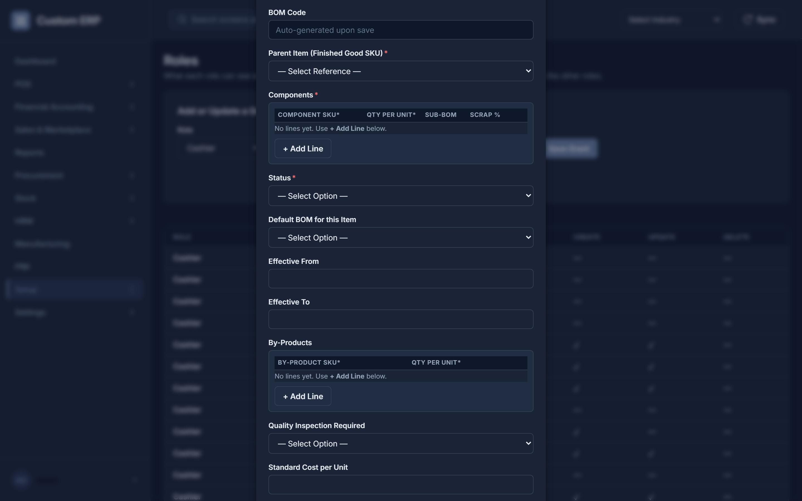
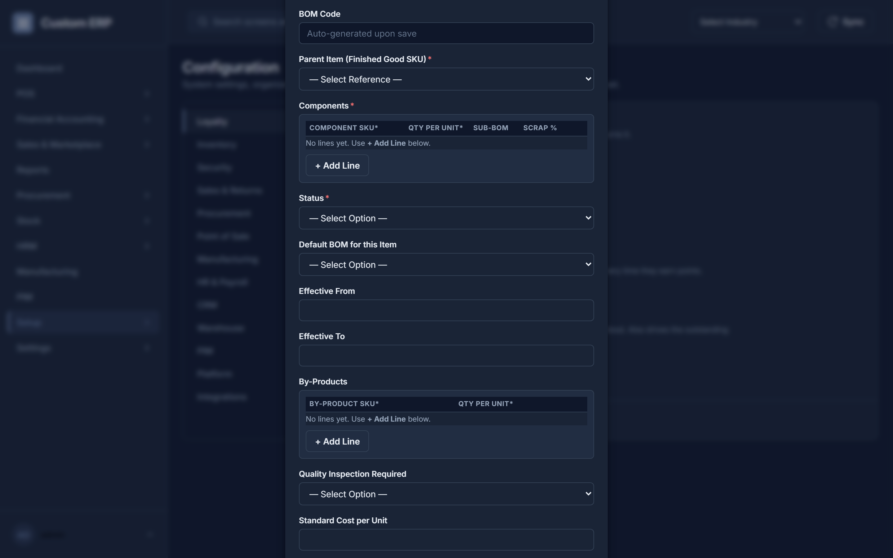

# Admin SOP — Step-by-Step Procedures

This is the deep companion to **[ADMIN_GUIDE.md](ADMIN_GUIDE.md)**. The Guide covers getting the system running (Part A), the operator/platform level (Part C), and developer/CTO level (Part D) as a reference manual. This SOP picks up where its Part B leaves off and gives literal, click-by-click procedures for **every admin-only screen** (the **Settings** sidebar module) and **every maker-checker / approval-gated workflow** in the system — the two categories the task that produced this doc specifically asked to cover in depth.

This document assumes you're already logged in as an **HR/Admin** role (ADMIN_GUIDE §A.3) and know the basics from **[USER_SOP.md](USER_SOP.md) §1** (record-list screen conventions, error handling). It does not repeat those.

---

## Part A — Settings Screens

These live under the **Settings** flyout in the sidebar. Every action on every one of them is enforced **server-side** as HR/Admin-only — that is the real gate, and it holds regardless of what the menu shows. The menu is *also* trimmed per role: a role with no read access to a screen does not see it, and a whole module flyout disappears once every entry inside it is hidden. Since Stage 30.5.7 the same applies within a screen — a role that can read a record type but not create one sees no **New** or **Bulk Import** button, and no row **Edit**/**Delete** icons, rather than discovering the refusal at Save.

### A.1 Users — creating and managing accounts

Sidebar: **Settings** → **Users**.

1. Fill in **Username**, **Password** (8+ characters), **Email**, pick a **Role** from the dropdown (populated from every role the system knows about), and optionally a **Location Code** (defaults to whatever you type — leave blank if not location-scoped).
2. Click **Create User**. It appears in the list below, status **Active**, immediately usable to log in.
3. **Deactivating a user**: click **Deactivate** on their row, confirm. Their login is then rejected exactly like a wrong password — they are not deleted, just locked out. You cannot deactivate the account you're currently logged in as.
4. **Reactivating**: click **Reactivate** on an Inactive user's row, confirm.
5. **Changing a user's location**: click **Set Location** on their row, type the new location code when prompted. This matters because location-scoped authorization on several screens (POS, Stock Transfer, Expenses) checks the acting user's own location — a user stuck on the wrong location code will see permission errors that look unrelated to location until you check this.
6. **MFA reset**: if an HR/Admin (or another MFA-required role) loses their authenticator device, there's no button for this on the Users screen — see ADMIN_GUIDE §B.2: run `cmd/reset_mfa` (`go run ./cmd/reset_mfa`) or ask a developer.
7. **Lockouts**: if a user is locked out after repeated failed logins, wait for the automatic lockout window to expire, or clear it directly at the database level (there's no in-app "unlock" button as of this writing).

### A.2 Roles — the permission grant matrix

Sidebar: **Settings** → **Roles**. This controls what each non-admin role can Read/Create/Update/Delete, per record type. **HR/Admin itself always has full access everywhere and never needs a row here.**




1. Pick a **Role** and a **Record Type** from the two dropdowns.
2. Tick whichever of **Read / Create / Update / Delete** should apply (Read is ticked by default).
3. Click **Save Grant**.
4. The table above the form always shows every currently-granted (role, record type) pair with checkmarks/dashes for each permission — this is your source of truth for "what can Role X actually do."
5. **A role with no row at all for a given record type has zero access to it — it fails closed, not open.** If a role should be able to see/use something and can't, the fix is almost always: add a grant row here for that exact (role, record type) pair, rather than a code change.
6. There is no Edit or Delete action on an existing grant row — to change one, just submit the form again with the same Role + Record Type and the new checkbox combination; it upserts (creates or replaces) that row.

### A.3 Prefix Configs — document numbering formats

Sidebar: **Settings** → **Prefix Configs**. Controls the auto-generated number format (invoice numbers, PO numbers, etc.) for every record type that uses a Code sequence.

1. The list shows every configured record type with its current **Prefix**, **Separator**, **Padding**, **Reset Interval**, and **Status**.
2. Click **Edit** on a row. You'll be prompted, one field at a time, for the new **Prefix**, **Separator**, **Padding Width** (a number), and **Reset Frequency** (type exactly `ANNUAL`, `MONTHLY`, or `NEVER`).
3. Confirming each prompt saves the whole updated configuration in one call — there's no separate Save step after the prompts.
4. **Reset Frequency** controls when the running sequence number restarts at 1: `ANNUAL` at the start of a financial year, `MONTHLY` at the start of a month, `NEVER` for a sequence that just keeps counting up forever.

### A.4 Dynamic Labels — renaming vocabulary

Sidebar: **Settings** → **Dynamic Labels**. Lets you overlay your industry's own terminology on top of the system's built-in labels (e.g. show "Design Number" everywhere the system would otherwise say "SKU"), without any code change.

1. Click **Add Translation Rule**.
2. Enter the **original word/label** exactly as it currently appears on screen (case-insensitive match, e.g. `Brand`), then the **replacement overlay label** (e.g. `Material Grade`).
3. It takes effect immediately across the app — every label, table header, and button matching the original text switches to your replacement the next time a screen renders.
4. To remove a mapping, click **Remove** on its row and confirm; the original built-in label comes back.

### A.5 Database Schema Design — registering new record types and fields

Sidebar: **Settings** → **Database Schema Design** (internally still called "DocType Builder" in the code/docs history — same thing). This is how you add a brand-new master or transaction record type, or a custom field on an existing one, **without any code change**.

1. **Registering a new record type**: click **Register New Record Type** (top right). You'll be prompted for:
   - **Record Type Name** — the technical identifier (e.g. `WarrantyClaim`).
   - **Module Group** — which sidebar/module grouping it belongs to (e.g. `Procurement`).
   - **Document Type** — type exactly `Master` (a reference list, gets an automatic Setup entry) or `Transaction` (a business document, needs its own screen wired up separately to be reachable — see the note in Part D of this doc about what "Transaction" without a screen looks like today).
2. **Configuring fields on a record type**: on the left, hover a **Module** to reveal its record types in a flyout (works exactly like the sidebar's own module flyouts), then click one to load its field list on the right.
3. Click **Add Field**. You'll be prompted in sequence for:
   - **Field name** (technical identifier, e.g. `material_weight`)
   - **Label** (display text, e.g. `Material Weight`)
   - **Fieldtype** — type exactly one of `Data` (short text), `Number`, `Select` (dropdown), `Check` (boolean), `Date`, `Link` (foreign key to another record type), `JSONTable` (a repeating line table — see below) or `JSONMap` (a key/value list)
   - Whether it's **mandatory** (confirm/cancel)
   - **Options** — for `Select`, a comma-separated choice list; for `Link`, the target record type's name; for `JSONTable`, the column spec (below); otherwise leave blank

   A `JSONTable` field renders as an add-line table on the create form instead of a text box. Its **Options** is a JSON array describing the columns, e.g.

   ```json
   [{"key":"sku","label":"Component SKU","type":"link","link":"Item","required":true},
    {"key":"qty","label":"Qty per Unit","type":"number","required":true}]
   ```

   `type` is `text`, `number` or `link` (with `link` naming the target record type, which makes that cell a live typeahead). A `required` column is enforced on every line at save time, with the error naming the offending line number. `JSONMap` needs no spec — it always renders a two-column Key/Value table.
4. Confirming the last prompt saves the field immediately — it appears in the table and is live on that record type's create form right away.
5. **Deleting a field**: click **Delete** on its row in the field table, confirm. This removes the field definition (existing saved data in that field on old records is not retroactively stripped, it just stops showing).
6. This is different from adding an actual *record* of an existing type (a new Vendor, a new Brand) — that's a normal business-user task done from that record type's own screen (USER_SOP.md §1).

### A.6 Activity Log — audit trail and error console

Sidebar: **Settings** → **Activity Log** (internally still called "Log Hub"). Three tabs.

1. **Audit Logs** (default tab): every logged user action — who, what action, details, and timestamp. Read-only, no filters beyond what's on screen.
2. **System Errors**: every recovered panic/error the server has caught, with severity, module, and message. Click any row to see its full **stack trace** in a dialog — use this when investigating a "Something Went Wrong" screen a user reported, especially if they gave you a correlation ID.
3. **Integration Payloads**: every outbound webhook/integration event, its status (Dispatched/Success/Failed/etc.), attempt count, and payload preview. A **Failed** row shows a **Retry** button — click it, confirm, and the event is re-queued for delivery.
4. **Test Panic Recovery** button (top right, next to the page title): deliberately triggers a backend panic to verify the recovery middleware is catching panics and the server stays up. Use this after any deployment change you're unsure about, not routinely — it's a diagnostic tool, not something to click during normal operation. A response (even an error response) means recovery worked; only a dropped connection means it didn't.

### A.7 Industry Selector — switching the active industry profile

Not under Settings — it's the dropdown in the header bar next to the Sync button, but it's an admin-level action (it changes tenant-wide configuration).

1. Pick an industry from the dropdown (Jewelry, Food & Beverage, Automobile, Clothing, Pharmaceuticals & Biotechnology, Metal & Steel Fabrication, Construction & Contracting, Medical Devices, Semiconductors, Agriculture & Perishable Goods).
2. Confirm the dialog warning that this reloads preset table field configurations.
3. The app re-fetches labels and registered record types and lands you back on the Dashboard with the new profile's preset fields active.
4. There's no "current industry" indicator to read back later — this is a one-time overlay action, not a persistent setting you can review afterward from within the app (the browser just remembers your last selection locally).

---

### A.7 Approval Rules — which role signs off what, and above what amount

Sidebar: **Settings** → **Approval Rules**. The routing table behind every approval-gated document. Full detail on using it is in §B.9; this is the screen itself.

1. The table lists every configured rule: **Record Type**, **Min Amount**, **Max Amount**, **Required Role**.
2. To add or change one, fill in the form and click **Save Rule**. Re-saving the same record type and amount band replaces that rule rather than adding a second.
3. **Leave no gap between bands.** A document whose amount falls in no band is not gated at all — it saves without any approval. If one band ends at 49,999 the next must start at 50,000.
4. Overlapping bands are rejected at save time with a message naming the conflict.
5. Every change is written to the Activity Log's Audit Logs tab as `SAVE_APPROVAL_RULE`.

### A.8 Configuration — every operational setting, per module

Sidebar: **Settings** → **Configuration**. **Nothing operational in this system is hardcoded.** 36 settings across 12 modules live here, and every one is read at the point it is used, on every use — so a change takes effect immediately, everywhere, with no restart.




1. Pick a module from the rail on the left (Sales & Returns, Procurement, Point of Sale, Manufacturing, HR & Payroll, CRM, Warehouse, PIM, Security, Platform, Finance, Integrations).
2. Change the values you need and click **Save Changes**.
3. **Numeric settings carry enforced Min/Max guardrails.** A value outside the allowed range is refused at save time with a message naming the bound — deliberately, so a mistyped platform limit cannot take the server down.
4. A setting you have never touched shows its **default**, which is byte-for-byte the constant it replaced. An untouched tenant behaves exactly as it always did.

What lives here, in brief:

| Module | Examples |
|---|---|
| **Sales & Returns** | Sales return window (days) |
| **Procurement** | Vendor-invoice 3-way match tolerance; **PO and GRN edit windows** (0 = no time limit, the default) |
| **Point of Sale** | Cash-drawer variance tolerance; loyalty value per point |
| **Manufacturing** | BOM nesting depth; production cost variance; MRP default lead time |
| **HR & Payroll** | ESI wage ceiling — a statutory figure that should never have needed a redeploy |
| **CRM** | Churn and lapsed-customer thresholds |
| **Warehouse** | The three cycle-count tier intervals; productivity threshold |
| **PIM** | Bulk-edit cap; thumbnail size |
| **Security** | Session token TTL; password-reset TTL; lockout threshold and duration; TOTP drift tolerance |
| **Platform** | Default and maximum list page size; per-tenant concurrency; CSV import batch size; max synchronous report rows; blanket field length cap |

> **One precedence rule worth knowing.** For settings that also have an environment variable (`JWT_EXPIRY_HOURS` is the only one today), the order is **explicit admin edit → environment variable → registered default**. So a deployment that sets the env var still shows the control, and an admin edit still wins over it — the control is never a lie.

#### A.8.1 Integrations

The same screen has an **Integrations** section for the multi-row credential records that aren't simple key/value settings:

- **Pine Labs terminals**, keyed by `terminal_id` — base URL and credentials per terminal.
- **Unicommerce / middleware stores**, keyed by `store_code` — base URL and credentials per store.

Secrets are masked in the list. Saving upserts, and the running workers pick a changed URL up on their next call — no restart. These deliberately exist **only** here; they are not duplicated into the settings list above, because two sources of truth for one URL is exactly the drift this screen exists to remove.

### A.9 Extension Hooks — letting an outside developer subscribe to events

Sidebar: **Settings** → **Extension Hooks**. For a client's own hired developer to react to events in this system without being given database access. See `extension-sdk/README.md` for the developer-facing side.

1. **To register a hook**: fill in the **Hook Point** (which event), the **Doctype** it applies to, the **Target URL** (must be `https://`), and a **Timeout (ms)**. Click **Register Hook**.
2. The table lists every registered hook with whether it's **Enabled**, its timeout, and who created it when.
3. **View Log** opens that hook's **Hook Call Log** — the most recent 100 calls, with what was sent and what came back. This is the first place to look when a developer says "the webhook isn't firing".
4. **Delete** removes a hook after confirmation.
5. **Issue Token** mints a scoped token for an external caller: pick the **Scope Doctype** and a **TTL** in minutes (maximum 1440, i.e. one day). **The token is shown once.** Copy it then; it cannot be retrieved afterwards.

> Keep TTLs short and scopes narrow. A scoped token is not a user account — it has no user row behind it, so the live user-state re-check that protects normal sessions does not apply to it. Revoking one means deleting its hook.

### A.10 System Status — deployment and backup health

Sidebar: **Settings** → **System Status**. Read-only.

1. **Latest Deployment by Environment** — one row per environment with build status, git commit, app version, who promoted it and when. Use it to answer "what is actually running on staging right now?" without SSH.
2. **Deployment history** — the same, over time.
3. **Backup / restore runs** — including the **last restore drill** date, badged as a warning once it goes stale. A backup nobody has ever restored is not a backup; this row is there to make that visible.

Rows appear here because a promote/deploy script recorded them. An empty table means the scripts haven't run against this database, not that nothing is deployed.

### A.11 Tenant Entitlements — which products a tenant has

Sidebar: **Settings** → **Tenant Entitlements**. Controls which modules a tenant can see and use.

1. Pick a **Tenant**. The table shows each module and whether it is enabled for them.
2. Toggle modules and save. The effect is immediate: the tenant's sidebar hides what they're not entitled to, and — the part that matters — the **server refuses requests for a doctype whose module is not granted**, with a `SAAS-0191`. The menu trimming is convenience; this is the enforcement.
3. **Provision Tenant** creates a new tenant schema: enter the **Tenant ID** and **Schema Name**. The new schema is cloned from `tenant_default`, so it inherits every doctype, field, seeded rule and permission grant.

> A module gate applies to *every* doctype mapped to that module. If a tenant reports that one screen 403s while its neighbours work, check this screen before looking at role permissions.

### A.12 Tenant Usage — live load per tenant

Sidebar: **Settings** → **Tenant Usage**. Read-only.

Shows, per tenant: **Active Users**, **In-Flight Requests**, and the **Configured Limits** they're being measured against. The per-tenant concurrency limit itself is a setting (§A.8, Platform). Use this when one tenant reports slowness — if their in-flight count is pinned at the limit, they are being throttled, not failing.

---

## Part B — The Maker-Checker Engine and Every Approval-Gated Workflow

### B.1 How it works, generically

Every approval-gated document follows the same shape: a maker creates it as **Draft**, submits it (an explicit "Submit for Approval" action, or automatically as part of another action like POS checkout), it becomes **Pending Approval**, and it shows up for a checker on the **Approvals** screen (USER_SOP.md §6) — filtered to whichever role is required for that specific document's amount. The checker clicks **Approve** or **Reject** (optionally with a note on rejection). Once decided, it's permanent and logged (`approval_log`) — there's no silent re-open.

Which role is required, and above what amount, is controlled by rows in an internal `approval_rules` table (per-tenant, per-doctype, banded by a min/max amount). Edit these on **Settings → Approval Rules** — see §B.9. (An earlier version of this SOP said there was no screen for this and gave a curl recipe instead. There is a screen; use it.)

### B.2 Purchase Order approval

- Maker flow: USER_SOP.md §15 (create Draft, Submit for Approval).
- **Default routing**: 0 – 49,999 → **Store Manager**; 50,000 and above → **HR/Admin**. (These are the seeded defaults — see §B.9 to change them.)
- Checker flow: Approvals screen, Approve/Reject as in §B.1.

### B.3 Purchase Requisition approval

A `PurchaseRequisition` record type exists with the same default amount routing as Purchase Orders (0–49,999 → Store Manager, 50,000+ → HR/Admin), and it's already wired into the approval engine at the data layer.

Maker flow: **Procurement → Purchase Requisitions** (USER_SOP.md §15A). Create it, submit it, and it routes exactly like a PO. Checker flow: Approvals screen, as §B.1. (An earlier version of this SOP said there was no screen for this at all. There is one, in the Procurement flyout.)

### B.4 Expense Claim approval

- Maker flow: USER_SOP.md §25 (create Draft, Submit for Approval).
- **Default routing**: 0 – 4,999 → **Store Manager**; 5,000 and above → **HR/Admin**.
- After the manager approval decision, the claim still needs the separate **Finance Verify** and **Mark Paid** steps (USER_SOP.md §25) — those are not part of the maker-checker engine, they're plain status-transition buttons any authorized user can click without a second sign-off.

### B.5 POS discount-approval gate

- This is the mechanism USER_SOP.md §3.2 describes from the cashier's side: a sale whose discount is high enough routes to Pending Approval instead of completing immediately.
- **Default routing**: any `POSCart` with a discount at or above the configured threshold → **Store Manager**. Note this routes on the *discount percentage/amount*, not the cart's rupee total, unlike every other amount-routed doctype.
- Checker flow: the sale shows up on the Approvals screen like anything else. Approving it finalizes the sale (posts stock and GL entries) exactly as if the cashier's original checkout had gone straight through; rejecting it cancels the sale — it never posts.

### B.6 Cycle-count variance approval

- A `CycleCountLine` record with any non-zero quantity variance routes to **Store Manager** for approval — this is the "cycle-count variance approval" gate.
- Starting a count and entering counted quantities is done on **Stock → Cycle Count** (USER_SOP.md §20G); reconciliation runs from the same screen. Variance lines then appear on Approvals and are decided normally. (An earlier version of this SOP said initiation was API-only. It is not.)

### B.7 PIM Content approval (ProductContent)

- Maker flow: USER_SOP.md §27.2 (Workbench tab → item detail panel → Content → Submit for Approval).
- **Default routing**: any amount → **HR/Admin** (ProductContent has no meaningful rupee amount to band on, so it's a single flat rule).
- Checker flow: same Approvals screen, or jump straight to the underlying `ProductContent` record list from the PIM Dashboard tab's "Pending approval" card.

### B.8 Vendor Invoice override-payment approval

- Normally a `VendorInvoice` is paid directly once **Matched** (USER_SOP.md §7) — no approval needed for that path.
- The backend also supports an **override**: paying an invoice that is *not* Matched (e.g. stuck in `MismatchHold`) by supplying an `override_reason`, which claims it as Pending Approval instead of paying immediately, routed by the same engine (default: any amount → **HR/Admin**).
- **How to trigger it**: on **Financial Accounting → Vendor Invoice**, a `MismatchHold` invoice shows an **Override & Pay** button alongside **Match**. It prompts for a written reason, refuses to proceed without one, and submits the payment for approval rather than paying immediately — the response says *"Override submitted - routed for approval"*. The reason is stored on the invoice (`payment_override_reason`) and in the approval log. (An earlier version of this SOP said no UI path existed. It does.)

### B.9 Changing approval-rule thresholds/roles

Use **Settings → Approval Rules**. The screen lists every configured rule (record type, amount band, required role) and lets you add or edit one in place: pick the **Record Type**, set **Min Amount** / **Max Amount**, choose the **Required Role**, and click **Save Rule**. Saving the same record type and band again replaces that rule rather than adding a duplicate.

Two things to get right:

- **Leave no gap between bands.** A document whose amount falls in no band is not gated at all. If Store Manager covers 0–49,999, the next band must start at 50,000, not 50,001.
- **A rule needs two people to be useful.** Maker-checker refuses self-approval, so whoever creates the document cannot approve it — see §B.10.

The underlying API (`GET`/`POST /api/v1/approval/rules`, HR/Admin-only for writes) is still there if you need to script a bulk change:

```powershell
# 1. Log in and capture the bearer token (replace credentials)
$login = Invoke-RestMethod -Method Post -Uri "http://localhost:8080/api/v1/login" `
  -Headers @{ "Content-Type" = "application/json"; "X-Tenant-ID" = "default" } `
  -Body '{"username":"<admin-username>","password":"<admin-password>"}'
$token = $login.token

# 2. View current rules for a doctype
Invoke-RestMethod -Uri "http://localhost:8080/api/v1/approval/rules" `
  -Headers @{ "Authorization" = "Bearer $token"; "X-Tenant-ID" = "default" }

# 3. Create or update a rule (id omitted = new row; pass the existing id to edit one)
Invoke-RestMethod -Method Post -Uri "http://localhost:8080/api/v1/approval/rules" `
  -Headers @{ "Content-Type" = "application/json"; "Authorization" = "Bearer $token"; "X-Tenant-ID" = "default" } `
  -Body '{"doctype":"PurchaseOrder","min_amount":0,"max_amount":49999,"required_role":"Store Manager"}'
```

`max_amount` can be omitted/`null` for an open-ended top band. The save endpoint runs an overlap check against existing bands for that doctype and rejects a conflicting range with an error message explaining the conflict. Every change here is written to the Activity Log's Audit Logs tab (`SAVE_APPROVAL_RULE`) automatically, same as everything else in this system.

### B.10 You need at least two user accounts — this is a hard prerequisite

**Maker-checker refuses self-approval.** Whoever submits a document cannot be the person who approves it, at any role, for any amount, with no override. That is the entire point of the mechanism, and it is enforced server-side.

The practical consequence catches out almost every new installation:

> **A single-user install can never complete an approval-gated document.** If you set the system up with one admin account and try to walk the purchasing flow yourself, your Purchase Order will submit, appear in Approvals — and refuse your own Approve click. Nothing is broken. You need a second account.

So, before your first end-to-end run, create at least two users (§A.1):

| Account | Role | Does |
|---|---|---|
| The maker | e.g. **Store Manager** | Creates and submits the PO, GRN, requisition, expense claim |
| The checker | **HR/Admin**, or a second Store Manager | Approves or rejects it |

Which role has to approve depends on the amount band (§B.9), so make sure the checker's role is the one your bands actually name. The commonest version of this problem is a two-person setup where both people happen to be Store Managers and the amount lands in the HR/Admin band — the document then sits in Approvals with nobody able to decide it.

To confirm your setup works, do the smoke test in USER_GUIDE §14 (the end-to-end worked example) with both accounts before rolling the system out to anyone.

---

## Part C — Finance Admin Procedures

### C.1 Accounting Periods — open and close

Covered from the general-user angle in USER_SOP.md §5.3; the admin-relevant points:

1. Create periods (Period Name, Start/End Date) ahead of when they're needed — there's no requirement they be contiguous or non-overlapping enforced by the form itself, so be deliberate about your naming/date convention.
2. Before closing, always click **Close Checklist** first and actually read it — it flags things like unposted documents that would otherwise be silently locked out of that period once closed.
3. **Closing is permanent — there is no reopen.** Treat it as the same class of operation as the database restore in ADMIN_GUIDE §C.3: only do it once you're sure, and only after everything that belongs in the period has been posted.

### C.2 Executing a Payment Proposal run

Covered from the general angle in USER_SOP.md §8. Operationally: build a proposal from every Matched invoice you intend to pay in one batch (e.g. "everything due this Friday"), then **Execute** it once — this pays every invoice in the batch through the normal vendor-invoice payment path in one action, and reports per-invoice failures individually rather than failing the whole batch. Re-running Execute on an already-Executed proposal isn't offered (the button only shows while Draft), so if some invoices in a batch failed, pay those specific ones individually from the Vendor Invoices screen rather than trying to re-run the proposal.

### C.3 TDS-aware vendor invoice payment

Covered in USER_SOP.md §7 step 3. Admin-relevant setup: the TDS sections offered in the **Pay w/ TDS** dropdown come from the `TDSSection` record type (Finance module) — create these first via Setup-style record-list access if the dropdown is empty (fields: Section Code, Description, Threshold Amount, Rate %, Status). There's no automatic threshold enforcement tying a specific section to a specific invoice amount — the person paying picks the section manually, so make sure whoever has this role knows which section code applies to which vendor/transaction type.

### C.4 Running a Bank Reconciliation

Covered in USER_SOP.md §9. Admin-relevant points: reconciliation only *matches* existing `BankStatementLine` records against GL postings — it does not create statement lines from a bank file automatically beyond what Bulk Import CSV brings in. If a reconciliation run reports many unmatched lines, the likely causes are: the statement CSV wasn't imported for the right account/date range, or GL postings for that period haven't happened yet (e.g. an unposted Sales Invoice or unpaid Vendor Invoice).

### C.5 GST validation on Purchase Order and POS checkout

- On the **Purchase Orders** screen (USER_SOP.md §15), the **Calculate GST** button is a pure calculator against `POST /api/v1/gst/calculate` — it shows the CGST/SGST (intrastate) or IGST (interstate) breakdown for the amount/rate/interstate flag entered, but it does **not** change what gets saved to `total_amount` on the PO (which this system treats as the taxable value throughout its accounting). It's there so a maker can sanity-check the tax math before submitting, not to record a separate tax liability line.
- On **POS checkout**, GST is calculated and posted automatically per line based on each item's HSN-classified rate — there's no separate admin step for this; it's already live for every sale.

### C.6 Report export job lifecycle (queue → poll → download)

Covered from the user's perspective in USER_SOP.md §14.2. The admin-relevant mechanics: clicking **Export in Background** on the Report Catalog tab queues an async job (`POST /api/v1/reports/export`) rather than generating the CSV inline — this matters for large reports that would otherwise time out a normal request. The screen polls `GET /api/v1/reports/export/{id}` automatically every 2 seconds until the job's status leaves `Pending`; a `Failed` job shows as failed with no further automatic retry (re-run the export from scratch). The actual CSV download (`?download=1`) is fetched as an authenticated blob and handed to the browser as a local file download, not a direct link — this is why you can't just paste an export URL into a new tab and expect it to work; it must go through the app's own authenticated fetch.

---

## Part D — Corrections: the "no screen yet" gaps are closed

**This section used to list nine capabilities as backend-only with no UI. All nine now have screens.** The list was written early and never re-driven against the app, and by the 2026-07-30 usability audit every row of it was false. Leaving it in place cost real time — it sent administrators to hand-rolled API calls for things that were a click away, and it fed the same wrong claims into USER_SOP and the UAT checklist, where a tester could sign a release off without testing eight shipped screens.

It is kept here as a correction rather than deleted, because anyone working from a printed or cached copy of the old table needs to know it was wrong.

| Was listed as "no screen" | Where it actually is |
|---|---|
| **GRN (Goods Receipt Note)** creation | **Procurement → Goods Receipt**. Loads lines from a PO or ASN, posts the receipt, raises stock. USER_SOP §15B. |
| **Purchase Requisition** | **Procurement → Purchase Requisitions**. USER_SOP §15A. |
| **Putaway** (assigning received stock to a bin) | **Stock → Putaway**. USER_SOP §20A. |
| **Pick List** (bin-driven picking) | **Stock → Wave / Batch Picking** (generate and release) and **Stock → Mobile Picking** (the handheld walk order). USER_SOP §20E/§20F. |
| **Bin condition transition** (Good → Damaged etc.) | **Stock → Bin Conditions**. USER_SOP §20B. |
| **Cycle count initiation/counting** | **Stock → Cycle Count**. USER_SOP §20G. Variance approval still lands in Approvals as before. |
| **Approval Rules configuration** | **Settings → Approval Rules**. Full read/write screen — see §B.9, which now documents the screen instead of curl. |
| **Vendor Invoice override-pay** | **Financial Accounting → Vendor Invoice**: a `MismatchHold` invoice shows **Override & Pay**, which demands a written reason and routes it to approval (it does not pay immediately). See §B.8. |
| **Per-record Edit on a record-list screen** | Every row has a pencil **Edit** icon beside its Delete icon. The old claim that it was "verified absent in the UI code itself" was simply wrong, and the delete-and-recreate workaround it recommended destroyed data for no reason. |

**Genuinely still API-only**, verified while rewriting this section — a short list, and none of it is a routine administrative task:

- **Tenant provisioning and module entitlement changes** beyond what **Settings → Tenant Entitlements** exposes (creating a tenant itself is a control-plane operation — ADMIN_GUIDE §A).
- **Direct `documents` upserts by explicit id.** The generic API still honours a caller-supplied `id` as an upsert; no screen does this, deliberately (see the numbering note in §B.3.2).

If you find something else in this SOP that doesn't match the app, the doc is what's wrong. Re-drive it and fix it here.

---

## Glossary Addendum

Terms used in this SOP not already in ADMIN_GUIDE.md's glossary:

| Term | Plain-language meaning |
|---|---|
| **Amount slab / band** | A min–max amount range in `approval_rules` that determines which role must approve a document in that range. |
| **Maker-checker slab routing** | The general mechanism: the amount (or, for POSCart/CycleCountLine, a non-amount value like discount % or variance qty) on a document is checked against configured slabs to decide which role's Approvals inbox it lands in. |
| **Override (Vendor Invoice)** | Paying an invoice that hasn't cleared normal 3-way match, gated behind its own approval instead of being blocked outright. |
| **Async export job** | A background-processed report export, tracked by a job ID, so a large report doesn't have to complete within one HTTP request's timeout. |

---

*See [ADMIN_GUIDE.md](ADMIN_GUIDE.md) for everything outside this SOP's scope: initial setup, `manage.ps1`/`promote.ps1` operations, backup/restore, incident response, and the developer/architecture reference.*
