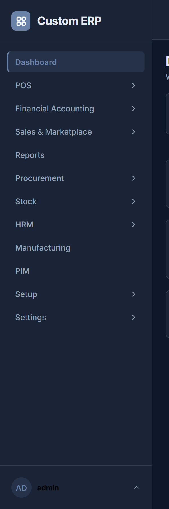
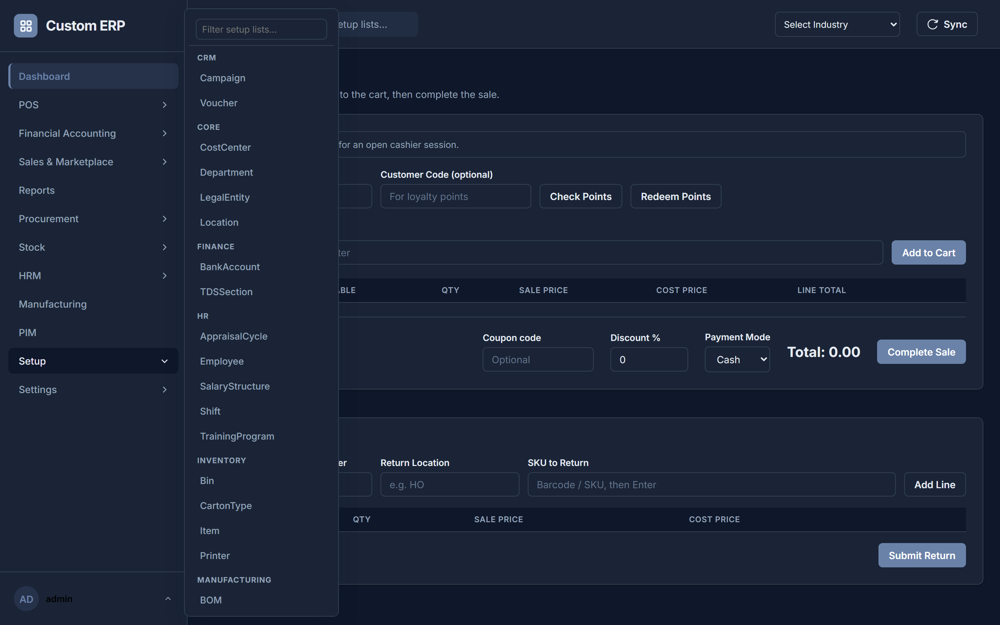
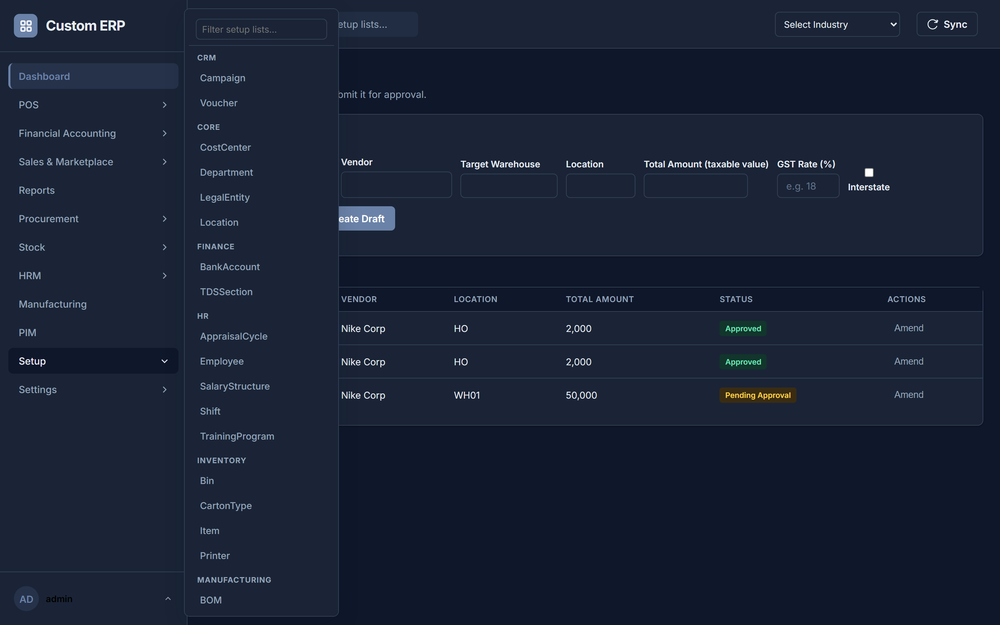
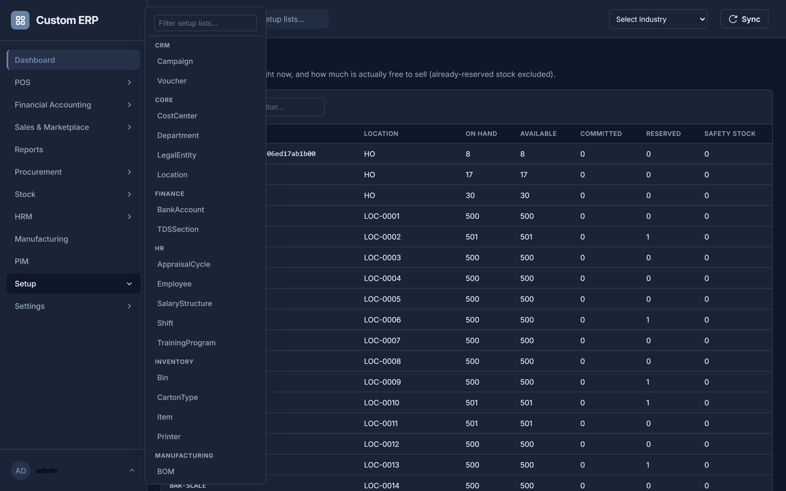
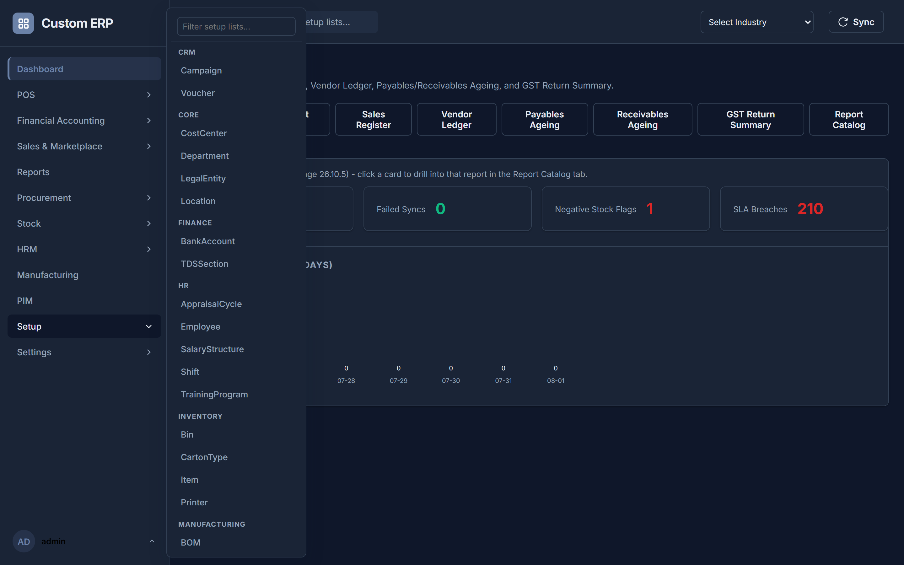

# User Guide

> **Applies to:** Stage 30.8 · **Last verified against the running app:** 2026-08-01
> Every step below was walked through against a live server on the date shown. If something here doesn't match what you see, the document is what's wrong — please report it.

**Welcome!** This guide explains how to use the ERP system. It's written in plain language for anyone using the system for the first time — no computer or accounting background needed. If a word might be unfamiliar, it's explained the first time it's used, and there's a glossary at the end.

*Need literal click-by-click steps for a screen not walked through in depth below? See **[USER_SOP.md](USER_SOP.md)** — the same plain-language style, one section per screen, covering every module.*

---

## How do I…?

Jump straight to the thing you're trying to do.

| I want to… | Go to |
|---|---|
| Log in for the first time | §2 |
| Find a screen I can't see in the menu | §3 |
| **Ring up a sale** | §4 — read the prerequisites box first |
| Open or close the till for a shift | §4.0 |
| Apply a coupon, or understand why an offer didn't appear | §4.2 |
| Print a receipt, or make it print without a dialog | §4.3 |
| Print a shipping label, a sales invoice, or barcode stickers | **[QZ_PRINTING_SETUP.md](QZ_PRINTING_SETUP.md)** — "Day-to-day use" |
| Take a return | [USER_SOP §3.3](USER_SOP.md) |
| Check how much stock I have | §5 |
| **Order stock from a supplier** | §6 |
| Add items and prices to a purchase order | §6, step 3 |
| Print a purchase order and send it to the vendor | §6, step 7 |
| Understand inclusive vs exclusive GST, or why a PO says IGST | §6.2 |
| Record stock that has arrived | §6, step 9 |
| Understand where document numbers come from | §6.1 |
| Move stock between locations | §7 |
| Add a vendor, item, brand, location… | §8 |
| Correct a record I got wrong | §8 — use the row's **Edit** icon |
| **Record what competitors charge, and see where I sit against them** | §8a, then the Competitor Price Gap report in §9 |
| Run a report / find the right report | §9 and **[REPORT_CATALOG.md](REPORT_CATALOG.md)** |
| **Place a customer order by hand (phone / walk-in / replacement)** | §9A.1 |
| Check whether a marketplace or Unicommerce order reached the ERP | §9A.2 |
| Process an order through to shipment and invoice | §9A.3 and §9A.4 |
| Understand why a field says my GSTIN, email or phone number is wrong | §8.1 |
| Approve or reject something | §10 |
| Change my own password or auto-logout | §11 |
| **Understand an error message or code** | §12 and **[ERROR_CODES.md](ERROR_CODES.md)** |
| **Set the whole thing up from scratch and make my first sale** | §13 — the full worked example |
| Know what my role is allowed to do | **[PERMISSION_MATRIX.md](PERMISSION_MATRIX.md)** |

---

## 1. What is this system?

Think of this system as one big digital notebook that your whole business shares. Instead of writing sales in one notebook, stock in another, and money in a third — everything goes into the same place. That way, everyone (the cashier, the warehouse person, the accountant, the owner) is always looking at the same, up-to-date information.

## 2. Logging In

1. Open the app in your web browser. You'll see a **login screen**.
2. Type in your **username** and **password** (your manager or admin gives these to you).
3. Click **Login**.
4. If you have a role that needs extra security (like an Admin), you may be asked for a **6-digit code** from an authenticator app on your phone. This is called **MFA** (Multi-Factor Authentication) — it's an extra lock on the door, on top of your password.
5. If you type your password wrong too many times in a row, the system will temporarily lock your account to keep it safe. Wait a bit and try again, or ask an admin for help.

### If your role uses MFA: your recovery codes

The very first time you set up MFA, the app shows you **ten recovery codes** and asks you to tick a box confirming you have saved them. Take that seriously — **this is the only time they are ever shown.** The system stores only a scrambled fingerprint of each one, so nobody, including your administrator, can look them up for you later.

- **Save them somewhere that is not your phone.** A printed copy in a locked drawer, or your password manager. Saving them on the phone that holds your authenticator app defeats the point: if you lose the phone, you lose both.
- Use **Copy** or **Download** on that screen if it helps — Download saves a small text file.
- **Each code works once.** On the login screen, if you don't have your phone, click **"Lost your phone? Use a recovery code"** and type one in instead of the 6-digit code. Dashes, spaces and capitals don't matter.
- After you sign in with a recovery code, you'll see a message telling you how many you have left. **That message is a prompt to act, not just information** — see below.

### Moving your authenticator to a new phone

Do this *before* you get rid of an old phone if you can, but it also works afterwards as long as you can still sign in (with a recovery code, if need be).

1. Sign in and open **My Profile** from the account menu.
2. In the **Two-Factor Recovery** panel, click **Set up a new authenticator device**.
3. Confirm your **password** (not a code — the whole point is that your old device may be gone).
4. Add the code shown to the authenticator app on your **new** phone, then enter the 6-digit code it displays.
5. Your old device stops working at that moment, and you are given a **fresh set of recovery codes** — save these too; the old set no longer works.

Your old authenticator keeps working the whole time until step 4 succeeds, so it is safe to start this and change your mind.

The same panel shows **how many recovery codes you have left** and lets you generate a new set at any time (which immediately cancels the old set). If it says you have none, generate some now — with no codes and no phone, only an administrator can get you back in.

**If you have lost both your phone and your codes**, ask an administrator to reset your two-factor setup for you (ADMIN_GUIDE §Users & Roles). You'll be asked to set it up again from scratch at your next login.

Once you're in, you'll see a **sidebar** on the left. **It only shows what your role can actually use** — if a colleague has menu entries you don't, that's your role, not a fault. A whole module disappears if you have no access to anything inside it, and your business only sees the modules it has licensed. Within a screen, buttons you can't use aren't shown either: if you can view a list but not add to it, you'll see a small **"Read-only for your role"** label where the **New** button would be. Ask your administrator if you need more access.

## 3. Finding Your Way Around

The sidebar has **eleven top-level entries**. Most are module groups: hover one and its screens slide out to the right (click it instead if you are on a touchscreen or using a keyboard). Three — **Reports**, **Manufacturing** and **PIM** — have no flyout and open straight away.

| Sidebar entry | What lives inside |
|---|---|
| **POS** | POS / Billing (§4) · POS Profiles · Offline Sync Review · Offline Queue Gaps |
| **Financial Accounting** | Finance / GL · Approvals (§10) · Vendor Invoice · Payment Proposals · Bank Reconciliation · Debit / Credit Notes · Sales Invoice |
| **Sales & Marketplace** | Order Management · Fulfillment · Marketplace · Customer |
| **Reports** | Opens directly (§9). This is also where you land when you first sign in — its first tab is a dashboard of live figures. |
| **Procurement** | Purchase Requisitions · Purchase Order (§6) · ASN · **Goods Receipt** · Vendors · RFQ / Quotes |
| **Stock** | Inventory (§5) · Stock Transfer (§7) · Bin · Putaway · Bin Conditions · LPN / Cartons / Pallets · Bin Replenishment · Wave / Batch Picking · Mobile Picking · Cycle Count · Sticker Printing |
| **HRM** | HR · Fixed Assets · Expenses |
| **Manufacturing** | Opens directly. |
| **PIM** | Opens directly. |
| **Setup** | Every reference list the system knows about (§8) |
| **Settings** | Admin-only: Users · Roles · Prefix Configs · Approval Rules · Dynamic Labels · Database Schema Design · Extension Hooks · Activity Log · Configuration · System Status · Tenant Entitlements · Tenant Usage |

**You only see what your role can use.** If a module or a screen isn't in your menu, your role doesn't have access to it — that's the system working, not something missing. Ask your administrator if you need it.

> **If you are a supplier**, your account is deliberately narrow: you sign in to the same app as everyone else, but the only screen you can reach is **Supplier Submissions**, and within it you see only the submissions filed under your own company — never another supplier's. Fill in the product details you want to propose (the product, the language, a title, and whatever descriptions, tags or image URL you have), save it, then use **Submit for Approval**. A reviewer at the company approves or rejects it; a rejection always carries a written reason, which you can read on the submission itself. Approved text does **not** go live automatically — it becomes a draft that the company still reviews and publishes on its own schedule. If the app tells you your account is not linked to a vendor yet, that's a setup step your contact at the company needs to finish.

**Two search boxes, and they do different things:**

- The **box at the very top of the window** finds *screens*. Type "purch" and it offers Purchase Order, Purchase Requisitions, and so on; pick one and it takes you there. It does **not** search your records.
- The **box just above a table**, on a screen, filters *that table's records*. This is how you find a particular vendor, item or invoice.

At the top right of most list screens there are **New** and **Bulk Import** buttons, and each row has **Edit** and **Delete** icons. Any of these that your role can't use simply won't be shown.

## 4. Making a Sale (POS / Billing)

This is the screen a cashier uses most.

> **Before your first sale — three things must already exist.** Skip any of them and the sale will be refused, with an error that only makes sense once you know this list.
>
> 1. **A Location to sell from.** Setup → Core → **Location**, with **Type = Store**.
> 2. **At least one Item, with its HSN Code and GST Rate filled in.** Setup → Inventory → **Item**. Both tax fields are required and the system will not let you save without them, because it cannot price a sale it can't tax. (If the item genuinely isn't taxed — produce, unbranded grain, exports — set its **Tax Treatment** instead of entering a 0 rate; see §9 Step 3.) Stock also has to exist: an Item on its own has a quantity of zero until a **Goods Receipt** brings some in (§6).
> 3. **An open cashier session at that location.** This is the one people miss. Checkout refuses with *"Cash opening is required before billing"* until a session is open. Opening one is step 2 below.

### 4.0 Open the till for the shift

1. Click **POS / Billing** (under the **POS** module).
2. Start typing your shop's **name** into **Location** and pick it from the list (the code and short code work too, if that is what you know it by). The bar above shows whether a session is open there.
3. If it says *"No open session … open one before selling"*, click **Open Session**, type the **cash physically in the till right now**, and confirm. The bar changes to *"Session open at …"*.
4. At the end of the shift, click **Close Session** and enter the cash you counted. The system shows what it expected, what you counted, and the difference — note it for your manager if it isn't zero.

You open a session once per shift, not once per sale.

### 4.1 Ring it up

1. With a location entered and a session open, type or scan the item's **barcode/SKU** into the box and click **Add to Cart** (or press Enter). The item appears in the cart with its price. You can use the item's **code**, its **barcode**, or its internal id — all three find the same item.
2. Repeat for every item the customer is buying.
3. If the customer is a returning/loyalty customer, type their code into **Customer Code**. **Redeem Points** spends their points on this sale — the discount comes off the amount to collect automatically, and the points are only actually deducted once the sale completes.
4. **Any offers that apply appear on their own, above the total** — see §4.2. If the customer has a coupon, type it into the **Coupon code** box.
5. Check the total — tax is calculated automatically, you don't need to work it out.
6. Choose how they're paying and click **Complete Sale**.
7. The sale is now recorded — stock goes down automatically, and the accounting entries are made automatically too. You don't need to tell any other screen about this sale; the system does it for you.
8. A box asks **"Print receipt?"**. Say yes and the receipt prints. If your till has a receipt printer set up for silent printing it goes straight there with no dialog (see §4.3); otherwise your browser's normal print dialog opens.

### 4.3 Printing the receipt

Nothing extra is needed to print — answering **Yes** to "Print receipt?" always works. What the setup below adds is the *one-click* part: the receipt goes straight to the till printer instead of opening a print dialog you have to click through on every sale.

To get that, your administrator installs **QZ Tray** on the till PC and creates a **Printer** record whose **Default For** is `Receipt` — the full steps are in **[QZ_PRINTING_SETUP.md](QZ_PRINTING_SETUP.md)**. If any of that isn't set up, the browser print dialog appears as before; nothing breaks and nothing is lost.

A few things worth knowing:

- **The receipt shows what was actually collected.** Offers and loyalty points spent both appear as their own lines, so the printed total matches the cash in the drawer.
- **A sale waiting on manager approval will not print a receipt.** The money hasn't been collected yet. Once the manager approves it from the **Approvals** screen the sale completes and can be printed.
- **Reprinting later is safe.** The receipt is rebuilt from the recorded sale, not from whatever is on screen, so it always shows what was originally rung up.
- **If a 58mm till roll prints text too wide**, tell your administrator to set **Label Width (mm)** to `58` on that Printer record.

**If something goes wrong mid-sale** (a barcode doesn't scan, the system shows an error), read the message on screen — it tells you exactly what's wrong (e.g. "this item is already sold" or "not enough stock") rather than just "error."

**If you applied a large discount**, the sale may not complete straight away: a dialog says it needs manager approval, and the sale sits as **Pending Approval** until a manager decides it from the **Approvals** screen. Nothing is charged until then.

### 4.2 Offers and coupons at the till

You do not apply offers by hand. Whatever your head office has set up in the ERP is worked out automatically as you build the cart, and shown in a panel just above the total — each offer by name, what it did ("10% off the bill", "buy 2 get 1 free — 1 free unit"), and how much it took off.

- **Automatic offers just appear.** Add the qualifying items and the offer shows up. Remove an item and it disappears again if the cart no longer qualifies. If an offer needs a minimum spend, it appears once the cart crosses it.
- **Coupon offers need the code.** Type it into the **Coupon code** box. Case doesn't matter, and you can enter more than one separated by a space or comma. If a code doesn't apply to this cart, the panel says so in plain words rather than silently ignoring it — check the spelling, and whether the cart actually meets the offer's conditions.
- **Some offers only apply to certain customers** (a loyalty tier, for instance). Look the customer up *before* expecting those to show — with no customer on the sale, a tier-restricted offer will not appear.
- **The final say is the server's, not this screen's.** The panel is a preview; the discount is recalculated for real when you take payment. In normal use the two agree. If they ever don't, the amount charged is the correct one.
- **The discount box is separate.** The **Discount %** field is still there for a manual, cashier-applied discount, and large manual discounts may still need a manager's approval. Offers are not manual discounts and don't need approval — they're the rules head office already signed off.

## 5. Checking Stock

1. Click **Inventory** in the sidebar.
2. Use the search box to find an item by name or code.
3. The screen shows how much is available right now.

If you need to know how much stock is *actually free to sell* (not already reserved for another order), that number accounts for anything already promised elsewhere — it's not just a raw count sitting in the warehouse.

## 6. Ordering More Stock (Purchase Order)

1. Click **Purchase Order**. The **New Purchase Order** panel is at the top of the screen — there's no separate "create" step to click first.
2. Fill in the four header boxes:
   - **Vendor** — start typing and pick the supplier from the list.
   - **Location (billing entity)** — which of your locations is buying. This decides who the vendor invoices, and it's half of how the system works out your GST (see §6.2).
   - **Target Warehouse (ship to)** — where the goods should physically arrive. Often the same as Location; it doesn't have to be.
   - **GST treatment of purchase price** — leave it on "Tenant default" unless this particular vendor quotes differently. See §6.2.
3. **Add your items.** Click **+ Add item** for each line, then fill in:
   - **Item** — type to search; pick from the list.
   - **Qty** and **Purchase Price** — what you're ordering and what you're paying per unit.
   - **MRP** — optional. Record it if you're tracking it; leave it blank if not. **It never appears on the vendor's printed copy** — it's for you, not for them.

   The four grey columns to the right — **HSN**, **GST %**, **Taxable**, **Tax**, **Line Total** — fill themselves in as you type. You can't edit them, on purpose: HSN and GST rate come from the Item master, so there's only ever one answer to "what tax does this item carry".

   If a line turns red, that item is missing its HSN code or GST rate on the Item master. Fix it under **Setup → Items** and the line clears.
4. Check the **totals** at the bottom — taxable value, the tax split, and the grand total — and the **supply-type banner** above the items (§6.2).
5. **You don't type a PO number.** The box shows "Auto (PO series)" and is greyed out on purpose. The number is issued when you save; see §6.1.
6. Click **Create Draft**. Depending on the amount it may need someone else's **approval** before it's official — that's a safety check, not a bug. You'll see it move to "Pending Approval", and once approved it's ready to send.
7. **Send it to the vendor.** On the order's row, **Print** opens a proper purchase order laid out for A4 — both parties' names, addresses and GSTINs, the item table with HSN and tax, the grand total, and the amount in words. **Send to Vendor** records the dispatch (the row shows "Sent to vendor") and opens a pre-filled email to the vendor's contact address. If your administrator has configured a notification channel, it goes out through that as well.
8. **Amend** loads the order back into the same panel — including its items — so you can change quantities or prices. Amending an already-approved PO sends it back for re-approval, and the screen warns you before it does.
9. When the stock physically arrives, record a **GRN** (Goods Receipt Note — "yes, this stock actually showed up") on **Procurement → Goods Receipt**. Click **Load Items from PO**, pick the order, adjust any quantity that arrived short, and click **Post Receipt**. **Only then does the stock count go up** — an order by itself never adds stock, only a confirmed receipt does. Check **Inventory** afterwards to confirm it moved.

**An RFQ is optional.** If you want to compare vendor quotes first, raise a Purchase Requisition and convert it to an **RFQ** (Procurement → RFQ), collect quotes, then convert to a PO. If you already know who you're buying from — which is the normal case — go straight to a Purchase Order as above. Nothing requires an RFQ to exist first.

### 6.1 Where document numbers come from

You never type the number on a Purchase Order, Goods Receipt, Stock Transfer, Expense Claim, Leave request, or any other transaction. The field is greyed out and reads something like **"Auto (PO series)"**, and the real number appears once you save — for example `PO/HO/26-27/000042`.

That number is issued by the system, in order, from a numbering series your administrator controls (see the Admin Guide, §B.3.2). Reading the example above left to right: the **PO** part is the document type, **HO** is the location it was raised at, **26-27** is the financial year, and **000042** is the running count. Your administrator can change any of that — including removing the location or the year entirely — so yours may look different, and that's fine.

Two things worth knowing:

- **Numbers can have gaps, and that's normal.** If a save fails validation after a number was drawn, that number isn't reused. A gap means "something was started and not completed", never "a document went missing".
- **You can't reuse or choose a number.** This is deliberate. When people typed their own numbers, two colleagues creating a PO at the same time could pick the same one — and the second save would quietly overwrite the first, with no warning to either of them. Now that can't happen.

### 6.2 GST on a purchase order: inclusive vs exclusive, and inter-state

Two things decide the tax on a PO, and the screen works both out for you.

**Does the price you typed already include GST?**

- **Exclusive** (the usual case, and the default) — the Purchase Price is the base price and GST is added on top. Type 450 at 5% and the line comes to 472.50.
- **Inclusive** — the price already has GST in it. Type 450 at 5% and the line stays 450, of which 21.43 is tax.

Your administrator sets which one is normal for your business (Admin Guide → Configuration → Procurement → "Purchase Order price GST treatment"). The dropdown on the PO screen shows what that default is, and you can override it on any single PO where a particular vendor quotes the other way.

**Is it inter-state or intra-state?**

You don't tick this any more. The system compares the state of the **legal entity behind your chosen Location** with the state of the **vendor**, and applies:

- **same state** → intra-state → **CGST + SGST**
- **different states** → inter-state → **IGST**

The banner above the items tells you which it chose and why — for example *"Inter-state (IGST) — vendor in Karnataka (29), billing entity in Maharashtra (27)"*.

Each side's state comes from its GSTIN (the first two digits are the state code), falling back to the **State** field on the record if there's no GSTIN.

If the banner turns amber and says it **could not work the supply type out**, it names exactly what's missing — usually "this vendor has no GSTIN or state recorded". Two options:

- **Fix the master** (better): add the GSTIN or State to the vendor under **Setup → Vendors**, or to the Legal Entity behind your Location. Every future PO for that vendor then gets it right automatically.
- **Set it by hand** (for this PO only): tick **Inter-state (IGST)** in the banner.

You can also **Override** a derived answer when you know something the master records don't — a bill-to/ship-to split, for instance. Once you override, your choice sticks and later saves won't quietly undo it.

## 7. Moving Stock Between Locations (Stock Transfer)

1. Click **Stock Transfer** in the sidebar.
2. Fill in the From and To warehouse/location, then add one or more line items (SKU + quantity) using the **Add Line** button — a transfer needs at least one line before it can be created. The Transfer Number is filled in for you when you save (§6.1).
3. Click **Create Transfer**. It starts as a **Draft**.
4. Once it's ready to go, click **Mark Approved**.
5. Click **Dispatch** to move the stock out of the source location (it sits "in transit" until received).
6. When it physically arrives, click **Receive** and confirm the quantity that actually showed up for each line — if less arrived than was dispatched, entering the lower number records that shortage rather than hiding it.

## 8. Managing Master Data (Vendors, Locations, Brands, and Similar Lists)

"Master data" just means the reference lists everything else points to — your vendors, your locations, your items, and things like brands, colors or sizes. A few of the most-used ones also appear directly in a module (**Vendors** under Procurement, **Customer** under Sales & Marketplace), but **Setup** holds all of them.

The **Setup** flyout is **grouped by module** (Core, Master Data, Inventory, HR, Finance, Procurement, Sales and so on) with a **filter box** at the top — type a few letters of what you want and the list narrows. At the bottom is an **Advanced** section, collapsed by default, holding the technical lists most businesses never touch. If you filter, matches inside Advanced are shown too, so nothing is ever hidden from a search.

> **Your shop is a Location.** Setup → Core → **Location**, with its **Type** set to Store, Warehouse or HO — this is the record every transaction points at. A Location also holds the shop's **Address, City, Contact Phone** and **Manager**. (Earlier versions had a separate "Stores" list under the Stock menu that nothing else read; it was retired and its fields folded into Location.)

Adding a new one always works the same way, no matter which list you're in:

1. Click the list in the sidebar (or open it from **Setup**).
2. Click the **New [thing]** button, top right.
3. Fill in the fields — anything marked with a **\*** is required, everything else is optional. A "Code" field usually says *"Auto-generated upon save"* — leave it blank and the system numbers it for you.
4. Some fields are small tables rather than boxes — a recipe’s components, a routing’s operations. Use **+ Add Line** to add a row and **Remove** to take one out. You never have to type these in a technical format.
5. If a dropdown is empty, it says so and offers a **create one first** link straight to the list you need. That is the normal way to find out you are missing a prerequisite.
6. Click **Save**.

> **Your shop can have a Short Code.** Optional, and nothing depends on it. It is there so staff can find a location by the two or three letters they actually say out loud ("BKC", "LDH2") while the **Location Name** stays the full name shown on screen and the **Location Code** stays the identifier the system uses. Searching a location box matches all three.

### 8.1 The system tells you what is missing — read the hints

You should almost never have to work out *which* list you are missing. Three things do it for you, and they all say the same thing the same way:

- **Under a search box.** Pick a vendor on a Purchase Order and, if no vendors exist yet, the box says so and offers a link straight to the Vendor list. If vendors *do* exist, the line only appears while you are in the box, and reads *"Can't find the Vendor you need? Add a Vendor"* — so it helps when you are stuck and stays out of the way when you are not.
- **At the top of a screen.** Open a screen that needs something you have not set up and a short panel lists what is missing, each with its own link. Close it with the **×** if you already know; it stays closed for the rest of your visit and comes back next time you sign in — deliberately, so a half-finished setup does not stay half-finished.
- **The ⧉ icon opens it in a new tab.** Every one of these links has one next to it. Use it when you do not want to lose what you are in the middle of — set the missing thing up in the second tab, come back to the first, and carry on. (The links are ordinary links, so **Ctrl+click** and **middle-click** work too.)

**If it says you do not have access**, the message names what needs setting up and asks you to contact your administrator. That is not an error you can fix — send them the name of the list it mentions.

### 8.2 Phone numbers

Phone boxes follow the country your administrator set up (**Settings → Configuration → Localization → Home country**). With India selected, a phone box takes exactly **10 digits** and will not accept an eleventh; the line under it tells you so before you start typing.

You never have to format anything. Spaces, dashes, brackets and a leading `+91` are all removed automatically, so pasting `+91 (98765) 43210` out of an email stores the same number as typing `9876543210` — which also means the system can tell it is the same customer instead of creating a second one.

**For a number in another country, start with `+` and the country's dialling code** (`+971 50 123 4567`). The system recognises it, stores it correctly, and records which country it belongs to. Orders that arrive from your online channels are cleaned the same way automatically — and an order is **never** rejected because of its phone number.

To change an existing one later, find it in the list (use the search box above the table if there are a lot) and click its row’s pencil **Edit** icon. You never need to delete and recreate a record to correct it.

### 8a. Tracking What Competitors Charge

If you want to know how your prices compare to what the same product sells for elsewhere, record what you find in **Setup → PIM → Competitor Price**. It behaves like any other list above — **New Competitor Price** for one row at a time, or **Bulk Import** to paste in a whole spreadsheet, which is the usual way. Most marketplace seller panels will export competitor pricing to CSV, and that file can go straight in.

The reliable route for a bulk load is:

1. Open **Setup → PIM → Competitor Price**.
2. Click **Bulk Import**, then **Download Template**. The template already has the right column headers.
3. Fill it in — one row per price you observed. Then upload it with **Bulk Import** again.

What each column means:

| Column | Required | What to put in it |
|---|---|---|
| `our_item` | no | The code of *your* item this competitor product competes with. Leave it blank if you have not matched it to one of your SKUs yet — the row is still saved, it just won't appear in the price-gap report until you fill this in. |
| `platform` | **yes** | Where you saw it. Must be one of the listed marketplaces, or `Other`. |
| `competitor_price` | **yes** | What they are actually charging. |
| `observed_at` | **yes** | The date you saw that price. A competitor price with no date isn't evidence of anything, so this can't be skipped. |
| `competitor_product`, `competitor_sku` | no | Their product title and their SKU/ASIN, so you can find the listing again. |
| `mrp`, `rating`, `review_count` | no | Useful context if the export gives it to you. |
| `source_url` | no | A link back to the listing. Nothing is ever fetched from it — it's there for you to click. |

If a row is rejected, the message names the row number and the exact problem (for example, a `platform` that isn't in the allowed list). Valid rows in the same file still import — you only need to fix and re-upload the failures.

Then run the **Competitor Price Gap** report (Section 9) to see where you stand.

> **"Our Price" comes from what you actually sold at, not from a price list.** This system has no separate price-list master — the price is set on the sale itself. So the report shows the most recent price you actually transacted at for that item, and tells you which it came from (a POS sale or a sales order). **An item you have never sold shows "No price on file"** rather than a made-up figure — that is correct, not a fault. Ring one through, and the comparison appears.

### 8b. Grouping Products for PIM Work

Once the Stage 36 migration has been applied, open **Setup → PIM → PIM Product Group** to save a set of products you want to review together.

- Choose **Static** when you know the exact products. Add each Item under **Static Products**. The group keeps that hand-picked list until you edit it.
- Choose **Dynamic** when membership should follow the data. You can limit by Product Family, show products below a completeness percentage, require a particular missing attribute, and/or choose Active or Inactive items. Filled filters are combined, and the group is recalculated whenever it is used—there is no stale saved result to refresh.
- Do not fill both kinds of input. A static group cannot have dynamic filters, and a dynamic group cannot have static rows; the save message points out the conflict.

To preview a group, open **Reports → PIM Product Group Readiness**, enter either its Group Code or record ID, and run the report. It shows the current members, completeness percentage, and missing fields. Using a group directly for bulk changes, task assignment, or export belongs to the next part of Stage 36 and is not available yet.

### 8.1 Fields that check what you typed (GSTIN, email, phone, PAN, IFSC, PIN code)

Some boxes know what kind of value belongs in them, and help you get it right.

**None of them become compulsory because of this.** If a field was optional before, leaving it blank is still perfectly fine and nothing will complain. The checks only apply once you've typed something — the rule is *"if you fill it in, fill it in properly"*.

What you'll notice:

- **A worked example in the empty box.** A GSTIN field shows `27AAPFU0939F1ZV`, an email field shows `name@company.com`, a PIN code shows `400051`. That's the shape it wants.
- **Keys that don't belong simply don't type.** A **phone** field takes digits and `+ - ( )` and spaces — letters won't go in at all. A **PIN code** takes digits only.
- **Automatic capitals** where the format uses them. Type a GSTIN, PAN or IFSC in lower case and it becomes upper case as you go, so it can't be rejected over something as trivial as capitals.
- **A message under the box when you click away**, if what's there isn't right. It tells you the rule *and* shows a valid example, rather than just saying "invalid".

The rules, in plain terms:

| Field | What it needs |
|---|---|
| **GSTIN** | 15 characters — 2-digit state code, 10-character PAN, then 3 more. `27AAPFU0939F1ZV` |
| **Email** | An `@` and a dot in the domain. `buyer@company.com` — `asdf` and `missing@dot` are both refused |
| **Phone / mobile** | Digits, optionally with `+ - ( )` and spaces. No letters |
| **PAN** | 10 characters — 5 letters, 4 digits, 1 letter. `AAPFU0939F` |
| **IFSC** | 11 characters — 4 bank letters, a `0`, then 6 more. `HDFC0001234` |
| **PIN code** | 6 digits, not starting with 0. `400051` |
| **Website / URL** | Must start with `http://` or `https://` |

If you save anyway with something malformed, the server refuses it and tells you the same thing — so a wrong GSTIN can't quietly reach an invoice months later.

> **Worth doing on your vendors:** a vendor's **GSTIN** is what lets a purchase order work out its own tax treatment (§6.2), and a vendor's **email** is what **Send to Vendor** uses (§6, step 7). Both are optional — but filling them in is what makes those two features work without anyone having to think about them.

## 9. Running a Report

1. Click **Reports** in the sidebar (it is a top-level entry, not inside a module).
2. Pick the report you need. There are 46 of them across 12 categories — **[REPORT_CATALOG.md](REPORT_CATALOG.md)** lists every one, what it answers, and what it needs from you.
3. Set any filters the report offers (date range, store, vendor…). A filter marked required has to be filled in before the report will run.
4. Where a report supports it, click a figure to **drill down** into the individual transactions behind it, or use **Export in Background** for a large export that would otherwise time out.
5. The numbers always come from real recorded transactions — never from someone’s manual guess — so you can trust them.

**The Trial Balance asks for an "As Of Date"** and starts on today. It shows every posting up to and including that date, so setting it to a month-end gives you that month’s closing position. Every account is listed either way; a date before you started trading correctly shows all zeros.

## 9A. Order Management (OMS) — taking and processing customer orders

**Order Management** is the one screen that follows a customer order all the way through: order → stock allocated → picked and packed → shipped → invoiced. Orders arrive here from three places, and they all behave identically once they're in:

- a **sales channel** (a marketplace or webstore your administrator has connected),
- **Unicommerce** or another OMS middleware, if that's how your orders are routed,
- or **by hand**, using the panel described below.

### 9A.1 Placing a manual order

Use this for a phone order, a walk-in wholesale order, a replacement, or anything a channel didn't send you.

1. Go to **Order Management**. The **New manual order** panel is at the top.
2. Fill in:
   - **Customer name** and **Customer phone** — both optional, but they're what makes an order findable later. The phone box only accepts digits, `+`, `-`, `(`, `)` and spaces; it won't let you type letters.
   - **Source** — defaults to "Manual". Change it if you want the order tagged as coming from somewhere specific (a phone line, a trade counter, a particular salesperson).
   - **Reference** — optional, but useful. It's your own order number for this order. If you send the **same reference twice, you get the same order back rather than a duplicate** — so a double-click or a retried entry can't create two orders.
   - **Payment** — Confirmed (paid), Pending, or Cash on delivery.
   - **Shipping address** — **required.** The order engine has to know where it's going.
3. Add items with **+ Add item**: search for the item, set the quantity and the unit price.
4. Click **Create Order**.

**What happens the moment you click it:** the order goes through exactly the same engine a marketplace order does — stock is checked and **reserved**, the order is allocated, and any hold rules your business has configured are evaluated. This is deliberate. A manual order is a real order, so it can't be allowed to skip the checks a channel order goes through.

That also means a manual order **can be refused**, and the most common reason is *"insufficient stock for reservation"*. That isn't a bug — it's the system declining to promise stock you don't have. Check **Inventory** for that item, receive the stock in (§6), and try again.

### 9A.2 Finding an order, and seeing that it reached the ERP

**If you know any identifier at all, use the search box at the top.** It searches, in one go: the ERP's own order id, the channel's order id, an **AWB / tracking number**, the **customer's phone number**, the customer's name, and any **SKU** on the order. Each result tells you *which* of those matched, which matters when a SKU search returns forty orders. Type the number the customer read out over the phone and you will find their order.

**If you're working a queue rather than looking for one order, use the filters.** Above the Orders table there is a row of filters: **Channel**, **Status**, **Hold reason**, **Location**, a **From/To** date range, and **SLA breach over** (1 hour / 4 hours / 24 hours). Each dropdown shows a count next to every option, so you can see how much work is behind a filter before you pick it. **Clear filters** resets them.

Filters you use repeatedly can be kept: set them up, then **Save this view** and give it a name. It reappears in the **Saved views…** dropdown. Views are private to you.

**Did my marketplace order actually sync in?** Every order — however it arrived — has a **Source** column showing the system it came from and, underneath, **that system's own order id**. Find the channel's order number there and you have your answer; if it isn't there, it hasn't arrived. You don't need anyone to check a database for you.

**The four tiles at the top** are live counts, each of which you can click to open the report behind it: integration exceptions, SLA breached, allocation pending, and reconciliation variance.

### 9A.3 Processing an order through to invoice

The Orders table is a working queue. Read a row left to right: order id (with an **Expedite** badge if it's been prioritised — expedited orders sort to the top), source, customer, status with its hold reason, line count, allocated location, age, and value.

**To act on one order, click Open.** That gives you the whole order on one page: every line with its own status and allocated location, the reservations behind it, fulfillment tasks, shipments, invoices, returns, refunds, the notification log, and the full audit trail.

Across the top of that page is the action bar:

| Action | What it does |
| --- | --- |
| **Release hold** | Clears a hold and re-allocates. Only shown while the order is On Hold. |
| **Hold** | Stops the order. Asks for an active Hold reason code, which is recorded. |
| **Edit** | Change the customer, phone, shipping/billing address or payment status. **Saving re-runs the same checks a new order goes through** — so if your edit leaves the order unfulfillable (an address with no PIN code, say) the order is placed On Hold with the reason, rather than saved silently broken. |
| **Reallocate** | Re-runs allocation for lines that haven't been picked yet, letting the engine pick the best location again. |
| **Switch facility** | Same, but you name the location. Lines already dispatched, cancelled or returned are left alone — the goods have physically moved. |
| **Expedite / Set Normal** | Flags the order as urgent. Expedited orders sort to the top of this queue **and** to the top of the warehouse's picking worklist. |
| **Split selected lines** | Tick **split** next to the lines you want fulfilled separately, then click this. They become an independent fulfilment group, picked and shipped on their own. It stays **one order** — one order id for the customer, one invoice chain. You can't split every line out; at least one has to stay. |
| **Cancel order** | Asks for a cancellation reason code. Not offered once an order is Shipped, Delivered, Closed or Cancelled. |

**Holding a single line** rather than the whole order: in the Lines table, click **Hold line**. The order keeps moving; only that line stops, and the stock it was holding is released back into the pool so another order can use it. **Release line** puts it back — re-reserving the stock if it's still available, or leaving the line Pending if it isn't (which is honest: it won't claim stock that no longer exists).

If an action is greyed out, the order has reached a status that closes it (Shipped, Delivered, Closed, Cancelled). An administrator can reopen any of these by configuring a Status Transition Rule.

**Acting on many orders at once:** tick the checkboxes in the Orders table — the header checkbox selects the whole page — and a bar appears with **Release Hold**, **Hold** and **Cancel**. Each order is still checked individually, so a mixed selection does what it can and tells you exactly which orders refused and why (an order that has already shipped can't be cancelled, and says so).

### 9A.4 The full order-to-cash walkthrough

1. **Order arrives** (channel, middleware, or the manual panel above). Stock is reserved automatically.
2. **Clear any hold.** An order sitting On Hold does not progress. Open it, read the reason, fix it, click **Release hold**. Working a backlog? Filter the queue by **Status = On Hold**, or by the specific **Hold reason**, tick the ones you've resolved and release them together.
3. **Pick and pack.** Go to **Fulfillment** — the task for this order is routed to the location holding the stock. Work it through pick → pack. Anything you marked **Expedite** appears at the top of the picking worklist. (Warehouses using wave picking or mobile picking do the same thing from those screens.)
4. **Book the shipment.** Under **Marketplace & Logistics**, book the courier and print the shipping label. The Shipment column starts reporting the booking's state.
5. **Hand over.** Once the courier has it, the order moves to Shipped and the shipment to In-Transit.
6. **Invoice.** The linked invoice appears in the Invoice column. Open it and settle it when the customer has paid.
7. **Delivered.** Delivery events move the order to Delivered.

If you're comparing this to how Unicommerce or a similar OMS describes the same flow: their "sale order → inventory allocation → picklist → invoice → manifest/dispatch" maps onto steps 1–6 above. The vocabulary differs; the sequence doesn't.

## 10. Approvals

If your role can approve things (e.g. a manager approving a purchase order), you'll see an **Approvals** section listing anything waiting on you. Open an item, review it, and either approve or reject it (you can add a note explaining why). Once decided, it can't be silently changed — there's always a record of who approved what and when.

## 11. Your Profile, Password, and Session

Click your name at the bottom of the sidebar to open your account menu, then **My Profile**. From there you can see your role and (if set up) your linked employee record, change your own password, and set how long the system should wait before automatically signing you out if you step away — separate from the account-wide session limit your admin controls.

## 12. If You Get Logged Out or See an Error

- If you haven't used the system in a while, you may be logged out automatically for security (either the account-wide session limit, or your own shorter auto-logout timer from §11) — just log back in.

### 12.1 How to read an error message

Every error dialog has up to three lines, and they mean different things:

1. **The headline** — what went wrong in plain words ("Required value is missing.").
2. **The detail** — the specific thing ("Field \"HSN Code\" (hsn_code) is required"). This is the line that usually tells you what to fix.
3. **What to do** — the suggested next step ("Enter the missing value.").

Underneath there's a **code** like `GLOBAL-0001` and a **correlation ID**. Look the code up in **[ERROR_CODES.md](ERROR_CODES.md)** for a fuller explanation; give the correlation ID to your admin if you need help, because it lets them find exactly this event in the log.

### 12.2 The errors people hit most

| What you see | What it actually means |
|---|---|
| *"Cash opening is required before billing"* | No cashier session is open at this location. §4.0. |
| *"Please enter HSN Code to continue"* | The item is missing its HSN Code. Every item needs one, whatever its tax treatment. |
| *"Tax category is required for this item"* | The item hasn't said how it's taxed. Either give it a **GST Rate** above 0, or set **Tax Treatment** to Exempt / Nil-Rated / Zero-Rated. The same message appears if you picked a non-taxable treatment *and* left a rate above 0 on it — the two contradict each other. |
| *"item not found"* at the till | The SKU isn't recognised. Code, barcode and internal id all work — check for a typo, or whether the item exists at all. |
| *"Selected Vendor does not exist or is inactive"* | You typed a vendor that isn't in the list. Use the suggestions as you type, or create the vendor first (§8). |
| *"…cannot move from 'X' to 'Y'"* | The document can't jump to that status from where it is. The message lists the statuses it *can* move to. |
| *"…requires a reason_code"* | You're reversing a decision (revoking an approved leave, un-selecting a vendor quote). Give a reason and it will go through. |
| *"This sale requires manager approval"* | The discount is over your store's threshold. The sale waits in Approvals; nothing is charged yet. |
| *"You do not have permission…"* | Your role can't do that. See **[PERMISSION_MATRIX.md](PERMISSION_MATRIX.md)**, then ask an admin. |
| *"Too many requests"* | You've run reports faster than the limit allows. The message says how long to wait. |

---

## 13. Open a Shop and Make Your First Sale — the full worked example

Everything above is per-screen. This section is the opposite: one continuous path from an empty system to money in the till, so you can see how the pieces connect. Allow about half an hour.

**You need two user accounts to complete this.** Approvals refuse self-approval, so the person who raises the purchase order cannot be the person who approves it. Ask your administrator for a second login before you start (ADMIN_SOP §B.10).

### Step 1 — Create the place you trade from

**Setup → Core → Location → New Location.** Give it a code (`MAIN`), a name, and set **Type = Store**. Save.

> This is the one record that makes a shop real to the rest of the system — every transaction points at a Location. §8.

### Step 2 — Create the supplier you buy from

**Procurement → Vendors → New Vendor.** Name and contact details. Save.

### Step 3 — Create something to sell

**Setup → Inventory → Item → New Item.** Fill in the name and code, and — this is the step people skip — the **HSN Code** and **GST Rate**. Both are required; the system refuses to save without them, because it can't price a sale it can't tax. Save.

> **Selling something that isn't taxed?** Unbranded grain, fresh produce, salt, books and exports are all sold at 0%, and a 0 in **GST Rate** on its own is still rejected — the system can't tell it apart from a rate you haven't filled in yet. Set **Tax Treatment** (just above GST Rate) instead:
>
> | Tax Treatment | Use it for | GST Rate |
> |---|---|---|
> | **Taxable** | Everything ordinary. This is what you get if you leave the field alone. | Must be greater than 0 |
> | **Exempt** | Goods exempted by notification — fresh produce, unbranded grain. | Leave 0 or blank |
> | **Nil-Rated** | Goods whose tariff rate is genuinely 0% — salt, certain cereals. | Leave 0 or blank |
> | **Zero-Rated** | Exports and SEZ supplies made under LUT/bond. | Leave 0 or blank |
>
> **HSN Code is still required on all four** — it goes on the invoice whatever the rate is, and the nil/exempt part of GSTR-1 is reported HSN-wise too. And you can't have it both ways: pick a non-taxable treatment and the item may not carry a GST Rate above 0.

At this point you have an item with **zero stock**. That's expected.

### Step 4 — Order some stock

**Procurement → Purchase Order.** Pick your vendor, target warehouse and location, enter the amount, and click **Create Draft**. Note that you don't type a PO number — it's issued on save (§6.1).

Click **Submit for Approval**.

### Step 5 — Approve it (as the *other* user)

Log in as your second account, go to **Financial Accounting → Approvals**, find the PO, and click **Approve**.

> If Approve is refused, you're logged in as the person who raised it. That's the check working. Use the other account.

### Step 6 — Receive the stock

Back as the first user: **Procurement → Goods Receipt**. Click **Load Items from PO**, choose your approved PO, confirm the quantities that actually arrived, and click **Post Receipt**.

**Now check Stock → Inventory.** The quantity should have gone up. If it hasn't, stop here — everything downstream depends on this having worked.

### Step 7 — Open the till

**POS → POS / Billing.** Start typing your shop name into **Location** and pick it from the list (typing the code `MAIN` finds it too), click **Open Session**, and enter the cash physically in the drawer.

### Step 8 — Sell something

Scan or type your item's code, press Enter, choose a payment mode, and click **Complete Sale**. Say yes to the receipt if you want to see it — it prints straight to the till printer if one has been set up for that (§4.3), otherwise through the browser's print dialog.

### Step 9 — Check that everything moved on its own

You should not have to tell any other screen about that sale. Confirm it:

| Check | Where | What you should see |
|---|---|---|
| Stock went down | **Stock → Inventory** | Quantity reduced by what you sold |
| The sale was recorded | **Reports → Sales Register** | Your sale, with its total |
| The books balanced | **Financial Accounting → Finance / GL** | Set **As Of Date** to today — debits equal credits, and the status reads "Balanced trial ledger" |
| The money is owed to the vendor | **Reports → Vendor Ledger** | Your purchase order against that vendor |

### Step 10 — Close the till

Back on **POS / Billing**, click **Close Session** and enter the counted cash. The system shows expected, counted, and the variance.

That's the whole loop: buy → receive → sell → and the accounting follows by itself. Every other feature in this guide hangs off this skeleton.

---

## 14. Glossary

| Term | In plain English |
|---|---|
| **GST** | The government sales tax added to a sale, calculated automatically. |
| **GRN** | Proof that ordered stock actually arrived — "Goods Receipt Note." |
| **GL / Ledger** | The accounting record of every rupee moving in or out of the business. |
| **SKU / Barcode** | The unique code identifying one specific product. |
| **MFA** | A second security check (a code from your phone) in addition to your password. |
| **Approval / Maker-checker** | A rule that important actions need a second person to say yes, so no one person can make a big mistake (or fraud) alone. |
| **Tenant** | Your business's own private copy of the system — other businesses using the same system can never see your data. |
| **Role** | What kind of user you are (Cashier, Manager, Super Admin, etc.) — it decides what you can see and do. |
| **Correlation ID** | A tracking code shown when something goes wrong, so support can find exactly what happened. |

---

*This system is under active development — not every feature described in the full product plan exists yet. If something you expect to see isn't there, it may not be built yet rather than something you're doing wrong; ask your administrator.*
