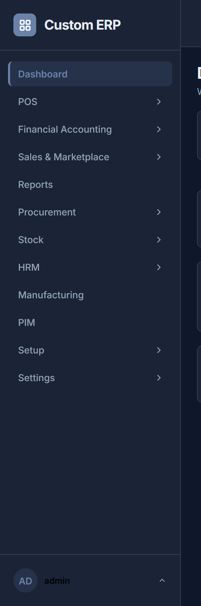
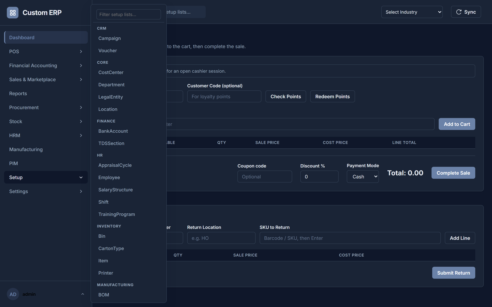
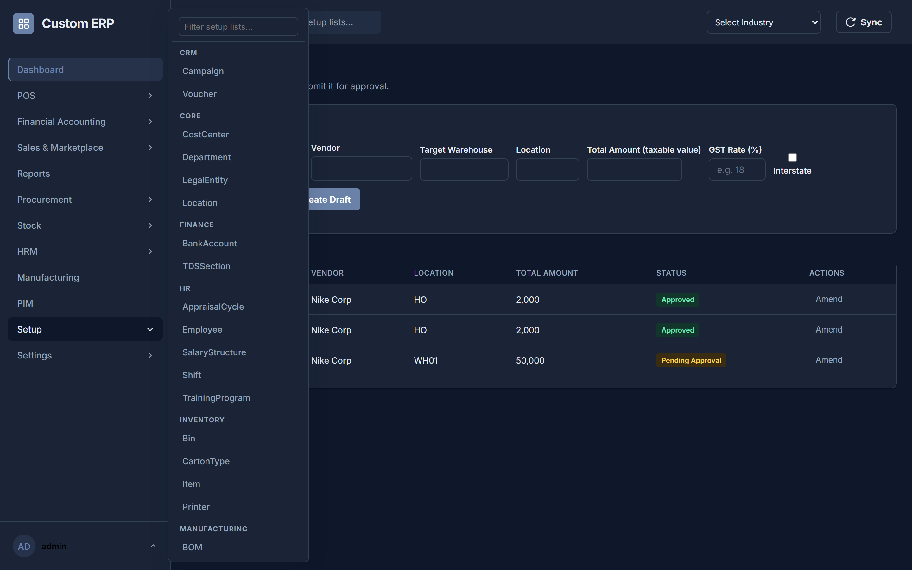
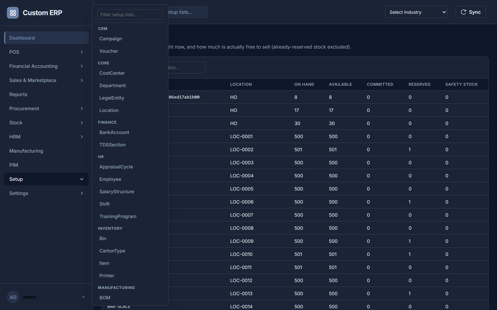
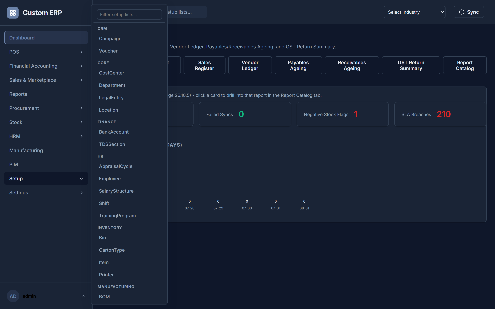

# User Guide

> **Applies to:** Stage 30.8 · **Last verified against the running app:** 2026-08-01
> Every step below was walked through against a live server on the date shown. If something here doesn't match what you see, the document is what's wrong — please report it.

**Welcome!** This guide explains how to use the ERP system. It's written in plain language for anyone using the system for the first time — no computer or accounting background needed. If a word might be unfamiliar, it's explained the first time it's used, and there's a glossary at the end.

*Need literal click-by-click steps for a screen not walked through in depth below? See **[USER_SOP.md](USER_SOP.md)** — the same plain-language style, one section per screen, covering every module.*

*Prefer to watch? The [editable process-video library](../sop-video/readme.md) currently has a
complete Purchase Requisition training chapter, including Department setup and a saved-number
check. Other video chapters are explicitly pending; use this written guide for those tasks.*

---

## How do I…?

Jump straight to the thing you're trying to do.

| I want to… | Go to |
|---|---|
| Log in for the first time | §2 |
| Watch a step-by-step Purchase Requisition example | [Process-video library](../sop-video/readme.md) |
| Find a screen I can't see in the menu | §3 |
| **Ring up a sale** | §4 — read the prerequisites box first |
| Open or close the till for a shift | §4.0 |
| Find a product when I don't have its barcode | §4.1 step 1 |
| Attach a customer to a sale, or add one at the counter | §4.1 step 5 |
| Work out a customer's change from cash | §4.1 step 8 |
| Understand why the till froze after a sale, and start the next one | §4.1a |
| Apply a coupon, or understand why an offer didn't appear | §4.2 |
| Print a receipt, or make it print without a dialog | §4.3 |
| Change which shop this till sells from | §4.5 |
| Understand why my shop isn't in the till's Store list | §4.0 step 2 |
| Fix a screen showing old or wrong data (Refresh vs Reset) | §12.3 |
| Print barcode stickers for everything on a GRN or a transfer | §7A.1 |
| Make one product category's label look different | §7A.2 |
| Re-print a single tag that fell off | §7A.3 |
| See who printed which labels, and when | §7A.4 |
| Print a shipping label or a sales invoice, or make labels print with no dialog | **[QZ_PRINTING_SETUP.md](QZ_PRINTING_SETUP.md)** — "Day-to-day use" |
| Take a return | [USER_SOP §3.3](USER_SOP.md) |
| Check how much stock I have | §5 |
| **Order stock from a supplier** | §6 |
| Add items and prices to a purchase order | §6, step 3 |
| Print a purchase order and send it to the vendor | §6, step 7 |
| Understand inclusive vs exclusive GST, or why a PO says IGST | §6.2 |
| Record stock that has arrived | §6, step 9 |
| Complete a missing barcode when receiving stock | §6.4 — existing/imported Items are covered automatically |
| Understand where document numbers come from | §6.1 |
| Move stock between locations | §7 |
| Add a vendor, item, brand, location… | §8 |
| Correct a record I got wrong | §8 — use the row's **Edit** icon |
| Create a missing vendor/item mid-way through a document, then carry on | §8.1.1 |
| **Set up jewellery Designs and their SKUs (Combination IDs)** | §8d |
| Understand the extra jewellery fields on an Item | §8d.1 |
| **Record what competitors charge, and see where I sit against them** | §8a, then the Competitor Price Gap report in §9 |
| Run a report / find the right report | §9 and **[REPORT_CATALOG.md](REPORT_CATALOG.md)** |
| **Place a customer order by hand (phone / walk-in / replacement)** | §9A.1 |
| Check whether a marketplace or Unicommerce order reached the ERP | §9A.2 |
| Process an order through to shipment and invoice | §9A.3 and §9A.4 |
| Understand why a field says my GSTIN, email or phone number is wrong | §8e |
| Approve or reject something | §10 |
| Change my own password or auto-logout | §11 |
| Find out which version I am on, to report a problem | §11.1 |
| **Understand an error message or code** | §12 and **[ERROR_CODES.md](ERROR_CODES.md)** |
| **Set the whole thing up from scratch and make my first sale** | §13 — the full worked example |
| Know what my role is allowed to do | **[PERMISSION_MATRIX.md](PERMISSION_MATRIX.md)** |

---

## 1. What is this system?

Think of this system as one big digital notebook that your whole business shares. Instead of writing sales in one notebook, stock in another, and money in a third — everything goes into the same place. That way, everyone (the cashier, the warehouse person, the accountant, the owner) is always looking at the same, up-to-date information.

## 2. Logging In

1. Open the app in your web browser. You'll see a **login screen**.
2. Type in your **username** and **password** (your manager or admin gives these to you).
3. Click **Login**.
4. **The first time you sign in** — and the first time after an administrator has reset your password — you are asked to **Set your own password**: type the password you were given, then your new one twice. Nothing else in the system opens until you have done this, so the password your administrator knows never stays in use. If you forget your password later, ask your administrator to reset it; you will be asked to choose a new one again.
5. Only administrator accounts (Super Admin / HR/Admin) are asked for a **6-digit code** from an authenticator app on their phone. This is called **MFA** (Multi-Factor Authentication) — an extra lock on the door, on top of the password. Everyone else signs in with username and password only.
6. If you type your password wrong too many times in a row, the system will temporarily lock your account to keep it safe. Wait a bit and try again, or ask an admin for help.

### If your role uses MFA: your recovery codes

The very first time you set up MFA, the app shows you **ten recovery codes** and asks you to tick a box confirming you have saved them. Take that seriously — **this is the only time they are ever shown.** The system stores only a scrambled fingerprint of each one, so nobody, including your administrator, can look them up for you later.

- **Save them somewhere that is not your phone.** A printed copy in a locked drawer, or your password manager. Saving them on the phone that holds your authenticator app defeats the point: if you lose the phone, you lose both.
- Use **Copy** or **Download** on that screen if it helps — Download saves a small text file.
- **Each code works once.** On the login screen, if you don't have your phone, click **"Lost your phone? Use a recovery code"** and type one in instead of the 6-digit code. Dashes, spaces and capitals don't matter.
- After you sign in with a recovery code, you'll see a message telling you how many you have left. **That message is a prompt to act, not just information** — see below.

### Moving your authenticator to a new phone

Do this *before* you get rid of an old phone if you can, but it also works afterwards as long as you can still sign in (with a recovery code, if need be).

1. Sign in and open **My Profile** from the account menu.
2. In the **Two-Factor Recovery** panel, click **Set up a new authenticator device**.
3. Confirm your **password** (not a code — the whole point is that your old device may be gone).
4. Add the code shown to the authenticator app on your **new** phone, then enter the 6-digit code it displays.
5. Your old device stops working at that moment, and you are given a **fresh set of recovery codes** — save these too; the old set no longer works.

Your old authenticator keeps working the whole time until step 4 succeeds, so it is safe to start this and change your mind.

The same panel shows **how many recovery codes you have left** and lets you generate a new set at any time (which immediately cancels the old set). If it says you have none, generate some now — with no codes and no phone, only an administrator can get you back in.

**If you have lost both your phone and your codes**, ask an administrator to reset your two-factor setup for you (ADMIN_GUIDE §Users & Roles). You'll be asked to set it up again from scratch at your next login.

Once you're in, you'll see a **sidebar** on the left. **It only shows what your role can actually use** — if a colleague has menu entries you don't, that's your role, not a fault. A whole module disappears if you have no access to anything inside it, and your business only sees the modules it has licensed. Within a screen, buttons you can't use aren't shown either: if you can view a list but not add to it, you'll see a small **"Read-only for your role"** label where the **New** button would be. Ask your administrator if you need more access.

## 3. Finding Your Way Around

The sidebar has **twelve top-level entries**. Most are module groups: hover one and its screens slide out to the right (click it instead if you are on a touchscreen or using a keyboard). Four — **Home**, **Reports**, **Manufacturing** and **PIM** — have no flyout and open straight away.

| Sidebar entry | What lives inside |
|---|---|
| **Home** | Opens directly. This is where you land when you first sign in — see "Home, your landing screen" below. |
| **POS** | POS / Billing (§4) · POS Profiles · Offline Sync Review · Offline Queue Gaps |
| **Financial Accounting** | Finance / GL · Approvals (§10) · Vendor Invoice · Payment Proposals · Bank Reconciliation · Debit / Credit Notes · Sales Invoice |
| **Sales & Marketplace** | Order Management · Fulfillment · Marketplace · Customer |
| **Reports** | Opens directly (§9). Its first tab is a dashboard of live figures. |
| **Procurement** | Purchase Requisitions · Purchase Order (§6) · ASN · **Goods Receipt** · Vendors · RFQ / Quotes |
| **Stock** | Inventory (§5) · Stock Transfer (§7), then under the **WMS** heading every warehouse-operations screen: Bin · Putaway · Warehouse Cockpit · Bin Conditions · LPN / Cartons / Pallets · Bin Replenishment · Wave / Batch Picking · Mobile Picking · RF Lot & Serial · Cycle Count · Dock Doors · Appointment Calendar · Yard Board · Trailers · Holds · Cross-Dock Plans · RF Receiving · Waves · Sortation · Loading · Sticker Printing (§7A) |
| **HRM** | HR · Fixed Assets · Expenses |
| **Manufacturing** | Opens directly. |
| **PIM** | Opens directly. |
| **Setup** | Every reference list the system knows about (§8) |
| **Settings** | Admin-only: Users · Roles · Prefix Configs · Approval Rules · Dynamic Labels · Database Schema Design · Extension Hooks · Activity Log · Configuration · System Status · Tenant Entitlements · Tenant Usage |




**You only see what your role can use.** If a module or a screen isn't in your menu, your role doesn't have access to it — that's the system working, not something missing. Ask your administrator if you need it. **Home**, **Reports** and the **Knowledge Center** are there for everyone; if you approve documents, your queue is on **Home** ("waiting on you") even when you have no Finance menu.

**Names, not codes.** Wherever you pick or see a record — a department, a warehouse, a vendor — the screen shows its **name**. The system's own reference (for example `Department/HQ/2026/000001`) is still what gets stored; hover over the box or cell to see it, and the copy button next to a list value still copies it.

**Dates.** Click any date box to open a calendar: the arrows change month, clicking the month name lets you jump by month or year, **Today** fills in today and **Clear** empties the box. You can still type a date straight into the box. From the keyboard, **Alt+↓** opens the calendar, the arrow keys move a day or a week, **Page Up/Down** a month, **Enter** picks and **Esc** closes.

### Home, your landing screen

Home is where you land right after signing in (and the "Home" link at the top of the sidebar always takes you back there). It is built from your own role, not a generic list, so it stays short and relevant:

- **Your quick actions** — a grid of the screens you actually use, each one click away: **Point of Sale** for a cashier, **Purchase Orders** for buying, the **Warehouse Cockpit** for a floor operator, **Finance / GL** for an accountant, and so on. A screen you have no access to simply is not a tile — never a greyed-out one you can click and get refused.
- **What's waiting on you** — a count of approvals needing your sign-off, when Approvals is something you use.
- **Recent** — the records you most recently created or touched, for the one task type you use most, so you can jump straight back into something you were just working on.
- **Get started** — while your company is still setting things up, this names the first master record (a Vendor, an Item, a Location…) you need before the rest of the screen has anything to show, with a link straight to creating it.

From your second visit onward you land back on whichever screen you were last using instead of Home, so you can pick up where you left off — click **Home** in the sidebar any time you want to return to it on purpose.

> **If you are a supplier**, your account is deliberately narrow: you sign in to the same app as everyone else, but the only screen you can reach is **Supplier Submissions**, and within it you see only the submissions filed under your own company — never another supplier's. Fill in the product details you want to propose (the product, the language, a title, and whatever descriptions, tags or image URL you have), save it, then use **Submit for Approval**. A reviewer at the company approves or rejects it; a rejection always carries a written reason, which you can read on the submission itself. Approved text does **not** go live automatically — it becomes a draft that the company still reviews and publishes on its own schedule. If the app tells you your account is not linked to a vendor yet, that's a setup step your contact at the company needs to finish.

**Two search boxes, and they do different things:**

- The **box at the very top of the window** finds *screens*. Type "purch" and it offers Purchase Order, Purchase Requisitions, and so on; pick one and it takes you there. It does **not** search your records.
- The **box just above a table**, on a screen, filters *that table's records*. This is how you find a particular vendor, item or invoice.

At the top right of most list screens there are **New** and **Bulk Import** buttons, and each row has **Edit** and **Delete** icons. Any of these that your role can't use simply won't be shown.

## 4. Making a Sale (POS / Billing)

This is the screen a cashier uses most.

> **Before your first sale — three things must already exist.** Skip any of them and the sale will be refused, with an error that only makes sense once you know this list.
>
> 1. **A Location you are allowed to sell from.** Setup → Core → **Location**, with **Sellable = Yes**. A location with **Sellable = No** — a back warehouse, a head office — will not appear in the till's **Store** box at all, and both opening a session and completing a sale there are refused. See §4.0.
> 2. **At least one Item, with its HSN Code and GST Rate filled in.** Setup → Inventory → **Item**. Both tax fields are required and the system will not let you save without them, because it cannot price a sale it can't tax. (If the item genuinely isn't taxed — produce, unbranded grain, exports — set its **Tax Treatment** instead of entering a 0 rate; see §9 Step 3.) Stock also has to exist: an Item on its own has a quantity of zero until a **Goods Receipt** brings some in (§6).
> 3. **An open cashier session at that store.** This is the one people miss. Checkout refuses with *"Cash opening is required before billing"* until a session is open. Opening one is step 3 below.

### 4.0 Open the till for the shift

1. Click **POS / Billing** (under the **POS** module).
2. Start typing your shop's **name** into **Store** and pick it from the list (the code and short code work too, if that is what you know it by). The bar above shows whether a session is open there.
   - **Only sellable locations appear here.** If the shop you expect is missing, it is almost certainly set to **Sellable = No** on its Location record — ask an administrator to change it. This is deliberate: it is what stops a sale being rung up against a warehouse or head office by accident.
3. If the bar says *"No open session … open one before selling"*, click **Open Session**, type the **cash physically in the till right now**, and confirm. The bar changes to *"Session open at …"*.
4. **The till is now bound to that store.** The **Store** box goes read-only and shows *"Bound to … for this session"* underneath. This is on purpose — it means you cannot drift onto another shop's stock halfway through a shift. To change it, see **Reset Terminal** in §4.5.
5. At the end of the shift, click **Close Session** and enter the cash you counted. The system shows what it expected, what you counted, and the difference — note it for your manager if it isn't zero.

You open a session once per shift, not once per sale.



### 4.1 Ring it up

1. **Scan it, or search for it — same box.** Point the scanner at the barcode and it rings straight up, no extra keypress. If you have no barcode, type part of the **product's name** instead and press Enter:
   - If what you typed is an exact **code** or **barcode**, the item is added immediately with no list.
   - Otherwise a short list of matching products appears underneath. Click one, or walk the list with the **↑ ↓** arrow keys and press **Enter**. **Esc** closes it.
   - If nothing matches you are told so plainly — *"No product matches …"* — rather than a blank line being added to the cart.
2. Repeat for every item the customer is buying. Scanning the same item twice adds 2, it does not create a second line.
3. **Adjust quantities with the − and + buttons** on the line, or type straight into the quantity box for a larger number. Pressing **−** on a quantity of 1 removes the line.
4. **Read the Available column before you promise anything.** It shows the quantity you can actually sell at this store. If some of that item is held back — quarantined by QC, damaged, or blocked — a second line says so: *"3 not sellable (QC hold / damaged / blocked)"*. That stock is physically in the shop but must not be sold. If you ask for more than can be sold, the row turns red and says *"Only N can be sold here"*.
5. **If the customer is a returning or loyalty customer**, type their **name** (or phone number, or code) into **Customer** and pick them from the list. The line beneath the box reads *"Walk-in — no customer attached"* until you do, so you always know which you are on.
   - **The customer isn't in the system yet?** Click **+ New Customer**, enter their name and phone, and they are created and attached to this sale without leaving the till.
   - **Check Points** shows their balance. **Redeem Points** spends points on this sale — the discount comes off the amount to collect automatically, and the points are only actually deducted once the sale completes.
6. **Any offers that apply appear on their own, above the total** — see §4.2. If the customer has a coupon, type it into the **Coupon code** box.
7. Check the total — tax is calculated automatically, you don't need to work it out.
8. **Choose how they're paying.** If it is **Cash**, type what the customer handed you into **Cash tendered** and the screen shows **Change due** before you commit to anything (or *"Short by …"* if it isn't enough). Card and UPI are for the exact amount, so the box disappears for those.
9. Click **Complete Sale**.

### 4.1a The sale is complete — the till freezes

This is deliberate and is the biggest change from how this screen used to work.

When the sale goes through, **the till stops and shows the finished bill**: the bill number, the store, each line, the total collected, the cash tendered and the change due. Everything below it is hidden, and **nothing can be scanned onto it**.

- The bill stays there as long as you need it — read the change back to the customer, answer a question about a line, print the receipt.
- When you are ready for the next customer, click **New Sale (Reset)**. The cart, customer, coupon, discount and tendered amount are all cleared for a clean start.
- **The store stays bound.** You do not re-pick your shop between customers.

Why it works this way: before, the cart silently emptied behind a dialog and the screen looked exactly as it had a moment earlier — so the next customer's items could be scanned onto what you still believed was the previous sale. Now there is an unmistakable boundary between one bill and the next.

**Two other outcomes freeze the till the same way**, so you always know where you stand:

- **Waiting for manager approval.** A large discount does not complete the sale. The panel says so in orange and offers no receipt — the money has not been collected and **the goods must not be handed over**. The sale sits as **Pending Approval** until a manager decides it from the **Approvals** screen.
- **Queued offline.** If the connection is down, the sale is saved on the till and syncs automatically when the connection returns. The panel tells you so and warns you **not to ring it up again**.

### 4.2 Offers and coupons at the till

You do not apply offers by hand. Whatever your head office has set up in the ERP is worked out automatically as you build the cart, and shown in a panel just above the total — each offer by name, what it did ("10% off the bill", "buy 2 get 1 free — 1 free unit"), and how much it took off.

- **Automatic offers just appear.** Add the qualifying items and the offer shows up. Remove an item and it disappears again if the cart no longer qualifies. If an offer needs a minimum spend, it appears once the cart crosses it.
- **Coupon offers need the code.** Type it into the **Coupon code** box. Case doesn't matter, and you can enter more than one separated by a space or comma. If a code doesn't apply to this cart, the panel says so in plain words rather than silently ignoring it — check the spelling, and whether the cart actually meets the offer's conditions.
- **Some offers only apply to certain customers** (a loyalty tier, for instance). Look the customer up *before* expecting those to show — with no customer on the sale, a tier-restricted offer will not appear.
- **The final say is the server's, not this screen's.** The panel is a preview; the discount is recalculated for real when you take payment. In normal use the two agree. If they ever don't, the amount charged is the correct one.
- **The discount box is separate.** The **Discount %** field is still there for a manual, cashier-applied discount, and large manual discounts may still need a manager's approval. Offers are not manual discounts and don't need approval — they're the rules head office already signed off.

### 4.3 Printing the receipt

Click **Print Receipt** on the finished bill. You can click it more than once — a customer who said no and then changed their mind does not need the sale re-rung.

If your till has a receipt printer set up for silent printing it goes straight there with no dialog (see below); otherwise your browser's normal print dialog opens. Nothing extra is needed to print — the button always works.

To get the one-click version, your administrator installs **QZ Tray** on the till PC and creates a **Printer** record whose **Default For** is `Receipt` — the full steps are in **[QZ_PRINTING_SETUP.md](QZ_PRINTING_SETUP.md)**. If any of that isn't set up, the browser print dialog appears as before; nothing breaks and nothing is lost.

A few things worth knowing:

- **The receipt says which shop sold it.** The header carries your company's name and GSTIN, the shop's name and code, the bill number, the date and time, and who was on the till. A customer holding the receipt can tell which branch of a chain they bought from — and it stands up as a tax document.
- **The receipt shows what was actually collected.** Offers and loyalty points spent both appear as their own lines, so the printed total matches the cash in the drawer.
- **A sale waiting on manager approval will not print a receipt.** The money hasn't been collected yet. Once the manager approves it from the **Approvals** screen the sale completes and can be printed.
- **Reprinting later is safe.** The receipt is rebuilt from the recorded sale, not from whatever is on screen, so it always shows what was originally rung up.
- **If a 58mm till roll prints text too wide**, tell your administrator to set **Label Width (mm)** to `58` on that Printer record.

**If something goes wrong mid-sale** (a barcode doesn't scan, the system shows an error), read the message on screen — it tells you exactly what's wrong (e.g. "this item is already sold" or "not enough stock") rather than just "error."

### 4.4 If prices changed while you were ringing up

Occasionally the back office changes a price between the moment the cart was priced and the moment you press **Complete Sale**. The system never quietly charges either figure. It stops, shows you what changed and the new total, and asks you to confirm. Nothing is charged until you do.

### 4.5 Reset Terminal — changing which shop the till sells from

**Reset Terminal** is in the bar at the top, next to the session buttons. Use it when the till is bound to the wrong store, or when you are genuinely moving this till to a different shop.

1. Click **Reset Terminal**. It tells you exactly what will happen — including how many cart lines will be thrown away — and asks you to confirm. **The cart is not saved.**
2. If **no session is open**, the **Store** box unlocks and you can pick a different shop.
3. If a **session is still open**, the cart is cleared but the store stays bound, and you are told why: a session is a cash-accountability record, so you must **Close Session** first. This is not a way to walk away from an open till.

Day to day you will not need this button. Between customers, use **New Sale (Reset)** on the finished bill instead — that keeps the store binding, which is what you want.

## 5. Checking Stock

1. Click **Inventory** in the sidebar.
2. Use the search box to find an item by name or code.
3. The screen shows how much is available right now.

If you need to know how much stock is *actually free to sell* (not already reserved for another order), that number accounts for anything already promised elsewhere — it's not just a raw count sitting in the warehouse.

### 5.1 Entering a wave on Mobile Picking

Open **Stock → Mobile Picking** and scan or type the existing **Wave ID** exactly as assigned.
Letters and hyphens are part of the identifier: `WAVE-0001` must remain `WAVE-0001`, not `0001`.
This is a warehouse code, not a phone number. Click **Load** for the chosen wave. The example is
only a format example; use a wave that exists in your warehouse. An assigned-wave chooser is
planned separately; this screen currently still requires the wave reference.

## 6. Ordering More Stock (Purchase Order)

1. Click **Purchase Order**. The **New Purchase Order** panel is at the top of the screen — there's no separate "create" step to click first.
2. Fill in the four header boxes:
   - **Vendor** — start typing and pick the supplier from the list.
   - **Location (billing entity)** — which of your locations is buying. This decides who the vendor invoices, and it's half of how the system works out your GST (see §6.2).
   - **Target Warehouse (ship to)** — where the goods should physically arrive. Often the same as Location; it doesn't have to be.
   - **GST treatment of purchase price** — leave it on "Tenant default" unless this particular vendor quotes differently. See §6.2.
3. **Add your items.** Click **+ Add item** for each line, then fill in:
   - **Item** — type to search; pick from the list.
   - **Qty** and **Purchase Price** — what you're ordering and what you're paying per unit.
   - **MRP** — optional. Record it if you're tracking it; leave it blank if not. **It never appears on the vendor's printed copy** — it's for you, not for them.

   The four grey columns to the right — **HSN**, **GST %**, **Taxable**, **Tax**, **Line Total** — fill themselves in as you type. You can't edit them, on purpose: HSN and GST rate come from the Item master, so there's only ever one answer to "what tax does this item carry".

   If a line turns red, that item is missing its HSN code or GST rate on the Item master. Fix it under **Setup → Items** and the line clears.
4. Check the **totals** at the bottom — taxable value, the tax split, and the grand total — and the **supply-type banner** above the items (§6.2).
5. **You don't type a PO number.** The box shows "Auto (PO series)" and is greyed out on purpose. The number is issued when you save; see §6.1.
6. Click **Create Draft**. Depending on the amount it may need someone else's **approval** before it's official — that's a safety check, not a bug. You'll see it move to "Pending Approval", and once approved it's ready to send.
7. **Send it to the vendor.** On the order's row, **Print** opens a proper purchase order laid out for A4 — both parties' names, addresses and GSTINs, the item table with HSN and tax, the grand total, and the amount in words. **Send to Vendor** records the dispatch (the row shows "Sent to vendor") and opens a pre-filled email to the vendor's contact address. If your administrator has configured a notification channel, it goes out through that as well.
8. **Amend** loads the order back into the same panel — including its items — so you can change quantities or prices. Amending an already-approved PO sends it back for re-approval, and the screen warns you before it does.
9. When the stock physically arrives, record a **GRN** (Goods Receipt Note — "yes, this stock actually showed up") on **Procurement → Goods Receipt**. Click **Load Items from PO**, pick the order, adjust any quantity that arrived short, and click **Post Receipt**. **Only then does the stock count go up** — an order by itself never adds stock, only a confirmed receipt does. Check **Inventory** afterwards to confirm it moved.
    Once it is posted, any Item on the receipt that still has no barcode gets one as a safety net — for example, an older or imported Item. A new Item made on screen requires a barcode before it can be saved. The GRN is also where you start printing its labels — see §7A.1.

#### 6.4 Completing missing barcodes at receipt

When you create an Item on screen, **Barcode** is required. Type an existing barcode, or use the **Generate** button beside the field to issue a valid EAN-13. Goods Receipt also has a safety net: **when you post a receipt, each distinct Item on it that still has no barcode gets one automatically**. This covers older, imported or API-created Items that pre-date the required on-screen field.

What that means in practice:

- **A new Item cannot normally be saved without a barcode.** The Item form marks Barcode with `*`; use **Generate** there if you do not already have a supplier barcode.
- **A missing barcode on a received Item is completed after the receipt posts.** You can then print its labels from that GRN (§7A.1).
- **An item that already has a barcode keeps it.** Receiving the same SKU again does not issue it a second barcode or change the one on your existing labels. This is safe to rely on: the same stock can be received any number of times and the barcode stays put.
- **The barcodes are real EAN-13 numbers**, with a valid check digit, so an ordinary retail scanner reads them.
- **It never blocks a receipt.** The missing-barcode safety net runs *after* the receipt has posted and the stock has moved. If generation fails, the receipt still stands and the Item remains unbarcoded; the failure is recorded in the system log for an administrator. You can use **Generate** on the Item form to retry.
- **Where to see it**: open the **Item** record and look at its **Barcode** field.

If you want to *print* at the moment of receipt, that is still a deliberate second step — post the receipt, then print its labels from the Sticker Printing screen (§7A.1). Posting a receipt does not send anything to a printer on its own.

**An RFQ is optional.** If you want to compare vendor quotes first, raise a Purchase Requisition and convert it to an **RFQ** (Procurement → RFQ), collect quotes, then convert to a PO. If you already know who you're buying from — which is the normal case — go straight to a Purchase Order as above. Nothing requires an RFQ to exist first.



### 6.1 Where document numbers come from

You never type the number on a Purchase Order, Goods Receipt, Stock Transfer, Expense Claim, Leave request, or any other transaction. The field is greyed out and reads something like **"Auto (PO series)"**, and the real number appears once you save — for example `PO/HO/26-27/000042`.

That number is issued by the system, in order, from a numbering series your administrator controls (see the Admin Guide, §B.3.2). Reading the example above left to right: the **PO** part is the document type, **HO** is the location it was raised at, **26-27** is the financial year, and **000042** is the running count. Your administrator can change any of that — including removing the location or the year entirely — so yours may look different, and that's fine.

Two things worth knowing:

- **Numbers can have gaps, and that's normal.** If a save fails validation after a number was drawn, that number isn't reused. A gap means "something was started and not completed", never "a document went missing".
- **You can't reuse or choose a number.** This is deliberate. When people typed their own numbers, two colleagues creating a PO at the same time could pick the same one — and the second save would quietly overwrite the first, with no warning to either of them. Now that can't happen.

**Master records are numbered the same way.** Vendors, Items, Customers, Employees and the other lists in §8 get their Code from a series on save (`Vendor/HQ/2026/000007`). In the on-screen form the Code field is read-only; for Items, a linked Product Family instead makes the save build a Combination ID (§8d). Your administrator can change the shape of a master series too, including for Vendor and Item (Admin Guide §B.3.2).

### 6.2 GST on a purchase order: inclusive vs exclusive, and inter-state

Two things decide the tax on a PO, and the screen works both out for you.

**Does the price you typed already include GST?**

- **Exclusive** (the usual case, and the default) — the Purchase Price is the base price and GST is added on top. Type 450 at 5% and the line comes to 472.50.
- **Inclusive** — the price already has GST in it. Type 450 at 5% and the line stays 450, of which 21.43 is tax.

Your administrator sets which one is normal for your business (Admin Guide → Configuration → Procurement → "Purchase Order price GST treatment"). The dropdown on the PO screen shows what that default is, and you can override it on any single PO where a particular vendor quotes the other way.

**Is it inter-state or intra-state?**

You don't tick this any more. The system compares the state of the **legal entity behind your chosen Location** with the state of the **vendor**, and applies:

- **same state** → intra-state → **CGST + SGST**
- **different states** → inter-state → **IGST**

The banner above the items tells you which it chose and why — for example *"Inter-state (IGST) — vendor in Karnataka (29), billing entity in Maharashtra (27)"*.

Each side's state comes from its GSTIN (the first two digits are the state code), falling back to the **State** field on the record if there's no GSTIN.

If the banner turns amber and says it **could not work the supply type out**, it names exactly what's missing — usually "this vendor has no GSTIN or state recorded". Two options:

- **Fix the master** (better): add the GSTIN or State to the vendor under **Setup → Vendors**, or to the Legal Entity behind your Location. Every future PO for that vendor then gets it right automatically.
- **Set it by hand** (for this PO only): tick **Inter-state (IGST)** in the banner.

You can also **Override** a derived answer when you know something the master records don't — a bill-to/ship-to split, for instance. Once you override, your choice sticks and later saves won't quietly undo it.

### 6.3 Batches and expiry dates (for items that need them)

Most items don't need this section. It applies only to items your administrator has marked as **batch-tracked** — typically food, medicines, cosmetics, chemicals or anything else where "which production lot did this come from" and "when does it expire" are real questions. If none of your items are marked that way, nothing below ever appears and the rest of the guide works exactly as written.

**Receiving batch-tracked stock.** On **Procurement → Goods Receipt**, once you pick an item in the SKU box a **batch row** appears underneath the quantity boxes, with a note telling you whether that item needs a lot number:

- **Batch / Lot No** — the number printed on the carton. **Required** for a batch-tracked item; you can't add the line without it.
- **Manufacture Date** and **Expiry Date** — type whichever the carton actually prints. If the item has a shelf life set up and you fill in only the manufacture date, the expiry is worked out for you (manufacture + shelf life) and the note on screen tells you so.
- **Supplier Batch No** — the supplier's own reference, if it differs from yours. Optional.

You don't need to create the batch anywhere first. Posting the receipt registers it for you, along with the supplier it came from.

**Two things the system will refuse, and why.**

- **A batch-tracked item with no lot number.** You'll be told the item is batch-tracked and needs one. There is no way round it, deliberately — stock nobody can trace back to a lot is exactly what batch tracking exists to prevent.
- **Goods that are too close to expiry.** If your administrator has set a minimum shelf life on receipt, a delivery arriving inside it is refused at the door, and the message tells you how many days it has left versus how many the item accepts. Take it up with the supplier rather than trying to force it through — accepting it means stock you'll never be able to pick.

You'll also be stopped if the expiry date you typed is before the manufacture date. That's always a typo, and it matters more than it looks: the system picks earliest-expiry stock first, so a lot dated wrongly would jump to the front of every pick list from then on.

**Picking batch-tracked stock.** You don't choose the lot — the pick list does, and it always chooses the one expiring soonest (this is called **FEFO**, first-expiry-first-out). Pick lists and the mobile picking screen show a **Batch / Expiry** column with the lot number, its expiry date, and a coloured flag when it's close: amber within 30 days, red within 7 days or already past. Pick **the batch shown**, not whatever is nearest to hand.

Two lots you will never be offered:

- Anything already past its expiry, or inside the minimum shelf life the item requires to be picked.
- Any lot someone has put on hold (see below).

If that means there isn't enough to fulfil the order, the pick list says **short** rather than quietly giving you stock it shouldn't. The stock is physically there; it's just not fit to send.

**Putting a lot on hold, and taking it off.** If a pallet is damaged, or QC wants a lot stopped, an administrator or store manager can mark the batch **Quarantined** or **Blocked**. It disappears from every pick list immediately. Releasing it back to **Active** requires a written reason — that reason is the first thing anyone asks for if the lot is ever part of a recall, so it isn't optional.

**Finding stock and tracing a lot.** Three reports under **Reports** (all exportable):

- **Batch Near-Expiry Watchlist** — everything expiring within the number of days you give it (30 by default), worst first, with how much is left and where. This is the one to open every morning if you sell anything dated.
- **Batch Stock Inquiry** — "where is lot X right now": every bin holding it, in what condition, with days left. Filter by item, location or lot.
- **Batch Movement History (Recall)** — "everywhere lot X has been": every movement from the receipt that brought it in through to the documents it went out on. Give it a lot number; add the item code if the same lot number is used across items.

Together the last two are what a recall needs — the first tells you what to stop shipping, the second tells you who already received it.

### 6.4 Asking vendors for quotes (RFQ)

**Procurement → RFQ / Quotes.** Use it when you want prices from several suppliers before you raise a Purchase Order.

1. **Create the RFQ**: describe what you need, the quantity and (optionally) a target date, then **Create RFQ**. It starts as **Draft**.
2. **Invite vendors**: on the RFQ's row choose **Vendors & Quotes**. Under **Invited vendors**, pick each supplier you are asking and **Invite vendor**. Remove one with its **×** while the RFQ is open.
3. **Mark as Sent** once you have actually sent the request to them (by email, phone or in person — the system records who it went to; it does not send the request itself).
4. **Record each quote** as it comes in: vendor, quoted price and lead time, then **Submit Quote**. A quote from a supplier you had not invited still records, and adds them to the invited list.
5. **Choose the winner**: **Select as Winner** on the best quote. The other quotes are rejected and the RFQ closes. If you decide to buy from nobody, use **Close** on the RFQ instead.

The status only moves forward — Draft → Sent → Closed.

### 6.5 Sending goods back to a supplier

There is **no separate Purchase Return screen yet.** Today, when you send goods back or a supplier overcharged you, record the money side with a **Debit Note** (Financial Accounting → Debit / Credit Notes): pick the supplier and the **Reference PO** from its list, the amount and the reason. Moving the returned stock itself out of your inventory is not yet a guided flow — ask your administrator how your business handles it until it is.

### 6.6 Paying the supplier's bill (Vendor Invoice and the three-way match)

When the supplier's bill arrives, record it and let the system check it before anyone pays it.

1. Go to **Financial Accounting → Vendor Invoice** and click **+ New Vendor Invoice**.
2. Enter the supplier's **Invoice Number**, pick the **Vendor**, the **PO Reference** and the **GRN Reference** (the goods receipt this bill is for), and the **Invoice Amount** exactly as printed on the bill — **including GST**. Save. It starts as **Draft**.
3. Click **Match** on its row. You are not asked for the PO or GRN again — the invoice already names them.
   - **Matched** — the bill agrees with what you actually accepted: accepted quantity × the PO rate, plus the PO's GST, within the tolerance your administrator set (2% by default). A **partial delivery billed for what arrived matches** — you do not have to wait for the whole PO. Goods you **rejected** at receipt are not owed, so they are not counted.
   - **On hold (MismatchHold)** — a message tells you exactly what disagreed: the bill differs from the accepted goods' value, or that GRN or PO has **already been billed** (a duplicate bill for the same goods is caught). Correct the amount with the supplier, or use **Override & Pay** with a written reason — that goes to a manager for approval rather than paying straight away.
4. A **Matched** invoice shows **Pay** (and **Pay w/ TDS** where TDS sections are set up). Paying it posts the entry to the accounts.

## 7. Moving Stock Between Locations (Stock Transfer)

1. Click **Stock Transfer** in the sidebar.
2. Fill in the From and To warehouse/location, then add one or more line items (SKU + quantity) using the **Add Line** button — a transfer needs at least one line before it can be created. The Transfer Number is filled in for you when you save (§6.1).
3. Click **Create Transfer**. It starts as a **Draft**.
4. Once it's ready to go, click **Mark Approved**.
5. Click **Dispatch** to move the stock out of the source location (it sits "in transit" until received).
6. When it physically arrives, click **Receive** and confirm the quantity that actually showed up for each line — if less arrived than was dispatched, entering the lower number records that shortage rather than hiding it.

## 7A. Printing Barcode Stickers and Labels

**Stock → Sticker Printing.** This is where item labels come from — the small barcode tags that go on the product itself. The screen has two tabs: **Print** (do a print run) and **Templates** (decide what a label looks like).

> **Before your first print run you need one Printer record.** Setup → Core → **Printer**, Active, one record per physical label printer. Without one, the Printer dropdown on this screen is empty and printing stops with "Select a printer first." (On this screen you always pick the printer yourself, so **Default For** = `Sticker` is not required here — it is what makes the *other* print screens one-click.) Getting labels to come out *silently* — straight to the thermal printer with no browser dialog — is a separate one-time per-PC setup covered in **[QZ_PRINTING_SETUP.md](QZ_PRINTING_SETUP.md)**; until that is done, printing still works, it just opens the normal browser print dialog.

### 7A.1 Print the labels for a GRN or a Transfer Order

This is the normal way to print. You don't type SKUs — you point at the document the goods arrived on, and the system reads its own lines.

1. Go to **Sticker Printing** (the **Print** tab opens by default).
2. In the **Print from Transaction** panel, pick **Goods Receipt (GRN)** or **Transfer Order** in the **Module** dropdown.
3. In **Document**, start typing the document number — a suggestion list appears; pick the one you want. (If you pasted or typed the full number, click **Load**.)
4. The line list appears, one row per SKU (or per SKU-and-lot, if a SKU arrived on more than one lot):
   - **Category** — what that item's Item Master says.
   - **Template** — which label layout it will use, or **Default layout** if no template covers that category (§7A.2).
   - **Batch/Lot** — shown only when at least one line on the document carries a lot number.
   - **Copies** — pre-filled with that line's own quantity. Overtype it if you want a different number.
5. Choose the **Printer** in the panel just below the line list, and type a **Reprint Reason** if this is a re-run of labels already printed once (optional, but it is recorded against the print).
6. Then either:
   - untick any rows you don't want and click **Print Selected** — the whole document in one run; or
   - click **Print** on a single row — just that one line.

Three things it does for you:

- **A GRN prints against accepted quantity only.** If 100 arrived, 3 were rejected and 2 damaged, you get 95 labels — not 100. A line with nothing accepted doesn't appear at all, since there is nothing sellable to label.
- **Lots stay separate.** If the same SKU came in on two different batch/lot numbers, it stays as two rows and a **Batch/Lot** column appears so you can tell them apart. Each row is selected, counted and printed on its own, and each label carries its own lot and expiry.
- **Mixed categories come off grouped.** A GRN holding earrings and necklaces prints all the earring labels, then all the necklace labels, so the strip can be torn into one stack per category.

If the document loads but says *"That document has no stickerable lines"*, the lines were all rejected/damaged, or (for a transfer) the quantities are zero.

### 7A.2 Make one category's label look different (Templates)

Out of the box, every SKU prints the same plain label — name, barcode, SKU. If an earring tag needs to be smaller and plainer than a necklace tag, define a template per category. You do this yourself; it needs no developer.

1. **Sticker Printing → Templates → New Template**.
2. Fill in **Template Code** and **Template Name** (any short identifiers of your own).
3. **Categories (comma-separated)** — list the categories this layout applies to, e.g. `Earrings, Studs`. These are matched against the **Category** field on the Item Master. Category is free text on the Item, so it has to be spelled the same way (capitals don't matter, surrounding spaces don't matter). Nothing warns you about a typo — it simply won't match, and those items fall back to the default layout.
4. **Label Width (mm)** / **Label Height (mm)** — the physical size of the label stock you load for this category. The canvas resizes to match.
5. Leave **Status** on **Active**. A template saved as **Inactive** is ignored on every print run, which is the safe way to retire a layout without deleting it.
6. Click the field buttons to drop content onto the label — **SKU**, **Name**, **Barcode**, **HSN**, **Category**, **Batch/Lot**, **Expiry**, **Mfg Date**, **Qty**, **Source Doc #**, or **+ Static Text** for your own fixed wording (a "Handmade in India" line, say).
7. Arrange it: **drag** a field to move it, drag the small square at its **bottom-right corner** to resize it. **Click** a field to select it, and the panel on the right lets you set **Text** (static fields only), **Font Size (mm)**, **Align**, **Bold**, or the exact **Position / Size (mm)** if you'd rather type numbers than drag. **Delete Element** removes the selected field.
8. Click **Save Template**. It appears in the Templates list and takes effect on the next print run.

What you see on the canvas is what prints — the preview and the real label are drawn by the same code, so there is nothing to keep in sync.

> **The default template.** Tick **Default (unmapped categories)** on one template to make it the catch-all for every item whose category matches no other template. Leave it unticked everywhere and unmatched items use the plain built-in label instead. Only one template needs this.

To change a template later, click it in the Templates list, edit, and save again.

### 7A.3 Print labels without a document (manual / re-print)

For one-offs — a tag that fell off, a single item being re-tagged — use the panel below **Print from Transaction**:

1. Choose the **Printer**, set **Copies per SKU**, and enter a **Reprint Reason** if it's a re-print.
2. Type or scan into **Scan or Enter SKU** and press Enter (or click **Add**) for each item. Added SKUs are listed underneath with an **x** to remove one.
3. Click **Print Stickers**.

Category templates apply here exactly as they do to a document print — the layout follows the item's category either way.

### 7A.4 What was printed, and by whom

The table at the bottom of the **Print** tab is the print history: SKU, barcode, printer, who printed it, how many copies, the reprint reason, and when. Every print run — document-driven or manual — lands here, so a queried re-print can always be traced back to a person and a time. A run started from a GRN or Transfer Order additionally records which document and which template it used.

## 8. Managing Master Data (Vendors, Locations, Brands, and Similar Lists)

"Master data" just means the reference lists everything else points to — your vendors, your locations, your items, and things like brands, colors or sizes. A few of the most-used ones also appear directly in a module (**Vendors** under Procurement, **Customer** under Sales & Marketplace), but **Setup** holds all of them.

The **Setup** flyout is **grouped by module** (Core, Master Data, Inventory, HR, Finance, Procurement, Sales and so on) with a **filter box** at the top — type a few letters of what you want and the list narrows. At the bottom is an **Advanced** section, collapsed by default, holding the technical lists most businesses never touch. If you filter, matches inside Advanced are shown too, so nothing is ever hidden from a search.

> **Your shop is a Location.** Setup → Core → **Location**, with its **Type** set to Store, Warehouse or HO — this is the record every transaction points at. A Location also holds the shop's **Address, City, Contact Phone** and **Manager**. (Earlier versions had a separate "Stores" list under the Stock menu that nothing else read; it was retired and its fields folded into Location.)

Adding a new one always works the same way, no matter which list you're in:

1. Click the list in the sidebar (or open it from **Setup**).
2. Click the **New [thing]** button, top right. The dialog title starts with **New** and opens with empty/default fields. A row's **Edit** action instead opens **Edit** with that record's saved values.
3. Fill in the fields — anything marked with a **\*** is required, everything else is optional. A "Code" field usually says *"Auto-generated upon save"* — leave it blank and the system numbers it for you. **Status** starts on **Active** for a new record; change it only if you are deliberately setting up something not yet in use.
4. Some fields are small tables rather than boxes — a recipe’s components, a routing’s operations. Use **+ Add Line** to add a row and **Remove** to take one out. These table editors build the stored format for you; other specialist fields still explicitly labelled JSON are not yet converted to table editors.
5. If what you need is not in a dropdown, choose **+ Create new …** at the bottom of it: a small form opens on top, asking only what that record needs, and the new record is selected for you when you save — your half-filled form stays open underneath. See §8.1.
6. Click **Save**.

**Using the keyboard:** opening a record form moves focus into it. **Tab** and **Shift+Tab**
stay within the open dialog; **Escape** cancels it and returns focus to the button that opened
it. Generated Code/Number fields remain read-only. After editing, **New** starts a separate
record and does not reuse the edited record's identifier.

> **Your shop can have a Short Code.** Optional, and nothing depends on it. It is there so staff can find a location by the two or three letters they actually say out loud ("BKC", "LDH2") while the **Location Name** stays the full name shown on screen and the **Location Code** stays the identifier the system uses. Searching a location box matches all three.

### 8.1 The system tells you what is missing — read the hints

You should almost never have to work out *which* list you are missing. Three things do it for you, and they all say the same thing the same way:

- **Under a search box.** Pick a department on a Purchase Requisition and, if none exist yet, the box says *"No Department has been set up yet. Set up Department"*. If departments *do* exist, the line only appears while you are in the box, and reads *"Can't find the Department you need? Add a Department"* — so it helps when you are stuck and stays out of the way when you are not.
- **In the search results.** Type a name that does not exist yet and the list offers **Create "what you typed"**.
- **Either way, you create it right there (Stage 57).** A small form opens **on top of** the one you are working in, already holding the name you typed, and asking only for what that record needs. Save it and it is filled into your box; your own form never closed, so nothing you typed is lost. This works everywhere a record is picked — a vendor or item on a purchase order, a department on a requisition, a zone on a new Bin, a location on a transfer. Inside the small form, a missing record can itself be created the same way (an Item's HSN code, for example). If your role is not allowed to create that kind of record, it says so and tells you who to ask instead.
- **At the top of a screen.** Open a screen that needs something you have not set up and a short panel lists what is missing, each with its own link. Close it with the **×** if you already know; it stays closed for the rest of your visit and comes back next time you sign in — deliberately, so a half-finished setup does not stay half-finished.
- **The ⧉ icon opens it in a new tab.** Every one of these links has one next to it. Use it when you do not want to lose what you are in the middle of — set the missing thing up in the second tab, come back to the first, and carry on. (The links are ordinary links, so **Ctrl+click** and **middle-click** work too.)

**If it says you do not have access**, the message names what needs setting up and asks you to contact your administrator. That is not an error you can fix — send them the name of the list it mentions.

#### 8.1.1 You are brought back to where you came from

The panel at the top of a screen ("This screen needs some setup first") takes you to the full list instead, for setups that need more than a small form. When you follow one of those links, the system remembers where you were and brings you back. If you were in the middle of a new record's form, it is closed first (so the list is all you see), and when you come back it **opens again with what you had typed**, with the record you just created already filled in. The browser's **Back** button does the same thing.

Say you are part-way through a **Goods Receipt** and the item you received does not exist yet. You click the link to the Item list, and:

- **A "← Back to Goods Receipt" link appears** at the top of the Item list, so you can change your mind and return without creating anything.
- **Once you save the new Item, you land back on the Goods Receipt automatically.** You do not have to navigate back through the menu and you do not lose your place.

Three details worth knowing, because they are deliberate:

- **It returns you after creating something new, not after editing.** If you go to the Item list and edit an *existing* item, you stay on the Item list — you clearly came to do list work, not to unblock the receipt.
- **It works from every one of these links, not just on Goods Receipt.** Any "create one first" link, any missing-setup panel link, anywhere in the app, behaves this way.
- **It forgets if you wander off.** Abandon the trip, navigate somewhere unrelated, and the return is dropped. A Vendor you create an hour later on the Vendor screen will not suddenly fling you back to a Goods Receipt you had forgotten about.

If you would rather not leave the screen at all, use the **⧉** icon to do the setup in a second tab instead (see above). Both approaches work; this one is for when you are happy to go and come back.

#### 8.1.2 HSN codes on an Item

The **HSN Code** box on an Item is a picker over your **HSN Code** list (Setup → Core → HSN Code). Type a few digits: codes already in use appear, each with its description and default GST rate, and picking one fills an empty **GST Rate** for you. A code that is not on the list yet can be created from the picker. The list also fills itself: every Item saved with a valid HSN adds that code. An HSN or SAC code is **4, 6 or 8 digits**; spaces and dots are removed for you. The Item stores the plain number, so GST, e-invoices and reports read it exactly as before.

**Barcodes on an Item** are optional to type: leave the box blank and one is issued for that SKU (when, depends on your administrator's barcode settings). Scan or type your own if you have one — it is kept. The **Generate** button makes one on the spot.

#### 8.1.3 Bins and zones

A Bin's **Zone** is picked from your Zone list, showing each zone's name. If the zone does not exist yet ("Cold Room"), choose **Create "Cold Room"** in the picker and save the small form — then save the Bin. You never need to know or type a zone's code.

### 8.2 Phone numbers

Phone boxes follow the country your administrator set up (**Settings → Configuration → Localization → Home country**). With India selected, a phone box takes exactly **10 digits** and will not accept an eleventh; the line under it tells you so before you start typing.

You never have to format anything. Spaces, dashes, brackets and a leading `+91` are all removed automatically, so pasting `+91 (98765) 43210` out of an email stores the same number as typing `9876543210` — which also means the system can tell it is the same customer instead of creating a second one.

**For a number in another country, start with `+` and the country's dialling code** (`+971 50 123 4567`). The system recognises it, stores it correctly, and records which country it belongs to. Orders that arrive from your online channels are cleaned the same way automatically — and an order is **never** rejected because of its phone number.

To change an existing one later, find it in the list (use the search box above the table if there are a lot) and click its row’s pencil **Edit** icon. You never need to delete and recreate a record to correct it.




### 8a. Tracking What Competitors Charge

If you want to know how your prices compare to what the same product sells for elsewhere, record what you find in **Setup → PIM → Competitor Price**. It behaves like any other list above — **New Competitor Price** for one row at a time, or **Bulk Import** to paste in a whole spreadsheet, which is the usual way. Most marketplace seller panels will export competitor pricing to CSV, and that file can go straight in.

The reliable route for a bulk load is:

1. Open **Setup → PIM → Competitor Price**.
2. Click **Bulk Import**, then **Download Template**. The template already has the right column headers.
3. Fill it in — one row per price you observed. Then upload it with **Bulk Import** again.

What each column means:

| Column | Required | What to put in it |
|---|---|---|
| `our_item` | no | The code of *your* item this competitor product competes with. Leave it blank if you have not matched it to one of your SKUs yet — the row is still saved, it just won't appear in the price-gap report until you fill this in. |
| `platform` | **yes** | Where you saw it. Must be one of the listed marketplaces, or `Other`. |
| `competitor_price` | **yes** | What they are actually charging. |
| `observed_at` | **yes** | The date you saw that price. A competitor price with no date isn't evidence of anything, so this can't be skipped. |
| `competitor_product`, `competitor_sku` | no | Their product title and their SKU/ASIN, so you can find the listing again. |
| `mrp`, `rating`, `review_count` | no | Useful context if the export gives it to you. |
| `source_url` | no | A link back to the listing. Nothing is ever fetched from it — it's there for you to click. |

If a row is rejected, the message names the row number and the exact problem (for example, a `platform` that isn't in the allowed list). Valid rows in the same file still import — you only need to fix and re-upload the failures.

Then run the **Competitor Price Gap** report (Section 9) to see where you stand.

> **"Our Price" comes from what you actually sold at, not from a price list.** This system has no separate price-list master — the price is set on the sale itself. So the report shows the most recent price you actually transacted at for that item, and tells you which it came from (a POS sale or a sales order). **An item you have never sold shows "No price on file"** rather than a made-up figure — that is correct, not a fault. Ring one through, and the comparison appears.

### 8b. Grouping Products for PIM Work

Once the Stage 36 migration has been applied, open **Setup → PIM → PIM Product Group** to save a set of products you want to review together.

- Choose **Static** when you know the exact products. Add each Item under **Static Products**. The group keeps that hand-picked list until you edit it.
- Choose **Dynamic** when membership should follow the data. You can limit by Product Family, show products below a completeness percentage, require a particular missing attribute, and/or choose Active or Inactive items. Filled filters are combined, and the group is recalculated whenever it is used—there is no stale saved result to refresh.
- Do not fill both kinds of input. A static group cannot have dynamic filters, and a dynamic group cannot have static rows; the save message points out the conflict.

To preview a group, open **Reports → PIM Product Group Readiness**, enter either its Group Code or record ID, and run the report. It shows the current members, completeness percentage, and missing fields.

A group is also the unit you act on: the **Group Actions** button on the Item table exports it or bulk-edits it, and §8c below uses one to hand out work.

### 8c. Handing out PIM work: tasks and workflows

A **task** is a piece of catalogue work with somebody's name on it — "add a main image to this product", due Friday. It is not an approval. An approval asks *"may this saved record proceed?"* and is answered once; a task exists precisely **because** the product is not ready yet, and it stays open, assigned and commented on until someone finishes it.

Everything below lives under **PIM**, on three tabs: **My Work**, **Task Templates** and **Workflows**.

#### Your inbox: PIM → My Work

Opens on *your* tasks. The four tiles count Open, In Progress and Blocked, plus how many rows on this page are overdue. The list puts anything overdue first, then whatever is due soonest, then High priority — so the row that needs you most is at the top rather than buried under whatever was created last.

- **Assignee → Everyone** shows the whole queue instead of just yours. You can also pick one person.
- **Start** and **Done** are on each row. **Details** opens the task: the full comment thread, who it is for, when it is due, and the actions that do not fit on a row — Reassign, Block, Cancel task, Mark done.
- **Comments are permanent.** There is no edit or delete. The thread is the record of why something took three weeks, so it is kept honest.
- **Tick several rows** and a bar appears above the list: reassign, set a status, set a due date or add the same comment to all of them at once. If some of them refuse — a finished task cannot be reassigned — you are told exactly which ones and why, rather than being left guessing which half worked.

> **A task you have marked Done cannot be re-opened.** That is deliberate: finishing a task can advance a workflow onto its next stage, and there is no honest way to un-advance work that has already been handed to someone else. If it turns out not to be finished, open it and press **Create follow-up** — you get a fresh task carrying the same product and assignee, and the history still says truthfully what was completed and when.

#### Handing the same job to many products: Task Templates

Rather than typing the same task fifty times, save it once. Go to **PIM → Task Templates → New**:

| Field | What to put |
|---|---|
| **Template Code / Name** | Your reference, e.g. `ENRICH-2026` / "Autumn enrichment sweep" |
| **Task Type** | Enrichment, Imagery, Attributes, Translation, Review or Other |
| **Title Pattern** | The title each generated task gets. Use `{item_code}`, `{item_name}`, `{family}` or `{status}` — e.g. `Enrich {item_name}`. Anything else is refused when you save, so a typo cannot end up printed across a hundred tasks |
| **Default Assignee / Role** | Who normally does this work (optional) |
| **Due In (days)** | Counted from the day the tasks are created, so the template stays usable months later |
| **Priority / Instructions** | Optional |

Then on **My Work**, in **Run a task template**, choose the template and a product group and press **Create tasks**. You get one task per product in the group.

Running the same template again is safe and is meant to be routine — a dynamic group picks up new products as the catalogue changes. Any product that **already has an open task from that template** is skipped, and you are told how many. Once a product's task is closed, it becomes eligible again.

#### Multi-step work: Workflows

A workflow walks one product through several stages in order — say *Enrich → Imagery → Review* — creating each stage's tasks as it gets there. Build one under **PIM → Workflows → New**, filling the **Stages** table:

| Column | What it does |
|---|---|
| **Stage Code / Stage Name** | The stage's reference and its label. Codes must be unique |
| **Sequence** | The order stages run in |
| **Parallel Group** | Leave blank for ordinary one-after-another. Give two stages the *same* value to run them together — the workflow waits for both before moving on |
| **Task Template** | The work this stage hands out |
| **Assignee / Role** | Who does it at this point (overrides the template's default) |
| **Entry Condition** | What must be true before the stage may **start** |
| **Exit Condition** | What must be true before the workflow may **leave** it. Blank means "when this stage's tasks are all closed", which is what you usually want |

The conditions are a fixed list, not a formula language — you pick from: *always*, *tasks complete*, *completeness at least (a percentage)*, *attribute present (an attribute code)*, *has main image*, *content approved*, and *item status*. Anything else is refused when you save the workflow, because a condition the system cannot evaluate would produce a workflow that silently never moves.

To run one, go to **My Work → Workflow runs**, pick the workflow, choose **One product** or **A product group**, name it, and press **Start run**.

The runs table then shows each product, which stage it is on ("2 of 4"), and — the useful column — **Waiting on**. A run that has stopped tells you why in plain words: *"cannot enter stage imagery: no active Main Image"*. Fix that, press **Advance**, and it carries on.

- The workflow advances **by itself** the moment a stage's last task is closed. You do not need to press anything.
- **Pause** stops a run without losing its place; **Resume** picks it up and immediately re-checks whether it can move.
- **Cancel** ends it and cancels its still-open tasks with it, so nobody is left working on a product that has been abandoned.
- **Activity** shows the run's own history — every stage entered, every block, who paused it and when.

A product can only be on one live run of the same workflow at a time; starting a second is refused until the first is finished or cancelled.

#### Turning a report into work: the Assign task button

Any PIM report listing products has an **Assign task** button on each row — including **PIM Product Group Readiness**, **PIM Overdue Tasks** and **PIM Stalled Workflow Runs**. Run the report, find the product that is short of something, press the button, and fill in the small form. The product code is already filled in, so you never retype it. The new task appears on **My Work**.

Three reports come with this, under **Reports → Report Catalog**:

- **PIM Task Workload by Assignee** — who is carrying how much, and how much of it is late.
- **PIM Overdue Tasks** — everything past its due date, oldest first, optionally for one person.
- **PIM Stalled Workflow Runs** — runs that have stopped moving, either blocked or paused-and-forgotten. Worth checking weekly: a blocked run has *no* open tasks, so it will never appear in anybody's inbox on its own.

### 8d. Jewellery items: Designs, Combinations (SKUs) and the extra attribute fields

This section only applies if your system is set to the **Jewellery** industry profile (an admin sets this once — Admin Guide §B.3.2.1). On that profile the **Item** record grows a set of jewellery-specific boxes, and you get an automatic way to number a design and its variations.

#### 8d.1 The extra boxes on an Item

Under the usual Item fields you get these. **Every one of them is optional** — fill in the ones your business actually records and leave the rest blank. Nothing is refused for being empty.

| Field | What to put in it |
|---|---|
| **Sub Category** | The level below Category — "Jhumka" under "Earrings". |
| **Type** | Your own further breakdown, if you use one. |
| **Brand** | Picked from your Brand list (on this profile the Brand screen is labelled **Partner Brand**). |
| **Gold Color (Color)** | The colour as the customer sees it — "Rose", "Oxidised Silver". |
| **Polish / Plating** | The finish — "Gold Polish", "Rhodium", "Antique". |
| **Metal Type** | Gold, Silver, Platinum or Brass. |
| **Purity (Karat)** | 14k, 18k, 22k or 24k. |
| **Gross Weight (g)** / **Net Weight (g)** | Weight with and without stones. |
| **Stone Type** / **Stone Weight (ct)** | The stone and its carat weight. |
| **Making Charge Type** / **Making Charge Value** | Percentage, PerGram or Fixed, and the number that goes with it. |
| **Size** | Ring size, bangle size, chain length — whatever your sizing is. |

The list deliberately covers **two different businesses**. If you sell fine/gold jewellery you will live in Metal Type, Purity, the weights and Making Charge. If you sell fashion or imitation jewellery you will live in Sub Category, Type, Brand, Color, Polish and Size, and never touch karat or weight at all. Both are normal — that is why none of them are compulsory.

#### 8d.2 Designs and Combinations — what the two words mean here

Two levels, and the difference matters:

- A **Design** is the thing your designer drew. One design, one record. In this system a Design is a **Product Family** record, and it gets its own number automatically — a **Design ID** like `Design/HQ/2026/000014`.
- A **Combination** (your **SKU**) is one orderable version of that design: this design *in rose gold, 18k, size 6*. Each combination is its own **Item** record, and it is what stock, pricing and barcodes attach to.

So one design with three colours and two sizes is **one** Product Family record and **six** Item records.

#### 8d.3 Creating a Design, then its Combinations

**Step 1 — create the Design.**

1. Go to the **Product Family** screen (**Setup → Product Family**).
2. Leave **Family Code** alone. It is read-only and blank until save; the system issues the Design ID for you.
3. Enter the required **Family Name**, leave **Description** blank if you do not need it, and choose the required **Status** (normally **Active**). Save and note the Design ID.

**Step 2 — create each Combination as an Item.**

1. Go to **Item** and start a new one.
2. Set **Family** to the Design you just made. This is the important box — it is what tells the system this Item is a version of that design.
3. Leave the read-only **Code** field alone. It is issued when you save; with a Family set, the system builds the Combination ID instead of a plain Item number.
4. Enter the required core fields — **Name**, **Barcode**, **HSN Code** and **GST Rate**. For Barcode, type the supplier's value or use **Generate**. Then fill in the optional attributes that make this version different — Metal Type, Purity, Stone Type, Gold Color, Polish, Size, and any weights or making charges you track.
5. Save. The system builds the Combination ID from the Design ID plus the variant attributes, joined with hyphens. For example, the live form produced `Design/HQ/2026/000002-Rose-Gold-18k-6-Diamond` for Rose color, Gold metal, 18k purity, size 6 and Diamond stone.
6. Repeat for each version. Same Family, different attributes, and each one gets its own distinct SKU.

#### 8d.4 Things worth knowing before you rely on it

- **Six fields shape the SKU, and only six**: Metal Type, Purity (Karat), Stone Type, Color, Polish/Plating and Size. They are the ones that define a genuinely different sellable version.
- **Weights and making charges deliberately do not.** Two rings of the same design, metal, purity and size are the *same* SKU even if one weighs 4.2g and the other 4.3g. If weight affected the SKU you would mint a new product code for every individual piece, which is not what a SKU is for. Record the weight on the piece; don't expect it in the code.
- **The normal on-screen Code field is read-only.** It is generated on save. When an Item is imported or created through an API with an explicit Code, that supplied value is retained rather than rebuilt.
- **Only on create.** Editing an existing Item never rewrites its code — a SKU that is already printed on labels and sitting in stock records does not change under you.
- **The code is stable.** The same design and the same attributes always produce the same SKU, no matter when or on which machine it is saved.
- **Bulk import works the same way.** Uploading Items by spreadsheet generates Design-based SKUs exactly as the on-screen form does: fill in the **family** column with the Design, and let the system build the code. You can leave the **code** column out of the file altogether. (This was *not* true before — a bulk-imported variation used to get a plain sequence number instead of a real SKU, so if you imported items previously, check whether their codes look like SKUs or like `Item/HQ/2026/000123`.)

### 8e. Fields that check what you typed (GSTIN, email, phone, PAN, IFSC, PIN code)

Some boxes know what kind of value belongs in them, and help you get it right.

**None of them become compulsory because of this.** If a field was optional before, leaving it blank is still perfectly fine and nothing will complain. The checks only apply once you've typed something — the rule is *"if you fill it in, fill it in properly"*.

What you'll notice:

- **A worked example in the empty box.** A GSTIN field shows `27AAPFU0939F1ZV`, an email field shows `name@company.com`, a PIN code shows `400051`. That's the shape it wants.
- **Keys that don't belong simply don't type.** A **phone** field takes digits and `+ - ( )` and spaces — letters won't go in at all. A **PIN code** takes digits only.
- **Automatic capitals** where the format uses them. Type a GSTIN, PAN or IFSC in lower case and it becomes upper case as you go, so it can't be rejected over something as trivial as capitals.
- **A message under the box when you click away**, if what's there isn't right. It tells you the rule *and* shows a valid example, rather than just saying "invalid".

The rules, in plain terms:

| Field | What it needs |
|---|---|
| **GSTIN** | 15 characters — 2-digit state code, 10-character PAN, then 3 more. `27AAPFU0939F1ZV` |
| **Email** | An `@` and a dot in the domain. `buyer@company.com` — `asdf` and `missing@dot` are both refused |
| **Phone / mobile** | Digits, optionally with `+ - ( )` and spaces. No letters |
| **PAN** | 10 characters — 5 letters, 4 digits, 1 letter. `AAPFU0939F` |
| **IFSC** | 11 characters — 4 bank letters, a `0`, then 6 more. `HDFC0001234` |
| **PIN code** | 6 digits, not starting with 0. `400051` |
| **Website / URL** | Must start with `http://` or `https://` |

If you save anyway with something malformed, the server refuses it and tells you the same thing — so a wrong GSTIN can't quietly reach an invoice months later.

> **Worth doing on your vendors:** a vendor's **GSTIN** is what lets a purchase order work out its own tax treatment (§6.2), and a vendor's **email** is what **Send to Vendor** uses (§6, step 7). Both are optional — but filling them in is what makes those two features work without anyone having to think about them.

## 9. Running a Report

1. Click **Reports** in the sidebar (it is a top-level entry, not inside a module).
2. Pick the report you need. There are 46 of them across 12 categories — **[REPORT_CATALOG.md](REPORT_CATALOG.md)** lists every one, what it answers, and what it needs from you.
3. Set any filters the report offers (date range, store, vendor…). A filter marked required has to be filled in before the report will run.
4. Where a report supports it, click a figure to **drill down** into the individual transactions behind it, or use **Export in Background** for a large export that would otherwise time out.
5. The numbers always come from real recorded transactions — never from someone’s manual guess — so you can trust them.

**The Trial Balance asks for an "As Of Date"** and starts on today. It shows every posting up to and including that date, so setting it to a month-end gives you that month’s closing position. Every account is listed either way; a date before you started trading correctly shows all zeros.




## 9A. Order Management (OMS) — taking and processing customer orders

**Order Management** is the one screen that follows a customer order all the way through: order → stock allocated → picked and packed → shipped → invoiced. Orders arrive here from three places, and they all behave identically once they're in:

- a **sales channel** (a marketplace or webstore your administrator has connected),
- **Unicommerce** or another OMS middleware, if that's how your orders are routed,
- or **by hand**, using the panel described below.

### 9A.1 Placing a manual order

Use this for a phone order, a walk-in wholesale order, a replacement, or anything a channel didn't send you.

1. Go to **Order Management**. The **New manual order** panel is at the top.
2. Fill in:
   - **Customer name** and **Customer phone** — both optional, but they're what makes an order findable later. The phone box only accepts digits, `+`, `-`, `(`, `)` and spaces; it won't let you type letters.
   - **Source** — defaults to "Manual". Change it if you want the order tagged as coming from somewhere specific (a phone line, a trade counter, a particular salesperson).
   - **Reference** — optional, but useful. It's your own order number for this order. If you send the **same reference twice, you get the same order back rather than a duplicate** — so a double-click or a retried entry can't create two orders.
   - **Payment** — Confirmed (paid), Pending, or Cash on delivery. **Confirmed** and **Cash on delivery** go straight through; **Pending** puts the order On Hold (*PAYMENT_PENDING*) until you edit it to Confirmed once the money arrives.
   - **Shipping address** — **required.** The order engine has to know where it's going.
3. Add items with **+ Add item**: search for the item, set the quantity and the unit price.
4. Click **Create Order**.

**What happens the moment you click it:** the order goes through exactly the same engine a marketplace order does — stock is checked and **reserved**, the order is allocated, and any hold rules your business has configured are evaluated. This is deliberate. A manual order is a real order, so it can't be allowed to skip the checks a channel order goes through.

That also means a manual order **can be refused**, and the most common reason is *"insufficient stock for reservation"*. That isn't a bug — it's the system declining to promise stock you don't have. Check **Inventory** for that item, receive the stock in (§6), and try again.

### 9A.2 Finding an order, and seeing that it reached the ERP

**If you know any identifier at all, use the search box at the top.** It searches, in one go: the ERP's own order id, the channel's order id, an **AWB / tracking number**, the **customer's phone number**, the customer's name, and any **SKU** on the order. Each result tells you *which* of those matched, which matters when a SKU search returns forty orders. Type the number the customer read out over the phone and you will find their order.

**If you're working a queue rather than looking for one order, use the filters.** Above the Orders table there is a row of filters: **Channel**, **Status**, **Hold reason**, **Location**, a **From/To** date range, and **SLA breach over** (1 hour / 4 hours / 24 hours). Each dropdown shows a count next to every option, so you can see how much work is behind a filter before you pick it. **Clear filters** resets them.

Filters you use repeatedly can be kept: set them up, then **Save this view** and give it a name. It reappears in the **Saved views…** dropdown. Views are private to you.

**Did my marketplace order actually sync in?** Every order — however it arrived — has a **Source** column showing the system it came from and, underneath, **that system's own order id**. Find the channel's order number there and you have your answer; if it isn't there, it hasn't arrived. You don't need anyone to check a database for you.

**The four tiles at the top** are live counts, each of which you can click to open the report behind it: integration exceptions, SLA breached, allocation pending, and reconciliation variance.

### 9A.3 Processing an order through to invoice

The Orders table is a working queue. Read a row left to right: order id (with an **Expedite** badge if it's been prioritised — expedited orders sort to the top), source, customer, status with its hold reason, line count, allocated location, age, and value.

**To act on one order, click Open.** That gives you the whole order on one page: every line with its own status and allocated location, the reservations behind it, fulfillment tasks, shipments, invoices, returns, refunds, the notification log, and the full audit trail.

Across the top of that page is the action bar:

| Action | What it does |
| --- | --- |
| **Release to Fulfillment** | The next step for a **Reserved** order: sends it to the warehouse. One pick task is created per location holding its stock, the order becomes **Released**, and the tasks appear on the **Fulfillment** screen. Clicking it twice does not create a second set. Only shown while the order is Reserved. |
| **Release hold** | Clears a hold and re-allocates. Only shown while the order is On Hold. |
| **Hold** | Stops the order. Asks for an active Hold reason code, which is recorded. |
| **Edit** | Change the customer, phone, shipping/billing address or payment status. **Saving re-runs the same checks a new order goes through** — so if your edit leaves the order unfulfillable (an address with no PIN code, say) the order is placed On Hold with the reason, rather than saved silently broken. |
| **Reallocate** | Re-runs allocation for lines that haven't been picked yet, letting the engine pick the best location again. |
| **Switch facility** | Same, but you name the location. Lines already dispatched, cancelled or returned are left alone — the goods have physically moved. |
| **Expedite / Set Normal** | Flags the order as urgent. Expedited orders sort to the top of this queue **and** to the top of the warehouse's picking worklist. |
| **Split selected lines** | Tick **split** next to the lines you want fulfilled separately, then click this. They become an independent fulfilment group, picked and shipped on their own. It stays **one order** — one order id for the customer, one invoice chain. You can't split every line out; at least one has to stay. |
| **Cancel order** | Asks for a cancellation reason code. Not offered once an order is Shipped, Delivered, Closed or Cancelled. |

**Holding a single line** rather than the whole order: in the Lines table, click **Hold line**. The order keeps moving; only that line stops, and the stock it was holding is released back into the pool so another order can use it. **Release line** puts it back — re-reserving the stock if it's still available, or leaving the line Pending if it isn't (which is honest: it won't claim stock that no longer exists).

If an action is greyed out, the order has reached a status that closes it (Shipped, Delivered, Closed, Cancelled). An administrator can reopen any of these by configuring a Status Transition Rule.

**Once an order is Released**, the warehouse is already picking it, so **Hold**, **Hold line**, **Switch facility**, **Split** and **Cancel** are refused with a message saying so. **Edit** (address, contact) and **Expedite** still work. If the location cannot fulfil it, **Reject** the task on the Fulfillment screen; the system re-routes it to the next best location with stock.

**Acting on many orders at once:** tick the checkboxes in the Orders table — the header checkbox selects the whole page — and a bar appears with **Release Hold**, **Hold** and **Cancel**. Each order is still checked individually, so a mixed selection does what it can and tells you exactly which orders refused and why (an order that has already shipped can't be cancelled, and says so).

### 9A.4 The full order-to-cash walkthrough

1. **Order arrives** (channel, middleware, or the manual panel above). Stock is reserved automatically.
2. **Clear any hold.** An order sitting On Hold does not progress. Open it, read the reason, fix it, click **Release hold**. Working a backlog? Filter the queue by **Status = On Hold**, or by the specific **Hold reason**, tick the ones you've resolved and release them together.
3. **Release to the warehouse.** Open the order (now **Reserved**) and click **Release to Fulfillment**. The order becomes **Released**.
4. **Pick and pack.** Go to **Fulfillment** — the task for this order is routed to the location holding the stock. Work it through pick → pack. Anything you marked **Expedite** appears at the top of the picking worklist. (Warehouses using wave picking or mobile picking do the same thing from those screens.)
5. **Book the shipment.** Under **Marketplace & Logistics**, book the courier and print the shipping label. The Shipment column starts reporting the booking's state.
6. **Hand over.** Once the courier has it, the order moves to Shipped and the shipment to In-Transit.
7. **Invoice.** The linked invoice appears in the Invoice column. Open it and settle it when the customer has paid.
8. **Delivered.** Delivery events move the order to Delivered.

If you're comparing this to how Unicommerce or a similar OMS describes the same flow: their "sale order → inventory allocation → picklist → invoice → manifest/dispatch" maps onto steps 1–7 above. The vocabulary differs; the sequence doesn't.

### 9A.5 Invoicing a customer in a foreign currency

Nothing here changes unless you actually set a currency other than your own on a document — if you only ever invoice in your own currency, skip this section entirely.

**Raising the invoice.** Set **Currency** on the invoice. Leave **Exchange Rate** blank and the rate is looked up automatically, using **the invoice's own date** rather than today's — so back-dating an invoice does not quietly apply this morning's rate. Enter a rate yourself when a contract fixes one; what you type wins.

The invoice keeps the amount you agreed in the customer's currency. Behind it, the accounts record what that is worth in your own currency at that rate. Both numbers matter: one is what the customer owes, the other is what it is worth to you.

**When the customer pays.** Settle the invoice as normal. Two optional details are worth supplying, because between the invoice date and the payment date the rate has almost certainly moved:

- **Settlement date** — the day the money actually reached you. Fill this in whenever you are entering a receipt a few days after the fact, so the rate used is the one that applied on the day rather than today's.
- **Exchange rate** — the rate your bank actually gave you, from the remittance advice. This beats any stored rate; without it the difference simply hides somewhere else in your accounts.

The difference between what you booked and what you actually received is recorded automatically as a foreign-exchange **gain** or **loss**. You do not calculate anything, and you cannot get it wrong by settling late — you just tell it the date and, if you have it, the rate.

**Why the amount you receive may differ from the invoice.** A $1,000 invoice raised when the dollar was 83 and collected when it was 85 brings in ₹85,000 against ₹83,000 booked. That extra ₹2,000 is a genuine gain and appears as one; it is not an error in the invoice. The reverse happens just as often.

**Seeing where you stand.** Under **Reports**, in the Finance category:

- **Open FX Exposure** — every unpaid foreign-currency invoice and what it is worth at today's rate. Worth a look before a large receipt.
- **FX Gain/Loss Register** — every exchange gain and loss that has been recorded, and which document caused it.

If your finance team runs a month-end revaluation, open balances get restated then too; that is described in the Admin Guide and is not something you need to do yourself.

## 10. Approvals

If your role can approve things (e.g. a manager approving a purchase order), you'll see an **Approvals** section listing anything waiting on you. Open an item, review it, and either approve or reject it (you can add a note explaining why). Once decided, it can't be silently changed — there's always a record of who approved what and when.

## 11. Your Profile, Password, and Session

Click your name at the bottom of the sidebar to open your account menu, then **My Profile**. From there you can see your role and (if set up) your linked employee record, change your own password, and set how long the system should wait before automatically signing you out if you step away — separate from the account-wide session limit your admin controls.

### 11.1 Which version you are on

At the **bottom of the sidebar, just under your name**, there is a small grey number:

```
0.1.0
```

That is the release of the system you are using. **Hover over it (or tap it on a phone)** and a small popup shows the same number with the date that release came out:

```
0.1.0
4/10/26
```

The date is day/month/year — so `4/10/26` is 4 October 2026.

**Why it matters:** if you ever report a problem, quote both lines. They tell whoever helps you exactly which release you were on, which is often the difference between "that was fixed last week" and a real bug. It updates by itself whenever your company deploys an update — there is nothing to refresh and nothing you can change here.

If the popup says **`dev build`** instead of a date, you are on a test or development copy rather than a released one. On your company's live system it will always show a date.

## 12. If You Get Logged Out or See an Error

- If you haven't used the system in a while, you may be logged out automatically for security (either the account-wide session limit, or your own shorter auto-logout timer from §11) — just log back in.

### 12.1 How to read an error message

Every error dialog has up to three lines, and they mean different things:

1. **The headline** — what went wrong in plain words ("Required value is missing.").
2. **The detail** — the specific thing ("Field \"HSN Code\" (hsn_code) is required"). This is the line that usually tells you what to fix.
3. **What to do** — the suggested next step ("Enter the missing value.").

Underneath there's a **code** like `GLOBAL-0001` and a **correlation ID**. Look the code up in **[ERROR_CODES.md](ERROR_CODES.md)** for a fuller explanation; give the correlation ID to your admin if you need help, because it lets them find exactly this event in the log.

### 12.2 The errors people hit most

| What you see | What it actually means |
|---|---|
| *"Cash opening is required before billing"* | No cashier session is open at this location. §4.0. |
| *"Please enter HSN Code to continue"* | The item is missing its HSN Code. Every item needs one, whatever its tax treatment. |
| *"Tax category is required for this item"* | The item hasn't said how it's taxed. Either give it a **GST Rate** above 0, or set **Tax Treatment** to Exempt / Nil-Rated / Zero-Rated. The same message appears if you picked a non-taxable treatment *and* left a rate above 0 on it — the two contradict each other. |
| *"item not found"* at the till | The SKU isn't recognised. Code, barcode and internal id all work — check for a typo, or whether the item exists at all. |
| *"Selected Vendor does not exist or is inactive"* | You typed a vendor that isn't in the list. Use the suggestions as you type, or create the vendor first (§8). |
| *"…cannot move from 'X' to 'Y'"* | The document can't jump to that status from where it is. The message lists the statuses it *can* move to. |
| *"…requires a reason_code"* | You're reversing a decision (revoking an approved leave, un-selecting a vendor quote). Give a reason and it will go through. |
| *"This sale requires manager approval"* | The discount is over your store's threshold. The sale waits in Approvals; nothing is charged yet. |
| *"You do not have permission…"* | Your role can't do that. See **[PERMISSION_MATRIX.md](PERMISSION_MATRIX.md)**, then ask an admin. |
| A **Rate Limit** message | The server is protecting itself from too many requests in a short time — from a script, a stuck key, or clicking very fast through many reports or imports. Nothing is broken and nothing was lost. Wait up to a minute and carry on. If you see it during ordinary work, tell your administrator which screen you were on. |
| *"Too many requests"* | You've run reports faster than the limit allows. The message says how long to wait. |

### 12.3 When a screen shows something that can't be right — Refresh vs Reset

Two buttons sit together at the top right of every screen. They are not two strengths of the same thing, and picking the wrong one is why a stale screen sometimes seems incurable.

| Button | What it does | Use it when |
|---|---|---|
| **Refresh** | Re-asks the server for labels and screen definitions. **Everything else is kept** — cached lists, and whatever you have half-finished on screen. | An administrator just renamed a field or added one, and you want it to appear. |
| **Reset** | **Throws the cached copy away** and rebuilds from the server: cached lists, remembered sidebar sections, the screen code itself, and all unsaved on-screen work. | A screen is showing something you know is wrong — a record you deleted, an old name, a list that will not update. |

**Reloading the page in your browser is not the same as Reset**, and this is the part that catches people out. Pressing F5 restarts the app against the *same* stored copies, so whatever was stale comes straight back. Reset is the only thing that drops those copies first.

**What Reset never touches:**

- **Your login.** You stay signed in. (To sign out, use the account menu.)
- **Your theme.** Light/dark stays as you set it.
- **Anything saved on the server.** Reset only clears what this browser is holding. No record, no sale and no document is deleted.
- **Sales waiting to sync.** If any offline sales are still queued, **Reset refuses to run at all** and tells you so — those are completed sales that have not reached the server yet, not cached data, and clearing them would lose them. Let them sync first (§4.1a), then Reset.

Reset will warn you before it runs, and it discards anything unsaved on screen — including a part-built POS cart. If you are mid-sale, finish or abandon it deliberately first.

> **At the till specifically**, you usually want one of the POS screen's own buttons instead: **New Sale (Reset)** between customers (§4.1a), or **Reset Terminal** to change which shop the till sells from (§4.5). The header Reset is the bigger hammer, for when the application itself looks wrong.

---

## 13. Open a Shop and Make Your First Sale — the full worked example

Everything above is per-screen. This section is the opposite: one continuous path from an empty system to money in the till, so you can see how the pieces connect. Allow about half an hour.

**You need two user accounts to complete this.** Approvals refuse self-approval, so the person who raises the purchase order cannot be the person who approves it. Ask your administrator for a second login before you start (ADMIN_SOP §B.10).

### Step 1 — Create the place you trade from

**Setup → Core → Location → New Location.** Give it a code (`MAIN`), a name, and set **Type = Store**. Save.

> This is the one record that makes a shop real to the rest of the system — every transaction points at a Location. §8.

### Step 2 — Create the supplier you buy from

**Procurement → Vendors → New Vendor.** Name and contact details. Save.

### Step 3 — Create something to sell

**Setup → Inventory → Item → New Item.** Fill in the name and code, and — this is the step people skip — the **HSN Code** and **GST Rate**. Both are required; the system refuses to save without them, because it can't price a sale it can't tax. Save.

> **Selling something that isn't taxed?** Unbranded grain, fresh produce, salt, books and exports are all sold at 0%, and a 0 in **GST Rate** on its own is still rejected — the system can't tell it apart from a rate you haven't filled in yet. Set **Tax Treatment** (just above GST Rate) instead:
>
> | Tax Treatment | Use it for | GST Rate |
> |---|---|---|
> | **Taxable** | Everything ordinary. This is what you get if you leave the field alone. | Must be greater than 0 |
> | **Exempt** | Goods exempted by notification — fresh produce, unbranded grain. | Leave 0 or blank |
> | **Nil-Rated** | Goods whose tariff rate is genuinely 0% — salt, certain cereals. | Leave 0 or blank |
> | **Zero-Rated** | Exports and SEZ supplies made under LUT/bond. | Leave 0 or blank |
>
> **HSN Code is still required on all four** — it goes on the invoice whatever the rate is, and the nil/exempt part of GSTR-1 is reported HSN-wise too. And you can't have it both ways: pick a non-taxable treatment and the item may not carry a GST Rate above 0.

At this point you have an item with **zero stock**. That's expected.

### Step 4 — Order some stock

**Procurement → Purchase Order.** Pick your vendor, target warehouse and location, enter the amount, and click **Create Draft**. Note that you don't type a PO number — it's issued on save (§6.1).

Click **Submit for Approval**.

### Step 5 — Approve it (as the *other* user)

Log in as your second account, go to **Financial Accounting → Approvals**, find the PO, and click **Approve**.

> If Approve is refused, you're logged in as the person who raised it. That's the check working. Use the other account.

### Step 6 — Receive the stock

Back as the first user: **Procurement → Goods Receipt**. Click **Load Items from PO**, choose your approved PO, confirm the quantities that actually arrived, and click **Post Receipt**.

**Now check Stock → Inventory.** The quantity should have gone up. If it hasn't, stop here — everything downstream depends on this having worked.

### Step 7 — Open the till

**POS → POS / Billing.** Start typing your shop name into **Store** and pick it from the list (typing the code `MAIN` finds it too), click **Open Session**, and enter the cash physically in the drawer. The Store box then locks to that shop for the shift (§4.0).

> **Shop not in the list?** It is set to **Sellable = No**. Open Setup → Core → **Location**, find it, set **Sellable = Yes** and save. Only sellable locations can run a till — see §4.0 step 2.

### Step 8 — Sell something

Scan the item, or type part of its **name** and press Enter and pick it from the list. Choose a payment mode — for **Cash**, type what the customer handed you into **Cash tendered** and read off the **Change due**. Click **Complete Sale**.

The till now **freezes on the finished bill** (§4.1a): the bill number, the lines, the total collected and the change. Click **Print Receipt** to see it — it prints straight to the till printer if one has been set up for that (§4.3), otherwise through the browser's print dialog. Click **New Sale (Reset)** when you are ready for the next customer.

### Step 9 — Check that everything moved on its own

You should not have to tell any other screen about that sale. Confirm it:

| Check | Where | What you should see |
|---|---|---|
| Stock went down | **Stock → Inventory** | Quantity reduced by what you sold |
| The sale was recorded | **Reports → Sales Register** | Your sale, with its total |
| The books balanced | **Financial Accounting → Finance / GL** | Set **As Of Date** to today — debits equal credits, and the status reads "Balanced trial ledger" |
| The money is owed to the vendor | **Reports → Vendor Ledger** | Your purchase order against that vendor |

### Step 10 — Close the till

Back on **POS / Billing**, click **Close Session** and enter the counted cash. The system shows expected, counted, and the variance.

That's the whole loop: buy → receive → sell → and the accounting follows by itself. Every other feature in this guide hangs off this skeleton.

---

## 14. Glossary

| Term | In plain English |
|---|---|
| **GST** | The government sales tax added to a sale, calculated automatically. |
| **GRN** | Proof that ordered stock actually arrived — "Goods Receipt Note." |
| **GL / Ledger** | The accounting record of every rupee moving in or out of the business. |
| **SKU / Barcode** | The unique code identifying one specific product. |
| **Sticker Template** | A label layout you design once for a product category, so those items' tags print with the right size and content (§7A.2). |
| **MFA** | A second security check (a code from your phone) in addition to your password. |
| **Approval / Maker-checker** | A rule that important actions need a second person to say yes, so no one person can make a big mistake (or fraud) alone. |
| **Tenant** | Your business's own private copy of the system — other businesses using the same system can never see your data. |
| **Role** | What kind of user you are (Cashier, Manager, Super Admin, etc.) — it decides what you can see and do. |
| **Sales Invoice** | The bill **you** give a customer — money owed **to** you. |
| **Vendor Invoice** | The bill a **supplier** gives you — money **you** owe. It is checked against the Purchase Order (what you ordered) and the Goods Receipt (what arrived) before it is paid: the "three-way match". |
| **Debit Note** | Sent **to a supplier** to reduce what you owe them — goods returned, or they overcharged. |
| **Credit Note** | Given **to a customer** to reduce what they owe you — a return or a cancelled sale. Easy way to remember: debit note → supplier, credit note → customer. |
| **POS Profile** | The settings for one till (which shop it sells from and its defaults), so a cashier can open the till without re-entering them. |
| **RFQ** | "Request for Quotation" — asking several suppliers for a price before you order (§6.4). |
| **HSN / SAC code** | The government's number for a kind of goods (HSN) or service (SAC); it decides the GST rate. 4, 6 or 8 digits (§8.1.2). |
| **Rate limit** | A ceiling on how many requests the server accepts per minute, to protect it. See §12.2. |
| **Correlation ID** | A tracking code shown when something goes wrong, so support can find exactly what happened. |

---

*This system is under active development — not every feature described in the full product plan exists yet. If something you expect to see isn't there, it may not be built yet rather than something you're doing wrong; ask your administrator.*
