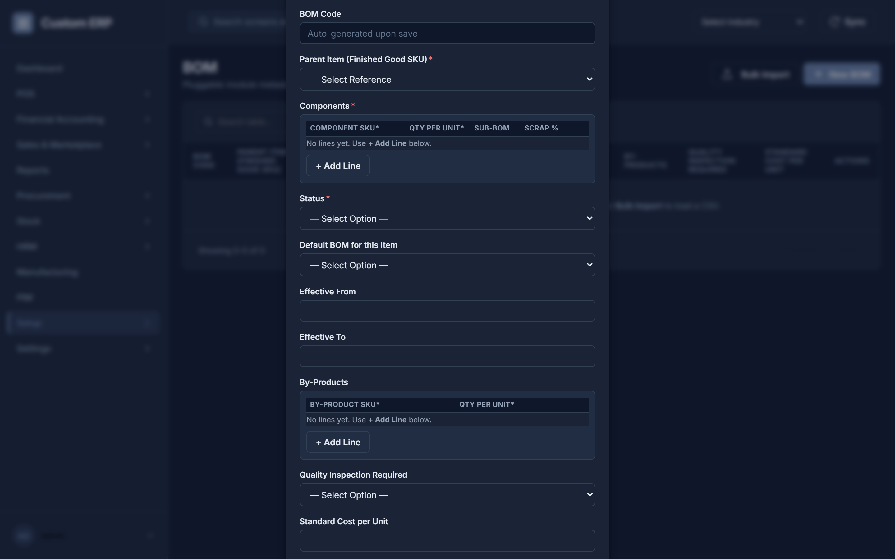
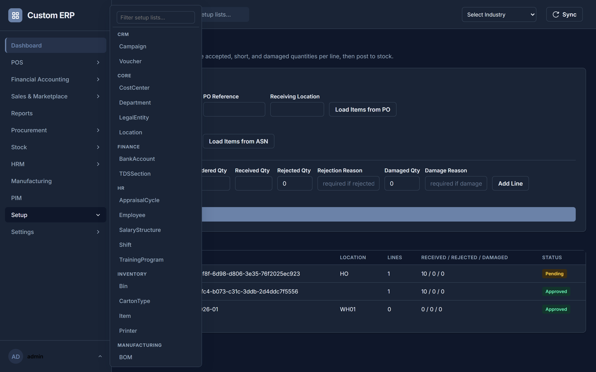
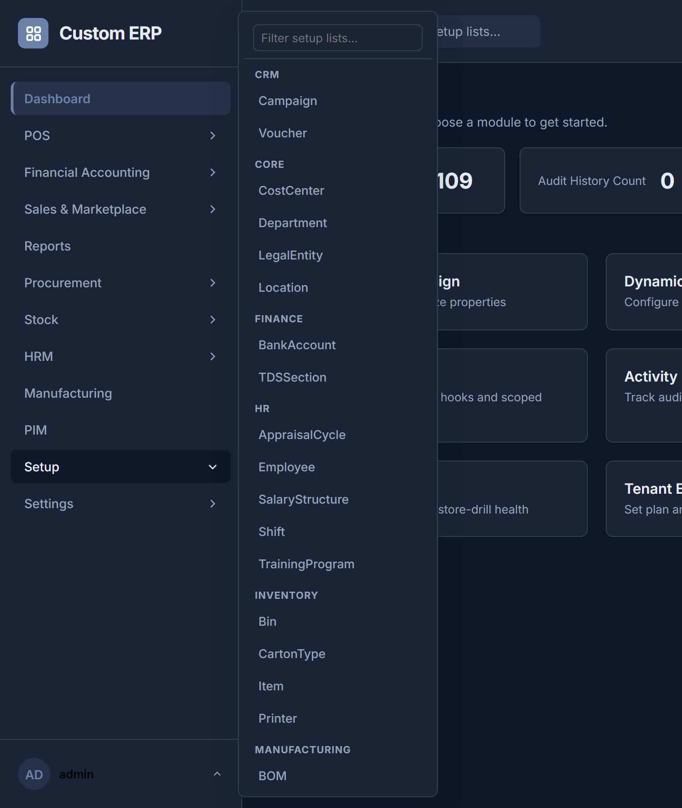

# User SOP — Step-by-Step Procedures

This is the deep companion to **[USER_GUIDE.md](USER_GUIDE.md)**. The Guide explains *what the system is* and walks through two examples (Making a Sale, Moving Stock) in full click-by-click detail. This SOP gives that same literal, click-by-click depth for **every** screen in the sidebar — one section per screen, in the order it appears in the menu. If a term isn't explained here, check the Guide's glossary (§13) first; new terms this SOP introduces are collected in §30 below.

This document assumes you've already read USER_GUIDE.md §2 (Logging In) and §3 (Finding Your Way Around). It does not repeat those.

---

## 1. Before You Begin — Patterns Used on Every Screen

A few things work the same way everywhere in this system. Learn them once here instead of re-reading them on every screen below.

- **The header search box** (top of the screen, "Search screens and setup lists...") is a **navigator, not a record search**. Type a few letters and it suggests screens and setup lists by name — "purch" offers Purchase Order, Purchase Requisitions and so on — and picking one takes you there. It does **not** look inside your records: it will not find a particular vendor, item or invoice. To find a *record*, go to its screen first and use that screen's own **Search table...** box.
- **Each record-list screen has its own search box**, just above the table. It filters the list you're looking at. If it finds nothing, the table says so and tells you to clear the box — that means "no match", not "empty list".
- **Creating a new record on a record-list screen**: click the plus-icon **New [Record Type]** button (top right), fill in the fields — anything with a red **\*** is required — and click **Save**. A field showing greyed-out placeholder text like *"Auto-generated upon save"* is numbered for you: leave it alone, you can't type in it.
- **If you don't see New or Bulk Import**, your role has read access to that record type but not create access. Instead of the buttons you'll see a small **"Read-only for your role"** label — hover it for the explanation. Ask an administrator to grant your role create access on the **Roles** screen (see [ADMIN_SOP.md](ADMIN_SOP.md) §A.2). The same applies to the row **Edit** and **Delete** icons: they only appear if your role can actually use them.
- **Document numbers are never typed.** Every transaction — Purchase Order, Goods Receipt, ASN, RFQ, Vendor Quote, Stock Transfer, Expense Claim, Leave, Employee Loan, Grievance, Production Order, Attendance — gets its number from a series when you save, shown as *"Auto (PO series)"* until then. Administrators control the format on the **Prefix Configurations** screen; see [ADMIN_GUIDE](ADMIN_GUIDE.md) §B.3.2. Gaps in a series are normal (a failed save doesn't reuse its number) and are not missing documents.
- **Editing an existing record**: every row on a record-list screen has a pencil **Edit** icon next to its trash-can **Delete** icon. Click Edit, change what you need, and Save — you do **not** need to delete and recreate a record to correct it. (Earlier versions of this SOP said Edit didn't exist and told you to delete and recreate. That was wrong, and following it destroyed data unnecessarily. **PIM record types** additionally support a multi-select **Bulk Edit** that changes one field across several records at once — see §27.)

- **Some fields are lists, not text.** Where a record needs several lines — a BOM's components, a Routing's operations, an appraisal cycle's KRAs — you get a small table with an **+ Add Line** button and a **Remove** button per row, not a box asking for JSON. Fill the columns in; required columns are marked with a **\***.
- **An empty dropdown tells you where to go.** If a picker has nothing in it, it says *"No [Record Type] records exist yet"* and offers a **create one first** link that takes you straight to the right setup list. That's the normal way to discover a prerequisite you haven't set up yet.
- **Bulk Import**: most record-list screens also have a **Bulk Import** button (top right, next to New). It opens a dialog where you can download a template CSV, fill it in, and upload it. Before committing, click **Preview (no changes written)** to see exactly what would be created/updated/rejected without actually saving anything — always do this first on a large file. Then click **Process Import** to actually save it.
- **Errors**: a red banner across the top of a form, a small pop-up ("toast") in the corner, or a centered dialog box will tell you what went wrong in plain language — read it, it's specific (e.g. "not enough stock" rather than just "error"). If you see a **correlation ID**, pass it to your admin if you need help.
- **Fields that auto-suggest as you type** (Vendor, Location, Item/SKU, Employee, Customer) are a convenience only — you can still type a value that isn't in the list; picking a suggestion just fills the field in faster.

---

## 2. Where you land after signing in

1. Signing in takes you to **Reports** (§14), whose first tab is a dashboard of live figures — stale approvals, failed syncs, negative stock and a sales trend. From the second visit onward you land back on whichever screen you were last using instead, so you can pick up where you left off.
2. There is no separate Dashboard screen. The one that used to sit at the top of the sidebar only held derived counts and shortcuts to admin/config tools (**Database Schema Design**, **Dynamic Labels**, **Prefix Configs**, **Activity Log**), all of which are in the **Settings** module — see **[ADMIN_SOP.md](ADMIN_SOP.md)**. It was removed in August 2026 rather than kept as a second front door to the same screens.

---

## 3. POS / Billing

Reached via the **POS** flyout → **POS / Billing**.

### 3.1 Open a cashier session (required before any sale)

1. In the **Location Code** box near the top, type the store/location code you're selling from (e.g. `HO`).
2. The bar above it shows whether a session is already open at that location. If it says *"No open session at [location] - open one before selling,"* click **Open Session**.
3. You'll be asked for the **opening cash float** — type the cash amount physically in the till at the start of the shift and confirm. The bar now shows *"Session open at [location]"* and a **Close Session** button appears.
4. At the end of the shift, click **Close Session**, enter the **counted cash** actually in the till, and confirm. The system tells you the Expected cash, Counted cash, and the Variance between them (if any) — write this down for your manager if it's non-zero.

### 3.2 Ring up a sale

1. With a location entered and a session open, click into **Scan or Enter SKU**, scan or type the item's barcode/SKU, and press **Enter** (or click **Add to Cart**). The item appears in the cart table with its **Available** stock count.
2. Repeat for every item. If the same SKU is scanned again, its quantity just increases by one instead of adding a duplicate row.
3. For each cart line you can edit **Qty**, **Sale Price**, and **Cost Price** directly in the table cells — the **Line Total** updates automatically. A line with a **Remove** button lets you take it back out.
4. **Optional — loyalty customer**: type the customer's code into **Customer Code**, then click **Check Points** to see their balance, or **Redeem Points** to spend points on this sale (enter how many points when prompted). The redemption appears as its own line in the totals and comes off the amount to collect **automatically** — you do not adjust any Sale Price by hand. The points are only actually deducted when the sale completes, so abandoning the cart costs the customer nothing.
5. Set **Discount %** and **Payment Mode** (Cash/Card/UPI) at the bottom. The **Total** updates live.
6. Click **Complete Sale**.
   - **Normal case**: the sale is recorded, a dialog shows the completed sale number and total, and asks if you want to **print a receipt** — click Yes/No. Stock and accounting entries update automatically; you don't need to do anything else.
   - **Discount-approval case**: if the discount you applied is above your store's configured threshold, the sale does **not** complete immediately — a dialog tells you *"This sale requires manager approval before it completes."* The cart is cleared client-side, but the sale itself sits as **Pending Approval** until a manager decides it from the **Approvals** screen (§6). Nothing is charged or posted until then.
7. **If something goes wrong mid-sale** — a barcode doesn't scan, or checkout is rejected — the red message box above the SKU field or the error dialog explains exactly why (e.g. insufficient stock); fix that and try again.

### 3.3 Process a return

Below the sale cart is a separate **Process a Return** panel — kept deliberately separate so an in-progress return can never get mixed into an in-progress sale.

1. Enter the **Original Order / Cart Number** the return is against (e.g. the `POS-...` number from the original sale's receipt) and the **Return Location**.
2. Scan or type each SKU being returned into **SKU to Return** and press Enter, or click **Add Line**. Edit **Qty**, **Sale Price**, and **Cost Price** per line the same way as the sale cart.
3. Click **Submit Return**. On success, the returned stock is put back into inventory immediately and the cart clears.

---

## 3A. Offline Sync Review

Reached via the **POS** flyout → **Offline Sync Review**. A record-list screen (§1) over `POSOfflineSyncVariance`.

When the till loses its connection, sales are queued in the browser and replayed when it comes back (§3.2). Occasionally a replayed sale can't be priced exactly as it was when it was rung up — stock has moved, or an offer has expired since. Each of those differences is recorded here rather than silently accepted.

1. Open the screen. Each row is one replayed sale whose result differed from what the till showed at the time.
2. Read the variance description on the row: it names the cart, what the till expected, and what the server actually posted.
3. Decide what to do about it in the real world (refund the difference, absorb it, chase the customer). **The record is a report, not an action queue** — nothing here needs approving to close it.

Review this at least once a day at any store that goes offline regularly. An empty list means every offline sale replayed exactly as rung up.

---

---

## 3B. Offline Queue Gaps

Reached via the **POS** flyout → **Offline Queue Gaps**. A record-list screen (§1) over `POSOfflineQueueGap`.

This is the more serious sibling of §3A. The server tracks each till's offline queue by heartbeat; if a till reports a queue and then comes back with fewer sales in it than it said it had, the missing ones are recorded here.

1. Each row names the cashier session, the location, and how many sales are unaccounted for.
2. **Treat a row here as a real event, not noise.** The commonest cause is a browser cache being cleared, or a device being replaced, while sales were still queued — that stock left the shop and no sale was ever recorded for it.
3. Reconcile against the physical till and the day's cash, and raise the sales manually if you can establish what they were.

Only HR/Admin and Store Manager can see this screen.

---

---

## 4. POS Profiles

Reached via the **POS** flyout → **POS Profiles**. This is a plain record-list screen (§1) — one profile per till/location combination.

1. Click **New POSProfile** (top right).
2. Fill in **Profile Name** (required), **Location** (required, a Location code), **Default Payment Mode** (required — Cash/Card/UPI), **Invoice Number Series** (optional), and **Default Opening Cash Float** (optional). **Status** defaults to Active/Inactive.
3. Click **Save**.

---

## 5. Finance / GL

Reached via the **Financial Accounting** flyout → **Finance / GL**. Three tabs at the top: **Trial Balance**, **Chart of Accounts**, and **Accounting Periods**.

### 5.1 Trial Balance tab (default)

A read-only, live view — nothing to fill in. It shows Total Debits, Total Credits, and whether the ledger is balanced (a green or red status dot), then every GL account with its debit/credit totals. These numbers always come from actual posted transactions.

### 5.2 Chart of Accounts tab

A read-only reference list of every GL account configured for your tenant — Account Code, Account Name, and Type (Asset/Liability/Equity/Revenue/Expense). No debit/credit totals here — that's what the Trial Balance tab is for; this tab is the master list of accounts themselves, not a balance report.

### 5.3 Accounting Periods tab

1. Click the **Accounting Periods** tab button.
2. To create one: fill in **Period Name** (e.g. `FY2026-Q3`), **Start Date**, **End Date**, and click **Create Period**. It starts **Open**.
3. Every existing period is listed with its status. An **Open** period shows a **Close Checklist** button.
4. Click **Close Checklist** to see a pass/fail list of pre-close checks (e.g. unposted documents) before you commit — this is advisory, it won't stop you from closing even if a check fails, it just shows you the risk. Read it, then confirm to close.
5. **Closing a period is permanent — there is no reopen.** Only close a period once you're sure everything for it has been posted.

---

## 6. Approvals

Reached via the **Financial Accounting** flyout → **Approvals**. This is a shared inbox — anything anywhere in the system that needs a second person's sign-off shows up here (Purchase Orders, Expense Claims, POS discounts, PIM content, and more), not just Finance items.

1. Each row shows the **Record Type**, its **Document ID**, an **Amount** (if applicable), and a **Location**.
2. Click **Approve** to accept it, or **Reject** to decline it — you'll be asked to optionally type a reason for a rejection.
3. Once decided, the document moves on automatically (e.g. an approved Purchase Order becomes ready to send, an approved POS sale finally posts its stock/GL entries). There is no "undo" — every decision is permanently logged with who decided it and when.
4. If the list is empty, it just says *"Nothing awaiting approval."*

---

## 7. Vendor Invoice

Reached via the **Financial Accounting** flyout → **Vendor Invoice**.

1. Click **+ New Vendor Invoice** to open the standard record-list New form (§1) — fill in Invoice Number, Vendor Code, PO Reference, GRN Reference, Invoice Amount, and Financial Year, then Save. It starts as **Draft**.

> **Prerequisite**: the **GRN Reference** this form asks for is the number of a posted Goods Receipt. Record the receipt first on **Procurement → Goods Receipt** (§15B) — the invoice cannot pass its 3-way match without one.

2. On the list, a **Draft** or **MismatchHold** invoice shows a **Match** button. Click it, then enter the **PO ID/number** and **GRN ID/number** it should match against when prompted. If the amounts line up, the invoice becomes **Matched**; if they don't, it goes to (or stays in) **MismatchHold** and needs to be matched again with corrected references.
3. Once **Matched**, two buttons appear:
   - **Pay** — pays the invoice in full from Cash/Bank after a confirmation prompt.
   - **Pay w/ TDS** — pick a TDS section from the dropdown next to the button (e.g. showing its withholding rate), then click it to pay with tax withheld under that section.
4. A **Paid** invoice has no further actions.

---

## 8. Payment Proposals

Reached via the **Financial Accounting** flyout → **Payment Proposals**. This batches several **Matched** vendor invoices into one payment run.

1. The top panel lists every currently **Matched** invoice with a checkbox. Tick the ones you want to pay together.
2. Click **Create Proposal from Selected**. It appears below as a new proposal, status **Draft**, with its total amount and invoice count.
3. Click **Execute** on a Draft proposal to pay every invoice in it via the normal vendor-invoice payment path, after a confirmation prompt.
4. If any invoice in the batch fails to pay, a dialog lists exactly which ones and why — the rest still succeed; nothing is all-or-nothing.

---

## 9. Bank Reconciliation

Reached via the **Financial Accounting** flyout → **Bank Reconciliation**.

1. If you have no bank accounts yet, click **Manage Bank Accounts** — this opens the standard record-list screen for BankAccount (Bank Name, Account Number, IFSC Code, Branch, GL Account Code, all required except Branch/IFSC). Create one, then come back to Bank Reconciliation.
2. Click **Statement Lines / Import CSV** to open the BankStatementLine record-list screen, where you can add lines one at a time or use **Bulk Import** (§1) to bring in a whole bank statement.
3. Back on the main Bank Reconciliation screen, pick a **Bank Account** from the dropdown and click **Reconcile**.
4. The result shows how many lines matched, and lists any statement lines or GL postings still left unmatched, so you can investigate the gap.

---

## 10. Debit / Credit Notes

Reached via the **Financial Accounting** flyout → **Debit / Credit Notes**. Two independent panels on one screen.

1. **Debit Notes** (adjustments to a vendor): click **+ New Debit Note**, fill in Note Number, Vendor, Reference PO (optional), Amount, Reason, then Save. It starts **Draft**.
2. **Credit Notes** (adjustments to a customer): same pattern via **+ New Credit Note**, with Customer and Reference Cart instead.
3. Either type shows a **Post** button while **Draft**. Click it, confirm — **this books the GL reversal immediately and cannot be undone** — and the note becomes **Posted**.

---

## 11. Sales Invoice

Reached via the **Financial Accounting** flyout → **Sales Invoice**. This is the credit-sale flow (bill a customer now, collect payment later — separate from a POS cash/card sale).

1. Click **+ New Sales Invoice**, fill in Invoice Number, Customer, Location, Total Amount, then Save. It starts **Draft**.
2. Click **Post** on a Draft invoice to recognize the receivable in the ledger — it becomes **Approved**.
3. Once the customer actually pays, click **Settle** and confirm — it becomes **Paid**. (This is the source feeding the Receivables Ageing report, §14.)

---

## 12. Fulfillment

Reached via the **Sales & Marketplace** flyout → **Fulfillment**. This is the pick/pack/dispatch queue for orders routed to your location.

1. Each task shows its **Status**: Pending, Picking, Packed, Dispatched, or Rejected.
2. From **Pending**: click **Start Picking** to move it to Picking, or **Reject** to decline it.
3. From **Picking**: click **Mark Packed**, or **Reject**.
4. From **Packed**: click **Dispatch**. Once Dispatched, no further action shows here.

---

## 12A. Order Management

Reached via the **Sales & Marketplace** flyout → **Order Management**. One operational view from channel order through fulfillment, shipment and invoice.

1. The table lists every **SalesOrder** — from a marketplace/channel import or the Order API — with its current stage.
2. **Refresh** re-reads the list; use it after releasing several orders in a row.
3. **Release** on an unreleased order allocates stock and creates the fulfillment task, which then appears on the **Fulfillment** screen (§12).
4. **Cancel** stops an order that has not yet shipped. It asks for confirmation.
5. **View** opens the order's full detail — its lines, its allocation, its shipment and its invoice, in one place.

> Orders **appear here on their own**. Nothing on this screen creates one: channel imports and the Order API do. An empty list means no channel has sent you an order yet, not that something is broken.

---

---

## 13. Marketplace

Reached via the **Sales & Marketplace** flyout → **Marketplace**. Two independent panels.

### 13.1 Settlements

1. Fill in **Settlement ID**, pick a **Channel** (Shopify/Amazon, plus any additional Channel records your admin has configured), **Total Sale**, **Commission**, **Net Payout**, and a comma-separated list of **Order IDs**.
2. Click **Reconcile**. The settlement appears in the table below with a **Reconciled** or pending status badge.

### 13.2 Logistics Bookings

1. Fill in **Order ID**, **Carrier**, **Tracking Number**, and **Shipping Charge**.
2. Click **Book**. The booking appears in the table below.

---

## 14. Reports

Reached via **Reports** in the sidebar. A row of tab buttons across the top switches between reports.

### 14.1 The six built-in tabs

- **Current Stock** — every SKU/location with On Hand, Available, Committed, Reserved, and Safety Stock. No filters — it's the full current snapshot.
- **Sales Register** — every completed POS sale with location, payment mode, total, and date.
- **Vendor Ledger** — every purchase order with vendor, amount, status, and date.
- **Payables Ageing** — Approved-but-not-yet-Closed purchase orders, bucketed by age since creation.
- **Receivables Ageing** — Approved-but-not-yet-Paid sales invoices (§11), bucketed by age.
- **GST Return Summary** — pick a **From**/**To** date range and click **Run**. Shows taxable value and CGST/SGST/IGST output tax already calculated per-transaction in that window. This is a summary report only — it does not e-file or generate an IRN.

None of these first six tabs take any other filters — what you see is everything in that category.

### 14.2 Report Catalog tab

This is the newer, general-purpose reporting framework — every report registered in the system (old and new) is reachable from here, grouped by category in the **Report** dropdown.

1. Pick a report from the **Report** dropdown.
2. Fill in whatever parameters appear next to it (dates, codes, etc. — a report with no parameters shows none). A field is required if the report needs it; you'll get an inline error naming the missing one if you try to run without it.
3. Click **Run** to see the results table.
4. **Drill-down**: if the report supports it, each row has a **View Details** button — click it to expand an inline sub-table of the underlying records behind that row, without leaving the page.
5. **Save Filter**: click it, name your current parameter values, and they're saved to the **Saved Filter** dropdown (only visible to you, tied to your username) for next time. Pick one from that dropdown to instantly re-fill the parameters.
6. **Export in Background**: click it to queue an async CSV export job instead of just viewing on-screen. A status line shows *"Export queued (job ...)... waiting for it to complete"* and polls automatically every couple of seconds. Once ready, click **Download CSV** to save the file — you don't need to keep the tab open and re-click; it keeps polling for you.

---

## 15. Purchase Order

Reached via the **Procurement** flyout → **Purchase Order**.

1. Fill in **Vendor**, **Target Warehouse**, **Location** (all required), **Total Amount** (the taxable value), and optionally a **GST Rate %** plus an **Interstate** checkbox. **PO Number** is greyed out and reads "Auto (PO series)" — it is issued when you save (see §1).
2. Click **Calculate GST** to preview the CGST/SGST or IGST breakdown for what you've entered so far — this is just a calculator, it doesn't change what gets saved.
3. Click **Create Draft**. It appears in the list below as **Draft**.
4. Click **Submit for Approval** on a Draft PO. Depending on the amount, it routes to a Store Manager (under a configured threshold) or HR/Admin (at or above it) — you'll see it move to **Pending Approval**, then **Approved** or **Rejected** once decided (§6).

5. **When the stock arrives**, record it on **Procurement → Goods Receipt** (§15B) against this PO. That is what actually raises your stock count — an approved PO on its own never does. The PO's own status stays **Approved** until the receipt closes it; look at the Goods Receipt screen, not this one, to see what has physically arrived.

---

## 15A. Purchase Requisitions

Reached via the **Procurement** flyout → **Purchase Requisitions**. A record-list screen (§1). This is the "someone has asked for something" step that precedes a Purchase Order.

1. Click **New Purchase Requisition**.
2. **Requisition number is auto-issued** — the field is greyed out (§1).
3. Fill in the **Description** of what's needed. This field suggests wordings that have been used before as you type; you can also type something new, and the system remembers it for next time.
4. Fill in the **Department** (also a suggest field) and the quantity/amount.
5. Save. It starts as **Draft**.
6. Submit it for approval. It routes by amount exactly like a Purchase Order (0–49,999 → Store Manager; 50,000 and above → HR/Admin by default), and appears in the approver's **Approvals** screen (§6).
7. Once approved, raise the actual Purchase Order (§15) against it.

---

---

## 15B. Goods Receipt

Reached via the **Procurement** flyout → **Goods Receipt**. **This is the screen that actually raises your stock count.** An approved Purchase Order on its own never does.

1. Enter the **PO Reference** for the order the stock has arrived against.
2. Click **Load Items from PO**. Every line on that order appears in the table with its **Ordered Qty**.
   - If the vendor sent an ASN ahead of the delivery (§15C), enter the **ASN Reference** and click **Load Items from ASN** instead — same result, prefilled from what the vendor said was coming.
   - **Add Line** adds a line by hand for anything that arrived but wasn't ordered.
3. For each line, enter what actually turned up:
   - **Received Qty** — what you accepted into stock.
   - **Rejected Qty** and **Rejection Reason** — what you refused (wrong item, wrong spec).
   - **Damaged Qty** and **Damage Reason** — what arrived broken.
   Record short and damaged quantities honestly. Entering the ordered quantity when less arrived is how stock records and reality drift apart, and it is very hard to unpick later.
4. **Receiving Location** is where the accepted stock lands. If you leave it blank it defaults to the PO's own target warehouse — that's deliberate, not a bug.
5. Click **Post Receipt**.
6. **Check that it worked.** Go to **Inventory** (§18) and confirm the quantity went up by what you accepted. If the receipt could not post to the ledger, it is marked **Cancelled** and the PO stays open for a real receipt — you are told, rather than being shown a false success.

The GRN number is auto-issued; you never type one.

---

---

## 15C. Advance Shipment Notices (ASN)

Reached via the **Procurement** flyout → **ASN**. Captures what a vendor says is coming, before it arrives.

1. Enter the **PO Reference** this shipment is against, the **Location** it is coming to, the **Vendor**, and — if you have them — the **Carrier**, **Tracking Number** and **Expected Date**.
2. For each item on the shipment, enter the **SKU** and **Expected Qty**, then click **Add Line**.
3. Click **Save ASN**. The ASN number is auto-issued.
4. When the delivery physically lands, go to **Goods Receipt** (§15B) and use **Load Items from ASN** to prefill the receipt.

> **The ASN's own "PO Number" field holds the referenced order's number, not the ASN's.** That is intentional — it's how the ASN is tied to its order.

---

---

## 16. Vendors

Reached via the **Procurement** flyout → **Vendors**. A standard record-list screen (§1).

1. Click **New Vendor** (top right). Fill in Vendor Name (required), GSTIN, Bank Account Number, Bank IFSC, Contact Phone, Contact Email (all optional), and Status. Vendor Code is auto-generated — leave it blank.
2. Click **Save**.

---

## 17. RFQ / Quotes

Reached via the **Procurement** flyout → **RFQ / Quotes**. This lets you request quotes from several vendors for the same requirement and compare them before creating a Purchase Order.

1. Fill in **Item / Requirement Description**, **Quantity**, and **Target Date**, then click **Create RFQ**. It starts **Draft**/open for quotes. **RFQ Number** is issued on save (see §1).
2. Click **View Quotes** on an RFQ row to open its quote comparison panel below the list.
3. To record a vendor's quote: fill in **Vendor**, **Quoted Price**, **Lead Time (days)**, and click **Submit Quote**. Repeat for each vendor quoting. **Quote Number** is issued on save (see §1).
4. Once you have quotes to compare, click **Select as Winner** next to the one you're accepting. Confirm — this marks that quote as the winner, **rejects every other quote automatically**, and closes the RFQ. This can't be undone, so make sure you've compared everything first.

---

## 18. Inventory

Reached via the **Stock** flyout → **Inventory**.

1. Use the **Search by SKU or location...** box to filter the list as you type.
2. The table shows, per SKU/location: **On Hand** (physical count), **Available** (what's actually free to sell — already-reserved stock excluded), **Committed**, **Reserved**, and **Safety Stock**.

This screen is read-only — there's no way to adjust stock counts directly here; stock changes come from sales, transfers, and (where applicable) manufacturing/returns.

---

## 19. Stock Transfer

Reached via the **Stock** flyout → **Stock Transfer**. Moves stock between two locations through a Draft → Approved → (optional Packed) → Dispatched → Received lifecycle.

1. Fill in **From Warehouse** and **To Warehouse**. **Transfer Number** is issued on save (see §1).
2. Add one or more lines: enter a **SKU** and **Qty**, click **Add Line**. Repeat for every item — a transfer needs at least one line.
3. Click **Create Transfer**. It starts as **Draft**.
4. Click **Mark Approved** when it's ready to go.
5. From **Approved**, you have two options:
   - Click **Pack** to record which items go in which physical box — you'll be prompted for a **Box ID** per line (typing the same Box ID for multiple lines groups them into one box). This is optional; it's just a confirmation step.
   - Click **Dispatch** directly (works from either Approved or Packed) — confirm, and the stock leaves the source location and sits "in transit."
6. Once it physically arrives, click **Receive**. You'll be prompted for the **quantity actually received** for each line, pre-filled with the dispatched quantity — if less arrived than was sent, type the lower number; that shortage is recorded rather than hidden.

---

## 20. Bin

Reached via the **Stock** flyout → **Bin**. A standard record-list screen (§1) defining physical storage locations within a warehouse.

1. Click **New Bin** (top right). Fill in **Bin Code** and **Location** (required), and optionally **Zone**, **Aisle**, **Rack**, **Capacity**.
2. Click **Save**.

> **Note**: this screen manages the bin *records themselves*. The things you do *with* bins each have their own screen in the **Stock** flyout: **Putaway** (assigning received stock to a bin), **Bin Conditions** (moving stock between Good / Damaged / QC-Hold / RTV), **Bin Replenishment** (topping up pick faces), **LPN / Cartons / Pallets**, **Wave / Batch Picking** and **Mobile Picking** (bin-ordered pick lists), and **Cycle Count**. See §20A–§20G.

---

## 20A. Putaway

Reached via the **Stock** flyout → **Putaway**. Places stock you have accepted into a specific bin.

1. Enter the **Location**, the **SKU**, the **Bin Code** it is going into, and the **Qty**.
2. The screen shows **Qty on hand to place** — the quantity at that location not yet assigned to any bin. **You cannot put away more than this**; the attempt is refused rather than inventing stock.
3. Click **Put Away**.
4. **Check Opportunity** asks whether this stock is already needed elsewhere — an open transfer or a sale waiting on this SKU at this location. If it is, **Stage for Cross-Dock** sends it straight on instead of putting it away and picking it again.

Both the Bin and SKU fields suggest as you type.

---

---

## 20B. Bin Conditions

Reached via the **Stock** flyout → **Bin Conditions**. Moves stock between **Good**, **Damaged**, **QC-Hold** and **RTV** (return to vendor) within a bin.

1. Enter the **Bin Code**, the **SKU**, the **Qty**, the **From Condition** and the **To Condition**.
2. Click **Move**.

**What this actually changes:** moving stock *out of* Good makes it unsellable — it stops counting toward what the POS can sell. Moving it back *into* Good makes it sellable again. This is the correct way to quarantine damaged stock; deleting or adjusting the quantity is not.

---

---

## 20C. LPN / Cartons / Pallets

Reached via the **Stock** flyout → **LPN / Cartons / Pallets**. Groups bin stock into a physical container so it can be tracked and moved as one unit.

1. **To assign**: enter the **LPN Code** (the carton or pallet's own label), the **Bin Code**, the **SKU**, the **Condition** and the **Qty**, then click **Assign**.
2. **To look up**: enter an LPN code and click **Look Up** to see everything in that container.

> An LPN is a *breakdown* of what is already in a bin, never a second count of it. The bin's own total is the source of truth; assigning stock to an LPN does not change it.

---

---

## 20D. Bin Replenishment

Reached via the **Stock** flyout → **Bin Replenishment**. Finds pick-face bins that have run low.

1. Enter the **Location** and click **Get Suggestions**.
2. The table lists every bin below its configured minimum quantity, with a suggested reserve bin to draw from.
3. Move the stock with **Stock Transfer** (§19) or **Putaway** (§20A) as appropriate.

The minimums come from the **BinReplenishmentRule** list (Setup → Advanced). With no rules configured, this screen correctly reports nothing to do.

---

---

## 20E. Wave / Batch Picking

Reached via the **Stock** flyout → **Wave / Batch Picking**. Picks several orders in one walk of the warehouse instead of one walk per order.

1. Enter a **Wave ID** — any label you choose for this batch, e.g. `WAVE-MORNING`.
2. Enter the **Task IDs** to include, comma-separated (they come from the **Fulfillment** screen, §12).
3. Click **Tag Tasks**.
4. Click **Generate Pick List**. You get:
   - a **consolidated pick list** in zone → aisle → rack → bin walking order, so you cross the warehouse once; and
   - a **per-order allocation** table showing which picked units belong to which task, with any **shortfall** flagged rather than hidden.
5. Hand the wave to a picker, who works it on **Mobile Picking** (§20F).

---

---

## 20F. Mobile Picking

Reached via the **Stock** flyout → **Mobile Picking**. The phone-friendly view of a wave, one item at a time.

1. Enter the **Wave ID** and click **Load**.
2. The screen shows a single pick line: bin, SKU, quantity.
3. Pick it, then click **Confirm & Next**. **Previous** goes back.
4. **Speak Item** reads the line aloud for hands-free picking.

Designed for a phone or handheld held one-handed in an aisle; it works on a desktop too.

---

---

## 20G. Cycle Count

Reached via the **Stock** flyout → **Cycle Count**. Counts stock in place, without shutting the warehouse.

1. **Get Plan** (with a **Location**) suggests which bins are due a count. How often a bin comes round depends on its ABC tier, and the intervals are configurable (ADMIN_SOP Part A → Configuration).
2. **Manage Count Lines** opens the lines for a **Count Session**. Enter the **Counted Qty (blind)** for each — *blind* means the counter is not shown the expected figure, so the count is not anchored by it.
3. Click **Reconcile Session**:
   - Lines that match the system exactly **post immediately**.
   - Lines with a variance route to **Approvals** for a Store Manager, and do not adjust stock until decided.
4. **Set Variance Reason** attaches a Reason Code to a variance line — do this before it is reviewed, so the approver knows what happened.
5. **Request Recount** sends a line back to be counted again; **Submit Recount Value** records the second count.
6. **Retry Post** re-attempts a line whose posting failed.

---

## 21. Locations — your shops, warehouses and head office

Reached via **Setup** → **Core** → **Location** (§28). A standard record-list screen (§1).

**This is the record that makes a place real to the rest of the system.** Every transaction that has to happen *somewhere* — a sale, a purchase order, a goods receipt, a transfer, a stock count, an expense claim — points at a Location. Create one before you try to trade.

1. Click **New Location** (top right).
2. Fill in **Location Code** and **Location Name** (both required). The code is what you will type or pick on every transaction screen, so keep it short — `MAIN`, `HO`, `WH1`.
3. Set **Type** (required) to **Store**, **Warehouse** or **HO**. This is what tells the system what kind of place it is; the pickers on transaction screens group locations by it.
4. Optionally fill in **Legal Entity**, **Address**, **City**, **Contact Phone** and **Manager**.
5. **Status** (required) is Active or Inactive.
6. Click **Save**.

> **If you are following an older printout**: there used to be a separate **Stores** entry in the **Stock** flyout, described here as "an address book that nothing reads". That was accurate — no transaction, report or picker could ever select one. It has been **removed**, and its Address / City / Contact Phone / Manager fields are now Location fields, as listed above. Any shop record you created there was moved to Location with **Type = Store** automatically. There is nothing you need to re-enter.

---

## 22. Sticker Printing

Reached via the **Stock** flyout → **Sticker Printing**.

1. Pick a **Printer** from the dropdown (create one first if the list is empty — see the note below), set **Copies per SKU**, and optionally a **Reprint Reason**.
2. Scan or type each SKU into **Scan or Enter SKU** and press Enter, or click **Add**. Repeat for every item to print. Each added SKU shows with a small **x** button to remove it.
3. Click **Print Stickers**. The system opens your browser's print dialog with one label per SKU per copy (name, barcode value as text, SKU, and HSN code if set), and logs the print in history below with who printed it and when.
4. **Print history** at the bottom shows every past print run, including any reprint reason given.

> Printer records themselves aren't managed from this screen — they're a Master-type record type, so create one via **Setup** (§28) if none exist yet, using the doctype name **Printer**.

---

## 23. HR

Reached via the **HRM** flyout → **HR**. Three tabs: **Attendance**, **Leave**, **Payroll Export**.

### 23.1 Attendance tab

1. Pick an **Employee**, a **Date**, a **Location**, and a **Status** (Present/Absent/Late/Leave/Holiday/WeeklyOff). **Attendance Code** is issued on save (see §1).
2. Click **Save**. It appears immediately in the list below.

### 23.2 Leave tab

1. Fill in **Employee**, **Leave Type** (Casual/Sick/Earned/Unpaid), **From**/**To Date**, and **Days**, then click **Apply**. It starts **Applied**. **Leave Code** is issued on save (see §1).
2. If you have approval rights, an **Applied** leave request shows **Approve** and **Reject** buttons right in the list — click one to decide it directly (no separate Approvals-screen trip needed for this particular doctype).

### 23.3 Payroll Export tab

1. Pick a **From** and **To** date, click **Export**.
2. A table shows, per employee: Present Days, Absent Days, Late Days, and Approved Leave Days for that period — ready to hand to payroll.

### 23.4 Employee records

Employees themselves are a Master-type record, so they're created and edited under **Setup** (§28), not on this HR screen — look for **Employee** in that dropdown.

---

## 24. Fixed Assets

Reached via the **HRM** flyout → **Fixed Assets**. Lifecycle: Draft → Capitalised → (any number of Transfers) → Disposed.

1. Fill in **Asset Number**, **Category**, **Cost**, **Useful Life (yrs)**, **Location**, **Custodian**, and **Acquisition Date** — all required except Category/Custodian — then click **Create**. It starts **Draft**.
2. Click **Capitalise** on a Draft asset to bring it onto the books — it becomes **Capitalised**, and depreciation starts being calculated automatically from here on (it's computed live on every view, not stored, so the numbers you see are always current as of today).
3. From **Capitalised**, click **Transfer** to move it to a new location/custodian (you'll be prompted for both — custodian is optional), or **Dispose** to write it off. Disposal asks for a **disposal type** (Sale, Scrap, or WriteOff) and warns that it writes off the asset's remaining net book value permanently.
4. The list shows **Cost**, **Accum. Depreciation**, and **Net Block** (Cost minus Accumulated Depreciation) live for every asset.

---

## 25. Expenses

Reached via the **HRM** flyout → **Expenses**. Lifecycle: Claim → Manager Approval → Finance Verification → Payment.

1. Fill in **Employee**, **Location**, **Expense Date**, **Category** (Conveyance/Travel/Food/Hotel/Fuel/Repair/Medical/Marketing/StoreExpense/Other), **Amount**, **GST Amount** (optional), **Advance Adjusted** (optional), and **Purpose**. Click **Create Draft**. **Claim Number** is issued on save (see §1).
2. Click **Submit for Approval** — this routes through the same Approvals screen (§6) as everything else; a manager approves or rejects it there.
3. Once **Approved**, click **Finance Verify** on the claim (this is a separate step from the manager approval — Finance checks the claim independently).
4. Once **Verified**, click **Mark Paid**, confirm — this posts the payment to the ledger and closes the claim out.

---

## 26. Manufacturing

Reached via **Manufacturing** in the sidebar. Single-level Bill of Materials (BOM) plus a linear Production Order lifecycle: Draft → Material Issued → Completed.

### 26.1 Create a BOM

1. Fill in **BOM Code** and **Parent Item** (the finished good's SKU).
2. In **Components**, type each raw-material SKU and quantity as `SKU:QTY`, comma-separated — e.g. `RAW-A:2, RAW-B:1`. Getting this format wrong shows an inline error explaining the expected shape.
3. Click **Create BOM**.

### 26.2 Run a Production Order

1. Pick a **BOM** from the dropdown, set **Quantity** and **Location**, click **Create Order**. It starts **Draft**. **Order Number** is issued on save (see §1).
2. Click **Issue Material** — this consumes the BOM's raw-material components from stock at that location; the order becomes **Material Issued**.
3. Click **Complete (Receive FG)**, confirm — this receives the finished good quantity into inventory and closes the order out as **Completed**.

---

## 27. PIM (Product Information Management)

Reached via **PIM** in the sidebar. Three bespoke tabs (Dashboard, Workbench, Reports) plus six tabs that are really shortcuts into record-list screens for PIM's underlying record types, all sharing the same **PIM** title/tab bar so it never feels like you've left the module.

### 27.1 Dashboard tab

A grid of clickable stat cards (Products, Incomplete, Pending approval, Ready to publish, Published, Missing main image, Publish queued, Publish failed). Clicking one jumps to either the **Workbench** tab or, for "Pending approval," straight to the **ProductContent** record list.

### 27.2 Workbench tab — the main day-to-day screen

1. Optionally pick a **Family** from the filter dropdown to narrow the list.
2. Each row shows an item's **Completeness** score (a colored badge — green ≥80%, amber ≥40%, red below) and how many fields are **Missing**. Click any row to open its detail panel below.
3. In the detail panel:
   - **Add / Update Attribute Value**: pick an **Attribute**, type a **Value**, click **Save**.
   - **Content**: fill in Language (defaults `en`), Title (required), Short Description, Long Description, SEO Title, Tags. Click **Save Draft** to save without submitting, or **Submit for Approval** to save and immediately send it into the same Approvals queue (§6) as everything else — an admin approves or rejects it there.
   - **Media**: pick a file (jpg/png/webp/gif/pdf) and a **Role** (Main Image/Gallery/Variant Image/Lifestyle/Certificate/Internal QC/Video-Other), click **Upload**. Existing media shows as thumbnails below with a **Deactivate** button on each.
   - **Channel Publishing**: pick a **Channel**, click **Publish**. A log below shows every past publish attempt for this item with its status (Published/Failed) and external ID.

### 27.3 Reports tab

1. Pick a report from the dropdown: **Content aging**, **Duplicate media**, **Channel mapping gaps**, or **Attribute quality**.
2. Click **Run report**. Results render as a plain table; *"No issues found"* means a clean pass.

### 27.4 The six doctype tabs

**Product Families**, **Attribute Definitions**, **Family Attributes**, **Channels**, **Category Mapping**, **Field Mapping** each open the standard record-list screen (§1) for their underlying record type, still inside the PIM header/tab bar. These, along with **Item**, are the record types where the **Bulk Edit** multi-select action (mentioned in §1) is available: tick several rows' checkboxes, click **Edit Selected**, pick a field and a new value, and confirm — it updates every selected record in one go. (Any record among them that was Approved gets bumped back to Pending Approval automatically if its record type is approval-gated.)

---

## 28. Setup

The **Setup** flyout holds every reference list ("master") the system knows about. It is **built from your own tenant's registered record types**, so what you see is what you actually have — a default tenant has 53 of them. It is not a fixed list, and an administrator can add more (Database Schema Design — see [ADMIN_SOP.md](ADMIN_SOP.md)).

**How it's laid out**

- **Grouped by module**, not one long alphabetical run. In a default tenant that's 14 groups — Core, CRM, Finance, HR, Inventory, Manufacturing, Master Data, OMS, PIM, POS, Procurement, Reports, Sales, Store.
- **A filter box at the top.** Type any part of a name or module — "vend", "channel", "report" — and the menu narrows as you type. This is the fastest way in once you know roughly what you want.
- **An "Advanced" divider at the bottom**, collapsed by default, holding the 15 system-internal lists (channel field maps, allocation and status-transition rules, notification templates, robotics credentials, saved report profiles and so on). Click it to expand. **If you filter, matches inside Advanced are shown automatically** — you never have to know something was filed there to find it.
- You only see lists your role can read, and only the modules your business has licensed.

**The everyday groups, in a default tenant**

| Group | Lists |
|---|---|
| **Master Data** | Brand, Color, Model, Size, Style, Batch |
| **Core** | Location (see §21), Department, Cost Center, Legal Entity |
| **Sales** | Customer, POS Profile |
| **POS** | Offer (the discounts and coupons the till applies — see §3.2) |
| **Procurement** | Vendor |
| **Inventory** | Item, Bin, Printer, Carton Type |
| **HR** | Employee, Shift, Salary Structure, Training Program, Appraisal Cycle |
| **Finance** | Bank Account, TDS Section |
| **Manufacturing** | BOM, Routing, Work Center |
| **PIM** | Channel, Product Family, Product Attribute Def, Product Attribute Group |
| **OMS** | Reason Code, Courier Service Area |
| **CRM** | Campaign, Voucher |
| **Reports** | Scheduled Report |

> **Note**: earlier versions of this SOP listed **Sub Brands, Sub Styles, Product Categories, Product Types, Item Names, Secondary Colors, Fabric Colors** and **Polishes** here. None of those has ever existed as a record type — they were placeholder entries in the page's HTML that the real menu overwrote on load. They have been removed from the code as well as from this document.

Every entry works exactly like §1 describes: **New [Type]**, fill in required fields, Save; per-row **Edit** and **Delete**; **Bulk Import** for CSV loading. Buttons you don't have permission to use aren't shown.

---

## 29. My Profile & Sign Out

Click your name/avatar at the bottom of the sidebar to open the account popover.

1. **My Profile**: shows your Username, Role, Status, linked Employee (if any), and whether MFA is enabled — all read-only. Below that:
   - **Contact & Session**: edit your **Email** and your personal **Auto Logout (inactivity)** timer (Never / 15 min / 30 min / 1 hour / 2 hours), click **Save Changes**.
   - **Change Password**: enter your Current Password, a New Password (8+ characters), confirm it, click **Update Password**.
2. **Sign Out**: click it, confirm in the dialog. You'll see a brief "Signing you out..." transition before landing back on the login screen.

---

## 30. Glossary Addendum

Terms used in this SOP not already in USER_GUIDE.md's glossary (§13):

| Term | In plain English |
|---|---|
| **3-way match** | Checking that a Vendor Invoice's amount agrees with both its Purchase Order and its GRN before it's allowed to be paid. |
| **TDS** | Tax Deducted at Source — a portion of a vendor payment withheld and remitted to the tax authority instead of paid to the vendor directly. |
| **Ageing (Payables/Receivables)** | How long money owed (to a vendor) or owed to you (by a customer) has been outstanding, grouped into time buckets. |
| **Drill-down** | Expanding a report row in place to see the individual transactions that make up that row's total. |
| **Saved Filter** | A named set of report parameter values you can re-apply later without retyping them. |
| **Completeness score** | PIM's percentage measure of how many of an item's expected fields/media are actually filled in. |
| **BOM (Bill of Materials)** | The list of raw-material components and quantities needed to make one unit of a finished good. |
| **Net Block** | An asset's Cost minus its Accumulated Depreciation so far — its current book value. |
| **Session (POS)** | A cashier's open till at one location, from Open Session to Close Session, used to reconcile the physical cash at day's end. |

---

*This system is under active development, so the occasional rough edge is expected — but if a step here doesn't match what you see on screen, that is a bug in this document and worth reporting. Earlier versions of this SOP claimed that Goods Receipt, Putaway, bin-level pick lists and bin condition changes had no screens. All of them do, and all of them are documented above.*
